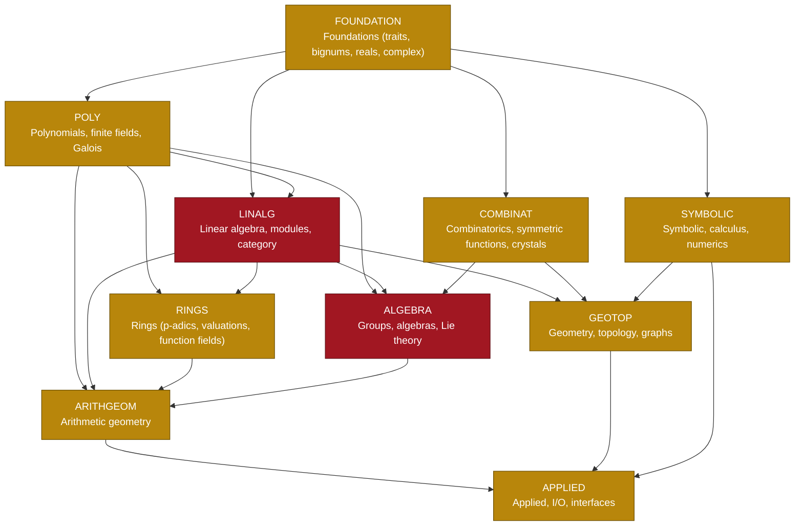

<!--
======================================================================
CONVENTIONS  (read before editing; applies to humans and Claude CLI)
----------------------------------------------------------------------
1. Two kinds of dependency are tracked:
     - MODULE deps  ->  architecture. Edit the Mermaid graph and the
       Module Registry table.
     - TASK deps    ->  "blocked-by". Put on the card as  BLOCKED-BY T-ID.
2. Card grammar (one line; fields after the title are optional):
     - [ ] {priority} **[{MODULE}]** {T-ID} {Title}  @{owner}  {blocked-by}  {status}
3. Exactly ONE status emoji at the end of each card. See Legend.
4. To move a task, cut the whole bullet line and paste it under the
   target stage heading. Never duplicate a card.
5. Task IDs are unique and never reused. Module keys are UPPERCASE and
   must match a row in the Module Registry.
6. On every edit: bump `updated:` in the frontmatter and add a row to
   the Change Log at the bottom.
7. Do not delete cards in Done; they are the deployment record.
8. The Algorithm Inventory is GROUND TRUTH, generated by reading the
   code on 2026-07-12. Every row cites file:line. When you change code,
   update the row. Do not let it drift into aspiration.
======================================================================
-->

# RustMath: Delivery Tracker

> [!info] What this is
> A plugin-free tracker for RustMath, a zero-unsafe Rust rewrite of SageMath's and MAGMA's core mathematics.
> **Sections:** the [[#Scorecard]] and [[#Board]] are for planning; the [[#Algorithm Inventory]] is the ground-truth
> record of every algorithm in the tree, its `file:line`, and whether it actually works.

> [!warning] The central risk in this codebase is the FACADE
> A *facade* is a real-looking public API that silently returns a plausible **fabricated** value instead of computing.
> It is far more dangerous than a missing function, because callers and tests both believe it. Real examples found here:
> `tau(n)` returned `1` for every *n*; `Gamma::cusp_count` returned `level²`; `Ideal::is_prime` returned `false`
> unconditionally; a Gröbner `reduce()` dropped terms, making `ideal_membership` return **true for non-members**.
> An honest `unimplemented!()` is a **success** (status ⬜); a fabricated value is a **defect** (status 🛑).

---

## Scorecard

Generated 2026-07-12 by reading all 67 workspace crates (~600k LOC). **1282 algorithms catalogued.**

| Status | Symbol | Count | Share | Meaning |
|---|:--:|--:|--:|---|
| Done | 🟢 | 521 | 41% | Implemented and tested against real values |
| Partial | ⏳ | 353 | 28% | Implemented but narrow, untested, or correctness unclear |
| Facade | 🛑 | 276 | 22% | **Returns a fabricated value.** Must not be trusted |
| Broken | 🔴 | 67 | 5% | Provably wrong, hangs, or panics on normal input |
| Missing | ⬜ | 65 | 5% | Honest `unimplemented!()` / `Err` — a good gap |
| **Total catalogued** | | **1282** | | |

A further **405** algorithms that a Sage/MAGMA-equivalent crate should have are **entirely absent** (not even a stub). They are listed per crate under [[#Algorithm Inventory]].

**Build health:** all 67 crates and **all workspace test targets compile cleanly** (`cargo build --workspace --tests`, 0 errors).
Compilation is *not* evidence of correctness — 276 of the compiling functions are facades.

### Where the facades are concentrated

| Crate | 🛑 Facade | 🔴 Broken | Health | The worst of it |
|---|--:|--:|:--:|---|
| `rustmath-rings` | 21 | 6 | 👁️ | Large surface; the real p-adic/MacLane core is solid, the generic ring layer is not |
| `rustmath-combinatorics` | 20 | 7 | 👁️ | GT patterns once allocated 89 GB via an `as usize` underflow (fixed); much else unverified |
| `rustmath-geometry` | 23 | 1 | ⚠️ | No V↔H conversion at all. `facet_normals()` → `vec![]`, `polar()` → `None`, `is_reflexive()` → `false` |
| `rustmath-algebras` | 17 | 1 | ⚠️ | Structure constants and representation theory largely fabricated |
| `rustmath-topology` | 16 | 2 | 👁️ | Homology/cohomology returns plausible groups it did not compute |
| `rustmath-modules` | 14 | 1 | ⚠️ | 93 files, 9k LOC — mostly type definitions with fabricated method bodies |
| `rustmath-schemes` | 12 | 3 | 👁️ | Blow-ups are now real; the older generic-scheme layer is not |
| `rustmath-liealgebras` | 11 | 3 | ⚠️ | Root systems real; representations/characters largely fabricated |
| `rustmath-symbolic` | 10 | 4 | 👁️ | `integrate()` is a heuristic table-matcher; no Risch |
| `rustmath-graphs` | 13 | 1 | 👁️ | Core traversal solid; the harder invariants are fabricated |
| `rustmath-affineschemes` | 12 | 1 | ⬜ | Near-total skeleton; superseded by rustmath-schemes |
| `rustmath-manifolds` | 9 | 3 | ⚠️ | Cohomology and characteristic classes fabricated |
| `rustmath-crystals` | 7 | 2 | ⚠️ | Almost nothing verified |
| `rustmath-symmetricfunctions` | 8 | 0 | 👁️ | Macdonald/LLT largely fabricated |
| `rustmath-groups` | 5 | 3 | 👁️ | No native Schreier–Sims; `generic.rs::bsgs` is baby-step-giant-step *discrete log*, a false friend |
| `rustmath-polynomials` | 7 | 0 | 👁️ | Fixed this sprint; residue is the Ring-generic Buchberger engine |
| `rustmath-algebraic` | 7 | 0 | ⚠️ | Algebraic-number arithmetic mostly fabricated |
| `rustmath-numberfields` | 6 | 1 | 👁️ | Class group / unit group not genuinely computed |
| `rustmath-numbertheory` | 2 | 4 | ⚠️ |  |
| `rustmath-lieconformal` | 5 | 1 | ⬜ |  |

---

## Module Dependency Graph

Cluster-level. Arrows point from a dependency to the thing that needs it. Colour = current health.
Per-crate dependencies are in the [[#Module Registry]].



Graph classes: `done` (shipped), `active` (in progress / mixed health), `blocked` (majority weak or skeleton), `planned` (not started).

---

## Module Registry

Authoritative list. Every card `[MODULE]` key must match a `Key` here. `Key` is the crate name minus the `rustmath-` prefix, uppercased.

| Key | Crate | Cluster | Depends on (in-workspace) | Health | 🟢 | ⏳ | 🛑 | 🔴 | ⬜ |
|---|---|---|---|:--:|--:|--:|--:|--:|--:|
| CORE | `rustmath-core` | FOUNDATION | (none) | 🟢 | 9 | 5 | 0 | 0 | 0 |
| FEATURES | `rustmath-features` | FOUNDATION | (none) | 🟢 | 2 | 2 | 0 | 0 | 0 |
| INTEGERS | `rustmath-integers` | FOUNDATION | core, typesetting | 👁️ | 16 | 12 | 4 | 1 | 0 |
| RATIONALS | `rustmath-rationals` | FOUNDATION | core, integers, typesetting | 🟢 | 8 | 1 | 0 | 0 | 0 |
| REALS | `rustmath-reals` | FOUNDATION | core, integers, rationals | 👁️ | 10 | 3 | 0 | 1 | 0 |
| COMPLEX | `rustmath-complex` | FOUNDATION | core, integers, rationals, reals, typesetting | 👁️ | 4 | 4 | 1 | 1 | 1 |
| CONSTANTS | `rustmath-constants` | FOUNDATION | core, integers, rationals | ⚠️ | 1 | 5 | 0 | 1 | 0 |
| NUMBERTHEORY | `rustmath-numbertheory` | FOUNDATION | core, integers, rationals | ⚠️ | 1 | 5 | 2 | 4 | 0 |
| SETS | `rustmath-sets` | FOUNDATION | core, integers, rationals | 👁️ | 8 | 3 | 1 | 1 | 1 |
| LOGIC | `rustmath-logic` | FOUNDATION | core | 👁️ | 4 | 2 | 1 | 0 | 0 |
| MISC | `rustmath-misc` | FOUNDATION | core | ⬜ | 5 | 0 | 0 | 0 | 1 |
| POLYNOMIALS | `rustmath-polynomials` | POLY | core, integers, rationals, typesetting | 👁️ | 28 | 13 | 7 | 0 | 1 |
| POWERSERIES | `rustmath-powerseries` | POLY | core, finitefields, integers, polynomials, rationals, typ… | 🟢 | 11 | 4 | 0 | 0 | 0 |
| FINITEFIELDS | `rustmath-finitefields` | POLY | core, integers, polynomials | 👁️ | 16 | 2 | 0 | 1 | 0 |
| PADICS | `rustmath-padics` | POLY | rings | ⬜ | 1 | 0 | 0 | 0 | 0 |
| ALGEBRAIC | `rustmath-algebraic` | POLY | complex, core, integers, polynomials, rationals | ⚠️ | 3 | 4 | 7 | 0 | 0 |
| GALOIS | `rustmath-galois` | POLY | core, integers, polynomials, rationals | 🟢 | 7 | 2 | 0 | 0 | 1 |
| MATRIX | `rustmath-matrix` | LINALG | complex, core, integers, polynomials, rationals, reals, t… | 👁️ | 25 | 12 | 2 | 2 | 2 |
| MODULES | `rustmath-modules` | LINALG | category, core, finitefields, integers, matrix, polynomia… | ⚠️ | 2 | 2 | 14 | 1 | 1 |
| CATEGORY | `rustmath-category` | LINALG | core, groups | ⚠️ | 3 | 3 | 4 | 0 | 3 |
| HOMOLOGY | `rustmath-homology` | LINALG | core, groups, integers, matrix | ⚠️ | 4 | 1 | 2 | 0 | 0 |
| RINGS | `rustmath-rings` | RINGS | complex, core, finitefields, integers, matrix, numberfiel… | 👁️ | 25 | 31 | 21 | 6 | 9 |
| COMBINATORICS | `rustmath-combinatorics` | COMBINAT | complex, core, integers, matrix, polynomials, rationals | 👁️ | 21 | 25 | 20 | 7 | 0 |
| SYMMETRICFUNCTIONS | `rustmath-symmetricfunctions` | COMBINAT | combinatorics, core, integers, matrix, rationals | 👁️ | 14 | 5 | 8 | 0 | 2 |
| CRYSTALS | `rustmath-crystals` | COMBINAT | combinatorics, core, integers, matrix | ⚠️ | 0 | 11 | 7 | 2 | 0 |
| TREES | `rustmath-trees` | COMBINAT | (none) | 🟢 | 6 | 0 | 0 | 0 | 0 |
| AUTOMATA | `rustmath-automata` | COMBINAT | core, integers, polynomials, rationals | 🟢 | 11 | 0 | 0 | 0 | 0 |
| GROUPS | `rustmath-groups` | ALGEBRA | combinatorics, complex, core, graphs, integers, matrix, p… | 👁️ | 19 | 8 | 5 | 3 | 1 |
| ALGEBRAS | `rustmath-algebras` | ALGEBRA | combinatorics, core, integers, liealgebras, matrix, modul… | ⚠️ | 8 | 6 | 17 | 1 | 1 |
| LIEALGEBRAS | `rustmath-liealgebras` | ALGEBRA | combinatorics, complex, core, integers, matrix, rationals | ⚠️ | 8 | 7 | 11 | 3 | 1 |
| LIECONFORMAL | `rustmath-lieconformal` | ALGEBRA | core, liealgebras, polynomials, rationals | ⬜ | 1 | 7 | 5 | 1 | 1 |
| QUANTUMGROUPS | `rustmath-quantumgroups` | ALGEBRA | combinatorics, core, integers, polynomials, rationals, rings | ⚠️ | 3 | 3 | 2 | 0 | 1 |
| QUIVERS | `rustmath-quivers` | ALGEBRA | core, graphs | 👁️ | 4 | 3 | 1 | 0 | 0 |
| MONOIDS | `rustmath-monoids` | ALGEBRA | automata, core, integers | 👁️ | 8 | 1 | 0 | 0 | 2 |
| NUMBERFIELDS | `rustmath-numberfields` | ARITHGEOM | core, integers, matrix, polynomials, rationals | 👁️ | 16 | 5 | 6 | 1 | 1 |
| QUADRATICFORMS | `rustmath-quadraticforms` | ARITHGEOM | core, integers, matrix, rationals | ⚠️ | 6 | 1 | 6 | 0 | 0 |
| ELLIPTICCURVES | `rustmath-ellipticcurves` | ARITHGEOM | complex, core, finitefields, integers, rationals, reals | 👁️ | 15 | 1 | 5 | 0 | 0 |
| MODULAR | `rustmath-modular` | ARITHGEOM | complex, core, integers, matrix, polynomials, rationals, … | 👁️ | 21 | 1 | 0 | 2 | 7 |
| SCHEMES | `rustmath-schemes` | ARITHGEOM | complex, core, ellipticcurves, finitefields, integers, ma… | 👁️ | 4 | 7 | 12 | 3 | 1 |
| AFFINESCHEMES | `rustmath-affineschemes` | ARITHGEOM | core, integers, polynomials, rationals, rings | ⬜ | 1 | 2 | 12 | 1 | 4 |
| CURVES | `rustmath-curves` | ARITHGEOM | complex, core, finitefields, groups, integers, matrix, nu… | 👁️ | 9 | 5 | 4 | 2 | 0 |
| SYMBOLIC | `rustmath-symbolic` | SYMBOLIC | core, integers, polynomials, rationals | 👁️ | 11 | 29 | 10 | 4 | 8 |
| CALCULUS | `rustmath-calculus` | SYMBOLIC | complex, core, integers, symbolic | ⚠️ | 9 | 7 | 4 | 1 | 6 |
| FUNCTIONS | `rustmath-functions` | SYMBOLIC | complex, core, integers, rationals, reals, symbolic | ⬜ | 6 | 0 | 0 | 0 | 1 |
| SPECIAL-FUNCTIONS | `rustmath-special-functions` | SYMBOLIC | complex, core, rationals, reals | 👁️ | 5 | 4 | 0 | 2 | 0 |
| NUMERICAL | `rustmath-numerical` | SYMBOLIC | complex, core, features, integers, numberfields, polynomi… | 👁️ | 13 | 1 | 1 | 0 | 2 |
| STATS | `rustmath-stats` | SYMBOLIC | core, rationals, reals | 👁️ | 9 | 2 | 1 | 2 | 0 |
| DYNAMICS | `rustmath-dynamics` | SYMBOLIC | complex, core, reals | 👁️ | 8 | 5 | 0 | 1 | 0 |
| GEOMETRY | `rustmath-geometry` | GEOTOP | core, integers, matrix, rationals, symbolic | ⚠️ | 9 | 15 | 23 | 1 | 0 |
| TOPOLOGY | `rustmath-topology` | GEOTOP | combinatorics, core, groups, integers, matrix, rationals | 👁️ | 5 | 7 | 16 | 2 | 0 |
| MANIFOLDS | `rustmath-manifolds` | GEOTOP | complex, core, integers, matrix, rationals, reals, symbolic | ⚠️ | 4 | 10 | 9 | 3 | 4 |
| GRAPHS | `rustmath-graphs` | GEOTOP | core, integers, matrix, polynomials, powerseries | 👁️ | 23 | 15 | 13 | 1 | 0 |
| CODING | `rustmath-coding` | APPLIED | core, finitefields, integers, matrix, polynomials, rationals | ⚠️ | 4 | 6 | 2 | 3 | 0 |
| CRYPTO | `rustmath-crypto` | APPLIED | core, finitefields, integers, matrix, polynomials | 👁️ | 19 | 9 | 2 | 1 | 0 |
| DATABASES | `rustmath-databases` | APPLIED | core, integers | ⚠️ | 3 | 7 | 2 | 0 | 1 |
| INTERFACES | `rustmath-interfaces` | APPLIED | combinatorics, core, groups, integers | 👁️ | 1 | 5 | 0 | 0 | 0 |
| PLOT | `rustmath-plot` | APPLIED | colors, core, plot-core | 👁️ | 5 | 2 | 4 | 1 | 1 |
| PLOT3D | `rustmath-plot3d` | APPLIED | colors, core, geometry, matrix, plot-core, reals | 👁️ | 6 | 4 | 2 | 0 | 0 |
| PLOT-CORE | `rustmath-plot-core` | APPLIED | colors, core | 🟢 | 3 | 0 | 0 | 0 | 0 |
| COLORS | `rustmath-colors` | APPLIED | (none) | 🟢 | 4 | 1 | 0 | 0 | 0 |
| JUPYTER | `rustmath-jupyter` | APPLIED | algebras, combinatorics, complex, core, finitefields, geo… | 👁️ | 2 | 4 | 0 | 0 | 0 |
| TYPESETTING | `rustmath-typesetting` | APPLIED | (none) | 🟢 | 3 | 1 | 0 | 0 | 0 |
| BENCHMARKS | `rustmath-benchmarks` | APPLIED | core, integers, matrix, polynomials, rationals, symbolic | ⬜ | 0 | 2 | 0 | 0 | 0 |
| IGP24 | `rustmath-igp24` | APPLIED | groups, integers, numberfields, polynomials | ⬜ | 0 | 1 | 0 | 0 | 0 |
| LAVA | `rustmath-lava` | APPLIED | (none) | 🟢 | 1 | 2 | 0 | 0 | 0 |

Health: 🟢 solid (mostly done + tested) · 👁️ mixed (real work + real gaps) · ⚠️ weak (mostly partial/facade) · ⬜ skeleton (little beyond type definitions)

---
## Board

Work items. The per-algorithm detail lives in the [[#Algorithm Inventory]]; these cards are the *units of work*.
A card exists per crate-scale remediation, not per algorithm — 276 facade cards would be unusable.

### 📋 Backlog
Approved work waiting to be prioritized. Ordered by damage: facade count, weighted by how load-bearing the crate is.

- [ ] 🟨 **[RINGS]** T-201 Audit the generic ring layer (the p-adic/MacLane core is sound; the rest is not) — 21 🛑 / 6 🔴  👤 @unassigned  🛑
- [ ] 🟨 **[COMBINATORICS]** T-202 Verify the 71k-LOC combinatorics surface against an oracle — 20 🛑 / 7 🔴  👤 @unassigned  🛑
- [ ] 🟥 **[GEOMETRY]** T-203 Exact polyhedra: V↔H conversion (double description), face lattice, polar duals — 23 🛑 / 1 🔴  👤 @unassigned  🛑
- [ ] 🟨 **[ALGEBRAS]** T-204 Structure constants, Wedderburn decomposition, representation theory — 17 🛑 / 1 🔴  👤 @unassigned  🛑
- [ ] 🟨 **[TOPOLOGY]** T-205 Real simplicial/cellular homology + cohomology ring — 16 🛑 / 2 🔴  👤 @unassigned  🛑
- [ ] 🟨 **[MODULES]** T-206 Free/projective module algorithms — 93 files of type definitions with fabricated bodies — 14 🛑 / 1 🔴  👤 @unassigned  🛑
- [ ] 🟦 **[SCHEMES]** T-207 Generic scheme layer (the new blow-up code is sound; the old layer is not) — 12 🛑 / 3 🔴  👤 @unassigned  🛑
- [ ] 🟦 **[LIEALGEBRAS]** T-208 Representations, characters, Weyl character formula — 11 🛑 / 3 🔴  👤 @unassigned  🛑
- [ ] 🟥 **[SYMBOLIC]** T-209 Risch integration + rational-function normalizer — 10 🛑 / 4 🔴  👤 @unassigned  🛑
- [ ] 🟦 **[GRAPHS]** T-210 Harder graph invariants (planarity, isomorphism, treewidth) — 13 🛑 / 1 🔴  👤 @unassigned  🛑
- [ ] 🟩 **[AFFINESCHEMES]** T-211 Fold into rustmath-schemes or delete — it is a near-total skeleton — 12 🛑 / 1 🔴  👤 @unassigned  🛑
- [ ] 🟦 **[MANIFOLDS]** T-212 de Rham cohomology, characteristic classes — 9 🛑 / 3 🔴  👤 @unassigned  🛑
- [ ] 🟦 **[CRYSTALS]** T-213 Kashiwara crystal operators — almost nothing is verified — 7 🛑 / 2 🔴  👤 @unassigned  🛑
- [ ] 🟦 **[SYMMETRICFUNCTIONS]** T-214 Macdonald/LLT polynomials — 8 🛑 / 0 🔴  👤 @unassigned  🛑
- [ ] 🟥 **[GROUPS]** T-215 Native Schreier–Sims/BSGS (real BSGS exists only behind the GAP bridge) — 5 🛑 / 3 🔴  👤 @unassigned  🛑
- [ ] 🟦 **[POLYNOMIALS]** T-216 Ring-generic Buchberger engine (the Field engine is sound) — 7 🛑 / 0 🔴  👤 @unassigned  🛑
- [ ] 🟨 **[ALGEBRAIC]** T-217 Algebraic number arithmetic and minimal polynomials — 7 🛑 / 0 🔴  👤 @unassigned  🛑
- [ ] 🟥 **[NUMBERFIELDS]** T-218 Class group (Buchmann) and unit group (they are not genuinely computed) — 6 🛑 / 1 🔴  👤 @unassigned  🛑
- [ ] 🟨 **[NUMBERTHEORY]** T-219 Bernoulli/CRT overflow bugs; continued fractions — 2 🛑 / 4 🔴  👤 @unassigned  🛑
- [ ] 🟩 **[LIECONFORMAL]** T-220 Lie conformal algebras — 5 🛑 / 1 🔴  👤 @unassigned  🛑
- [ ] 🟨 **[QUADRATICFORMS]** T-221 Reduction theory, class numbers, genus theory — 6 🛑 / 0 🔴  👤 @unassigned  🛑
- [ ] 🟩 **[CURVES]** T-222 OFF-LIMITS (live IGP24 work). Read-only: Belyi maps, dessins d'enfants — 4 🛑 / 2 🔴  👤 @unassigned  🛑
- [ ] 🟥 **[INTEGERS]** T-223 Quadratic sieve: broken GF(2) nullspace AND it emits known composites as prime — 4 🛑 / 1 🔴  👤 @unassigned  🛑
- [ ] 🟦 **[ELLIPTICCURVES]** T-224 Generic-field elliptic curves (the Q-rational stack is sound) — 5 🛑 / 0 🔴  👤 @unassigned  🛑
- [ ] 🟦 **[CALCULUS]** T-225 Limits, series, multivariable calculus — 4 🛑 / 1 🔴  👤 @unassigned  🛑
- [ ] 🟨 **[CODING]** T-226 Generic LinearCode<F: Field>, Berlekamp–Massey, real Reed–Solomon — 2 🛑 / 3 🔴  👤 @unassigned  🛑
- [ ] 🟩 **[PLOT]** T-227 Plot backends — 4 🛑 / 1 🔴  👤 @unassigned  🛑
- [ ] 🟦 **[MATRIX]** T-228 Exotic normal forms (the core decompositions are sound) — 2 🛑 / 2 🔴  👤 @unassigned  🛑
- [ ] 🟩 **[CATEGORY]** T-229 Functor/natural-transformation layer — 4 🛑 / 0 🔴  👤 @unassigned  🛑
- [ ] 🟩 **[STATS]** T-230 Distributions and hypothesis tests — 1 🛑 / 2 🔴  👤 @unassigned  🛑
- [ ] 🟦 **[CRYPTO]** T-231 Cryptographic primitives audit — 2 🛑 / 1 🔴  👤 @unassigned  🛑
- [ ] 🟦 **[COMPLEX]** T-232 Complex analysis: contour integration, residues — 1 🛑 / 1 🔴  👤 @unassigned  🛑
- [ ] 🟩 **[SETS]** T-233 Set-theoretic constructions — 1 🛑 / 1 🔴  👤 @unassigned  🛑
- [ ] 🟦 **[HOMOLOGY]** T-234 Chain complexes, Smith-normal-form homology — 2 🛑 / 0 🔴  👤 @unassigned  🛑
- [ ] 🟩 **[QUANTUMGROUPS]** T-235 Quantum group representations — 2 🛑 / 0 🔴  👤 @unassigned  🛑
- [ ] 🟦 **[MODULAR]** T-236 Overconvergent/p-adic modular forms — 0 🛑 / 2 🔴  👤 @unassigned  🛑
- [ ] 🟦 **[SPECIAL-FUNCTIONS]** T-237 Bessel, Airy, hypergeometric — 0 🛑 / 2 🔴  👤 @unassigned  🛑
- [ ] 🟩 **[DATABASES]** T-238 OEIS/LMFDB/Cremona connectors — 2 🛑 / 0 🔴  👤 @unassigned  🛑
- [ ] 🟩 **[PLOT3D]** T-239 3D plot backends — 2 🛑 / 0 🔴  👤 @unassigned  🛑
- [ ] 🟥 **[REALS]** T-240 Interval arithmetic is NOT verified — it rounds to nearest, so enclosures are unsound — 0 🛑 / 1 🔴  👤 @unassigned  🛑
- [ ] 🟦 **[CONSTANTS]** T-241 Arbitrary-precision mathematical constants — 0 🛑 / 1 🔴  👤 @unassigned  🛑
- [ ] 🟩 **[LOGIC]** T-242 Logic and satisfiability — 1 🛑 / 0 🔴  👤 @unassigned  🛑
- [ ] 🟥 **[FINITEFIELDS]** T-243 PrimeField::zero()/one() PANIC — blocks all generic Field code — 0 🛑 / 1 🔴  👤 @unassigned  🛑
- [ ] 🟩 **[QUIVERS]** T-244 Quiver representations — 1 🛑 / 0 🔴  👤 @unassigned  🛑
- [ ]  🟦 **[NUMERICAL]** T-245 Audit and remediate 1 facades / 0 broken — 1 🛑 / 0 🔴  👤 @unassigned  🛑
- [ ] 🟩 **[DYNAMICS]** T-246 Dynamical systems — 0 🛑 / 1 🔴  👤 @unassigned  🛑

### 🎯 Selected for Development  (WIP <= 8)
The recorded resume queue. Each is one chunk: 1 crate, 2 implementation stages + 2 adversarial verifiers, commit on CONFIRM.

- [x] 🟥 **[FINITEFIELDS]** T-111 Post-freeze: `PrimeField::zero()/one()` (coercing-Eq sentinel), `fp_factor` inseparable, `discriminant()` deg≥4, Bareiss `resultant`  👤 @claude  🟢 `5ff8749` 2026-07-16 *(B-01 unblocked; audit caught + fixed a strict-Eq silent-lie; weierstrass `is_smooth()` was silently wrong pre-fix)*
- [x] 🟥 **[GROUPS]** T-112 Post-freeze: native Schreier–Sims/BSGS + degree-5 Galois completion (Cayley sextic resolvent)  👤 @claude  🟢 `5ff8749` 2026-07-16 *(\|M23\|, \|M24\| from generators; 36/36 vs PARI polgalois; degree 5 always Decided)*
- [x] 🟨 **[SYMBOLIC]** T-113 Risch integration (Hermite reduction + Rothstein–Trager) + `Expr → (num,den)` normalizer  👤 @claude  🟢 `8a9a5ed` 2026-07-16 *(decision procedure, exact differentiate-back gate; audit-found termination cliff fixed with RischBudget + labeled BudgetExceeded; 650/0/3)*
- [x] 🟨 **[CODING]** T-114 Generic `LinearCode<F: Field>` + Berlekamp–Massey  👤 @claude  🟢 `edb9100` 2026-07-16 *(MacWilliams two-way gate over GF(4)/GF(9); real RS via BM+Chien+Forney; the BCH generator table was partly WRONG and is now derived; 67/0/0)*
- [x] 🟨 **[GEOMETRY]** T-115 Exact rational polyhedra: double description, face lattice, polar duality  👤 @claude  🟢 `146a228` 2026-07-16 *(six facades dead; 417/0/1)*

### 🏗️ In Progress  (WIP <= 5)

*(empty — development paused after Chunk 10 by request, 2026-07-12)*

### 🔍 Code Review  (WIP <= 4)

*(empty)*

### 🧪 Testing / QA  (WIP <= 4)

*(empty)*

### ✅ Done
Completed and pushed to `belyi/u0-unblock-and-true-root-detector`. Do not delete; this is the release record.
Every chunk was gated by two independent adversarial verifiers that re-derived expected values from
PARI/GP, sympy or direct point-counting *before* comparing to the code.

- [x] 🟦 **[CORE]** T-001 Phase 0: workspace green + honest — every test target compiles  👤 @claude  🟢 2026-07-10
- [x] 🟦 **[MATRIX]** T-002 Smith / Hermite normal form (`ensure_divisibility` was a no-op *and* non-terminating)  👤 @claude  🟢 2026-07-10
- [x] 🟥 **[FINITEFIELDS]** T-003 Conway polynomials — **15 of 34 table entries were mathematically wrong**  👤 @claude  🟢 2026-07-10
- [x] 🟦 **[GALOIS]** T-004 New crate: exact Galois groups deg 2–4 (resolvents), deg-5 Frobenius sieve, honest Decided/Unresolved contract  👤 @claude  🟢 2026-07-10
- [x] 🟦 **[MODULAR]** T-005 Chunk 1: Manin symbols + Hecke operators (Merel/Heilbronn), Eichler–Shimura verified  👤 @claude  🟢 2026-07-11
- [x] 🟥 **[ELLIPTICCURVES]** T-006 Chunk 2: torsion, canonical heights, 2-descent — **the group law itself used short-form formulas on general Weierstrass models**  👤 @claude  🟢 2026-07-11
- [x] 🟦 **[RINGS]** T-007 Chunk 3–4: typed K(x), MacLane inductive valuations, p-adic Newton polygons, OM/Montes factorization  👤 @claude  🟢 2026-07-11
- [x] 🟦 **[MODULAR]** T-008 Chunk 5–6: newform decomposition, Atkin–Lehner, winding elements, certified L-values  👤 @claude  🟢 2026-07-11
- [x] 🟨 **[ELLIPTICCURVES]** T-009 Chunk 7: AGM real periods, BSD assembly, analytic Ш, Rizzo wild root numbers (51,212 models vs PARI, zero mismatches)  👤 @claude  🟢 2026-07-11
- [x] 🟥 **[ELLIPTICCURVES]** T-010 Chunk 8: higher L-derivatives, division polynomials, Mordell–Weil p-saturation, rank≥2 BSD — **389a analytic rank certified EXACTLY 2, unconditionally**  👤 @claude  🟢 2026-07-12
- [x] 🟥 **[MODULAR]** T-011 Chunk 9: old/new block structure + **14-facade purge** (τ(n) returned 1 for all n)  👤 @claude  🟢 2026-07-12
- [x] 🟥 **[SCHEMES]** T-012 Chunk 10: elimination/saturation/ideal-quotient + blow-ups resolving node/cusp/tacnode — **fixed 3 hangs; polynomials was not green at HEAD**  👤 @claude  🟢 2026-07-12

---
## Algorithm Inventory

**Ground truth, generated 2026-07-12 by reading the code.** Every row cites `file:line`.
Rows are ordered worst-first (🔴 broken → 🛑 facade → ⏳ partial → ⬜ honest gap → 🟢 done) so the defects are at the top of each table.

| Symbol | Status | Trust it? |
|:--:|---|---|
| 🟢 | Done — implemented and tested against independently derived values | Yes |
| ⏳ | Partial — narrow, untested, or correctness unverified | With care |
| 🛑 | **Facade — returns a fabricated value** | **No. This is a defect.** |
| 🔴 | Broken — provably wrong, hangs, or panics | No |
| ⬜ | Not implemented — honest `unimplemented!()` / `Err` | N/A (this is fine) |

---

### FOUNDATION — Foundations

#### `rustmath-core` · 🟢 solid

*Foundational algebraic trait vocabulary (Ring/Field/EuclideanDomain, Parent/Element, coercion, analytic/ball traits).*

**Depends on:** *(no in-workspace deps)*  
**Tally:** 🟢 9 · ⏳ 5 · 🛑 0 · 🔴 0 · ⬜ 0

| | Algorithm | Location | Notes |
|:--:|---|---|---|
| ⏳ | Coercion / Pushout trait vocabulary | `rustmath-core/src/coercion.rs:35` | Vocabulary only — no coercion graph here (that lives in rustmath-category::core_bridge). `has_coercion_from` default returns `true` unconditionally (coercion.rs:40); an implementor that forgets to override it asserts a coercion always exists. |
| ⏳ | Divisibility trait (units, associates, gcd-domain vocabulary) | `rustmath-core/src/divisibility.rs:1` |  |
| ⏳ | Non-associative algebra traits (Lie/Jordan vocabulary) | `rustmath-core/src/nonassoc.rs:1` |  |
| ⏳ | Object-safe morphism layer (dyn-safe map storage) | `rustmath-core/src/morphism.rs:1` | Type-erasure plumbing; no composition/kernel/image algorithms. |
| ⏳ | Valuation trait | `rustmath-core/src/valuation.rs:1` |  |
| 🟢 | Binary exponentiation (repeated squaring) as Ring::pow default | `rustmath-core/src/traits.rs:74` |  |
| 🟢 | Euclidean algorithm (gcd) default method | `rustmath-core/src/traits.rs:106` |  |
| 🟢 | Extended Euclidean algorithm default method | `rustmath-core/src/traits.rs:130` |  |
| 🟢 | OrderedRing / OrderedField traits | `rustmath-core/src/ordering.rs:1` |  |
| 🟢 | Parent/Element category-free structure layer | `rustmath-core/src/parent.rs:1` |  |
| 🟢 | Ring / CommutativeRing / IntegralDomain / EuclideanDomain / Field trait hierarchy | `rustmath-core/src/traits.rs:45` |  |
| 🟢 | UniqueRepresentation cache (hash-consing) | `rustmath-core/src/unique_representation.rs:1` |  |
| 🟢 | analytic::RealField / ComplexField / Ball traits (precision-parameterised) | `rustmath-core/src/analytic.rs:62` | Trait definitions plus default pow/atan2; the real implementations are in rustmath-reals/rustmath-complex. 1 #[should_panic] test (analytic.rs:687, negative base in pow). |
| 🟢 | lcm via gcd | `rustmath-core/src/traits.rs:120` |  |

**Absent entirely** (a Sage/MAGMA equivalent would have these):

- **Generic CRT / lifting over an arbitrary EuclideanDomain** — Every multimodular algorithm in the tree re-implements CRT locally in i64 (see rustmath-numbertheory/src/bernoulli.rs:427), which is exactly where the overflow bugs live.
- **Generic Half-GCD / fast extended Euclid** — The default xgcd is the schoolbook loop; polynomial and integer users all inherit O(n^2).
- **Fraction-field / localisation functor at the trait level** — Sage/MAGMA build Q from Z generically; here Rational is hand-written.

#### `rustmath-features` · 🟢 solid

*Compile-time/runtime feature flags and fallback selection (no mathematics).*

**Depends on:** *(no in-workspace deps)*  
**Tally:** 🟢 2 · ⏳ 2 · 🛑 0 · 🔴 0 · ⬜ 0

| | Algorithm | Location | Notes |
|:--:|---|---|---|
| ⏳ | CPU capability detection (AVX/AVX2/AVX512/NEON, core count) | `rustmath-features/src/lib.rs:411` | Documented as "Detect CPU capabilities at runtime" but uses `cfg!(target_feature = ...)`, which is COMPILE-time. On a stock build every SIMD flag reports false regardless of the actual CPU. Conservative (never claims a feature it lacks), so not a facade, but the doc is wrong. |
| ⏳ | Declared external-library features (gmp, mpfr, flint, pari) | `rustmath-features/src/lib.rs:103` | These are flags with no backing implementation anywhere in the workspace; has_feature(Feature::Gmp) can only ever gate a fallback. |
| 🟢 | Feature registry + enabled_features query | `rustmath-features/src/lib.rs:202` |  |
| 🟢 | with_fallback! macro / FallbackOperation selection strategy | `rustmath-features/src/fallback.rs:1` |  |

#### `rustmath-integers` · 👁️ mixed

*Arbitrary-precision integers (num-bigint backed) plus primality, factorization and elementary number theory.*

**Depends on:** `rustmath-core`, `rustmath-typesetting`  
**Tally:** 🟢 16 · ⏳ 12 · 🛑 4 · 🔴 1 · ⬜ 0

| | Algorithm | Location | Notes |
|:--:|---|---|---|
| 🔴 | Quadratic Sieve — GF(2) linear algebra + dependency extraction + factor recovery | `rustmath-integers/src/quadratic_sieve.rs:266` | Two independent fatal defects. (1) gaussian_elimination_gf2 (266-321): for a column with no pivot it emits as a "dependency" the set of ALL rows having a 1 in that column — that is not a nullspace vector of the exponent matrix. (2) try_dependency (350-360): y is computed as `q_product.sqrt().unwrap_or(Integer::one())` where q_product is the product of the q_i ALREADY REDUCED MOD N — that product is not a perfect square, so `sqrt()` returns a floor-sqrt garbage value and the congruence x^2 ≡ y^2 (mod n) simply does not hold; gcd(x−y,n) then only splits n by luck. The passing unit tests (n=143, n=1001) succeed via the trivial q=1 relation / small-prime pre-division, not via the sieve. |
| 🛑 | Enumeration of all quadratic residues mod p | `rustmath-integers/src/integer.rs:839` | `for i in 1..limit.to_usize().unwrap_or(1000).min(1000)` — the loop is silently capped at 1000 regardless of p. For p > ~2000 it returns a strict SUBSET of the residues while the doc says "all quadratic residues in [0,p)". No error, no flag. |
| 🛑 | Quadratic Sieve — complete factorization driver | `rustmath-integers/src/quadratic_sieve.rs:501` | Line 533-535: `// Couldn't factor, assume it's prime` → `factors.push((remaining.clone(), 1))`. The enclosing loop guard is `!is_prime(&remaining)`, so this pushes a number KNOWN TO BE COMPOSITE into the output as a prime factor. Callers get a plausible-looking factorization that is wrong. |
| 🛑 | factor_aurifeuillian | `rustmath-integers/src/factorint.rs:287` | Advertised as "Factor using Aurifeuillian factorization ... x^4+4y^4 = (…)(…)". No Aurifeuillian identity is ever applied: the sign==+1 branch falls straight through to plain trial-division `factor(n)` (lines 292-296) and the sign==−1 branch only uses the trivial (a−1) \| (a^n−1). |
| 🛑 | factor_cunningham | `rustmath-integers/src/factorint.rs:332` | Advertised as "Factor using Cunningham tables". There is no table: it re-detects b^n±1 for b in {2,3,5,7,10,11,12} and then calls the same trial-division `factor()`. For b^n+1 it does literally nothing (line 365-369). |
| ⏳ | Complete factorization driver over Pollard's rho | `rustmath-integers/src/prime.rs:769` | Fallback path (prime.rs:808-828): when rho fails and the trial-division fallback finds one divisor, it `break`s out of the OUTER loop and then pushes the surviving cofactor as (remaining, 1) — claiming a composite is prime. Reachable only after 10^6 failed rho iterations, but it is a silent wrong-answer path. |
| ⏳ | Divisor enumeration, tau, sigma_k from the prime factorization | `rustmath-integers/src/integer.rs:211` | Correct formulas, but all of them call prime::factor(), which is O(sqrt n) trial division — these hang, not fail, on 40+ digit inputs. |
| ⏳ | Euler phi, Moebius mu, radical, is_square_free, is_perfect_power | `rustmath-integers/src/integer.rs:405` | Same trial-division dependency as above. |
| ⏳ | Lenstra ECM (stage 1 + naive stage 2, affine Weierstrass, sigma parameterisation) | `rustmath-integers/src/ecm.rs:316` | Honest: gcd of the failed modular inverse is the factor, returns None on failure. But it is affine (one modular inverse per group op — no Montgomery ladder / no batched inversion), and stage 2 is `.take(100)` primes (ecm.rs:384-397). Orders of magnitude off GMP-ECM. |
| ⏳ | Miller–Rabin primality test | `rustmath-integers/src/prime.rs:32` | Fixed witness set [2..37] — deterministic only for n < 3.317e24. The `rounds: u32` parameter is a lie: the outer loop repeats the IDENTICAL deterministic witness list `rounds` times, so extra rounds buy zero extra confidence (prime.rs:55-58, comment admits "In a real implementation, we'd use random witnesses"). Beyond 3.3e24 `is_prime` returns true for any strong pseudoprime to those 12 bases. |
| ⏳ | Pollard's p−1 | `rustmath-integers/src/prime.rs:631` | Stage 1 only. The test for it was DELETED with the comment "the algorithm having reliability issues" (prime.rs:998-1000) — i.e. this function is shipped untested. |
| ⏳ | Primitive roots mod n | `rustmath-integers/src/modular.rs:62` | Search bound of 1000 is now DOCUMENTED honestly (modular.rs:44-50) — complete for n<=1000, explicitly partial above. Good example of the honest-gap pattern. |
| ⏳ | Quadratic Sieve — factor base + Tonelli–Shanks + sieving for smooth relations | `rustmath-integers/src/quadratic_sieve.rs:161` | Factor-base generation and smoothness trial division are correct; legendre_symbol swallows errors with `.unwrap_or(Integer::one())` (line 58), i.e. an arithmetic failure is reported as "is a QR". |
| ⏳ | aurifeuillian(n) — detection of n = a^k ± 1 | `rustmath-integers/src/factorint.rs:232` | Misnamed: it detects perfect-power-plus/minus-one shapes; it has nothing to do with Aurifeuillian L·M factorizations of Phi_n(a). Returns None honestly when no shape matches. |
| ⏳ | factor_trial_division with a divisor limit | `rustmath-integers/src/factorint.rs:162` | When the limit is too small the composite cofactor is pushed as (cofactor, 1) — documented in the fn doc, but a caller reading the pair list will treat it as prime. |
| ⏳ | next_prime / previous_prime / nth_prime / prime_range / primes_first_n / prime_pi | `rustmath-integers/src/prime.rs:137` | All naive (test each candidate with is_prime). prime_pi(x) is O(x·sqrt x) — prime_pi(10^8) is not reachable. |
| ⏳ | random_prime(a,b) | `rustmath-integers/src/prime.rs:394` | Enumerates EVERY prime in [a,b) into a Vec, then picks one at random. Unusable for any cryptographic-size range; not a fabrication, just quadratically wrong shape. |
| 🟢 | Arbitrary-precision integer arithmetic (num-bigint wrapper) | `rustmath-integers/src/integer.rs:19` |  |
| 🟢 | Binomial coefficient mod p via Lucas' theorem | `rustmath-integers/src/integer.rs:910` |  |
| 🟢 | Chinese Remainder Theorem (pairwise and n-modulus) | `rustmath-integers/src/crt.rs:17` |  |
| 🟢 | Fermat pseudoprime test | `rustmath-integers/src/prime.rs:110` |  |
| 🟢 | Legendre symbol (Euler criterion) and Jacobi symbol (quadratic reciprocity) | `rustmath-integers/src/integer.rs:563` |  |
| 🟢 | Machine-word modular arithmetic (add/mul/pow via i64/i128) + deterministic Miller–Rabin | `rustmath-integers/src/fast_arith.rs:208` |  |
| 🟢 | Modular exponentiation (mod_pow) | `rustmath-integers/src/integer.rs:76` |  |
| 🟢 | Modular inverse via extended Euclid | `rustmath-integers/src/integer.rs:866` |  |
| 🟢 | Newton integer square root (floor sqrt) | `rustmath-integers/src/integer.rs:140` |  |
| 🟢 | Newton n-th root (floor) | `rustmath-integers/src/integer.rs:167` |  |
| 🟢 | Pollard's rho with Floyd cycle detection | `rustmath-integers/src/prime.rs:550` | Correct; restarts use a deterministic LCG (`rand_int`, prime.rs:687) rather than randomness, so it is reproducible but can stall identically on retries. |
| 🟢 | SageInteger extension trait: factorial, binomial (multiplicative), is_prime_power, nth_root | `rustmath-integers/src/sage_wrapper.rs:167` | binomial uses the exact incremental multiplicative formula; well tested (147 tests in the crate). |
| 🟢 | Segmented Sieve of Eratosthenes over u64 ranges | `rustmath-integers/src/fast_arith.rs:364` |  |
| 🟢 | Tonelli–Shanks square root mod p | `rustmath-integers/src/integer.rs:737` | Includes the p≡3 (mod 4) fast path; honest Err on non-residue. |
| 🟢 | Trial-division factorization | `rustmath-integers/src/prime.rs:415` |  |
| 🟢 | Trial-division primality test | `rustmath-integers/src/prime.rs:7` |  |

**Absent entirely** (a Sage/MAGMA equivalent would have these):

- **Baillie–PSW (strong Lucas + base-2 MR)** — The only primality path above 3.3e24 is a fixed 12-base MR, which has known counterexamples in principle; BPSW is the industry default and has no known counterexample.
- **APR-CL or ECPP proving** — There is no primality PROOF for large n anywhere in the workspace (rustmath-constants' Pratt certificates need a full factorization of p−1 by trial division).
- **Self-initializing MPQS / SIQS and NFS** — The existing QS is broken and, even if fixed, has no large-prime variation, no self-initialization and no block Lanczos/Wiedemann — factoring stops around 20 digits.
- **Shanks SQUFOF** — The standard 18-digit workhorse between rho and QS; PARI (which Sage calls) leans on it.
- **Block Lanczos / Wiedemann over GF(2)** — Dense boolean Gaussian elimination is O(n^3) in bits and cannot handle a real factor base.
- **Meissel–Lehmer / Lagarias–Miller–Odlyzko prime counting** — prime_pi is a linear scan; Sage computes pi(10^12) instantly.
- **Discrete logarithm (baby-step giant-step, Pohlig–Hellman, Pollard rho for dlog)** — Completely absent from the foundation, yet needed by finite fields, elliptic curves and crypto.
- **Multiplicative order of an element mod n (public API)** — Only a private helper exists inside modular.rs; class-field and character code needs it.
- **Cornacchia's algorithm (x^2 + d y^2 = n)** — Needed for CM constructions, Hilbert class polynomials and prime representation by binary forms.
- **Fast factorial / primorial by binary splitting** — factorial is a linear product loop; Sage uses binary splitting and is orders of magnitude faster.
- **Lucas sequences U_n, V_n mod n** — Prerequisite for BPSW and for p+1 factoring (Williams).
- **Kronecker symbol (extension of Jacobi to all integers)** — Number fields and quadratic forms need (a/n) for even/negative n.

#### `rustmath-rationals` · 🟢 solid

*Exact rational arithmetic, continued fractions, and elementary special numbers over Q.*

**Depends on:** `rustmath-core`, `rustmath-integers`, `rustmath-typesetting`  
**Tally:** 🟢 8 · ⏳ 1 · 🛑 0 · 🔴 0 · ⬜ 0

| | Algorithm | Location | Notes |
|:--:|---|---|---|
| ⏳ | Rational::from_f64 | `rustmath-rationals/src/rational.rs:157` | Brute-force search over EVERY denominator 1..=1_000_000, keeping the best error, stopping at 1e-10. It is an approximation where an exact answer exists (an f64 IS a dyadic rational). Sage's QQ(float) is exact. Also up to 10^6 iterations per call. |
| 🟢 | Bernoulli numbers over Q by the binomial recurrence (B_1 = -1/2 convention) | `rustmath-rationals/src/special_numbers.rs:35` | Exact Rational arithmetic and exact Integer binomials — this is the CORRECT Bernoulli implementation in the workspace (contrast rustmath-numbertheory::bernoulli, which is i64-based and breaks). |
| 🟢 | Continued fraction of a rational (Euclidean expansion) and reconstruction | `rustmath-rationals/src/continued_fraction.rs:27` |  |
| 🟢 | Convergents p_k/q_k of a continued fraction | `rustmath-rationals/src/continued_fraction.rs:71` |  |
| 🟢 | Exact rational arithmetic in lowest terms (gcd reduction on construction) | `rustmath-rationals/src/rational.rs:19` |  |
| 🟢 | Harmonic and generalized harmonic numbers | `rustmath-rationals/src/special_numbers.rs:111` |  |
| 🟢 | Periodic continued fraction of sqrt(n) — canonical (m,d,a) recurrence | `rustmath-rationals/src/continued_fraction.rs:161` | Correct textbook recurrence, terminates at the first a_k = 2*a_0; returns None for perfect squares. Honest guard against d=0. |
| 🟢 | SageRational extension: height, content, nth_root, sqrt, mod_integer, additive/multiplicative order, convergents | `rustmath-rationals/src/sage_wrapper.rs:77` |  |
| 🟢 | floor / ceil / round / p-adic valuation of a rational | `rustmath-rationals/src/rational.rs:96` |  |

**Absent entirely** (a Sage/MAGMA equivalent would have these):

- **Exact QQ(f64) conversion (mantissa·2^exp)** — from_f64 approximates instead; any code round-tripping a float through Q silently loses the exact value.
- **Rational reconstruction from a residue mod m (Wang / half-gcd)** — The single missing primitive that makes every multimodular algorithm in the tree (e.g. bernoulli_multimodular) wrong.
- **Best rational approximation with bounded denominator (Stern–Brocot / CF truncation)** — Sage's .nearby_rational(max_denominator=…); used for recognizing floating point results.
- **Continued fraction of an arbitrary real/quadratic irrational (not just sqrt(n))** — Pell equations and unit computation in real quadratic fields need CF of (a+sqrt(d))/b.
- **Farey sequence / mediant enumeration** — Standard Sage functionality, used by modular symbols.

#### `rustmath-reals` · 👁️ mixed

*Real numbers: pure-Rust arbitrary-precision BigFloat, an MPFR (rug) wrapper, an f64 Real, and f64 intervals.*

**Depends on:** `rustmath-core`, `rustmath-integers`, `rustmath-rationals`  
**Tally:** 🟢 10 · ⏳ 3 · 🛑 0 · 🔴 1 · ⬜ 0

| | Algorithm | Location | Notes |
|:--:|---|---|---|
| 🔴 | Interval arithmetic on f64 endpoints (+, −, ×, ÷, sqrt, abs, hull, intersection, split) | `rustmath-reals/src/interval.rs:186` | Advertised in lib.rs:8 as "Interval arithmetic for verified computations". Every endpoint operation uses ordinary round-to-NEAREST f64 (add: interval.rs:186; mul: 210; sqrt: 165) — there is no outward/directed rounding anywhere. The result therefore need not contain the true value: e.g. the point intervals [0.1,0.1] + [0.2,0.2] produce an interval that excludes the exact 0.3. As a verified-computation primitive it is unsound; as a coarse f64 range tracker it works. |
| ⏳ | Real (f64) + RealField(precision) factory | `rustmath-reals/src/real.rs:20` | The `precision` field is stored and IGNORED: `RealField::new(100).make_real(x)` (real.rs:62,77) hands back a 53-bit f64 while advertising 100 bits. The doc comment admits it ("currently ignored"), so it is an honest-but-misleading API rather than a silent fabrication — but any caller who trusts the precision argument gets a wrong answer. |
| ⏳ | RoundingMode enum | `rustmath-reals/src/rounding.rs:1` | An enum with no consumer: BigFloat always rounds half-even and the MPFR wrapper never takes a rounding-mode argument. |
| ⏳ | Transcendental functions on Real (sin/cos/tan/asin/…/asinh/atanh) | `rustmath-reals/src/transcendental.rs:5` | Straight f64 passthrough — fine as f64, useless at any other precision. |
| 🟢 | BigFloat atan / atanh power series | `rustmath-reals/src/bigfloat.rs:338` |  |
| 🟢 | BigFloat decimal I/O (to_decimal_string / from_decimal_str) and floor/ceil/round to Integer | `rustmath-reals/src/bigfloat.rs:636` |  |
| 🟢 | BigFloat exp: range reduction by 2^s + Taylor + s re-squarings with s extra guard bits | `rustmath-reals/src/bigfloat.rs:401` |  |
| 🟢 | BigFloat ln: 2·atanh((x−1)/(x+1)) with a dedicated near-1 branch to avoid cancellation, plus msb·ln2 split | `rustmath-reals/src/bigfloat.rs:435` |  |
| 🟢 | BigFloat sin/cos: argument reduction mod 2π at mag(x) extra bits + halving + Taylor + double-angle recovery | `rustmath-reals/src/bigfloat.rs:488` |  |
| 🟢 | BigFloat sqrt: exponent parity fix + scaled integer isqrt | `rustmath-reals/src/bigfloat.rs:459` |  |
| 🟢 | BigFloat: pure-Rust arbitrary-precision binary float (Integer mantissa · 2^exp), round-half-to-even, canonical form | `rustmath-reals/src/bigfloat.rs:70` | Binary ops combine at the LARGER of the two precisions, so precision never silently degrades. normalize() (line 300) implements correct round-half-even + trailing-zero stripping. |
| 🟢 | MPFR-oracle conformance suite for all BigFloat transcendentals | `rustmath-reals/tests/bigfloat_rug_oracle.rs:45` | Enforces \|err\| <= \|exact\|·2^(2−p) (4 ulp) at p = 64/128/256/640 against rug/MPFR, including the hard cases: ln near 1 (1±2^−40), sqrt near 0 (4e−290), sin/cos at 1e15 and at 64 digits of π (tiny-result absolute bound 2^−(p+8)). This is the strongest correctness gate in the whole cluster — the numeric certification in rustmath-ellipticcurves rests on solid ground. |
| 🟢 | RealMPFR: arbitrary-precision real wrapping rug::Float (GMP/MPFR) | `rustmath-reals/src/mpfr.rs:31` | ARCHITECTURAL FLAG: `rug` is a NON-optional dependency of this crate (Cargo.toml, no feature gate), and rug links C GMP/MPFR. The project's "pure Rust, zero unsafe" claim (CLAUDE.md) is false for rustmath-reals and rustmath-complex as they stand. Exact Integer<->rug conversions are done via little-endian digit transfer (mpfr.rs:368). |
| 🟢 | π by Machin's formula (16·atan(1/5) − 4·atan(1/239)); ln2 = 2·atanh(1/3) | `rustmath-reals/src/bigfloat.rs:389` |  |

**Absent entirely** (a Sage/MAGMA equivalent would have these):

- **BigFloat asin/acos/atan2/sinh/cosh/tanh/pow-with-real-exponent** — Only sqrt/exp/ln/sin/cos/atan exist at arbitrary precision; hyperbolic and inverse-trig callers are forced back to f64.
- **Real ball/interval type over BigFloat WITH ulp inflation (directed rounding)** — The only rigorous-enclosure story in the tree is BigRealBall (in rustmath-complex), which explicitly does NOT inflate the radius by rounding error. Nothing in the workspace can currently produce a provable real enclosure.
- **Arbitrary-precision Gamma / erf / zeta / Bessel / Ei** — Any L-function or special-function work above f64 has nothing to call.
- **AGM at arbitrary precision in this crate** — rustmath-ellipticcurves rolled its own AGM; the foundation should own it.
- **Correctly-rounded (as opposed to 4-ulp) transcendentals, or a documented ulp contract per function on RealMPFR** — BigFloat has a certified 4-ulp bound; RealMPFR inherits MPFR's correct rounding but nothing tests it.
- **Root isolation / bisection / Newton on a real function** — Foundation-level numerics for polynomial real roots is absent (complex roots exist via Aberth).

#### `rustmath-complex` · 👁️ mixed

*Complex numbers: f64 Complex, MPC/rug ComplexMPFR, pure-Rust BigComplex over BigFloat, balls/intervals, and Aberth–Ehrlich root finding.*

**Depends on:** `rustmath-core`, `rustmath-integers`, `rustmath-rationals`, `rustmath-reals`, `rustmath-typesetting`  
**Tally:** 🟢 4 · ⏳ 4 · 🛑 1 · 🔴 1 · ⬜ 1

| | Algorithm | Location | Notes |
|:--:|---|---|---|
| 🔴 | ComplexIntervalFieldElement::sqrt | `rustmath-complex/src/complex_interval.rs:393` | Computes sqrt at the four CORNERS of the rectangle and takes the hull ("For now, compute sqrt at corners and take hull"). The image of a box under the principal sqrt is not the hull of the corner images (it fails outright for boxes straddling the branch cut), so the returned rectangle is not an enclosure. |
| 🛑 | ComplexBall::arg on a ball containing the origin | `rustmath-complex/src/complex_arb.rs:182` | Line 195: `// Return a ball covering all angles` — and then it returns the bare scalar `RealMPFR::with_val(prec, PI)`. No radius, no interval: the caller receives "the argument is π" for a ball whose argument is completely undetermined. |
| ⏳ | BigRealBall / BigComplexBall implementing the core Ball trait | `rustmath-complex/src/ball.rs:50` | Only add and mul are implemented (no sub/div/sqrt/exp). The module doc (ball.rs:11-15) honestly states that the radius is NOT inflated by the one-ulp dyadic rounding of each BigFloat op, so the enclosures are not provable. Honest gap, not a facade — but it means the "certified" layer is not yet certified. |
| ⏳ | ComplexBall (rug-backed center+radius ball arithmetic: +, −, ×, ÷) | `rustmath-complex/src/complex_arb.rs:40` | Radius propagation formulas (\|z1\|r2 + \|z2\|r1 + r1r2 for mul) are right in exact arithmetic, but the CENTERS are rounded by MPFR with no compensating radius inflation, while the doc claims "Operations maintain rigorous error bounds / Results contain the true mathematical result". Also abs()/abs_upper_bound() drop to f64 internally. |
| ⏳ | ComplexIntervalFieldElement: rectangular complex intervals (arith, abs range, endpoints) | `rustmath-complex/src/complex_interval.rs:1` | f64 endpoints with nearest rounding (same non-rigor as rustmath-reals::Interval); the stored `precision` is ignored (complex_interval_field.rs:81 admits "this is a simplified approach"). |
| ⏳ | MPC morphisms / string parsing helpers (CCtoMPC, MPFRtoMPC, split_complex_string) | `rustmath-complex/src/complex_mpc_ext.rs:1` | Sage-port plumbing; `late_import()` is an intentional no-op kept for API compatibility. |
| ⬜ | IntegrationContext (precision/tolerance/depth/max-evals for "numerical integration with error control") | `rustmath-complex/src/complex_arb.rs:442` | There is no integrator. The module doc advertises "Context for numerical integration with error control" and the struct only has setters plus is_converged(); no function anywhere consumes it to integrate. Honest emptiness rather than a wrong number, but the API promises a capability that does not exist. |
| 🟢 | Aberth–Ehrlich simultaneous polynomial root finding at arbitrary precision | `rustmath-complex/src/roots.rs:378` | Deterministic Fujiwara-bound initialization (no conjugate-symmetric stalemates), Gauss–Seidel sweeps at precision+64 guard bits, backward-error freeze, per-root certified forward bound n·\|p(z)/p'(z)\|, isolation flags, and an explicit honest section on multiple-root stagnation. Model implementation for the rest of the repo. |
| 🟢 | BigComplex: pure-Rust arbitrary-precision complex over BigFloat, full ComplexField (sqrt, exp, ln, sin, cos, arg, abs, pow, inverse) | `rustmath-complex/src/bigcomplex.rs:73` | Tested with real invariants: sqrt(−1)=i, exp(iπ)=−1, ln/exp round-trip (bigcomplex.rs:387-416). |
| 🟢 | Complex (f64) arithmetic + exp, ln, pow, sqrt, sin/cos/tan, sinh/cosh/tanh, arg, abs | `rustmath-complex/src/complex.rs:128` | Correct f64-level implementations; div by zero returns Err (reciprocal, complex.rs:266). |
| 🟢 | ComplexMPFR: arbitrary-precision complex via rug (MPC) | `rustmath-complex/src/mpc.rs:1` | 25 tests. Same C-dependency flag as rustmath-reals: rug is a non-optional dependency. |

**Absent entirely** (a Sage/MAGMA equivalent would have these):

- **Rigorous (ulp-inflating) ball arithmetic with div/sqrt/exp/log — an actual Arb clone** — Everything downstream that says "certified" (elliptic-curve periods, L-values, Belyi maps) currently rests on non-inflating balls or bare BigFloat.
- **Certified numerical integration (acb_calc_integrate / Gauss–Legendre with rigorous remainder)** — IntegrationContext advertises it; period and L-function work needs it.
- **Krawczyk / alpha-theory root certification** — aberth_roots gives a heuristic-but-well-argued forward bound; a Krawczyk operator over BigComplexBall would make it a proof.
- **Real root isolation (Sturm sequences, VAS/Descartes)** — Sage/MAGMA both isolate real roots exactly; nothing in the workspace does.
- **Gamma, zeta, theta, Weierstrass ℘ and elliptic integrals over C at arbitrary precision** — Modular forms and elliptic curves keep re-deriving these; the complex foundation should own them.
- **Complex AGM** — Needed for periods of curves with non-real embeddings; only a real AGM exists (in ellipticcurves).

#### `rustmath-constants` · ⚠️ weak

*Precomputed constants, sequence/factorization tables, and Pratt primality certificates.*

**Depends on:** `rustmath-core`, `rustmath-integers`, `rustmath-rationals`  
**Tally:** 🟢 1 · ⏳ 5 · 🛑 0 · 🔴 1 · ⬜ 0

| | Algorithm | Location | Notes |
|:--:|---|---|---|
| 🔴 | Pratt certificate verification | `rustmath-constants/src/certificates.rs:142` | As a VERIFIER it is unsound in two ways. (1) verify_self returns `true` unconditionally for any self.prime < 100 (certificates.rs:114-118) — a hand-built certificate asserting that 91 is prime verifies. (2) verify() iterates the subcertificates map but never checks that a subcertificate EXISTS for each claimed prime factor of p−1, so a certificate whose `factors` contain composites and whose subcertificate map is empty passes. Certificate soundness is the entire point of the module. |
| ⏳ | Lookup tables for Fibonacci / primes / Catalan / Bell / Lucas | `rustmath-constants/src/sequences.rs:93` | Honest: every accessor returns Option and yields None past the end of the table — no fabricated tail. |
| ⏳ | Pratt primality certificate generation (primitive root + factorization of p−1, recursive) | `rustmath-constants/src/certificates.rs:72` | Structurally right, but it depends on primitive_roots() (which only searches up to 1000, so for large p it returns None and generation fails) and on trial-division factor(p−1) (which hangs for large p). Usable only for small primes. |
| ⏳ | Precomputed factorization database | `rustmath-constants/src/factorizations.rs:189` | Small hand-entered table; get() returns Option (honest). |
| ⏳ | Trigonometric / logarithm approximation tables (f64) | `rustmath-constants/src/tables.rs:20` | Nearest-index lookup with no interpolation — accuracy is 1/resolution, and the API name (get_sin_approx) says so. |
| ⏳ | pi_digits(n)/e_digits(n)/… truncation accessors | `rustmath-constants/src/constants.rs:144` | Truncates (never rounds) and silently caps at the 1000 stored digits — asking for 5000 digits returns 1000 with no error. No on-demand computation, even though rustmath-reals::BigFloat can now produce π/e to any precision. |
| 🟢 | 1000-decimal-digit literals for π, e, φ, √2, γ | `rustmath-constants/src/constants.rs:30` | Spot-checked: the leading digits of π and e are correct. |

**Absent entirely** (a Sage/MAGMA equivalent would have these):

- **On-demand arbitrary-precision constants via BigFloat** — BigFloat already computes π and e to any precision with a certified error bound; the constants crate should route through it instead of capping at 1000 stored digits.
- **Lucas–Lehmer test / Mersenne certificates** — Standard content for a constants+certificates crate.
- **ECPP / Atkin–Goldwasser–Kilian certificates** — Pratt needs the full factorization of p−1, so it cannot certify a 100-digit prime; ECPP is the only practical route.
- **Real Cunningham tables (b^n ± 1)** — rustmath-integers::factor_cunningham advertises them and there is no table anywhere to back it.
- **OEIS / LMFDB lookup integration** — The `databases` feature flag exists in rustmath-features with nothing behind it.
- **Catalan's constant, Apéry's ζ(3), Khinchin, Glaisher** — Standard Sage constants; only 5 constants are shipped.

#### `rustmath-numbertheory` · ⚠️ weak

*Bernoulli numbers (exact, mod p, multimodular) and integral quadratic forms; re-exports the prime functions from rustmath-integers.*

**Depends on:** `rustmath-core`, `rustmath-integers`, `rustmath-rationals`  
**Tally:** 🟢 1 · ⏳ 5 · 🛑 2 · 🔴 4 · ⬜ 0 · `#[ignore]` × 1

| | Algorithm | Location | Notes |
|:--:|---|---|---|
| 🔴 | Bernoulli number mod p (single index) | `rustmath-numbertheory/src/bernoulli.rs:212` | Doc advertises "an efficient algorithm based on computing power sums modulo p, O(p log p)". The body computes the FULL exact rational B_n via the O(n^2) recurrence and then reduces (line 236). Worse, it calls Integer::to_i64() on the numerator (line 245), and Integer::to_i64 PANICS when the value does not fit (integer.rs:41) — B_50's numerator already exceeds i64, so this panics on normal input. Correct only for small n. |
| 🔴 | Bernoulli numbers by the binomial recurrence with a memo cache | `rustmath-numbertheory/src/bernoulli.rs:86` | The binomial coefficients come from binomial_coefficient(n,k) -> i64 (bernoulli.rs:130). C(n+1,k) overflows i64 for n around 62-66 (C(67,33) ≈ 1.4e19 > i64::MAX), so bernoulli_number(n) panics in debug and returns silently wrong rationals in release for any n beyond ~62. The correct exact implementation lives in rustmath-rationals/src/special_numbers.rs:35 (Integer binomials); this crate should delegate to it. |
| 🔴 | Multimodular Bernoulli via CRT | `rustmath-numbertheory/src/bernoulli.rs:325` | For n > 20 it computes B_n mod ~5 small primes (each of which internally computes the EXACT B_n anyway — the algorithm is circular), CRTs the residues to get x mod M with M ≈ 10^4-10^5, then returns rational(x, von_Staudt_denominator). No rational reconstruction, no symmetric lift, M far smaller than the true numerator ⇒ the returned rational is simply not B_n. The lone test (test_bernoulli_multimodular) only uses n ∈ {0,2,4,6,8}, all of which take the `if n <= 20 { return bernoulli_number(n) }` shortcut, so the broken branch is never executed. |
| 🔴 | verify_bernoulli_mod_p (Kummer-style congruence check) | `rustmath-numbertheory/src/bernoulli.rs:508` | Its only test is #[ignore]d with `// TODO: Fix verification formula` (bernoulli.rs:642) — the sole #[ignore] in the cluster, and it is indeed hiding a wrong formula (plus unguarded i64 products). |
| 🛑 | Discriminant (determinant of the Gram matrix) | `rustmath-numbertheory/src/quadratic_forms.rs:308` | Hard-coded for dimensions 1, 2, 3 (Sarrus); for EVERY dimension >= 4 it returns `Integer::zero()` — `// For larger dimensions, would need full determinant algorithm / For now, return zero as placeholder` (lines 331-335). A zero discriminant is the positive claim "this form is degenerate". Display (line 493) prints it, so any 4-dimensional form prints as disc=0. Separately, the doc says the binary discriminant is b^2−4ac while the code returns det(Gram) = ac − b^2/4-scaled. |
| 🛑 | Table of B_0..B_{p-3} mod p | `rustmath-numbertheory/src/bernoulli.rs:274` | Line 291: when B_n is not p-integral it pushes `0` into the vector (`result.push(0); // Use 0 for non-integral values`). The returned Vec is documented as "[B_0, B_2, …, B_{p−3}] mod p" with no way for the caller to tell a genuine 0 from a non-integral entry. |
| ⏳ | Representation search / count of representations by a quadratic form | `rustmath-numbertheory/src/quadratic_forms.rs:195` | Exhaustive (2·bound+1)^n box search. `represents()` returning false is a bounded-search failure reported as a decision — but the bound is caller-supplied and the doc says so, so it is honest-but-weak rather than a facade. |
| ⏳ | Theta series coefficients of a quadratic form | `rustmath-numbertheory/src/quadratic_forms.rs:373` | Brute-force count_representations per coefficient; exponential in the dimension. |
| ⏳ | bernoulli_numbers_vec (B_0, B_2, …, B_2n) | `rustmath-numbertheory/src/bernoulli.rs:174` | Doc claims "uses the tangent numbers method which is more efficient than the recurrence" — the body is a plain loop over bernoulli_number(2i). False documentation, inherits the i64 overflow. |
| ⏳ | p-adic local density alpha_p(n) | `rustmath-numbertheory/src/quadratic_forms.rs:419` | Exhaustively enumerates (Z/p^m Z)^k — matches the definition but is unusable past k=3, m=3. No closed-form Siegel/Conway–Sloane evaluation. |
| ⏳ | von Staudt–Clausen denominator of B_n | `rustmath-numbertheory/src/bernoulli.rs:405` | Only scans primes p <= 1000, so for n >= 1008 it can omit a prime with (p−1)\|n; the i64 accumulator can also overflow. |
| 🟢 | QuadraticForm: construction (symmetry check) and evaluation x^T A x | `rustmath-numbertheory/src/quadratic_forms.rs:56` |  |

**Absent entirely** (a Sage/MAGMA equivalent would have these):

- **Gauss reduction of binary quadratic forms + class group composition (Gauss composition / Shanks NUCOMP)** — The headline capability of a quadratic-forms module in Sage/MAGMA (class numbers, Pell, CM); entirely absent.
- **Buchmann's class group / regulator algorithm** — Needed for real quadratic fields; nothing in the workspace computes a class group from forms.
- **Genus symbols and Conway–Sloane / Hasse invariants** — Local-global (Hasse–Minkowski) solubility of a quadratic form cannot be decided at all today.
- **LLL / Minkowski reduction of an integral quadratic form** — The representation search is a brute-force box scan; reduction is the standard prerequisite (and LLL is needed by half the tree).
- **Closed-form Siegel local densities and the Siegel–Weil mass formula** — local_density enumerates residues exponentially; the classical closed forms are what makes it usable.
- **Zagier / Akiyama–Tanigawa or power-sum algorithm for B_n mod p, and Harvey's multimodular Bernoulli** — The current mod-p routine computes the exact rational first — the exact opposite of the point. This is the crate's central promise.
- **Dirichlet characters, generalized Bernoulli numbers B_{n,chi}** — Prerequisite for L-values at negative integers, which rustmath-modular and rustmath-ellipticcurves want.
- **Pell equation solver, Cornacchia, Diophantine toolkit** — Classical number theory expected in a crate named `numbertheory`; the CF machinery to do it already exists in rustmath-rationals.

#### `rustmath-sets` · 👁️ mixed

*Set-theoretic structures: set traits, cartesian products, condition sets, union-find, families, finite set maps, integer ranges.*

**Depends on:** `rustmath-core`, `rustmath-integers`, `rustmath-rationals`  
**Tally:** 🟢 8 · ⏳ 3 · 🛑 1 · 🔴 1 · ⬜ 1

| | Algorithm | Location | Notes |
|:--:|---|---|---|
| 🔴 | IntegerRange::intersect | `rustmath-sets/src/integer_range.rs:350` | Takes max(start), min(end) and then `// For now, use the larger step (simplified approach)` (lines 364-370). Step ALIGNMENT is never considered. Two concrete failures: {0,2,4,6,8} ∩ {1,3,5,7,9} (both step 2) returns start=1,step=2 = {1,3,5,7,9} instead of the empty set; step-2 ∩ step-3 returns step 3 rather than lcm=6. The returned range is a plausible-looking fabrication. |
| 🛑 | IntegerRange::difference | `rustmath-sets/src/integer_range.rs:396` | Lines 406-410: if the two steps differ, `// Complex case - return original for now` → `return vec![self.clone()]`, i.e. the positive claim "A − B = A" for every B with a different step. |
| ⏳ | IntegerRange::contains (bounds + step alignment) | `rustmath-sets/src/integer_range.rs:252` | Falls back to `return true` (line 279) when the step/offset cannot be converted to i64 — a membership claim on a path it did not check. |
| ⏳ | IntegerRange::union | `rustmath-sets/src/integer_range.rs:294` | If the steps differ it returns both ranges unmerged (lines 303-306) — the doc promises "a vector of DISJOINT ranges", which this is not. |
| ⏳ | NonNegativeIntegers / PositiveIntegers as infinite sets | `rustmath-sets/src/lib.rs:874` | Membership predicates only; no arithmetic or set ops with the infinite sets. |
| ⬜ | SetOperations::is_subset default | `rustmath-sets/src/lib.rs:199` | `unimplemented!("is_subset requires a concrete implementation")` — an HONEST gap, exactly the right shape. Noted here so it is not mistaken for a facade. |
| 🟢 | Cartesian product with a mixed-radix iterator | `rustmath-sets/src/lib.rs:296` |  |
| 🟢 | ConditionSet (set defined by a predicate over a universe) | `rustmath-sets/src/lib.rs:394` |  |
| 🟢 | Counting maps: falling factorial (injective), inclusion–exclusion (surjective/Stirling), factorial (bijective) | `rustmath-sets/src/finite_set_maps.rs:308` |  |
| 🟢 | Family / LazyFamily (indexed collections, lazily generated values) | `rustmath-sets/src/lib.rs:566` |  |
| 🟢 | FiniteEnumeratedSet | `rustmath-sets/src/lib.rs:686` |  |
| 🟢 | FiniteSetMap: injectivity / surjectivity / bijectivity, image, preimage | `rustmath-sets/src/finite_set_maps.rs:129` |  |
| 🟢 | Set / FiniteSet / EnumerableSet / SetOperations / ComplementableSet trait hierarchy | `rustmath-sets/src/lib.rs:126` |  |
| 🟢 | Union-Find / disjoint-set with path compression and union by rank | `rustmath-sets/src/disjoint_set.rs:118` | Also a hashable-element variant (disjoint_set.rs:376). NB a second, simpler DisjointSet is duplicated in lib.rs:446. |

**Absent entirely** (a Sage/MAGMA equivalent would have these):

- **RecursivelyEnumeratedSet (BFS/DFS/graded closure under a successor map)** — One of the most-used Sage set classes — the backbone of enumerating orbits, words, Coxeter elements. Nothing here.
- **Correct step-aware range algebra (intersection via CRT on (start mod step), lcm of steps)** — It is a five-line CRT and would turn the three broken/facade range ops into correct ones.
- **Disjoint union and quotient sets / equivalence-class sets** — Standard Sage constructions; the union-find is there, the quotient-set wrapper is not.
- **Set partitions, the partition lattice, and Bell/Stirling enumeration as SET objects** — Lives (if anywhere) in combinatorics; a sets crate is expected to expose it.
- **Powerset / subset lattice iterator** — Trivially expected of a set library and absent.

#### `rustmath-logic` · 👁️ mixed

*Boolean formulas, CNF/DNF, DPLL SAT solving, natural-deduction and resolution proofs.*

**Depends on:** `rustmath-core`  
**Tally:** 🟢 4 · ⏳ 2 · 🛑 1 · 🔴 0 · ⬜ 0

| | Algorithm | Location | Notes |
|:--:|---|---|---|
| 🛑 | Natural-deduction proof checker (Proof::validate) | `rustmath-logic/src/proof.rs:77` | The catch-all arm at proof.rs:204-207 — `_ => { // For other rules, just accept them for now; proven.push(formula.clone()) }` — covers OrElim, NotIntro and NotElim. Any step using one of those three rules is accepted WITHOUT CHECKING, so validate() returns `true` for provably invalid proofs. Separately, ProofStep::Assume pushes its formula unconditionally and assumptions are never discharged, so `assume(goal)` alone "proves" the goal. A proof checker that says yes to unsound proofs is the worst possible facade. |
| ⏳ | CNF conversion (eliminate implications → NNF → distribute) and DNF conversion | `rustmath-logic/src/cnf.rs:167` | Naive distribution: the clause count blows up exponentially. No Tseitin/Plaisted–Greenbaum encoding, so the SAT solver can never be fed a nontrivial circuit. |
| ⏳ | Resolution refutation search (saturation, capped at 1000 rounds) | `rustmath-logic/src/proof.rs:520` | Returns None both when no new clause can be derived (genuinely satisfiable) and when the 1000-round cap is hit — a bounded search whose exhaustion is indistinguishable from a decision, though it does not fabricate a proof. |
| 🟢 | Boolean formula AST + structural simplification | `rustmath-logic/src/formula.rs:229` |  |
| 🟢 | DPLL SAT solver with unit propagation and pure-literal elimination | `rustmath-logic/src/sat.rs:47` | Honest recursive DPLL; returns Satisfiable(assignment) or Unsatisfiable. |
| 🟢 | Formula evaluation / substitution under an assignment | `rustmath-logic/src/operations.rs:12` |  |
| 🟢 | Resolution proof checking (parent indices, resolvent correctness) | `rustmath-logic/src/proof.rs:~560` | ResolutionProof::validate genuinely re-derives each resolvent; this one is sound. |

**Absent entirely** (a Sage/MAGMA equivalent would have these):

- **Tseitin / Plaisted–Greenbaum CNF encoding** — Without it, to_cnf is exponential and the SAT solver is unusable on real inputs.
- **CDCL with clause learning, watched literals, VSIDS** — DPLL without learning is decades behind; anything at the scale Sage users hit (Boolean Gröbner, graph colouring) will not terminate.
- **Assumption discharge / scoped contexts in natural deduction** — Without discharge the calculus is not natural deduction at all — implication introduction is impossible and the checker is unsound.
- **Quine–McCluskey / Espresso minimization** — Standard Boolean-function simplification, expected alongside CNF/DNF.
- **BDDs (ROBDD with apply/restrict)** — Sage's sage.logic and every serious Boolean toolkit have them; needed for model counting and equivalence checking.
- **First-order unification and resolution** — proof.rs is propositional only.

#### `rustmath-misc` · ⬜ skeleton

*Non-mathematical utilities ported from sage.misc: temp files, tables, verbosity, multi-dimensional ranges.*

**Depends on:** `rustmath-core`  
**Tally:** 🟢 5 · ⏳ 0 · 🛑 0 · 🔴 0 · ⬜ 1

| | Algorithm | Location | Notes |
|:--:|---|---|---|
| ⬜ | Empty placeholder types for 11 sage.misc modules (weak_dict, viewer, unknown, trace, superseded, stopgap, sphinxify, sh, sageinspect, sagedoc_conf, test_nested_class) | `rustmath-misc/src/weak_dict.rs:5` | Each file is a 6-line `pub struct X;` marked `// Stub implementation for sage.misc.X`. Honest emptiness — no fabricated behaviour, no math at risk. They exist only to make the module list match Sage's. |
| 🟢 | Keyword search index | `rustmath-misc/src/search.rs:1` |  |
| 🟢 | Multi-dimensional range / cartesian-product iterators (mrange) | `rustmath-misc/src/mrange.rs:1` |  |
| 🟢 | Table formatting | `rustmath-misc/src/table.rs:1` |  |
| 🟢 | Temporary file/dir management with atomic write | `rustmath-misc/src/temporary_file.rs:1` |  |
| 🟢 | Verbosity control | `rustmath-misc/src/verbose.rs:1` |  |

**Absent entirely** (a Sage/MAGMA equivalent would have these):

- **Weak-reference caching dictionary (WeakDict) with real semantics** — Sage's UniqueRepresentation caching relies on it; rustmath-core's UniqueCache holds strong Arcs and never evicts, so parents leak.

---

### POLY — Polynomials, Finite Fields, Galois

#### `rustmath-polynomials` · 👁️ mixed

*Univariate/multivariate polynomials over arbitrary rings: factorization (Zassenhaus, Berlekamp, Cantor–Zassenhaus), Gröbner bases + elimination/saturation/colon ideals, resultants/discriminants, p-adic Newton-polygon factorization, resolvents.*

**Depends on:** `rustmath-core`, `rustmath-integers`, `rustmath-rationals`, `rustmath-typesetting`  
**Tally:** 🟢 28 · ⏳ 13 · 🛑 7 · 🔴 0 · ⬜ 1

| | Algorithm | Location | Notes |
|:--:|---|---|---|
| 🛑 | Morphism::compose (composition of morphisms of affine varieties) | `rustmath-polynomials/src/algebraic_geometry.rs:403` | `let composed_functions = self.coordinate_functions.clone();` (line 410) — the other morphism is never substituted. Returns self's coordinate functions relabelled as the composite. MultivariatePolynomial::substitute (multivariate.rs:416) exists and would do the job. |
| 🛑 | ProjectiveVariety::is_homogeneous | `rustmath-polynomials/src/algebraic_geometry.rs:286` | Computes `degree`, ignores it, then `true // Placeholder` (line 298). Every polynomial is 'homogeneous'. |
| 🛑 | QuotientElement::inverse | `rustmath-polynomials/src/quotient.rs:273` | Returns `None` unconditionally — the claim 'no element of any quotient ring is a unit'. |
| 🛑 | QuotientElement::is_unit | `rustmath-polynomials/src/quotient.rs:282` | `!self.is_zero()` — claims EVERY nonzero element of every quotient ring is a unit. Directly contradicts inverse() above (which says none are). |
| 🛑 | QuotientRing::dimension | `rustmath-polynomials/src/quotient.rs:168` | `None // Placeholder`. Doc says 'For finite-dimensional quotient rings ... returns the dimension. Otherwise returns None', so None is the false claim 'infinite-dimensional'. staircase::quotient_dimension already computes this correctly and is not wired in. |
| 🛑 | QuotientRing::is_field | `rustmath-polynomials/src/quotient.rs:157` | `false // Placeholder` — the positive claim 'no quotient ring is a field'. k[x]/(x^2+1) over Q reports not-a-field. |
| 🛑 | is_irreducible (generic R: EuclideanDomain) | `rustmath-polynomials/src/factorization.rs:274` | CRITICAL. Body: if square-free and deg<=3 -> `return Ok(true); // Conservative: assume irreducible if square-free`; for deg>=4 it falls through to `Ok(true)` as well. So is_irreducible(x^2-1) = TRUE. It is exported from lib.rs alongside the correct is_irreducible_over_integers, so callers can silently pick the lying one. |
| ⏳ | Buchberger's algorithm over a general Ring (no coefficient division) | `rustmath-polynomials/src/groebner.rs:314` | Honestly documented: for non-monic input over a non-field the output is a generating set, NOT a certified Gröbner basis (needs strong GB / Möller). Panics (not hangs) when the default budget trips; try_groebner_basis (:328) returns Err instead. |
| ⏳ | Buchberger's first criterion (coprime leading monomials) | `rustmath-polynomials/src/groebner.rs:719` | Only the FIRST criterion; the chain/second criterion is absent ('For now, implement only the first criterion'). |
| ⏳ | Ideal::is_prime | `rustmath-polynomials/src/ideal.rs:461` | Honest: decides (0) and the unit ideal, returns Err for everything else naming primary decomposition. The old unconditional `false` is GONE. |
| ⏳ | Ideal::radical (principal-univariate squarefree part + Seidenberg zero-dimensional) | `rustmath-polynomials/src/ideal.rs:520` | Real for the two computable cases; returns Err naming Gianni–Trager–Zacharias for positive-dimensional non-principal ideals. The old self.clone() facade is GONE. |
| ⏳ | Laurent polynomials (ring ops) | `rustmath-polynomials/src/laurent.rs:15` | Add/Sub/Neg/Mul/Ring only — no division, no gcd, no factorization. |
| ⏳ | Mestre's algorithm (genus-2 curve from invariants: conic/pencil descent) | `rustmath-polynomials/src/mestre.rs:120` | descent_phi/solve_h_given_r/pencil_disc_is_square implemented; exercised end-to-end by tests/mestre_pipeline.rs. |
| ⏳ | Musser square-free factorization over Z[x] (pseudo-remainder GCD) | `rustmath-polynomials/src/factorization.rs:156` | Correct in characteristic 0; honestly Err(NotSupported) when f'=0 (char p). Uses poly_gcd_prem, so factors are only defined up to a unit/content. |
| ⏳ | UnivariatePolynomial::discriminant | `rustmath-polynomials/src/univariate.rs:343` | KNOWN DEFECT CONFIRMED: hard-coded formulas for degree 2 and 3 only; `_ => None` for degree >= 4. Honest None (not a facade), but the API silently gives up. disc::discriminant already does this correctly for Z. |
| ⏳ | UnivariatePolynomial::gcd (Euclidean with pseudo-remainder fallback) | `rustmath-polynomials/src/univariate.rs:244` | Terminates (falls back to pseudo_rem when div_rem makes no progress) but the result is the gcd only up to a factor in R, and it is not made monic. Documented. |
| ⏳ | UnivariatePolynomial::resultant (Sylvester matrix + cofactor-expansion determinant) | `rustmath-polynomials/src/univariate.rs:501` | KNOWN DEFECT CONFIRMED: determinant_helper (univariate.rs:530) is recursive expansion by minors, O(n!). Mathematically correct, but unusable past degree ~5 (Sylvester matrix is (m+n)x(m+n)). Should delegate to disc::resultant or a subresultant PRS. |
| ⏳ | p-adic factorization via Newton polygon + residual polynomials (Ore/Montes, regular segments) | `rustmath-polynomials/src/padic_factor.rs:125` | Regular (separable-residual) segments fully resolved; non-regular segments return an honest PadicError::NonRegularSegment instead of guessing. No second-order Montes/MacLane iteration here (that lives in rustmath-rings/src/padics/om_factorization.rs). Validated against LMFDB in tests/lmfdb_local.rs. |
| ⏳ | solve_quadratic / solve_cubic (Cardano) | `rustmath-polynomials/src/roots.rs:201` | Rational-root path is exact; the irrational path returns a STRING ('Use Cardano's formula with p=..., q=...') rather than a value (roots.rs:300). Casus irreducibilis not handled. |
| ⏳ | solve_quartic (advertised: Ferrari's method) | `rustmath-polynomials/src/roots.rs:330` | Ferrari is NOT implemented. With no rational root it returns QuarticRoots::Symbolic{description: "Use Ferrari's method or numerical root finding"} (roots.rs:367). Honest-ish (the enum variant admits it) but the doc claims 'Uses Ferrari's method'. |
| ⬜ | groebner_basis_f4 | `rustmath-polynomials/src/groebner.rs:800` | NOT F4 — it is #[deprecated] and its doc says so explicitly: it just calls groebner_basis_optimized (Buchberger). No Macaulay matrix, no symbolic preprocessing. Honest, but real F4 does not exist. |
| 🟢 | Berlekamp factorization over GF(p) (Q-matrix + null space + gcd splitting) | `rustmath-polynomials/src/factorization.rs:558` | Tested on GF(2)/GF(3) with real factor values (tests at factorization.rs:1468-1521). |
| 🟢 | Bivariate resultant/discriminant over Q by evaluation–interpolation | `rustmath-polynomials/src/bivariate.rs:208` | resultant_q (:91) is a Euclidean PRS; discriminant_in_t (:248); poly_sqrt (:290). |
| 🟢 | Buchberger's algorithm over a field (normal selection + 1st criterion + budget) | `rustmath-polynomials/src/groebner.rs:1043` | groebner_basis_field / reduced_groebner_basis_field (:1164) divide by the leading coefficient for real; normal_form (:911) is the true normal form; s_polynomial_field (:1000) is the correct S-poly. Budgeted -> Err, never hangs. |
| 🟢 | Cantor–Zassenhaus equal-degree factorization over F_p (i64 fast path) | `rustmath-polynomials/src/fp_factor.rs:323` | With distinct_degree_factor (:261), squarefree_factor (:242), full factor (:375). Deterministic LCG for the random split. |
| 🟢 | Dedekind factorization-shape (cycle type mod p) | `rustmath-polynomials/src/padic_factor.rs:65` |  |
| 🟢 | Discriminant over Z (any degree, via disc::resultant) | `rustmath-polynomials/src/disc.rs:201` | disc(f) = (-1)^{n(n-1)/2} Res(f,f')/lc(f). This is the one to use; UnivariatePolynomial::discriminant is the crippled one. |
| 🟢 | Elimination ideals via block/elimination monomial order | `rustmath-polynomials/src/elimination.rs:88` | NEW work, verified: relabels vars, runs the Elimination{block} order, keeps GB elements free of the block, returns a reduced basis. |
| 🟢 | Hensel lifting (linear + multi-factor) for Zassenhaus | `rustmath-polynomials/src/zp_hensel.rs:143` | hensel_lift_all at zp_hensel.rs:192. |
| 🟢 | Ideal intersection via (t·I + (1−t)·J) ∩ k[x] | `rustmath-polynomials/src/elimination.rs:191` | Replaces the old product-of-ideals facade. |
| 🟢 | Ideal monoid (product/power of ideals) | `rustmath-polynomials/src/ideal_monoid.rs:20` |  |
| 🟢 | Ideal quotient (colon) I : J = ⋂_k (1/g_k)(I ∩ (g_k)) | `rustmath-polynomials/src/elimination.rs:281` | exact_divide (:236) errors rather than rounding. Replaces the old self.clone() facade. |
| 🟢 | Ideal saturation I : f^inf (Rabinowitsch trick with a fresh variable) | `rustmath-polynomials/src/elimination.rs:145` |  |
| 🟢 | Ideal::contains (exact membership via reduced GB normal form over a field) | `rustmath-polynomials/src/ideal.rs:223` |  |
| 🟢 | Krull dimension via maximal independent set of the leading-term ideal | `rustmath-polynomials/src/elimination.rs:347` | Exponential search, honestly refused above 16 variables. Unit ideal -> -1. |
| 🟢 | Multi-modular (CRT) resultant over Z with Hadamard bound | `rustmath-polynomials/src/disc.rs:149` | This is the fast, correct resultant. Independent of the O(n!) one on UnivariatePolynomial. |
| 🟢 | Multivariate division algorithm (divide_multiple) | `rustmath-polynomials/src/multivariate.rs:634` | The old term-dropping bug (which made ideal_membership true for non-members) is FIXED: unreducible leading terms are moved to the remainder, quotient coefficients are exhibited exactly. |
| 🟢 | Newton polygon over Q_p | `rustmath-polynomials/src/newton.rs:73` |  |
| 🟢 | Quadratic Hensel lifting over Z/p^k | `rustmath-polynomials/src/factorization.rs:976` |  |
| 🟢 | Quotient-ring vector-space dimension via the Gröbner staircase | `rustmath-polynomials/src/staircase.rs:58` | Counts standard monomials; None for positive-dimensional. This is the working replacement for QuotientRing::dimension. |
| 🟢 | Rational root theorem (rational_roots) | `rustmath-polynomials/src/roots.rs:11` |  |
| 🟢 | Resolvents: discriminant, pair-sum, subset-sum (via Newton's identities / power sums) | `rustmath-polynomials/src/resolvent.rs:251` | discriminant_resolvent (:119), galois_in_alternating (:126), pair_sum_resolvent (:138), resolvent_orbit_signature (:357). |
| 🟢 | Squarefree decomposition over Z[x] (Yun) | `rustmath-polynomials/src/zx.rs:295` |  |
| 🟢 | Sturm sequences / real root counting (global and on an interval) | `rustmath-polynomials/src/real_roots.rs:63` | count_real_roots (:147), count_real_roots_in (:158), count_real_roots_int (:169). |
| 🟢 | Subresultant PRS GCD over Z[x] | `rustmath-polynomials/src/zx.rs:239` |  |
| 🟢 | Yun squarefree_decomposition over a field | `rustmath-polynomials/src/univariate.rs:654` |  |
| 🟢 | Zassenhaus factorization over Z[x] (mod-p factor + Mignotte bound + Hensel lift + subset recombination) | `rustmath-polynomials/src/zassenhaus.rs:273` | factor() returns (content, [(irreducible, mult)]); Err(()) only when recombination exceeds MAX_RECOMBINE — never hangs. Cross-checked by tests/lmfdb_*.rs. |
| 🟢 | factor_over_integers (public wrapper delegating to Zassenhaus) | `rustmath-polynomials/src/factorization.rs:468` | Doc-comment above it still says 'Does not implement Zassenhaus' — the doc is stale, the body delegates to zassenhaus::factor. Cosmetic only. |
| 🟢 | is_irreducible_over_integers (via complete Zassenhaus factorization) | `rustmath-polynomials/src/factorization.rs:510` |  |

**Absent entirely** (a Sage/MAGMA equivalent would have these):

- **Multivariate polynomial GCD** — Absent entirely; elimination.rs:419 refuses multivariate squarefree parts because of it, which is what blocks Ideal::radical for positive-dimensional ideals.
- **Multivariate polynomial factorization** — Sage/MAGMA staple (Bernardin/Wang, Hensel-lifted). Nothing in the crate factors a MultivariatePolynomial.
- **Primary decomposition (Gianni–Trager–Zacharias)** — Named in the honest Errs of Ideal::is_prime and Ideal::radical — it is THE missing keystone for the ideal layer.
- **van Hoeij LLL-based recombination** — Zassenhaus recombination is exponential in the number of modular factors; MAX_RECOMBINE just gives up. Needed for Swinnerton-Dyer-style polynomials.
- **F4 / F5 (Faugère) Gröbner engines** — groebner_basis_f4 is a deprecated alias for Buchberger. No matrix reduction anywhere.
- **FGLM basis conversion and the Gröbner walk** — Standard way to get a lex GB from a grevlex one; without it every lex/elimination computation pays full Buchberger cost.
- **Hilbert series / Hilbert polynomial of a graded ideal** — Basic invariant in Sage/MAGMA; also the standard fast route to Krull dimension and degree (the current krull_dimension is a 2^n subset search).
- **Buchberger's second (chain) criterion** — Only the first criterion is implemented; the S-pair count is far larger than it needs to be.
- **Ferrari's method for quartics / general symbolic radical solving** — solve_quartic returns a string. There is no route from a degree-4 polynomial to its roots as algebraic numbers.
- **Squarefree factorization in characteristic p (generic path)** — factorization::square_free_factorization returns Err when f'=0. The FqPoly path in rustmath-finitefields does it correctly (p-th roots); the generic path does not.
- **Factorization over number fields / over GF(q)[x] for the generic UnivariatePolynomial<R>** — Only Z[x] and F_p[x] are factorable through this crate's generic type.
- **Fast arithmetic (Karatsuba/FFT multiplication, fast division, Kronecker substitution)** — All polynomial multiplication is schoolbook O(n^2).
- **Subresultant PRS resultant on UnivariatePolynomial** — Would kill the O(n!) resultant defect for any coefficient ring, not just Z.

#### `rustmath-powerseries` · 🟢 solid

*Truncated power series, Laurent and Puiseux series, lazy series, weighted automata, and algebraic (Newton–Puiseux) series over Q — MAGMA chapters 49/50/52.*

**Depends on:** `rustmath-core`, `rustmath-finitefields`, `rustmath-integers`, `rustmath-polynomials`, `rustmath-rationals`, `rustmath-typesetting`  
**Tally:** 🟢 11 · ⏳ 4 · 🛑 0 · 🔴 0 · ⬜ 0

| | Algorithm | Location | Notes |
|:--:|---|---|---|
| ⏳ | Formal derivative of a power series | `rustmath-powerseries/src/series.rs:246` | Off-by-one precision OVER-CLAIM: it keeps precision = self.precision and pads, so the x^{p-1} coefficient is a fabricated 0 (the true value p·a_p is unknown). The crate's own test code works around it (transcendental.rs:281 explicitly ignores the last coefficient). Should return precision p-1. |
| ⏳ | Newton–Puiseux algorithm (Newton polygon + characteristic polynomial + branch expansion) | `rustmath-powerseries/src/algebraic.rs:396` | HONEST partial: only branches with a RATIONAL leading coefficient and a SIMPLE characteristic root are expanded; every other edge branch increments NewtonPuiseuxResult.unresolved rather than being silently dropped. No field extensions (Duval), no char-p driver. |
| ⏳ | Rational roots of a rational-coefficient univariate (rational root theorem) | `rustmath-powerseries/src/algebraic.rs:182` | SMELL: if any cleared coefficient overflows i64/i128 it returns `vec![]` — an empty list is the positive claim 'no rational roots'. Documented as 'returning fewer roots, never a wrong root', but downstream (newton_puiseux) an empty root list silently means 'no branches'. |
| ⏳ | Roots in GF(p) by exhaustive enumeration | `rustmath-powerseries/src/algebraic.rs:256` | O(p) brute force; fine as a primitive, useless for large p. |
| 🟢 | Implicit function theorem for algebraic series (Newton iteration on a bivariate) | `rustmath-powerseries/src/algebraic.rs:108` |  |
| 🟢 | Laurent series over a field (integral valuation, field of fractions) | `rustmath-powerseries/src/laurent.rs:29` | try_inverse (:287), valuation, change_precision. |
| 🟢 | Lazy power series (memoised on-demand coefficients, Rc<RefCell> cache) | `rustmath-powerseries/src/lazy.rs:46` | from_recursive, derivative/integral, try_inverse. is_weakly_zero/is_weakly_equal are honestly named ('weakly' = up to a bound). |
| 🟢 | Newton–Raphson power series inversion (doubling) | `rustmath-powerseries/src/series.rs:277` | Iterates until 2^k >= precision (an earlier hard-coded 5 iterations was wrong past 32 terms). |
| 🟢 | Precision regime (Free vs Fixed) and SeriesRing parent | `rustmath-powerseries/src/precision.rs:31` |  |
| 🟢 | Puiseux series (rational exponents over a Laurent core) | `rustmath-powerseries/src/puiseux.rs:45` |  |
| 🟢 | Reversion / compositional inverse (Newton form of Lagrange inversion) | `rustmath-powerseries/src/series.rs:206` |  |
| 🟢 | Series composition f(g) with g(0)=0 | `rustmath-powerseries/src/series.rs:154` | try_compose errors when g(0) != 0; compose() is the panicking convenience wrapper. |
| 🟢 | Transcendental series: exp, log, sqrt, sin/cos, integral, Laplace (exact coefficient recurrences) | `rustmath-powerseries/src/transcendental.rs:74` | integral (:39), laplace (:53), log (:104), sqrt (:135), sin_cos (:164). Honest Err on domain violations (exp needs f(0)=0, log needs f(0)=1, sqrt needs a square leading coefficient — transcendental.rs:132 documents the restriction). |
| 🟢 | Truncated power series ring (min-precision propagating arithmetic) | `rustmath-powerseries/src/series.rs:17` | Ring/CommutativeRing/IntegralDomain impls in series_core_impls.rs:31; coeff() PANICS honestly past the known precision rather than returning a fabricated 0 (series.rs:100, covered by a #[should_panic] test at series.rs:556). |
| 🟢 | Weighted automata -> recognizable/rational series (DP over path weights) | `rustmath-powerseries/src/automaton.rs:115` |  |

**Absent entirely** (a Sage/MAGMA equivalent would have these):

- **Multivariate power series** — MAGMA/Sage both have them; only univariate exists here.
- **Weierstrass preparation / division theorem** — The standard tool for local analytic geometry and for factoring series.
- **Padé approximants and rational reconstruction from a series** — Sage's pade(); a routine need for guessing generating functions.
- **D-finite / holonomic closure (sum, product, algebraic-to-holonomic) and P-recursive coefficient extraction** — Sage's ore_algebra ecosystem; the natural next layer above the algebraic-series module already here.
- **Puiseux/Newton–Puiseux over finite fields and over extensions (Duval's rational Puiseux expansions)** — Explicitly named as future work in the module docs; without extensions most singular branches come back as `unresolved`.
- **Hadamard product, Borel/Laplace transforms beyond `laplace`, and exp/log in characteristic p (divided powers)** — transcendental.rs needs invertible integers, so nothing works in char p.

#### `rustmath-finitefields` · 👁️ mixed

*GF(p), GF(p^n) (Conway-compatible), Z/mZ, Galois rings GR(p^a,d), and polynomial factorization over GF(q).*

**Depends on:** `rustmath-core`, `rustmath-integers`, `rustmath-polynomials`  
**Tally:** 🟢 16 · ⏳ 2 · 🛑 0 · 🔴 1 · ⬜ 0

| | Algorithm | Location | Notes |
|:--:|---|---|---|
| 🔴 | Ring::zero() / Ring::one() for PrimeField | `rustmath-finitefields/src/prime_field.rs:266` | CONFIRMED KNOWN DEFECT. Both bodies are `panic!("Cannot create PrimeField::zero() without modulus")` (:269, :273). Any generic code that instantiates R::zero() for R = PrimeField aborts. Same pattern in extension_field.rs:188/192, finite_field.rs:697/700 (FiniteFieldElement) and galois_ring.rs:762/765 (GaloisRingElement). The parent-based FiniteField::zero()/one() (finite_field.rs:288/296) work fine — the trait impls are the trap. This blocks Matrix<PrimeField>, Polynomial<PrimeField>, etc. |
| ⏳ | Discrete logarithm by baby-step/giant-step | `rustmath-finitefields/src/finite_field.rs:545` | Correct O(sqrt(q)) BSGS; refuses honestly (MathError) when the group is too large for usize. No Pohlig–Hellman/index calculus, so it is unusable for cryptographic-size fields. |
| ⏳ | ExtensionField (legacy per-element GF(p^n)) | `rustmath-finitefields/src/extension_field.rs:37` | Explicitly a migration target per lib.rs; it is a thin wrapper over FiniteFieldElement whose Ring::zero/one panic. |
| 🟢 | Cantor–Zassenhaus equal-degree factorization over GF(q) (incl. char-2 trace map) | `rustmath-finitefields/src/poly_factor.rs:613` | Deterministically seeded PRNG; odd char uses a^{(q^d-1)/2}, char 2 uses the trace map. |
| 🟢 | Conway polynomial table | `rustmath-finitefields/src/conway.rs:139` | ~56 tabulated (p,n) entries (p<=~13, small n), sourced from Lübeck. Returns None outside the table — HONEST, no fabricated fallback. has_conway_polynomial/available_conway_polynomials expose the coverage. |
| 🟢 | Distinct-degree factorization over GF(q) | `rustmath-finitefields/src/poly_factor.rs:585` |  |
| 🟢 | Frobenius, trace, norm, minimal polynomial of a finite field element | `rustmath-finitefields/src/finite_field.rs:441` | minimal_polynomial (:477) builds prod (x - a^{q^i}) over the conjugates and extracts F_p coefficients. |
| 🟢 | Full factorization over GF(q) (SFF + DDF + EDF) | `rustmath-finitefields/src/poly_factor.rs:692` |  |
| 🟢 | GF(p^n) as a shared parent with Conway defining polynomial | `rustmath-finitefields/src/finite_field.rs:146` | Falls back to poly_factor::find_irreducible when no Conway polynomial is tabulated; with_modulus (:184) validates monic+irreducible. |
| 🟢 | Galois rings GR(p^a, d): Teichmüller lift and digits, Frobenius, Hensel/Newton unit inversion, gcd/xgcd, valuation, nilpotency | `rustmath-finitefields/src/galois_ring.rs:55` | teichmuller (:429), teichmuller_digits (:446), unit_inverse (:543) via Newton lifting from the residue field, xgcd (:630). |
| 🟢 | Irreducible polynomial search over F_p / GF(q) | `rustmath-finitefields/src/poly_factor.rs:192` | find_irreducible (:192), random_irreducible (:231), irreducible_polynomial (:752). |
| 🟢 | Lucas sequences U_n/V_n mod m | `rustmath-finitefields/src/integer_mod.rs:586` |  |
| 🟢 | Multiplicative order (strip prime factors of q-1) and primitivity test | `rustmath-finitefields/src/finite_field.rs:513` |  |
| 🟢 | Norm-compatible field embeddings GF(p^m) -> GF(p^n), m \| n | `rustmath-finitefields/src/embedding.rs:67` | Conway path uses g_m -> g_n^{(p^n-1)/(p^m-1)} and VERIFIES the image is a root of the domain modulus; non-Conway path finds a real root of the defining polynomial in the codomain (deterministic lex-smallest choice) and honestly sets is_conway_compatible()=false. compose (:182) exists. |
| 🟢 | Rabin irreducibility test over GF(q) | `rustmath-finitefields/src/poly_factor.rs:706` |  |
| 🟢 | Roots of a polynomial in GF(q) (via factorization) | `rustmath-finitefields/src/poly_factor.rs:738` |  |
| 🟢 | Tonelli–Shanks square root mod p, and Hensel-lifted square root mod p^k | `rustmath-finitefields/src/integer_mod.rs:429` | square_root_mod_prime_power at :520. |
| 🟢 | Yun square-free factorization over GF(q) (with p-th roots) | `rustmath-finitefields/src/poly_factor.rs:539` |  |
| 🟢 | Z/mZ (IntegerMod element + Zmod parent): inverse via xgcd, pow, order, nilpotent/idempotent/zero-divisor tests | `rustmath-finitefields/src/integer_mod.rs:35` | Zmod::solution (zmod.rs:131) solves linear congruences; factored_modulus (:123). Mixing moduli panics with a clear message (integer_mod.rs:100). |

**Absent entirely** (a Sage/MAGMA equivalent would have these):

- **Pohlig–Hellman / index calculus discrete logarithm** — Only BSGS exists (O(sqrt q) time AND memory) — discrete_log is unusable beyond toy fields.
- **Primitive-element search (a generator of GF(q)^*)** — is_primitive() can test an element but nothing produces one; needed for Zech logs, for Conway verification, and for cyclic-code constructions.
- **Normal bases / Gauss periods and the Frobenius matrix** — MAGMA has NormalBasis/NormalElement; needed for efficient exponentiation and for coding theory.
- **Zech (Jacobi) logarithm tables** — The standard fast representation for small GF(q) arithmetic in both Sage and MAGMA.
- **Berlekamp's algorithm over GF(q) (not just GF(p))** — Berlekamp exists only in rustmath-polynomials for prime fields; over GF(q) only Cantor–Zassenhaus is available.
- **Splitting field / algebraic closure of F_p (lattice of GF(p^n) with automatic coercion)** — FieldEmbedding gives one arrow at a time; there is no closure object or automatic coercion along the divisibility lattice.
- **Artin–Schreier and Kummer extension constructors** — Standard for char-p extension towers.
- **Conway polynomial computation (rather than a 56-entry table)** — Fields outside the table silently fall back to a non-canonical irreducible, which makes embeddings non-canonical (is_conway_compatible()=false).

#### `rustmath-padics` · ⬜ skeleton

*Compatibility shim: re-exports the p-adic machinery, whose canonical home is rustmath-rings/src/padics.*

**Depends on:** `rustmath-rings`  
**Tally:** 🟢 1 · ⏳ 0 · 🛑 0 · 🔴 0 · ⬜ 0

| | Algorithm | Location | Notes |
|:--:|---|---|---|
| 🟢 | Re-export shim (PadicInteger, PadicRational, hensel_lift_root) | `rustmath-padics/src/lib.rs:12` | CONFIRMED: the crate is 34 lines and contains NO mathematics — just `pub use rustmath_rings::padics::{...}` plus one smoke test. The real implementations (capped_relative, eisenstein, extension, newton_polygon, om_factorization/MacLane, unramified, pow_computer) live in rustmath-rings/src/padics/. Anyone auditing p-adics must audit rustmath-rings, not this crate. |

**Absent entirely** (a Sage/MAGMA equivalent would have these):

- **(N/A — everything is delegated)** — This crate should either be deleted or documented as a deprecated alias. Judging its 'coverage' is meaningless; audit rustmath-rings/src/padics/ instead. Keeping it around risks a future worker 'implementing p-adics' here and forking the tree.

#### `rustmath-algebraic` · ⚠️ weak

*Algebraic numbers (QQbar) and algebraic reals (AA) as an expression-tree descriptor with exact rational interval refinement.*

**Depends on:** `rustmath-complex`, `rustmath-core`, `rustmath-integers`, `rustmath-polynomials`, `rustmath-rationals`  
**Tally:** 🟢 3 · ⏳ 4 · 🛑 7 · 🔴 0 · ⬜ 0

| | Algorithm | Location | Notes |
|:--:|---|---|---|
| 🛑 | AlgebraicField::i() (the imaginary unit of QQbar) | `rustmath-algebraic/src/algebraic_field.rs:41` | CRITICAL. Returns AlgebraicNumber::zero() (line 43). i == 0. |
| 🛑 | AlgebraicNumber::to_complex | `rustmath-algebraic/src/algebraic_number.rs:50` | CRITICAL. Non-rational -> `Complex::new(0.0, 0.0)` (line 57). Every irrational algebraic number embeds to 0+0i. |
| 🛑 | AlgebraicReal::to_f64 | `rustmath-algebraic/src/algebraic_real.rs:149` | CRITICAL. `if rational {...} else { /* TODO */ 0.0 }` (line 154). AlgebraicReal::sqrt(2).to_f64(53) == 0.0. The interval machinery that would give the right answer (eval_interval) is right there in descriptor.rs and is not called. |
| 🛑 | complex_embedding / all_complex_embeddings | `rustmath-algebraic/src/embeddings.rs:35` | all_complex_embeddings returns `vec![complex_embedding(alpha, precision)]` — a length-1 list for an algebraic number of ANY degree (the doc directly above says 'An algebraic number of degree n has n complex embeddings'). And each entry is 0+0i via the to_complex facade above. Doubly wrong. |
| 🛑 | galois_conjugates | `rustmath-algebraic/src/conjugates.rs:18` | CRITICAL. `vec![alpha.clone()]` unconditionally (line 26) — every algebraic number has exactly one conjugate, itself. The tests only test rationals, where that happens to be right. |
| 🛑 | minimal_polynomial | `rustmath-algebraic/src/minimal_polynomial.rs:20` | CRITICAL. Rational case is right. Root case returns root.polynomial WITHOUT factoring, so it is not minimal. UnaryExpr/BinaryExpr case returns `x` (minimal_polynomial.rs:39-40) — i.e. it asserts alpha = 0 for EVERY composite expression. degree() (:48) is derived from it, so degree(sqrt(2)+sqrt(3)) reports 1. |
| 🛑 | radicals::nth_root | `rustmath-algebraic/src/radicals.rs:16` | Handles rational-with-denominator-1 exactly; for anything else (irrational alpha, or a rational with a denominator) it falls through to `alpha.clone()` (line 39-40). So nth_root(sqrt(2), 3) == sqrt(2), and nth_root(1/4, 2) == 1/4. |
| ⏳ | AlgebraicNumber PartialEq | `rustmath-algebraic/src/algebraic_number.rs:169` | Conservative in the SAFE direction: exact for rationals, `false` for all non-rational pairs (so two equal-but-differently-written radicals compare unequal). Explicitly documented as a false-negative risk, never a false positive. |
| ⏳ | AlgebraicReal::sign (and the Ord/Eq built on it) | `rustmath-algebraic/src/algebraic_real.rs:283` | DANGEROUS-BUT-DOCUMENTED: a bounded search whose exhaustion is reported as a decision. After SIGN_REFINEMENT_ROUNDS=4 rounds (512 bits/leaf) without separating from zero it `return 0` — i.e. reports 'exactly zero'. So PartialEq can return TRUE for two distinct values. The doc comment (algebraic_real.rs:236-268) states this explicitly and gives timing data for why the cap is not raised. It is a soundness gap, not a fabrication: it never misclassifies well-separated values. Fixing it needs resultant-based minimal polynomials. |
| ⏳ | AlgebraicReal::sqrt / nth_root (isolating interval from an f64 approximation ± 0.1) | `rustmath-algebraic/src/algebraic_real.rs:62` | Perfect powers are detected exactly; otherwise the isolating bracket is derived from a f64 estimate with a hard-coded epsilon 0.1 (algebraic_real.rs:75-79, :143-147). refine_root_interval defends itself (if the bracket has no sign change it refuses to bisect), but there is no proof the bracket ISOLATES a single root. |
| ⏳ | radicals::radical_simplify | `rustmath-algebraic/src/radicals.rs:52` | An identity no-op (`alpha.clone()`). Not a wrong VALUE (the number is unchanged), but the doc promises sqrt(8) -> 2*sqrt(2) and nothing happens. |
| 🟢 | AlgebraicDescriptor expression tree + simplify (quadratic-surd folding) | `rustmath-algebraic/src/descriptor.rs:1` | same_quadratic_surd_square (descriptor.rs:295) folds sqrt(n)*sqrt(n) -> n exactly; this is what makes the golden-ratio test pass. |
| 🟢 | Exact rational interval arithmetic + root-interval bisection refinement | `rustmath-algebraic/src/descriptor.rs:376` | refine_root_interval uses exact Rational bisection with a sign-change guard, never floats; interval_mul etc. propagate bounds soundly. Producing Some(sign) is a proof. |
| 🟢 | Field/parent objects (AlgebraicField, AlgebraicRealField) and operations wrappers | `rustmath-algebraic/src/operations.rs:8` | Thin, honest delegations to the operator impls. |

**Absent entirely** (a Sage/MAGMA equivalent would have these):

- **Resultant-based minimal polynomial of a sum/product (Res_y(f(y), g(x-y)) and Res_y(y^deg f(x/y), g(y)))** — THE keystone gap. It is what would fix minimal_polynomial, degree, galois_conjugates, all_complex_embeddings, certified equality, and the best-effort-zero hole in AlgebraicReal::sign — all at once. rustmath-polynomials already has a working resultant (disc::resultant).
- **Root isolation of an arbitrary rational polynomial (Sturm / Vincent–Akritas–Collins / Descartes) to CONSTRUCT algebraic numbers** — There is no way to say 'the 3rd real root of this quintic'. Only sqrt/nth_root constructors exist, and their isolating intervals come from f64 guesses. rustmath-polynomials/src/real_roots.rs has Sturm sequences and is not used here.
- **Complex root isolation / certified numeric evaluation to n bits** — to_complex and to_f64 are facades precisely because there is no evaluator. An Aberth/Newton+interval evaluator exists in rustmath-complex (aberth_roots, referenced by rustmath-galois).
- **Factorization of the minimal polynomial to guarantee minimality** — minimal_polynomial's Root branch returns the defining polynomial unfactored; rustmath-polynomials::factor_over_integers (Zassenhaus) is available and not called.
- **Number-field arithmetic backing (representation of QQbar elements in a common number field, LLL/Pari-style)** — Sage's QQbar keeps an exact field element plus an interval. Here every element is an unevaluated expression tree, which is why nothing composite can be decided.

#### `rustmath-galois` · 🟢 solid

*Galois groups of univariate polynomials over Q: exact low-degree resolvent classification plus the Frobenius/Dedekind cycle-type sieve (MAGMA ch. 38 subset).*

**Depends on:** `rustmath-core`, `rustmath-integers`, `rustmath-polynomials`, `rustmath-rationals`  
**Tally:** 🟢 7 · ⏳ 2 · 🛑 0 · 🔴 0 · ⬜ 1

| | Algorithm | Location | Notes |
|:--:|---|---|---|
| ⏳ | General degree: Jordan-criterion certificates (q-cycle with n/2<q<=n-3 => A_n; 2-transitive + 3-cycle/transposition => A_n/S_n) | `rustmath-galois/src/sieve.rs:153` | HONEST by construction: it decides only by EXHIBITED elements plus the exact discriminant parity; everything else returns Unresolved with the full evidence trail. It therefore decides essentially only A_n/S_n for n>=6 — which is the common case, but it is not a general Galois-group algorithm. |
| ⏳ | Reducible input: multiquadratic (C2^m) and cubic x quadratic compositum (Goursat by hand) | `rustmath-galois/src/reducible.rs:59` | Exact for those two shapes (C6 / S3 / S3xC2 decided by disc3, disc3·d2 square tests). Any other compositum with >=2 nonlinear factors returns Unresolved with blocked_on naming the missing general Goursat/subdirect-product analysis (reducible.rs:152). |
| ⬜ | Stauduhar descent | `rustmath-galois/src/stauduhar.rs:56` | HONEST STUB, exactly as the lead said: always Err(MathError::NotImplemented) naming the three blockers (transitive-subgroup lattice + coset reps + BSGS in rustmath-groups; generic H-invariant construction; certified root labelling on rustmath_complex::aberth_roots). Tested to refuse (stauduhar.rs:70). |
| 🟢 | Degree 2: discriminant square test | `rustmath-galois/src/lowdegree.rs:30` |  |
| 🟢 | Degree 3: discriminant square test (C3 vs S3) | `rustmath-galois/src/lowdegree.rs:39` |  |
| 🟢 | Degree 4: resolvent cubic factorization pattern + Kappe–Warren C4/D4 disambiguation | `rustmath-galois/src/lowdegree.rs:96` | Exact: 0 rational roots -> A4/S4 by disc; 3 roots -> V4; 1 root -> C4 vs D4 by whether both x^2-Bx+d and x^2+ax+(b-B) split over Q(sqrt(disc)). Internal contradictions are raised as errors, not papered over. |
| 🟢 | Degree 5: parity + Frobenius cycle-type sieve over the complete 5T1–5T5 table | `rustmath-galois/src/quintic.rs:249` | SOUND: candidates are only ever RULED OUT (an observed cycle type must occur in G); a decision is made only when exactly one candidate survives. The F20-vs-S5 blind spot is returned as Unresolved, not guessed. |
| 🟢 | Evidence / Decided-vs-Unresolved result type (honesty contract) | `rustmath-galois/src/types.rs:97` | Unresolved carries ruled_out reasons, the remaining candidate set, and a blocked_on string. This crate is the model the rest of the repo should copy. |
| 🟢 | Frobenius/Dedekind cycle types (factorization shape mod p over good primes) | `rustmath-galois/src/sieve.rs:79` | frobenius_cycle_types at :100. |
| 🟢 | galois_group entry point (Zassenhaus factor, monicize via y -> a^{n-1} g(y/a), dispatch by degree) | `rustmath-galois/src/lib.rs:127` | Handles non-monic, non-squarefree and reducible input by normalizing to the radical/irreducible factors with a note in the evidence. Errs only on zero/constant input. |

**Absent entirely** (a Sage/MAGMA equivalent would have these):

- **Stauduhar's method (relative resolvents + descent through the maximal-transitive-subgroup lattice)** — The only general algorithm for degree >= 6. Its absence means degrees 6-11 almost always come back Unresolved unless the polynomial is A_n/S_n.
- **Transitive group database (nTk for n <= 15/23) with generators, orders, and the subgroup lattice** — Required by Stauduhar and by any nTk identification; only a hand-written 5T1..5T5 table exists (quintic.rs).
- **Fieker–Klüners p-adic Galois group algorithm** — The modern replacement for numeric Stauduhar; avoids certified complex root labelling entirely.
- **Tschirnhausen transformations** — Needed to break degenerate resolvents (repeated resolvent roots), which is the standard fallback in every serious implementation.
- **Galois group as an actual permutation-group object (generators acting on the roots)** — The crate returns a NAME and an order, not a group. No Galois correspondence, no subfield lattice, no fixed fields — all of which Sage/MAGMA give you.
- **Splitting field construction** — There is no way to get the number field the group acts on.
- **General Goursat/subdirect-product analysis for reducible input** — Named explicitly in the honest Unresolved at reducible.rs:152; without it any compositum of >= 2 nonlinear factors is undecided.

---

### LINALG — Linear Algebra, Modules, Category

#### `rustmath-matrix` · 👁️ mixed

*Generic dense/sparse linear algebra over any Ring/Field/EuclideanDomain: elimination, normal forms, characteristic polynomials, lattices (LLL/Fincke-Pohst).*

**Depends on:** `rustmath-complex`, `rustmath-core`, `rustmath-integers`, `rustmath-polynomials`, `rustmath-rationals`, `rustmath-reals`, `rustmath-typesetting`  
**Tally:** 🟢 25 · ⏳ 12 · 🛑 2 · 🔴 2 · ⬜ 2

| | Algorithm | Location | Notes |
|:--:|---|---|---|
| 🔴 | Rational (Frobenius) canonical form | `rustmath-matrix/src/companion.rs:315` | Built on the broken polynomial-matrix SNF above. Additionally companion.rs:333 falls back to `characteristic_polynomial` as a SINGLE invariant factor whenever the SNF returns no factors — a plausible-value fallback that asserts the matrix is cyclic/non-derogatory. companion.rs:121 also admits its invariant-factor validation only "verif[ies] they're all monic", not the divisibility chain. |
| 🔴 | Smith normal form of a polynomial matrix (invariant factors of xI - A) | `rustmath-matrix/src/polynomial_matrix.rs:116` | ensure_divisibility (polynomial_matrix.rs:278) detects d_i ∤ d_{i+1}, adds column i to column i+1 — which makes entry (i,i+1) nonzero, i.e. the matrix is no longer diagonal — and then does NOTHING: `// Re-run elimination for this position` / `// (In a full implementation, we'd recursively fix this)`. The struct field is still called `diagonal` and invariant_factors() (:320) reads its diagonal and returns it as the invariant factors. So whenever the divisibility chain fails, the returned 'Smith form' is neither diagonal nor Smith and the invariant factors are wrong, silently. |
| 🛑 | MatrixAction on PolynomialMap (composition of a matrix with a polynomial map) | `rustmath-matrix/src/action.rs:135` | `fn act(&self, poly) -> Result<PolynomialMap<R>> { /* For now, we just return a copy */ Ok(poly.clone()) }` — returns the input unchanged as if it had been composed with the matrix. Exported via lib.rs as MatrixPolymapAction/PolymapMatrixAction. |
| 🛑 | random_diagonalizable_matrix | `rustmath-matrix/src/special.rs:971` | Advertises a matrix with the given eigenvalues. It builds diag(D), then throws D away's similarity: it computes `let _p = random_unimodular_matrix(...)` (UNUSED, note the underscore) and instead applies 5 random ROW operations to D. Row operations are not similarity transforms, so the returned matrix generally has NEITHER the requested eigenvalues NOR any guarantee of being diagonalizable. Comment: "Full implementation would need matrix inverse. For now, we just apply row operations to the diagonal matrix". |
| ⏳ | Determinant by cofactor/Laplace expansion (O(n!)) | `rustmath-matrix/src/matrix.rs:168` | Exact and correct, but the generic Ring/EuclideanDomain `det()` (matrix.rs:252) is O(n!) — hard-coded Sarrus up to 3x3, then full recursion. Lattice::determinant_squared (lattice.rs:471) routes a rank-n Gram matrix through it, so a rank-12 lattice is ~5x10^8 recursive calls. No Bareiss/fraction-free or modular/CRT determinant exists. |
| ⏳ | Faddeev-LeVerrier characteristic polynomial (Field only) | `rustmath-matrix/src/companion.rs:204` | Divides by k as a field element, so it is silently wrong/undefined in characteristic p <= n. Duplicates charpoly_berkowitz, which is the safe one. Nothing guards the characteristic. |
| ⏳ | Fincke-Pohst enumeration / SVP / CVP (Babai nearest-plane seed + enumeration) in f64 | `rustmath-matrix/src/enumerate.rs:80` | shortest_vector at :144, closest_vector at :167. Duplicate of the lattice.rs machinery but entirely in f64; shortest_vector falls back to `red[0]` (unwrap_or_else) if enumeration finds nothing — a plausible-default fallback on a path that advertised the true SVP. |
| ⏳ | Fincke-Pohst short-vector enumeration (Lattice::short_vectors / shortest_vectors) | `rustmath-matrix/src/lattice.rs:510` | Real FP recursion with BigFloat GSO. But there is a hard NODE_CAP = 2_000_000 (lattice.rs:524) whose exhaustion is NOT reported: a truncated enumeration is returned as if complete, so `shortest_vectors` could under-report. The doc comment even hand-waves this ("a hit-count near the cap is reported by an empty result only if truly nothing was found"). |
| ⏳ | LLL lattice basis reduction (delta = 3/4, f64 Gram-Schmidt steering, exact integer updates) | `rustmath-matrix/src/lll.rs:75` | Correct in the sense that reduced = U*basis holds exactly and U is unimodular. But GSO is f64 (loses steering above ~2^53) and the loop has a silent iteration cap (`if iters > cap { break; }`, lll.rs:92) — on cap the function returns a possibly UNREDUCED basis with no error. Tests only certify reducedness via the same f64 GSO. |
| ⏳ | Linear system solve A x = b | `rustmath-matrix/src/linear_solve.rs:138` | Only the square-full-rank case. Line 167: "For now, only handle unique solution case" — a CONSISTENT underdetermined system returns Ok(None), the same value used for "no solution". Callers cannot distinguish inconsistent from infinitely-many. No particular-solution + kernel-basis path. |
| ⏳ | Matrix norms (Frobenius, infinity, 1) and condition number | `rustmath-matrix/src/matrix.rs:489` | condition_number (matrix.rs:552) is \|\|A\|\|_inf * \|\|A^-1\|\|_inf, not the 2-norm condition number; returns None on singular. f64-valued. |
| ⏳ | Moore-Penrose pseudoinverse | `rustmath-matrix/src/linear_solve.rs:271` | Normal equations (A^T A)^{-1} A^T only. For rank-deficient A the normal matrix is singular and it returns Ok(None) rather than the true pseudoinverse — the Penrose conditions in the doc comment are not met in that case. Honest None, but the advertised generality is not there. |
| ⏳ | Sparse (dictionary-of-keys) matrix over a Euclidean domain with SNF/HNF/rank | `rustmath-matrix/src/sparse_forms.rs:173` | Correct but it simply densifies (to_dense) and calls the dense SNF/HNF. No sparse-specific pivoting/Markowitz. |
| ⏳ | Sparse CSR matrix (matvec, transpose = CSC view, add, matmul, submatrix) | `rustmath-matrix/src/sparse.rs:36` | CSR only. There is NO CSC storage type — sparse.rs:238 just notes that transpose-of-CSR is CSC. matmul (sparse.rs:323) densifies a row accumulator ("A more efficient implementation would use sparse accumulation"). No sparse elimination, no Wiedemann/Lanczos. |
| ⏳ | Vector space / subspace: coordinates, direct sum, containment, quotient space + projection | `rustmath-matrix/src/vector_space.rs:42` | Present and computational (coordinates by solving, quotient at :160). Untested against Sage values in depth. |
| ⏳ | is_positive_definite via Sylvester's criterion | `rustmath-matrix/src/matrix.rs:587` | Correct criterion, but each leading minor goes through the O(n!) cofactor determinant and then through to_f64, so it is both exponential and float-thresholded (`det_f64 <= 0.0`). |
| ⬜ | QR (Householder), Cholesky, Hessenberg reduction, SVD | `rustmath-matrix/src/decomposition.rs:263` | All four are commented out (`/* // Commented out: These methods require from_f64 ... */` at :263-442, :444-577, :579-684), as are their tests (:780-876). QRDecomposition/CholeskyDecomposition/HessenbergDecomposition/SVDDecomposition are still exported from lib.rs:39-42 and are unconstructible. This also silently kills Matrix::eigenvalues (which called hessenberg_decomposition). |
| ⬜ | QR algorithm for eigenvalues / power iteration / eigenvectors / Jordan canonical form | `rustmath-matrix/src/eigenvalues.rs:22` | The ENTIRE impl block (lines 22-383) is inside a `/* ... */` comment ("Commented out: Requires from_f64"). Only the structs EigenDecomposition, Eigenvector, JordanForm survive, and lib.rs:44 still re-exports them — they are types with no constructor anywhere in the workspace. Honest gap, but the public API advertises them. |
| 🟢 | Berlekamp-Massey (minimal linear recurrence of a sequence over a field) | `rustmath-matrix/src/berlekamp_massey.rs:55` | Has a verify function at :167. |
| 🟢 | Certified complex eigenvalue approximation (exact Berkowitz charpoly -> Aberth-Ehrlich root finder with forward-error certificates) | `rustmath-matrix/src/eigenvalues_approx.rs:69` | Unusually honest module: documents that cluster multiplicity is heuristic, and that certificates are relative to the computed charpoly for inexact rings. |
| 🟢 | Companion matrix of a polynomial | `rustmath-matrix/src/companion.rs:53` |  |
| 🟢 | Determinant via PLU (O(n^3)) | `rustmath-matrix/src/decomposition.rs:220` |  |
| 🟢 | Eigenspace = Nullspace(A - eI) | `rustmath-matrix/src/charpoly_exact.rs:134` |  |
| 🟢 | Elementary divisors / invariant factors of an integer matrix | `rustmath-matrix/src/integer_forms.rs:274` |  |
| 🟢 | Exact LLL-reducedness certificate over Q (size reduction + Lovasz, no floating point) | `rustmath-matrix/src/lattice.rs:244` | Genuinely rigorous: a `true` answer proves reducedness. Good pattern. |
| 🟢 | Exact rational Gram-Schmidt orthogonalisation | `rustmath-matrix/src/lattice.rs:192` |  |
| 🟢 | Exact rational eigenvalues via the rational-root theorem + synthetic division | `rustmath-matrix/src/charpoly_exact.rs:155` | Honest: only returns eigenvalues that lie in Q, documented as such. Handles multiplicity of 0 exactly. |
| 🟢 | Gram matrix / lattice determinant (det of B B^T) | `rustmath-matrix/src/lattice.rs:458` | Exact, but see the O(n!) determinant note. |
| 🟢 | Gram-Schmidt over a generic inner-product space | `rustmath-matrix/src/inner_product.rs:125` | Orthonormalize (:177), project (:219) and cosine_angle (:254) are all commented out (need sqrt/from_f64) — honest missing. |
| 🟢 | Hermite normal form (row-style, U*A = H) + canonical HNF (positive pivots, above-pivot entries in [0,pivot)) | `rustmath-matrix/src/integer_forms.rs:301` | HermiteNormalForm::canonicalize at :70. Tests independently verified against Python/SymPy, incl. the u-stride fix for non-square input (integer_forms.rs:874-926). |
| 🟢 | Image (column space) basis from RREF pivots | `rustmath-matrix/src/linear_solve.rs:244` |  |
| 🟢 | Kernel (nullspace) basis from RREF | `rustmath-matrix/src/linear_solve.rs:200` |  |
| 🟢 | LLL with arbitrary-precision (BigFloat/MPFR) Gram-Schmidt, parametrized delta | `rustmath-matrix/src/lattice.rs:298` | lll_reduce_rf at :376 is the BigFloat instantiation. Same silent iteration cap at lattice.rs:327. Output quality is certifiable exactly by lll_is_reduced_exact. |
| 🟢 | LU decomposition (Doolittle, no pivoting) | `rustmath-matrix/src/decomposition.rs:76` |  |
| 🟢 | Matrix algebra M_n(F) and the subalgebra generated by matrices (closure under right multiplication by generators, echelon independence test) | `rustmath-matrix/src/matrix_algebra.rs:257` | Real spinning algorithm with an n^2+1 dimension cap that cannot be exceeded mathematically. |
| 🟢 | Matrix inverse (Gauss-Jordan on [A\|I]) | `rustmath-matrix/src/linear_solve.rs:309` |  |
| 🟢 | Multiplicative order / order dividing m / projective order of a matrix | `rustmath-matrix/src/charpoly_exact.rs:299` | order_dividing at :320, projective_order_dividing at :354. multiplicative_order_bounded is explicitly bounded and returns Option — honest. |
| 🟢 | PLU decomposition with partial pivoting | `rustmath-matrix/src/decomposition.rs:131` |  |
| 🟢 | Row echelon form / reduced row echelon form (Gauss-Jordan) | `rustmath-matrix/src/linear_solve.rs:21` | RREF at linear_solve.rs:101; rank at :129. |
| 🟢 | Samuelson-Berkowitz division-free characteristic polynomial | `rustmath-matrix/src/charpoly_exact.rs:48` | Correct division-free Toeplitz recursion; works over any CommutativeRing (Integer included). |
| 🟢 | Smith normal form over a Euclidean domain (Bezout row/column rotations + divisibility-chain repair) | `rustmath-matrix/src/integer_forms.rs:143` | Real. Termination invariant documented (exact subtraction when pivot divides; Bezout rotation otherwise). ensure_divisibility (integer_forms.rs:545+) does the honest 2x2 gcd/lcm reduction and keeps P*A*Q = S. Tests are SymPy-cross-checked (integer_forms.rs:805+). |
| 🟢 | Special matrix constructors (Vandermonde, Hilbert, Lehmer, Toeplitz, Hankel, circulant, Jordan block, block/block-diagonal, elementary matrices, random unimodular) | `rustmath-matrix/src/special.rs:29` |  |
| 🟢 | Strassen matrix multiplication | `rustmath-matrix/src/strassen.rs:68` |  |

**Absent entirely** (a Sage/MAGMA equivalent would have these):

- **Bareiss / fraction-free Gaussian elimination and modular (CRT + Hadamard bound) determinant** — The only generic determinant is O(n!) cofactor expansion. Any integer matrix past ~10x10 (including Gram matrices of lattices, which the crate itself constructs) is effectively uncomputable. This is the single biggest performance hole.
- **Dixon p-adic lifting / modular rational linear solve** — Exact solve over Q currently means Gauss-Jordan with unbounded coefficient blowup. Sage/MAGMA use Dixon lifting for anything nontrivial.
- **Wiedemann / block-Wiedemann / Lanczos sparse solve and sparse rank over GF(p)** — The crate has Berlekamp-Massey (the core of Wiedemann) but never uses it for a sparse solve. Sparse linear algebra is the workhorse for modular symbols and index calculus.
- **Minimal polynomial of a matrix (Krylov / spinning)** — polynomial_ops.rs:88 has one, but the whole file is commented out. RationalCanonicalForm::minimal_polynomial (companion.rs:190) just returns the largest stored invariant factor, i.e. it inherits the broken poly-SNF.
- **Jordan canonical form (working)** — Commented out. Standard for any CAS; the JordanForm type is exported but unconstructible.
- **Frobenius/rational canonical form via cyclic decomposition (Storjohann)** — The existing route through polynomial-matrix SNF is broken; the standard algorithm avoids polynomial matrices entirely.
- **QR / Cholesky / LDL^T / SVD / symmetric (Jacobi) eigensolver / real Schur form** — All commented out. RustMath therefore has NO working numerical decomposition at all beyond LU.
- **BKZ / deep-insertion LLL and L2 (Nguyen-Stehle) floating-point LLL** — Only classic LLL delta=3/4 with a silent iteration cap. Needed for any serious lattice work (polredabs, Coppersmith, saturation).
- **Kannan / Fincke-Pohst with provable termination and an explicit truncation signal** — Both enumerators silently truncate at a node/iteration cap and return the partial result as if complete.
- **Echelon form over Z/nZ and over a general PID; kernel over Z (saturation)** — kernel() requires a Field. There is no integer kernel/saturation, which homology, modular symbols, and Mordell-Weil all need.
- **Matrix exponential/logarithm, permanent, Pfaffian** — Standard Sage/MAGMA matrix methods, entirely absent.
- **Dense CSC storage and sparse Gaussian elimination (Markowitz pivoting)** — 'CSR/CSC' is claimed in the project docs but only CSR exists; sparse forms densify to compute anything.

#### `rustmath-modules` · ⚠️ weak

*Modules over rings: free modules, submodules, quotients, FG modules over PIDs, graded/Steenrod modules, tensor algebra, modules-with-basis.*

**Depends on:** `rustmath-category`, `rustmath-core`, `rustmath-finitefields`, `rustmath-integers`, `rustmath-matrix`, `rustmath-polynomials`, `rustmath-rationals`  
**Tally:** 🟢 2 · ⏳ 2 · 🛑 14 · 🔴 1 · ⬜ 1

| | Algorithm | Location | Notes |
|:--:|---|---|---|
| 🔴 | Evaluation of a p-form on p vectors | `rustmath-modules/src/tensor/free_module_alt_form.rs:106` | "Simplified evaluation - sum over all components": multiplies coefficient by v_i[idx_i] and sums, with no antisymmetrisation and no permutation sign. Wrong for any form of degree >= 2. |
| 🛑 | CartesianProduct::inject_left / inject_right | `rustmath-modules/src/with_basis/cartesian_product.rs:65` | Both return `ModuleWithBasisElement::zero()` ("Placeholder - needs proper implementation"). The canonical injections of a direct sum are the zero map. |
| 🛑 | DualModule::apply (canonical pairing) and transpose_morphism | `rustmath-modules/src/with_basis/dual.rs:44` | apply() returns `M::BaseRing::zero()` for every pair ("This is a placeholder"), i.e. the canonical pairing is identically zero. transpose_morphism (:72) returns an empty BTreeMap — the zero morphism. dual.rs:207 similarly fabricates the evaluation functional. |
| 🛑 | Exterior derivative of an alternating form | `rustmath-modules/src/tensor/free_module_alt_form.rs:200` | Returns a fresh zero (p+1)-form. d(omega) = 0 always. |
| 🛑 | FreeModuleLinearGroup membership test | `rustmath-modules/src/tensor/free_module_linear_group.rs:28` | "Check if a matrix is in the group (simplified - just checks dimensions)" — any square matrix of the right size, including singular ones, is declared to be in GL(M). |
| 🛑 | FreeModuleMorphism::image_basis | `rustmath-modules/src/free_module_morphism.rs:142` | Returns ALL columns of the matrix as a 'basis' — no reduction, no independence check. For a rank-1 3x3 map it reports a 3-element basis of the image. |
| 🛑 | FreeModuleMorphism::kernel_basis | `rustmath-modules/src/free_module_morphism.rs:134` | `// TODO: Implement proper kernel computation using Gaussian elimination` / `// For now, return empty vector` / `Vec::new()`. An empty kernel basis is the positive claim 'this map is injective'. The crate DEPENDS on rustmath-matrix, which has a working kernel(). |
| 🛑 | Interior product of an alternating contravariant tensor | `rustmath-modules/src/tensor/alternating_contr_tensor.rs:151` | "Simplified implementation - actual interior product would compute contractions". |
| 🛑 | ModuleWithBasisMorphism::kernel / rank / is_injective / is_surjective / is_isomorphism | `rustmath-modules/src/with_basis/morphism.rs:160` | kernel() returns `vec![]` ("For now, return empty (indicating trivial kernel)") => is_injective() (:182) is TRUE FOR EVERY MORPHISM. rank() (:175) counts non-zero basis images instead of computing a rank, so a map sending e1,e2 both to f1 reports rank 2 => is_surjective / is_isomorphism are fabricated too. |
| 🛑 | ModuleWithBasisParentMethods::echelon_form / span_basis / are_linearly_independent | `rustmath-modules/src/with_basis/parent.rs:141` | echelon_form returns its input unchanged ("TODO: Implement Gaussian elimination / For now, just return the input"); span_basis delegates to it; are_linearly_independent (:158) then compares lengths and therefore returns TRUE for ANY list of elements, including [v, v]. |
| 🛑 | QuotientModule::are_equivalent | `rustmath-modules/src/quotient_module.rs:39` | `// Simplified: would need to check if a-b is in span of generators` / `a == b`. Equality in the quotient is reported as equality in the ambient module, so every nonzero class in M/N is declared distinct from 0. |
| 🛑 | Submodule::rank | `rustmath-modules/src/submodule.rs:39` | Returns `self.generators.len()` — the number of generators, not the rank of the span. Two identical generators report rank 2. |
| 🛑 | Tensor contraction (Einstein summation) | `rustmath-modules/src/tensor/tensor_with_indices.rs:141` | `pub fn contract(_t1, _t2) -> TensorType { TensorType::new(0, 0) }` — ignores both arguments and returns a type, not a tensor. FreeModuleTensor::contract_simple (tensor/free_module_tensor.rs:159) likewise returns only the resulting TensorType, never touching the components. |
| 🛑 | TorsionQuadraticModule::brown_invariant | `rustmath-modules/src/torsion_quadratic_module.rs:33` | `// Simplified implementation` / `BigRational::from_integer(0.into())` — the Brown invariant of every discriminant form is reported as 0. (True Brown invariant of the A1 discriminant form is 1 mod 8.) |
| 🛑 | Wedge product of alternating forms | `rustmath-modules/src/tensor/free_module_alt_form.rs:171` | `let result = FreeModuleAltForm::new(new_degree, dimension); /* Simplified wedge product computation ... This is a placeholder showing the structure */ result` — returns the ZERO (p+q)-form for any inputs. |
| ⏳ | FGPModule (finitely generated module over a PID, stored as free_rank + invariant factors) | `rustmath-modules/src/fg_pid/fgp_module.rs:16` | Pure data holder. There is NO constructor from a relation matrix and no Smith-normal-form call anywhere — the caller must already know the invariant factors. is_torsion_free() just asks whether the caller supplied any. |
| ⏳ | Tensor components with symmetry (CompWithSym / CompFullySym / CompFullyAntiSym, index canonicalisation, permutation parity by bubble-sort swap count) | `rustmath-modules/src/tensor/comp.rs:133` | Symmetric/antisymmetric index canonicalisation is real (comp.rs:142-240, bubble_sort_count_swaps at :321). No contraction, no index raising/lowering. |
| ⬜ | Ore modules, filtered vector spaces, matrix morphisms, vector-space homspaces, diamond cutting, free_module_integer, Steenrod modules, fp_graded morphisms/homspaces | `rustmath-modules/src/ore_module.rs:5` | 21 of the 93 files are literal named stubs: `// Stub implementation for sage.modules.X` + an empty unit struct. Full list: free_module_homspace, misc, free_quadratic_module_integer_symmetric, vector_space_homspace, tensor_operations, complex_double_vector, ore_module_homspace, filtered_vector_space, vector_space_morphism, diamond_cutting, free_module_integer, free_module_pseudohomspace, real_double_vector, finite_submodule_iter, ore_module_morphism, multi_filtered_vector_space, ore_module_element, free_module_pseudomorphism, tutorial_free_modules, ore_module, matrix_morphism. fp_graded/{morphism,homspace,free_*}.rs and fp_graded/steenrod/{module,morphism}.rs are 4-line empty structs. These are HONEST gaps. |
| 🟢 | CombinatorialFreeModule (sparse HashMap-backed formal linear combinations: monomial, sum_of_terms, map_coefficients, map_support) | `rustmath-modules/src/combinatorial_free_module.rs:34` | The most real file in the crate. Still only element bookkeeping. |
| 🟢 | Free module over a ring: rank, standard basis, element arithmetic (add/negate/scalar_mul) | `rustmath-modules/src/free_module.rs:16` | Genuinely works, but it is bookkeeping — no algorithm. |

**Absent entirely** (a Sage/MAGMA equivalent would have these):

- **Construction of a finitely generated module over a PID from a relation matrix via Smith normal form** — This is THE algorithm the fg_pid module exists for, and rustmath-matrix (a direct dependency) already has a correct SNF. Without it FGPModule is a struct literal.
- **Kernel / image / cokernel of a module homomorphism over Z or a field** — Currently facaded to vec![] / all-columns. Every downstream user (homology, class groups, Mordell-Weil) needs this.
- **Hom(M,N) as a module, and Ext/Tor** — Homspace files are empty stubs; there is no free resolution machinery at all.
- **Real tensor product / contraction / wedge with antisymmetrisation** — The tensor subtree (2.5k LOC) computes tensor TYPES but never tensor VALUES: contraction, wedge and exterior derivative all return zero or a type.
- **Discriminant form / Brown invariant / genus symbols for torsion quadratic modules** — brown_invariant is hard-coded to 0. Needed for lattice genus theory (Nikulin, Conway-Sloane).
- **Diamond cutting (Voronoi cell of a lattice)** — Sage's sage.modules.diamond_cutting; the file exists as an empty stub.
- **Steenrod algebra action and minimal free resolutions over the Steenrod algebra** — The fp_graded/steenrod subtree is two 4-line empty structs; the module hierarchy claims to support it.
- **Echelon/Gaussian elimination on a list of module elements (span basis, linear independence)** — Facaded to identity, making are_linearly_independent unconditionally true.

#### `rustmath-category` · ⚠️ weak

*Category-theory scaffolding: Category/Functor/NaturalTransformation traits, axioms, a runtime coercion graph, and concrete Ring/Group/Module categories.*

**Depends on:** `rustmath-core`, `rustmath-groups`  
**Tally:** 🟢 3 · ⏳ 3 · 🛑 4 · 🔴 0 · ⬜ 3

| | Algorithm | Location | Notes |
|:--:|---|---|---|
| 🛑 | FiniteDimensional<R>::is_vector_space | `rustmath-category/src/module_category.rs:416` | `// This would require checking if the base ring is a field` / `// For now, return false by default` / `false`. Declares that modules over a FIELD are not vector spaces. |
| 🛑 | GroupParentMethods::derived_series / lower_central_series | `rustmath-category/src/group_category.rs:96` | Both default to `Vec::new()` (:97, :104). An empty derived series is the positive claim that the series is empty — it is never empty (it always starts with G). Nothing in the workspace overrides them (only `impl GroupElementMethods for SimpleElement {}` in the test module at :642 exists), so these are dead-but-dangerous defaults. |
| 🛑 | GroupParentMethods::is_simple / is_perfect / is_solvable / is_nilpotent | `rustmath-category/src/group_category.rs:114` | All four are DEFAULT trait methods with body `false` (:115, :122, :127, :132). Any type that impls GroupParentMethods silently inherits 'this group is not simple / not perfect / not solvable / not nilpotent'. Same shape as the Ideal::is_prime -> false facade. Note S_3 IS solvable, Z/5 IS simple and nilpotent. |
| 🛑 | QuotientRing R/I construction | `rustmath-category/src/ring_category.rs:302` | The struct stores only `base_ring`; the ideal field is a comment: `// In a full implementation, would store the ideal`. QuotientRing::new(R) therefore constructs an object named 'R/I' that has no I and cannot reduce anything. |
| ⏳ | Axiom traits (associativity, commutativity, unity, identity, inverse) with finite verification | `rustmath-category/src/axioms.rs:1` | Trait scaffolding with default checks over supplied element lists; no exhaustive/structural proof. |
| ⏳ | Coercion path discovery (S -> T) | `rustmath-category/src/coercion.rs:324` | Only DIRECT edges. coercion.rs:339: "For now, we don't implement BFS for indirect paths" then `None`. Since the doc says "Returns None if no path exists", a 2-hop path (Z -> Q -> R) is reported as 'no coercion exists'. A BFS over the registered graph is ~20 lines. |
| ⏳ | Functor / ForgetfulFunctor / IdentityFunctor and NaturalTransformation | `rustmath-category/src/functor.rs:1` | Trait definitions with identity/forgetful instances; natural_transformation.rs:339 uses () as a placeholder functor type in tests. No naturality-square verification over real data. |
| ⬜ | CartesianProducts<R>::rank / TensorProducts<R>::rank | `rustmath-category/src/module_category.rs:216` | Return None ("This would need actual module objects to compute"). Option-typed => honest. Second occurrence at :346. |
| ⬜ | CoercionMorphism / RingHomomorphism / FieldHomomorphism / ModuleHomomorphism / GroupHomomorphism composition | `rustmath-category/src/algebraic_morphisms.rs:190` | compose() returns None with "Composition not implemented due to type system constraints" (algebraic_morphisms.rs:194, morphism.rs:240). Honest Err/None, but it means the category's central operation is unavailable for the algebraic morphism types. Also source()/target() return the WRONG object on several of these ("Simplified: same type" at algebraic_morphisms.rs:99, :190, :272, :379 and morphism.rs:229/236) — a morphism's target() returns its source. |
| ⬜ | GroupParentMethods::center / commutator_subgroup / frattini_subgroup / generators | `rustmath-category/src/group_category.rs:89` | Default to None. Option-typed, so honest — but no implementation exists anywhere. |
| 🟢 | ModuleCategory::is_subcategory_of | `rustmath-category/src/module_category.rs:600` | Explicitly de-facaded: the test at :610 records that "the previous stub ignored `other` entirely and always returned true, which was dishonest". Now compares base rings. Good precedent. |
| 🟢 | Morphism composition, associativity / commuting-square / commuting-triangle verification, MorphismDiagram, MorphismPath::compose_all | `rustmath-category/src/morphism_composition.rs:73` | verify_associativity :80, square_commutes :224, triangle_commutes :251. Real (if shallow) checks. |
| 🟢 | Runtime coercion map (TypeId-keyed registry) + core_bridge driving rustmath_core::coercion::Pushout | `rustmath-category/src/core_bridge.rs:64` | graph_pushout at :89, coerce_pair_via_graph at :109, coercion_as_morphism at :139. The one-directional category -> core wiring described in CLAUDE.md is real and tested. Standard coercions registered at coercion.rs:352. |

**Absent entirely** (a Sage/MAGMA equivalent would have these):

- **BFS/Dijkstra over the coercion graph for indirect (multi-hop) coercion paths** — Explicitly declined at coercion.rs:339; without it the coercion system only handles directly-registered pairs and silently claims no path otherwise.
- **Actual group-theoretic decision procedures behind the category defaults (derived series, lower central series, solvability, nilpotency, simplicity)** — rustmath-groups is a direct dependency and presumably has some of these; the category layer fabricates `false`/empty instead of delegating. Deleting the defaults (making them required methods) would be strictly safer.
- **Quotient-ring / quotient-object construction that actually stores the ideal or congruence** — ring_category::constructions::QuotientRing is a named box with no ideal.
- **Limits/colimits, (co)products, pullbacks/pushouts as constructions (not just the pushout of coercions)** — Standard categorical machinery Sage exposes; the crate has only the coercion pushout.
- **Naturality-square verification for natural transformations** — The type exists but nothing checks the defining commuting square.

#### `rustmath-homology` · ⚠️ weak

*Chain and cochain complexes over Z with homology/cohomology and Euler characteristic.*

**Depends on:** `rustmath-core`, `rustmath-groups`, `rustmath-integers`, `rustmath-matrix`  
**Tally:** 🟢 4 · ⏳ 1 · 🛑 2 · 🔴 0 · ⬜ 0

| | Algorithm | Location | Notes |
|:--:|---|---|---|
| 🛑 | Cohomology H^n = ker(d^n)/im(d^{n-1}) — FREE RANK only | `rustmath-homology/src/cochain_complex.rs:143` | Identical facade: `torsion: vec![]` at cochain_complex.rs:181. |
| 🛑 | Homology H_n = ker(d_n)/im(d_{n+1}) — FREE RANK only | `rustmath-homology/src/chain_complex.rs:145` | CRITICAL. Line 183: `torsion: vec![], // Simplified - full torsion computation requires Smith normal form`. An empty torsion list is the positive claim 'H_n is torsion-free'. H_1(RP^2) = Z/2 is reported as 0; H_1(Klein bottle) = Z + Z/2 is reported as Z. HomologyGroup::is_free() (:251) therefore returns TRUE for every group the crate ever computes, to_abelian_group() (:261) fabricates a free abelian group, and structure_string() prints '0' for a nonzero group. rustmath-matrix::smith_normal_form is a direct dependency and its own source comment even cites 'the 0/±1 boundary matrices of simplicial homology' — the fix is one call. The only 'torsion' test (chain_complex.rs:549) builds a HomologyGroup struct BY HAND and never calls homology(), so the facade is invisible to the suite. |
| ⏳ | Simplicial chain complex from vertices/edges/triangles | `rustmath-homology/src/chain_complex.rs:373` | Hard-capped at dimension 2 (vertices, edges, triangles only). No general simplicial complex, no Delta-complex, no CW structure. |
| 🟢 | Chain complex construction with d_n ∘ d_{n+1} = 0 validation and shape checking | `rustmath-homology/src/chain_complex.rs:39` | Genuinely verifies that the boundary maps compose to zero (chain_complex.rs:80-104) and errors otherwise. Cochain analogue at cochain_complex.rs:37. |
| 🟢 | Euler characteristic χ = Σ (-1)^n rank(C_n) | `rustmath-homology/src/chain_complex.rs:199` |  |
| 🟢 | Integer matrix rank by fraction-free (cross-multiplication) Gaussian elimination | `rustmath-homology/src/chain_complex.rs:297` | Correct over Z (entries can blow up — no content removal — but the rank is right). Used for both ker and im dimensions. |
| 🟢 | Kernel dimension via rank-nullity | `rustmath-homology/src/chain_complex.rs:358` | Returns only the DIMENSION, never a basis. There is no cycle/boundary basis anywhere in the crate. |

**Absent entirely** (a Sage/MAGMA equivalent would have these):

- **Smith normal form of the boundary matrices to get TORSION coefficients** — This is the whole point of integral homology and it is the crate's one facade. rustmath-matrix::smith_normal_form / elementary_divisors already exist and are tested; H_n torsion = the elementary divisors > 1 of d_{n+1} restricted to ker(d_n).
- **Homology with coefficients in a field or in Z/nZ, and the universal coefficient theorem** — Only integral Betti numbers are available; a field-coefficient homology is the cheap sanity check against the integral one.
- **Explicit cycle/boundary bases and representative cycles for homology classes** — Only DIMENSIONS are computed (compute_kernel returns a usize). Nothing can name a generator of H_n.
- **Chain maps, chain homotopies, and the induced map on homology** — There is no morphism type at all in the crate — only complexes.
- **Long exact sequences (Mayer-Vietoris, pair/relative homology), and tensor/Hom of complexes** — Standard homological algebra; entirely absent.
- **Cup product / cohomology ring structure** — CochainComplex computes additive cohomology only; the ring structure is what distinguishes cohomology from homology.
- **Free resolutions, Ext and Tor** — The crate is called 'homology' and advertises 'homological algebra structures' in its lib.rs doc, but has no resolution machinery.
- **Persistent homology / general simplicial complex of arbitrary dimension** — simplicial_chain_complex stops at triangles (dim 2).

---

### RINGS — Rings: p-adics, Valuations, Function Fields

#### `rustmath-rings` · 👁️ mixed

*Umbrella ring-theory crate (141 files, ~74k LOC): the real p-adics (Newton polygons, unramified/Eisenstein extensions, OM/Montes factorization), MacLane inductive valuations with residue-field towers, modules over Dedekind domains (pseudo-matrices), a typed genus-0 function-field layer, plus a very large legacy string-typed function-field / Jacobian / asymptotics surface.*

**Depends on:** `rustmath-complex`, `rustmath-core`, `rustmath-finitefields`, `rustmath-integers`, `rustmath-matrix`, `rustmath-numberfields`, `rustmath-polynomials`, `rustmath-rationals`, `rustmath-reals`  
**Tally:** 🟢 25 · ⏳ 31 · 🛑 21 · 🔴 6 · ⬜ 9 · `#[ignore]` × 19

| | Algorithm | Location | Notes |
|:--:|---|---|---|
| 🔴 | Algebraic closure of a finite field: element as coefficient vector over GF(p), lift to a larger degree, Frobenius | `src/algebraic_closure.rs:1` | Multiplication (src/algebraic_closure.rs:266) does polynomial multiplication and then `result_coeffs.truncate(lcm_degree)` — it TRUNCATES instead of reducing modulo the irreducible polynomial ('simplified: just take mod x^n for now'). Products are simply wrong. lift_to (131) copies coefficients without applying the compatible (Conway) embedding. minimal_polynomial_degree (150) returns the extension degree unconditionally ('placeholder'). multiplicative_order (157) squares (`power = &power * &power`) inside a loop indexed by k, so it computes x^(2^k), not x^k — the returned order is wrong. |
| 🔴 | Class number of a number field | `src/number_field/mod.rs:476` | #[ignore = "pre-existing: class-number computation incorrect; needs real class-group algorithm"]. The implementation lives in rustmath-numberfields but is consumed here; Buchmann's algorithm is absent. |
| 🔴 | Fraction field Frac(R) and its elements | `src/fraction_field.rs:1` | reduce() (fraction_field.rs:55 and fraction_field_element.rs:118) are EMPTY BODIES, so fractions are never put in lowest terms while PartialEq is derived on (num, den): 2/4 != 1/2. FractionFieldEmbeddingSection::apply (fraction_field.rs:238) only recognizes den == 1, so 4/2 is reported as not lying in the base ring. partial_fraction_decomposition (fraction_field_element.rs:172) returns `vec![self.clone()]` — a facade. factor() (164) returns the string '[not factored]'. |
| 🔴 | Multivariate power series ring & elements (monomial order, truncation, partial derivative, integral) | `src/multi_power_series_ring_element.rs:1` | integral(var_index) (273) increments the exponent but NEVER divides the coefficient by (e+1): the integral of x is returned as x^2, not x^2/2. Silently wrong on a normal input. |
| 🔴 | RIF sin / cos | `src/real_mpfi.rs:535` | UNSOUND ENCLOSURE. Only evaluates at the two endpoints and takes min/max: 'A full implementation would check for critical points (pi/2 + n*pi)'. sin([0, pi]) returns approximately [0,0] instead of [0,1] — the true range is not contained in the result. Same bug in cos (562). An interval library that returns a non-enclosure is worse than one that returns nothing. |
| 🔴 | Tropical polynomial roots (corner locus) | `src/semirings/tropical_polynomial.rs:218` | roots() returns EVERY pairwise term-intersection abscissa x = (a_j - a_i)/(i - j), without checking that the two terms actually attain the minimum there. Intersections of terms that never lie on the lower envelope are reported as roots. Over-reports. |
| 🛑 | ACSV (analytic combinatorics in several variables) — multivariate GF asymptotics | `src/asymptotic.rs:754` | Almost every function in this half of the file fabricates. SymbolicPolynomial::gcd (754) returns the constant 1 ('Simplified: return 1 (indicating coprime)'). div_rem (763) returns None always. subs_all (1138) returns the polynomial UNCHANGED whenever any variable is kept symbolic. diff_op (1163), diff_op_simple (1181) return the polynomial UNCHANGED (zero derivatives). diff_all (1201) returns only the 0-th derivative. diff_prod (1220) returns the FIRST FACTOR. diff_seq (1240) returns the sequence unchanged. reduce (864) 'cancel obvious common factors' just keeps every factor. |
| 🛑 | BaseRingFloorDivAction on power series | `src/power_series_poly.rs:279` | `act(&self, element: &R, series)` IGNORES `element` entirely and returns the coefficients unchanged ('Simplified: just divide (would need proper floor division)'). Advertises division by a ring element; performs none. |
| 🛑 | Drinfeld modules (rank r, Carlitz module, action, morphisms, isogenies, j-invariant, CM/supersingular test) | `src/function_field/drinfeld_modules/finite_drinfeld_module.rs:199` | has_cm() (199) returns false unconditionally; is_supersingular() (209) returns false unconditionally, hence is_ordinary() (219) is always true; frobenius_period() (228) returns 1; point_count(d) (171) returns q^(r*d) ('Approximate'). j_invariant (190) only returns whatever a caller set with set_j_invariant. drinfeld_module.rs:241 action() returns a string. There is no Ore/skew-polynomial ring, so no phi_a is ever computed. 3 #[ignore]s: mod.rs:154, morphism.rs:376, function_field/mod.rs:287. |
| 🛑 | Function-field ideals (polymod & rational): norm, multiply, intersect, divides, relative degree, ramification index | `src/function_field/ideal_polymod.rs:83` | String-typed. ideal_rational.rs helpers self-label: is_irreducible 'simplified' (342), gcd 'Simplified: would use Euclidean algorithm' (354-361), lcm 'simplified' (366), degree 'Simplified degree calculation' (321). #[ignore] at ideal_polymod.rs:392: 'prime ideal generator is zero; needs real ideal computation'. |
| 🛑 | Generic quotient ring R/I and its elements | `src/quotient_ring.rs:74` | is_field() (195) returns false unconditionally; is_integral_domain() (203) returns false unconditionally — i.e. 'no quotient is a field, no quotient is a domain'. QuotientRingElement::reduce() (257) is an EMPTY BODY, so cosets are never reduced and the derived PartialEq compares raw representatives: in Z/5, [2] != [7]. is_noetherian() (213) returns true ('Assume base ring is Noetherian for now'). |
| 🛑 | Hermite normal form over K[x] (for function-field orders/ideals) | `src/function_field/hermite_form_polynomial.rs:72` | Operates on Vec<Vec<String>>. The 'polynomial arithmetic' helpers are string manipulation: polynomial_degree (230) greps for 'x^'; leading_coefficient (259) returns "1" unless the string starts with a digit or '-'; divide_polynomial (~275) returns format!("({})/({})", ...) and subtract/multiply likewise concatenate. reversed_hermite_form (72) and hermite_form (149) return well-shaped garbage strings. No HNF is computed. |
| 🛑 | Jacobians of curves (base / Hess model / hyperelliptic / Khuri-Makdisi): group law, Abel-Jacobi, order, group structure, Frobenius | `src/function_field/jacobian_base.rs:159` | String theater throughout. JacobianPointBase::add (159) returns format!("({}) + ({})", ...); negate/scalar_mul likewise; abel_jacobi (271) returns 'P - P0' as a string. JacobianGroup::order (511) fabricates q^g ('Use Weil bounds: approximately q^g') and CACHES it. group_structure (528) returns vec![1]. frobenius_polynomial (523) returns a format! string. jacobian_hess.rs: count_points (369) returns q+1, frobenius_trace (375) returns 0. jacobian_khuri_makdisi.rs:497 order() 'Would use baby-step giant-step or Pollard rho'. NO divisor class arithmetic exists anywhere in this cluster. |
| 🛑 | Khuri-Makdisi divisor-class arithmetic (small/medium/large model, Riemann-Roch space intersection/sum) | `src/function_field/khuri_makdisi.rs:167` | riemann_roch_dimension(n) (167) returns n+1-g when n >= 2g-1 and otherwise returns 0 — a fabricated dimension in exactly the interesting range. add_divisors (179) returns the literal string "D1 + D2 via KM". reduce (184) returns format!("reduce({})"). intersect_spaces (191) and sum_spaces (198) return the CONSTANT vec!["f1", "f2"]. extract_divisor (205) returns "D". |
| 🛑 | Lazy Laurent / lazy power series | `src/lazy_series.rs:175` | Not lazy. LazyCauchyProductSeries wraps a precomputed Vec<R> of coefficients; there is no coefficient closure, no undetermined-coefficient/functional-equation solving, no self-referential definition — i.e. none of the capability the name and the module doc advertise. |
| 🛑 | Orders of function fields: integral basis, discriminant, different, decompose_prime, class number, genus, point counting | `src/function_field/order_polymod.rs:190` | decompose_prime (190) returns `vec![(format!("({})O_K", prime), 1)]` — claims EVERY prime is inert with e=1 ('Would use Kummer's theorem or similar'). class_number (196 and 357) returns `1` ('Simplified') — so is_pid() (~305) is always true. genus (311) memoizes `Some(0)` ('Would use Riemann-Hurwitz'). count_points(n) (334) returns q^n + 1, discarding the Weil error term entirely. Same shape in order.rs:300/311 and order_rational.rs:182/187/194/223 (gcd returns a string). |
| 🛑 | PadicExtension::is_galois | `src/padics/extension.rs:403` | Returns `false` for EVERY Eisenstein and every General extension ('For now, return false conservatively.'). A degree-2 extension is ALWAYS Galois, so Q_5(sqrt 5) — built from the Eisenstein x^2-5 that the crate's own test at extension.rs:~1145 constructs — is reported non-Galois. A negative decision that was never computed. |
| 🛑 | Picard group / degree-zero Picard group of a curve | `src/function_field/picard_group.rs:300` | DivisorClass::is_zero (300) checks whether the REPRESENTATIVE divisor is zero, not whether it is principal — so a nonzero principal divisor is reported as a nonzero class. split_by_degree (404) 'For now, return the class and degree' — returns the class unchanged instead of subtracting deg * [canonical]. |
| 🛑 | QQbar is_zero / is_one | `src/qqbar.rs:157` | `_ => false` for every non-Rational descriptor. (sqrt(2) - sqrt(2)).is_zero() is false. A negative decision that was never computed. |
| 🛑 | QQbar minimal polynomial | `src/qqbar.rs:189` | For any BinaryExpr/UnaryExpr node it returns `UnivariatePolynomial::new(vec![Rational::zero(), Rational::one()])`, i.e. the polynomial x — which claims the number is ZERO. sqrt(2).minimal_polynomial() == x. AlgebraicReal::minimal_polynomial (430) forwards to it. |
| 🛑 | Reconstruction of a binary quadratic / cubic / quintic from its invariants | `src/invariants/reconstruction.rs:92` | All three fabricate. binary_quadratic_coefficients_from_invariants(D) returns [1, D, 0] — whose discriminant is D^2, not D. binary_cubic (148) returns [D, 0, 0, 1]. binary_quintic (203) 'uses the invariants as leading coefficients': vec![A, B, C, R, B, 1]. None of these have the requested invariants. |
| 🛑 | Ring extension towers (common_base, tower_bases, generators, variable_names) | `src/ring_extension.rs:310` | common_base (310) returns ring1.clone() ('Simplified: assume rings are equal for now'). tower_bases (322) returns vec!["Base ring"]. generators (330) and variable_names (339) return EMPTY vecs — and the crate's own tests at 428/434 assert `gens.is_empty()`, canonizing the facade. |
| 🛑 | S-unit group rank and generators | `src/number_field/s_unit_solver.rs:406` | rank is computed as `s_primes.len() + unit_group.rank`. The true rank of O_S^* is \|S_K\| + r1 + r2 - 1 where S_K is the set of primes of K ABOVE the rational primes — so whenever any p in S splits or is ramified into more than one prime of K, the returned rank is too small and is returned as fact. The generators loop likewise pushes the rational prime p itself 'For simplicity ... (when it remains prime in K)' without checking that it does. The doctest happens to be right only by luck (2 ramifies, 3 is inert in Q(sqrt 2)). |
| 🛑 | String-typed function fields K(x) and K[y]/(f): genus, is_galois, num_rational_places, different | `src/function_field/function_field_polymod.rs:156` | THE BIG ONE. genus(base_genus) (156) returns the invented formula (deg-1)*(g_K + deg/2) — 'Real computation requires ramification data'. is_galois() (205) returns false unconditionally. num_rational_places(1) (378) returns the constant-field size q ('Simplified approximation'). different() (~215) returns a format! string. function_field_rational.rs:302 num_rational_places likewise. This whole string layer is superseded by function_field/typed for K(x) — but nothing in the API tells a caller that. |
| 🛑 | Transvectant (h-th transvectant of two binary forms) — the engine of classical invariant theory | `src/invariants/invariant_theory.rs:526` | Computes the correct RESULT DEGREE m+n-2h and then returns a ZERO form of that degree: `let coefficients = vec![R::from(0); num_coeffs];`. 'For simplicity, we return a zero form of the correct degree.' Every transvectant is 0. |
| 🛑 | Tropical curve genus | `src/semirings/tropical_variety.rs:151` | `pub fn genus(&self) -> usize { 0 }` — 'This is a placeholder'. Returns 0 for every tropical curve. |
| 🛑 | UCF normal form / conductor / is_zero / is_real / equality | `src/universal_cyclotomic_field.rs:186` | No Zumbroich basis, no normalization. conductor() (186) = lcm of the stored orders; is_zero() (191) = 'terms map is empty'; is_real() (201) = 'every k is 0 or n/2'; PartialEq is DERIVED on the HashMap. Consequences: 1 + z3 + z3^2 (= 0) is not zero, has conductor 3 not 1, and is reported non-real; z3 + z3^2 != -1. |
| ⏳ | Algebraic numbers QQbar / AA: expression-DAG (Rational \| Root \| BinaryExpr \| UnaryExpr) with f64 approximation | `src/qqbar.rs:99` | approximate() (207) does real f64 complex arithmetic over the DAG. But there is NO exact arithmetic, no root isolation/refinement, no interval certification, no exact comparison. |
| ⏳ | Asymptotic ring / asymptotic expansions: growth terms x^p (log x)^q e^(cx), growth comparison, expansion arithmetic | `src/asymptotic.rs:68` | GrowthTerm::multiply (118) and compare_growth (135) are real (lexicographic on (exp_coeff, power, log_power)). |
| ⏳ | Big-O notation objects | `src/big_oh.rs:1` |  |
| ⏳ | Binary quadratic / binary quartic invariants (discriminant b^2-4ac; Eisenstein D = ae-4bd+3c^2 and E = ace+2bcd-ad^2-b^2e-c^3) | `src/invariants/invariant_theory.rs:154` | discriminant (154), eisenstein_d (220), eisenstein_e (235). The I/J formulas are only valid in the BINOMIAL normalization (a0 x^4 + 4a1 x^3 y + 6a2 x^2y^2 + ...), but the struct doc (BinaryQuartic::new, line ~200) documents plain coefficients ax^4+bx^3y+cx^2y^2+dxy^3+ey^4. Convention mismatch — silently wrong for the documented input. |
| ⏳ | C-finite sequences (linear recurrence with constant coefficients): evaluation by recurrence, characteristic polynomial | `src/cfinite_sequence.rs:1` | closed_form() (265) is a facade: it returns a formatted STRING of the recurrence instead of Binet-style closed form — 'This is a placeholder'. It does not lie about a numeric value, but a caller expecting a closed form gets the recurrence back. |
| ⏳ | Fraction field of F_p[t] (FpT) | `src/fraction_field_fpt.rs:1` | One #[ignore] at 607 ('fraction-field polynomial normalization mismatch; needs real normalization'). is_square (289) is a 'For now, simplified check'. |
| ⏳ | Fundamental units of a number field | `src/number_field/s_unit_solver.rs:166` | Degree > 2 is an HONEST Err(NotImplemented) ('requires LLL algorithm'). The quadratic case (202) calls solve_pell_equation (252), which is a HARD-CODED TABLE of 8 values {2,3,5,6,7,10,11,13} with an honest Err fallback — not a continued-fraction algorithm despite the doc comment claiming one. Note d is extracted as -minpoly.coeff(0), which silently assumes the defining polynomial is exactly x^2 - d. |
| ⏳ | Generic p-adic field extension arithmetic (PadicExtension: quotient Qp[x]/(f), multiplication with reduction mod f, norm, trace) | `src/padics/extension.rs:225` | Mul (src/padics/extension.rs:707) reduces high-degree terms against the defining polynomial, but the reduction is written by hand and self-labelled 'simplified reduction' at 733. Superseded in practice by unramified.rs / eisenstein.rs, which are the certified paths. |
| ⏳ | Growth groups (monomial x^p, exponential b^x, cartesian products) and term monoids (O-terms, B-terms, terms with coefficient) | `src/growth_group.rs:65` | growth_group.rs / growth_group_cartesian.rs / term_monoid.rs. term_monoid identity() paths are honest unimplemented!('requires growth group') at term_monoid.rs:~4 sites. |
| ⏳ | Hensel lifting of a simple root of a polynomial over Z_p | `src/padics/padic_integer.rs:1` | hensel_lift_root exported from padics/mod.rs:21. Fixed-modulus model; padic_integer.rs:179 and :213 self-describe as 'simplified' for the inverse operation. |
| ⏳ | Homsets / ring morphisms | `src/homset.rs:203` | morphism.rs:217 'we would validate that these images...' — RingHom construction does not check that the generator images satisfy the relations, so an invalid homomorphism is accepted. homset.rs:223 'A full implementation would use TypeId'. |
| ⏳ | Laurent series ring & elements (valuation, unit_part, shift, truncate, reverse, derivative, integral) | `src/laurent_series_ring_element.rs:72` | LaurentSeriesRing::is_field (laurent_series_ring.rs:93) 'For now, we return false as a conservative answer' — but K((x)) over a field IS a field. Wrong negative decision. |
| ⏳ | Lazy real numbers (RLF): expression tree with deferred evaluation to a chosen precision | `src/real_lazy.rs:1` | Two #[ignore]s at 875/889: eval_to_complex only handles a leaf Complex and silently falls back to REAL evaluation for BinOp — a complex-valued lazy expression evaluates to the wrong thing rather than erroring. |
| ⏳ | Localization of a ring at a prime / at an element (multiplicative set bookkeeping) | `src/localization.rs:91` | at_prime (111), at_element (132), normalize_extra_units (292). Data/bookkeeping layer only — no saturation, no localized ideal theory. |
| ⏳ | Noncommutative ideals (left/right/two-sided) | `src/noncommutative_ideals.rs:100` | is_prime (318) returns a stored flag that the caller sets with set_prime (323) — it is never decided. Bookkeeping only. |
| ⏳ | Number field automorphisms / is_galois_extension / is_normal_extension | `src/number_field/morphisms.rs:493` | is_galois_extension compares \|Aut(K/Q)\| with [K:Q] — the right criterion. But #[ignore] at number_field/tests.rs:181 'requires full automorphism computation', so compute_automorphisms is not exercised. |
| ⏳ | Orders in number fields: maximal order, equation order, discriminant, conductor, ideal factorization | `src/number_field/order.rs:104` | maximal_order (128), factor_ideal (261), OrderIdeal::is_prime (549), norm (525). 14 'simplified/placeholder/for now' hits in the file; is_maximal (211) and conductor (224) are the weakest. |
| ⏳ | Power series over a polynomial base (truncated, with precision, valuation, shift, derivative, composition) | `src/power_series_poly.rs:64` | compose (161), derivative (141) are real. |
| ⏳ | Puiseux series ring & elements (ramification index, valuation, leading exponent, truncate, shift) | `src/puiseux_series_ring_element.rs:75` | No Newton-Puiseux algorithm (no expansion of algebraic function roots). #[ignore] at puiseux_series_ring.rs:237 ('Laurent series ring view mismatch'); is_field (puiseux_series_ring.rs:145) 'return false as a conservative estimate' — also wrong. |
| ⏳ | Real ball arithmetic (midpoint-radius, exact rational midpoint/radius; add/sub/mul with rigorous error propagation, overlaps, containment) | `src/real_arb.rs:139` | add (207), sub (214), mul (221) propagate radii correctly and EXACTLY (Rational midpoint/radius), so enclosures are sound. But `precision` is stored and never used to round, and there are NO transcendental functions (no exp/log/sin/atan) — the whole point of Arb. accuracy() (197) 'Simplified: would need proper log2'. |
| ⏳ | Real interval field RIF (rug-Float endpoints, outward-rounded +,-,*,/, sqrt, exp, ln, recip, hull, intersection, split) | `src/real_mpfi.rs:217` | sqrt (468), recip (486), exp (503), ln (517) round endpoints outward. Sound modulo a possible 1-ulp slip (the transcendental call after with_val_round uses nearest rounding). |
| ⏳ | Residue fields R/m and the reduction map | `src/residue_field.rs:49` | 85 'A full implementation would need to check congruence'; 345 'we would verify primality / For now, we trust the caller' — an invalid modulus silently yields a non-field. |
| ⏳ | Riemann theta functions / theta characteristics / period matrices | `src/function_field/theta_functions.rs:113` | TODO at 120 ('Verify symmetry and positivity of Im(Omega)') and 158 ('Fix return type - f64 doesn't implement Ring'). evaluate (312) exists; no rigorous truncation bound. |
| ⏳ | Ring derivations (zero, function-defined, inner ad_a, twisted, linear combinations, derivation modules) | `src/derivation.rs:27` | #[ignore] at derivation.rs:413 — 'composed derivation gives wrong value; needs real derivation-composition algorithm'. ComposedDerivation (145) is therefore BROKEN-but-known: the composite of two derivations is not a derivation (D1 o D2 fails Leibniz), and the code does not compute the correct bracket [D1,D2]. |
| ⏳ | Sum of two/three/four squares decomposition + is_sum_of_two_squares / is_sum_of_three_squares | `src/sum_of_squares.rs:48` | is_sum_of_two_squares (48) is a correct trial-division criterion. two_squares (103), three_squares (211), four_squares (280) are correct but O(sqrt n) EXHAUSTIVE SEARCH and return a valid but non-canonical decomposition (25 -> (0,5), not Sage's (3,4)). Three #[ignore]d tests (382, 460, 488) record exactly this. Not a facade — the answers satisfy the equation. |
| ⏳ | Tate algebra K<x_1..x_n> (terms, monomials, add, mul) | `src/tate_algebra.rs:57` | Data structure only. NO Gauss valuation / Gauss norm anywhere in the file, no precision/overconvergence tracking, no Tate-algebra Groebner basis. The defining feature of a Tate algebra is absent. |
| ⏳ | Tropical (min-plus / max-plus) semiring, univariate and multivariate tropical polynomials, evaluation, tropical add/mul | `src/semirings/tropical_semiring.rs:1` | Arithmetic is real; f64-based. 44 tests. |
| ⏳ | Tropical variety membership (min attained by >= 2 terms) | `src/semirings/tropical_variety.rs:77` | contains_point / is_tropical_zero is correct up to a 1e-10 f64 tolerance. |
| ⏳ | Universal cyclotomic field: sparse (order,power)->Q representation, roots of unity zeta_n^k, complex conjugation | `src/universal_cyclotomic_field.rs:124` | Data structure only. There is NO Add/Mul/Sub/Div impl at all, so the 'field' has no arithmetic. |
| ⏳ | is_s_unit | `src/number_field/s_unit_solver.rs:592` | Returns false if the norm has a denominator ('Simplified for now') — a wrong negative for a genuine S-unit of non-integral norm. |
| ⏳ | p-adic Galois group / Frobenius automorphisms of an unramified extension | `src/padics/extension.rs:1043` | GaloisGroup::new builds automorphisms by iterating frobenius(); order() (1113) = number of automorphisms found. Real for unramified; the degree-3 and general cases replaced older unimplemented! facades (see 1339/1484 comments) but only unramified is cross-checked. |
| ⬜ | Augmented valuations (string-typed) | `src/augmented_valuation.rs:1` | HONEST: unimplemented!() ×2; comment at 410 says the formerly-#[ignore]d test now runs against the real MacLane E. Superseded by valuation::maclane. |
| ⬜ | Divisors and divisor groups on a function field (string-keyed): degree, addition, canonical divisor, genus | `src/divisor.rs:1` | HONEST: DivisorGroup::canonical_divisor and DivisorGroup::genus (417) are unimplemented!('...(facade)'). The comment at divisor.rs:670 records that the formerly-#[ignore]d tests were re-pointed at the typed layer. Real divisors live in function_field/typed/divisor.rs. |
| ⬜ | Function-field places / valuation rings (string-typed): valuation, uniformizer, residue field, series expansion | `src/function_field/valuation.rs:271` | HONEST for the valuation itself: FunctionFieldValuation::valuation is unimplemented!() (the module header at valuation.rs:44-49 explicitly says so and points to function_field::typed::Place). But the surrounding predicates on valuation_ring.rs (is_dvr 266, is_pid 275, is_ufd 284, is_integrally_closed 293, krull_dimension 311) return hard-coded answers. |
| ⬜ | Gauss / developing / inductive / limit / mapped / scaled / trivial valuation shims | `src/valuation/gauss_valuation.rs:20` | HONEST and correctly deprecated. GaussValuation is #[deprecated] 'data-only stub'. DevelopingValuation::value (developing_valuation.rs:33) and LimitValuation::value (limit_valuation.rs:44) are unimplemented!() with doc-comments pointing to valuation::maclane. Only TrivialDiscreteValuation computes. |
| ⬜ | Kaehler differentials / differentials of a function field (divisor of a differential, residue, canonical divisor) | `src/differential.rs:1` | HONEST: differential.rs has 3 unimplemented!() with 2 #[ignore]d tests explicitly annotated 'facade -> unimplemented; needs real algorithm (Phase 4)' (608, 627). divisor() (111) and residue() (138) are the gaps. This is the correct way to leave a gap. |
| ⬜ | PARI ring bridge | `src/pari_ring.rs:26` | HONEST: module doc says 'This is a symbolic/stub implementation.' No PARI is linked. |
| ⬜ | S-unit equation solver (Smart's algorithm) | `src/number_field/s_unit_solver.rs:487` | HONEST: n >= 3 returns Err(NotImplemented) naming LLL + Baker bounds. Good. |
| ⬜ | Steinitz normal form (explicit O^{k-1} + a transformation) | `src/dedekind/pseudo.rs:428` | Honest: returns DedekindError::NeedsClassGroup. Good. |
| ⬜ | UCF sqrt of an integer (Gauss sums) | `src/universal_cyclotomic_field.rs:272` | Honest: handles perfect squares, else Err(UCFError::NotImplemented). Good. |
| 🟢 | Cached prime-power computer (PowComputer / PowComputer_ext for unramified, Eisenstein and general extensions) | `src/padics/pow_computer.rs:88` | pow/reduce/valuation with cache; pow_computer_ext.rs:113/150/187 for the three extension shapes. Has a criterion bench. |
| 🟢 | Capped-relative-precision p-adic elements (unit/valuation split, Teichmuller lift, precision lift/reduce, inverse) | `src/padics/capped_relative.rs:105` | teichmuller_lift (340), unit_split (302), inverse (433). |
| 🟢 | Certified factorization of K[x] into monic irreducibles (capability trait, with reconstruction check) | `src/function_field/typed/factor.rs:1` | FactorableConstantField for Rational and GFp<P>; re-multiplies the factorization and Errs on mismatch. |
| 🟢 | Certified polynomial factorization over a residue tower GF(p^d) (distinct-degree + certified reconstruction) | `src/valuation/residue_tower.rs:653` | factor_certified re-multiplies factors and compares; a wrong factorization is an Err. |
| 🟢 | Divisors on P^1: free abelian group on places, principal divisor div(f), degree, effective part, genus-0 Riemann-Roch basis L(D) and dim L(D) | `src/function_field/typed/divisor.rs:115` | principal (115), riemann_roch_basis (150), riemann_roch_dimension (187), is_in_riemann_roch_space (254). deg div(f)=0 is enforced by test. Genus 0 only, and honestly labelled so. |
| 🟢 | Eisenstein p-adic extension Z_p[pi]: uniformizer valuation v_L, norm (matrix + resultant), trace (matrix + power sums), inverse | `src/padics/eisenstein.rs:77` | norm() (413) / trace() (427) cross-certify two independent algorithms and Err on mismatch. |
| 🟢 | Elementary divisor (Fitting/determinantal) ideals of O^n / M over a Dedekind domain | `src/dedekind/pseudo.rs:329` | elementary_divisors. |
| 🟢 | Hom/End of pseudo-basis (projective) and torsion modules over a Dedekind domain | `src/dedekind/hom.rs:39` | hom_module (39), end_module (60), compose_homs (139), torsion_hom_cyclic_factors (219), divisibility_chain (238). |
| 🟢 | Infinity ring / unsigned infinity ring (signed infinities, arithmetic with infinities) | `src/infinity.rs:75` | Small, self-consistent. |
| 🟢 | MacLane inductive valuations on K[x] (Gauss valuation, shifted/monomial Gauss valuation, augmentation w = [v, w(phi)=lambda] via phi-adic expansion min-formula) | `src/valuation/maclane.rs:430` | gauss (430), gauss_shifted (443), augment (1386), value (500). Key-polynomial condition is VERIFIED before augmenting; a non-key phi is an Err (there is a should-fail test proving the min formula is non-multiplicative for non-keys). E/F bookkeeping at 567/576. |
| 🟢 | MacLane key-polynomial criterion at every augmentation level (monic, one-sided Newton polygon of slope -lambda_k, irreducible residual polynomial over kappa_k, not divisible by y) | `src/valuation/maclane.rs:1225` | is_key. Level-0 case: monic, p-integral, irreducible reduction mod p. Level>=1 uses the residue tower. |
| 🟢 | MacLane step / MacLane approximants (tree of extensions of v_p to Q[x]/(f); terminates when sum E(w)*F(w) = deg f) | `src/valuation/maclane.rs:1776` | mac_lane_approximants; mac_lane_step at 1505. Each leaf approximates exactly one irreducible Q_p-factor with its (e,f). 72 tests in src/valuation. |
| 🟢 | Modules over Dedekind domains via pseudo-matrices: Hermite-like reduction to a pseudo-basis (Cohen Alg. 1.4.7) | `src/dedekind/pseudo.rs:115` | PseudoMatrix::hnf. Echelon with pivots exactly 1. 26 tests; cross-checked against Smith normal form from rustmath-matrix via the Z context. |
| 🟢 | Monomial enumeration (all monomials of a given degree / bounded degree, counting) | `src/monomials.rs:75` | monomials (75), monomials_of_degree (109), count_monomials_of_degree (176). |
| 🟢 | Newton polygon of a polynomial over a discrete valuation (lower convex hull; slope/length -> root valuations & multiplicities) | `src/padics/newton_polygon.rs:67` | from_points builds the lower hull; of_rational_polynomial / of_integer_polynomial specialize to v_p. slopes(), root_valuations(), num_finite_roots() all derived. ~148 tests across src/padics. |
| 🟢 | Okutsu-Montes / MacLane (OM) factorization of monic squarefree p-integral polynomials over Q_p | `src/padics/om_factorization.rs:244` | om_factorization: factor COUNT and per-factor (e,f) are DECIDED; approximations refined until prod(approx) = f mod p^N. Honest internal-error Errs rather than fabricated leaves. is_irreducible() (127) is a real decision. Doctest: (x^2+1)(x^2-2) over Q_2 -> ramification_data [(2,1),(2,1)]. |
| 🟢 | Places of K(x): finite (monic irreducible) + infinite; exact valuation v_P by factor multiplicity, uniformizer, valuation-ring membership, residue field K[x]/(p) | `src/function_field/typed/place.rs:72` | valuation (160), uniformizer (148), residue (188), residue_at_infinity (215), residue_field_degree (243), ResidueClass arithmetic incl. inverse (325). v(fg)=v(f)+v(g) is a test. |
| 🟢 | Product trees / prod_with_derivative (subproduct tree multiplication) | `src/generic.rs:286` | prod_with_derivative (286), product_tree_multiply (345). |
| 🟢 | Residue-field tower kappa_0 = GF(p) subset kappa_j = kappa_{j-1}[y]/(psi_j) with recursive reduction map and Guardia-Montes-Nart Q_j^t residual normalization | `src/valuation/residue_tower.rs:59` | Full tower arithmetic (e_add/e_mul/e_inv/e_pow), poly_gcd, poly_pow_mod, poly_pth_root, is_irreducible, factor_certified. Key lifting from residual factors is re-checked (value + residual associate) before use, so a lifting bug is an Err, not a wrong key. |
| 🟢 | Resultant via Euclidean recursion; discriminant of a monic polynomial | `src/padics/om_factorization.rs:154` | resultant_euclid + discriminant_monic (206). Exact rational arithmetic; replaces the unusable cofactor Sylvester expansion. |
| 🟢 | Steinitz class / Steinitz ideal of a projective module over a Dedekind domain | `src/dedekind/pseudo.rs:283` | steinitz_ideal + steinitz_is_trivial (296) + is_isomorphic (306). Honest: IsoDecision::Unresolved when the Steinitz quotient cannot be certified principal — NOT a fabricated decision. |
| 🟢 | Typed rational function field K(x) = Frac(K[x]) with canonical num/den normalization | `src/function_field/typed/element.rs:48` | RationalFunction kept in canonical form (gcd=1, den monic); evaluate, derivative. 57 tests over both Rational and GFp<5>. |
| 🟢 | Unramified p-adic extension Z_q: Conway/irreducible modulus, Frobenius, norm & trace (matrix and Frobenius-product cross-check), conjugates, inverse | `src/padics/unramified.rs:146` | norm() (545) and trace() (559) cross-certify norm_via_matrix vs norm_via_frobenius and Err on disagreement. Construction REJECTS a modulus whose reduction mod p is reducible (187) — the old placeholder-polynomial bug has a regression test at 844. |
| 🟢 | const-generic prime field GF(p) with working Ring::zero()/one() | `src/function_field/typed/gfp.rs:32` | Exists because rustmath_finitefields::PrimeField carries a runtime modulus and its Ring::zero() panics — cannot serve as a generic coefficient field. |
| 🟢 | p-adic ring/field constructors Zp, Qp, Zq, Qq | `src/padics/factory.rs:528` | zp (528), qp (555), zq (582), qq (617). |

**Absent entirely** (a Sage/MAGMA equivalent would have these):

- **Riemann-Roch over a general (genus > 0) function field — Hess's algorithm, or the Brill-Noether / normal-basis approach** — The single biggest hole. function_field/typed does exact Riemann-Roch on P^1 ONLY (genus 0). Every genus>0 L(D) in the crate is fabricated (khuri_makdisi.rs:167, order_rational.rs:458). Without it there are no AG codes, no Jacobian arithmetic, no divisor class group.
- **Genus computation of a function field (Riemann-Hurwitz from a real different, or the singularity/delta-invariant formula for plane curves)** — Every genus() in the string layer is a fabricated constant or an invented formula (function_field_polymod.rs:156, order_polymod.rs:311, place.rs:286). Genus gates Riemann-Roch, zeta functions, and Weil bounds — a wrong genus poisons everything downstream.
- **Maximal order of a function field (Round 2 / Round 4, or Montes for function fields) and the different/discriminant** — order_polymod::integral_basis / different / decompose_prime all fabricate. Nothing in the crate can integrally close K[x][y]/(f), so no place decomposition is possible.
- **Decomposition of a place in a function-field extension (Kummer/Dedekind criterion; Montes for the non-maximal case)** — decompose_prime (order_polymod.rs:190) claims every prime is inert. e_i, f_i and sum e_i f_i = n are the fundamental identity; nothing computes them.
- **Divisor class group arithmetic on a curve (Hess reduction, Khuri-Makdisi, or Mumford/Cantor for hyperelliptic)** — jacobian_*.rs are pure string concatenation. Cantor's algorithm for hyperelliptic Jacobians is the standard, well-understood minimum and is entirely absent even though jacobian_hyperelliptic.rs exists.
- **Zeta function / L-polynomial of a curve over F_q, and Weil-bounded point counting** — count_points returns q^n+1 (order_polymod.rs:334) and frobenius_polynomial returns a string. The Weil error term is discarded, so every point count is wrong for g > 0.
- **Exact algebraic number arithmetic (QQbar): resultant-based minimal polynomial of a+b and a*b, root isolation (Sturm/VCA/Descartes), interval refinement, exact sign/equality decision** — qqbar.rs is an f64-approximated expression DAG whose minimal_polynomial returns x. Sage's QQbar is exact; ours cannot decide whether two algebraic numbers are equal.
- **Zumbroich basis normal form for the universal cyclotomic field, plus UCF field arithmetic (+,-,*,/) and Galois conjugation sigma_k** — universal_cyclotomic_field.rs has NO arithmetic at all and no normal form, so 1+z3+z3^2 is not recognized as 0. This is the representation Sage/GAP use for character tables.
- **Transvectant / Omega-process (Cayley) and a real classical-invariant-theory engine (covariants of binary forms, Clebsch invariants of the quintic)** — transvectant (invariant_theory.rs:526) returns the zero form. Every covariant computed through it is 0. reconstruction.rs then fabricates on top of that.
- **Rigorous interval sin/cos/tan with critical-point handling (and Arb-style transcendentals: exp, log, atan, gamma, zeta)** — real_mpfi::sin/cos (535/562) return non-enclosures — unsound. real_arb has no transcendental functions at all, which is what Arb is FOR.
- **Newton-Puiseux algorithm (Puiseux expansions of the roots of an algebraic function)** — puiseux_series_ring* stores ramified exponents but never computes an expansion. This is the natural companion to the Newton-polygon code that already exists in padics.
- **Groebner bases over a Tate algebra (Caruso-Vaccon-Verron) and Gauss valuation / overconvergence on K<x>** — tate_algebra.rs has no Gauss norm and no precision at all. Rigid analytic geometry needs both.
- **Truly lazy series (coefficient closures, series defined by functional equations / undetermined coefficients, e.g. F = 1 + x*F^2)** — lazy_series.rs wraps a precomputed Vec. Sage's LazyPowerSeriesRing is defined by its ability to solve for coefficients on demand; none of that exists.
- **Gröbner-basis-backed quotient rings R/I (normal-form reduction, is_field/is_maximal, is_prime)** — quotient_ring.rs never reduces cosets and answers is_field/is_integral_domain with a hard false. rustmath-polynomials has Buchberger; it is not wired in.
- **Composite p-adic extension towers (unramified over Eisenstein; general e,f > 1 as an element ring) and negative-valuation (field-level) elements in unramified/eisenstein** — HONESTLY DEFERRED (padics/mod.rs:43-47 says so). Named here because Sage/MAGMA both have it and because Z_q and Z_p[pi] alone cannot represent a general local field.
- **Buchmann's class group / unit group algorithm for number fields (and a real continued-fraction Pell solver)** — class_number is #[ignore]d as incorrect; fundamental units are a hard-coded table of 8 discriminants. Everything in algebraic number theory downstream (regulator, S-units, BSD) blocks on this.
- **Ore / skew polynomial rings tau-twisted, so that a Drinfeld module phi_a can actually be computed** — The Drinfeld cluster (2.5k LOC) fabricates every invariant because there is no phi to evaluate. An Ore ring is the prerequisite.

---

### COMBINAT — Combinatorics, Symmetric Functions, Crystals

#### `rustmath-combinatorics` · 👁️ mixed

*The workhorse combinatorics crate: partitions, permutations, tableaux, words, posets, designs, enumeration, plus ~60 specialised algebraic-combinatorics modules (94 files, ~71k LOC).*

**Depends on:** `rustmath-complex`, `rustmath-core`, `rustmath-integers`, `rustmath-matrix`, `rustmath-polynomials`, `rustmath-rationals`  
**Tally:** 🟢 21 · ⏳ 25 · 🛑 20 · 🔴 7 · ⬜ 0 · `#[ignore]` × 7

| | Algorithm | Location | Notes |
|:--:|---|---|---|
| 🔴 | Border-strip removal (Partition::remove_border_strip) | `rustmath-combinatorics/src/partitions.rs:530` | is_valid_border_strip_removal (line 648) is `self.sum() >= result_partition.sum()` with the comment "For now, accept all removals" — every removal is accepted, connectivity and the no-2x2 condition are never checked, and heights are computed from the wrong rows. remove_border_strip_advanced (line 661) additionally emits DUPLICATE inner partitions (all_inner_partitions_of_size, line 689), which rustmath-symmetricfunctions/src/ribbon.rs:218 documents as having made chi^(1^3)(1^3) come out as 6 instead of 1. |
| 🔴 | Bruhat order comparison (tableau criterion) | `rustmath-combinatorics/src/permutations.rs:263` | The inequality is REVERSED: it counts #{k<=i : sigma(k) <= j} and rejects when count_self > count_other, which tests sigma >= tau, not sigma <= tau. Concretely id.bruhat_le(w0) is FALSE in S_2. kazhdan_lusztig.rs:358 already carries 'TODO: Fix the bruhat_le implementation in permutations.rs'. Everything downstream (Bruhat intervals, KL) is poisoned. |
| 🔴 | Jeu de taquin rectification of skew tableaux | `rustmath-combinatorics/src/skew_partition.rs:734` | compute_shape_after_removal fakes the resulting skew shape: "For now, use a simpler approach: reduce the first non-zero inner partition entry" (line 742) — it decrements the FIRST nonzero inner part regardless of where the slide actually started/ended, so the shape after a jdt slide is wrong in general. rectify()/straighten() (line 993) inherit this. |
| 🔴 | Key (Demazure character) polynomials kappa_alpha | `rustmath-combinatorics/src/key_polynomial.rs:226` | apply_key_operators (line 476) sorts alpha with the DIVIDED DIFFERENCE partial_i instead of the Demazure operator pi_i = partial_i(x_i · -). Degree therefore drops on every swap: kappa_(0,1) should be x1+x2 but this returns the constant -1. The divided_difference implementation itself (line 348) is correct. |
| 🔴 | Murnaghan-Nakayama rule (symmetric-group characters) | `rustmath-combinatorics/src/symmetric_group_representations.rs:137` | remove_border_strips_recursive (line 204) only ever offers ONE candidate cell per row (`col_options.push(parts[row]-1)`), so it can never strip k>1 cells from a single row: the trivial character chi^(n) comes out 0 instead of 1. Five tests are #[ignore]d with 'TODO: Fix Murnaghan-Nakayama' (lines 622, 669, 680, 707, 737). A CORRECT abacus-based MN exists in rustmath-symmetricfunctions/src/classical_bases.rs:245 — this one should be deleted and delegated. |
| 🔴 | Six-vertex model (DWBC) <-> ASM bijection | `rustmath-combinatorics/src/six_vertex_model.rs:476` | from_asm uses a 'simplified heuristic' local rule with no path analysis; the DWBC configuration generator is known-wrong — two tests are #[ignore]d ('TODO: Fix configuration generation algorithm for DWBC', lines 612, 688). |
| 🔴 | Symmetric-group character table + orthogonality check | `rustmath-combinatorics/src/symmetric_group_representations.rs:444` | Built on the broken MN above; verify_orthogonality (line 526) fails and its test is #[ignore]d. |
| 🛑 | ASM q-enumeration A_n(q) | `rustmath-combinatorics/src/alternating_sign_matrix.rs:433` | For n>=3 returns `vec![asm_count(n)]` — a single-coefficient 'polynomial' presented as the q-enumeration. |
| 🛑 | Cluster complexes / generalized associahedra | `rustmath-combinatorics/src/cluster_complex.rs:391` | Positive roots for non-A types are just the simple roots (line 391); cluster generation by mutation is a TODO (line 429); face enumeration 'just return basic statistics' (line 473); E6/E7/E8 Cartan matrices are missing (line 335). |
| 🛑 | Connected labelled graphs by the exponential formula (ExpNum) | `rustmath-combinatorics/src/expnums.rs:277` | Returns 2^(n(n-1)/2) / 2 for n>=2 ('Simplified approximation', line 292): C_4 comes out 32, true value 38. The log/exp of the EGF is never taken. |
| 🛑 | Connected-graph species / labelled rooted trees (species.rs) | `rustmath-combinatorics/src/species.rs:434` | connected_graphs returns `vec![Integer::one(); degree]` (all counts = 1); rooted_trees (line 492) uses an ad-hoc recurrence 'Approximate using Cayley's formula variations'. |
| 🛑 | F-, H- and M-triangles (Chapoton) | `rustmath-combinatorics/src/triangles_fhm.rs:160` | to_h / inverse conversions are 'placeholder implementation' (lines 162, 236, 244, 399) — they return the input reshaped, not the actual triangle transform. |
| 🛑 | Fully packed loops; Wieland bijection FPL -> ASM | `rustmath-combinatorics/src/fully_packed_loop.rs:382` | to_asm returns `AlternatingSignMatrix::identity(self.n)` for EVERY FPL configuration ('TODO: Implement full Wieland bijection', line 388). |
| 🛑 | Hall polynomials g^nu_{lambda,mu}(q) | `rustmath-combinatorics/src/hall_polynomial.rs:80` | Only the degenerate cases (empty mu/nu, all-one-part) are real; everything else falls through to hall_polynomial_recurrence -> hall_polynomial_general, described as 'a placeholder for the full implementation' (line 168). |
| 🛑 | Hall-Littlewood P (in hall_polynomial.rs) | `rustmath-combinatorics/src/hall_polynomial.rs:285` | Returns a formatted STRING "P_{2,1}(x_1,...,x_n; q)" as Ok(...) — no computation at all. |
| 🛑 | Kazhdan-Lusztig polynomials P_{u,v}(q) | `rustmath-combinatorics/src/kazhdan_lusztig.rs:284` | `let result = r_uv;` — it returns the R-POLYNOMIAL and calls it the KL polynomial ('Return R-polynomial scaled appropriately as a first approximation', line 287). Every KL polynomial is fabricated. The R-polynomial recursion itself (r_polynomial_memo) is real. Tests only assert 'it runs' (lines 404, 412, 431, 470). |
| 🛑 | Kostka-Foulkes polynomials K_{lambda mu}(q) (charge statistic) | `rustmath-combinatorics/src/hall_polynomial.rs:327` | kostka_foulkes_compute (line 358): 'Default: return 1 for compatible partitions (placeholder)' — returns the polynomial 1 for any lambda,mu with more than two rows. The charge statistic is never computed. A REAL Kostka-Foulkes exists in rustmath-symmetricfunctions/src/hall_littlewood.rs:277. |
| 🛑 | Littlewood-Richardson coefficients via Knutson-Tao puzzles | `rustmath-combinatorics/src/knutson_tao.rs:352` | CRITICAL. littlewood_richardson_coefficient = generate_knutson_tao_puzzles(...).len(); the generator picks a puzzle size of `sqrt(n).ceil()+1` (line 250) and NEVER imposes lambda/mu/nu as boundary conditions — they only bound the label alphabet. The returned integer is a plausible-looking count of unrelated triangles, not c^nu_{lambda,mu}. Its own test (line 550) merely checks \|nu\| = \|lambda\|+\|mu\|. schur_product_decomposition (line 384) is built on it. NOTE: correct LR coefficients ARE obtainable today via rustmath-symmetricfunctions classical_bases::multiply in the Schur basis. |
| 🛑 | Molecular species decomposition | `rustmath-combinatorics/src/species.rs:452` | `vec![MolecularSpecies::new(species.clone())]` — returns the input as its own molecular decomposition. |
| 🛑 | NCSym (symmetric functions in non-commuting variables) | `rustmath-combinatorics/src/ncsym.rs:251` | 'This is a placeholder implementation' / 'For now, return a simple bound' (lines 251-350): the ribbon expansion returns the input ribbon back. |
| 🛑 | Pipe dreams (RC-graphs) | `rustmath-combinatorics/src/pipe_dream.rs:84` | from_permutation places a crossing at an arbitrary (i, j-1) per inversion ('simplified version', line 84); is_reduced (line 196) ends with `true // Simplified: assume reduced`; schubert_polynomial_at_one (line 222) returns `1` unconditionally. |
| 🛑 | Plane partitions: generation and q-series | `rustmath-combinatorics/src/plane_partition.rs:533` | plane_partition_q_series returns [1, 0, 0, ..., 0] ('Not implemented yet - would require q-series arithmetic', line 533) — all coefficients above the constant term are fabricated zeros. The row generator generate_valid_row (line 258) is an empty function body. |
| 🛑 | Ranking/unranking of combinatorial objects | `rustmath-combinatorics/src/ranking.rs:451` | 'Simplified ranking - in practice this would use Catalan number indexing' (line 451) and 'This is a placeholder for the full algorithm' (line 462); the tree unranker (line 479) is 'Simplified tree generation'. Ranks are not bijective with the objects. |
| 🛑 | Refined ASM enumeration by number of -1s | `rustmath-combinatorics/src/alternating_sign_matrix.rs:239` | Hardcodes n<=2 and returns Integer::zero() for every n>=3 ('This is a placeholder', line 260) — i.e. it claims no ASM of size >=3 has any -1s. |
| 🛑 | Set systems: sunflower bound, VC dimension, shattering | `rustmath-combinatorics/src/set_system.rs:746` | vc_dimension returns 0 for any ground set with n>20 ('Too large to enumerate, return 0 as placeholder', line 748) — a size limit reported as the answer. |
| 🛑 | Similarity class types (conjugacy classes of GL_n(F_q)) | `rustmath-combinatorics/src/similarity_class_type.rs:382` | Multiple 'simplified'/'placeholder' bodies: class-size / number_of_classes / the type generator at lines 382-585 do not implement the Green/Macdonald formulas. |
| 🛑 | Species composition F o G (Bell/Faa di Bruno) | `rustmath-combinatorics/src/species.rs:243` | Invents a formula: `let g_avg = other.counts.get(n / k)` — 'Average contribution from g' (line 265). The result is a fabricated integer sequence, not the composition. |
| ⏳ | Affine permutations (extended affine symmetric group) | `rustmath-combinatorics/src/affine_permutations.rs:509` | 'For G_2, use a simplified calculation' (line 509). |
| ⏳ | Beta-numbers / abacus, t-core and t-quotient (James-Kerber) | `rustmath-combinatorics/src/partitions.rs:295` | to_abacus/from_abacus/t_core/t_quotient/from_t_core_and_quotient (lines 189-487) look structurally right but are not checked against known core/quotient tables. |
| ⏳ | Block designs / BIBD parameter checks, Steiner triple systems, Latin squares & MOLS, Hadamard matrices (Sylvester, Paley I/II), Hadamard 3-designs, design automorphisms | `rustmath-combinatorics/src/designs.rs:218` | STS only for v=3,7,9 and honest None otherwise (line 268); MOLS is a hardcoded table for n=3,4,5,7 (line 877) with honest None elsewhere. Hadamard Sylvester/Paley (hadamard.rs:98, hadamard.rs:127) and is_hadamard (hadamard.rs:32) are real. find_automorphisms (designs.rs:808) is brute force over all permutations. |
| ⏳ | Bruhat covering relation | `rustmath-combinatorics/src/permutations.rs:229` | Length+1 and a transposition of two values are checked, but the 'no element strictly between' condition is not — for adjacent lengths this is actually sufficient, so it is probably right; untested. |
| ⏳ | Combinatorial species: sum, product, derivative, pointing | `rustmath-combinatorics/src/species.rs:198` |  |
| ⏳ | Cyclic sieving phenomenon: verification, orbit polynomial, orbit structure | `rustmath-combinatorics/src/cyclic_sieving.rs:169` | CSP verify/holds evaluate the polynomial at roots of unity via rustmath-complex; honest panics on bad input. |
| ⏳ | Dual RSK / mixed insertion / Hecke insertion | `rustmath-combinatorics/src/tableaux.rs:683` | Implemented (lines 683, 710, 776) but untested against known values. |
| ⏳ | Dyck words / nu-Dyck paths: area, bounce, dinv, peaks/valleys | `rustmath-combinatorics/src/dyck_word.rs:164` |  |
| ⏳ | Exponential generating function calculus (ExpNum: binomial transform, product, derivative) | `rustmath-combinatorics/src/expnums.rs:309` |  |
| ⏳ | Free pre-Lie algebra / Grossman-Larson / dendriform algebras | `rustmath-combinatorics/src/free_prelie_algebra.rs:201` | free_prelie_algebra.rs:201 'This is a placeholder - the exact formula involves complex recursion'. |
| ⏳ | Growth diagrams (Fomin) for RS | `rustmath-combinatorics/src/growth_diagram.rs:32` | Computes each grid entry by re-running RS on the sub-permutation rather than by Fomin's local growth rules; the resulting shapes are right, the algorithm is not the one advertised. |
| ⏳ | Hillman-Grassl correspondence (+ inverse) | `rustmath-combinatorics/src/tableaux.rs:604` | Present with an inverse at line 884; no value-level test found. |
| ⏳ | Jeu de taquin slide (on straight-shape tableau) | `rustmath-combinatorics/src/tableaux.rs:341` |  |
| ⏳ | Kleshchev / good & normal cells, residue sequences (crystal of level-l Fock space) | `rustmath-combinatorics/src/partitions.rs:1052` | PartitionTuple good_cells/normal_cells/is_kleshchev (lines 1052, 1122, 1192); untested against known Kleshchev multipartitions. |
| ⏳ | Lyndon word generation (brute filter at fixed length; FKM up to length n) | `rustmath-combinatorics/src/words.rs:457` | lyndon_words enumerates all k^n words and filters by is_lyndon (exponential); lyndon_words_up_to (line 501) claims FKM. |
| ⏳ | Parking functions | `rustmath-combinatorics/src/parking_function.rs:1` | Two parallel modules (parking_function.rs and parking_functions.rs); the tree bijection in parking_functions.rs:166 'attaches all vertices to root for now'. |
| ⏳ | Regular / k-automatic sequences | `rustmath-combinatorics/src/regular_sequences.rs:344` | 'This is a placeholder - full implementation would use AutomaticSequence' (line 344). |
| ⏳ | Schubert polynomials via divided differences from x^delta | `rustmath-combinatorics/src/schubert.rs:162` | Real algorithm (descend from w_0 by partial_i along a length-decreasing path); tested for S_id, S_(1,0), S_(2,1,0) only. monk_rule (line 238) is just polynomial multiplication, not a Schubert-basis expansion; monk_rule_expansion (line 254) does not restrict the transposition (i,j) to i<=r<j. |
| ⏳ | Shard intersection order | `rustmath-combinatorics/src/permutations.rs:465` | Self-described 'simplified version that works when both permutations have the same structure' (line 482). |
| ⏳ | Sidon sets / B_h sequences (greedy + backtracking search) | `rustmath-combinatorics/src/sidon_sets.rs:268` | is_sidon_set / is_bh_sequence are exact; greedy_* are honestly documented heuristics (line 356); max_sidon_set_size (line 375) is a bound, not an exact maximum. |
| ⏳ | Specht modules: polytabloids, Garnir elements, standard basis | `rustmath-combinatorics/src/specht_module.rs:119` | The polytabloid basis indexed by standard tableaux is real; the S_n ACTION is a facade: permutation_action (line 434) re-inserts the input coefficient at the input basis index without straightening ('A full implementation would use the Straightening Algorithm', line 450), so it returns the identity action for every permutation. verify_garnir_relation (line 470) just checks the element is nonzero. |
| ⏳ | Sturmian / Christoffel words, word morphisms, Thue-Morse & Rudin-Shapiro automatic sequences | `rustmath-combinatorics/src/word.rs:487` | Christoffel/Sturmian use a p/q float approximation of the slope (word.rs:516, words.rs:726). |
| ⏳ | Tamari lattice on binary trees (rotations, meet/join, covers, rank) | `rustmath-combinatorics/src/tamari_lattice.rs:322` | Real rotation-based order; meet/join by brute-force search over all trees. |
| ⏳ | de Bruijn sequences (prefer-one / prefer-zero / Lyndon-word concatenation) and universal cycles | `rustmath-combinatorics/src/debruijn.rs:179` | debruijn_sequence, prefer_one (227), prefer_zero (269), universal_cycle_subsets (295), universal_cycle_permutations (353); is_valid (line 65) gives a self-check. |
| ⏳ | q-analogues: q-integer, q-factorial, q-binomial, q-multinomial | `rustmath-combinatorics/src/q_analogue.rs:243` | q_multinomial divides via a hand-rolled exact long division (line 267) with a TODO; q-binomial itself is fine. |
| 🟢 | Alternating sign matrices: validity, ASM number A(n) = prod (3k+1)!/(n+k)! | `rustmath-combinatorics/src/alternating_sign_matrix.rs:208` |  |
| 🟢 | Chen-Fox-Lyndon factorization (Duval's algorithm) | `rustmath-combinatorics/src/words.rs:346` | Correct Duval. Standard (condensed) factorization at line 398. NOTE: word.rs:277 is a second, duplicate implementation of the same thing — the crate carries two parallel word modules (word.rs and words.rs). |
| 🟢 | Classical counting: factorial, binomial, multinomial, Catalan, Fibonacci/Lucas, Stirling 1st/2nd, Bell, Eulerian, Narayana, Delannoy, Motzkin, Schröder | `rustmath-combinatorics/src/lib.rs:377` |  |
| 🟢 | Conjugacy class size z_lambda / cycle type | `rustmath-combinatorics/src/symmetric_group_representations.rs:353` |  |
| 🟢 | Dancing Links / Knuth's Algorithm X (exact cover) | `rustmath-combinatorics/src/dlx.rs:409` | Real DLX with the min-column S-heuristic (line 312); solve_all/solve_one. |
| 🟢 | Divided difference operators partial_i | `rustmath-combinatorics/src/key_polynomial.rs:348` |  |
| 🟢 | Gelfand-Tsetlin pattern <-> SSYT bijection (to_tableau/from_tableau) | `rustmath-combinatorics/src/gelfand_tsetlin.rs:187` | VERIFIED FIXED: the old (end-start) usize underflow is gone — line 219 uses `usize::try_from(part(k,i) - part(k-1,i)).ok()?` so a malformed pattern returns None instead of allocating a near-usize::MAX repeat. from_tableau (line 252) is a true inverse and there is a round-trip test (line 581). No OOM risk remains. |
| 🟢 | Gelfand-Tsetlin pattern enumeration (interlacing backtracking) | `rustmath-combinatorics/src/gelfand_tsetlin.rs:295` |  |
| 🟢 | Gray codes (binary<->Gray, rank/unrank, iterators) | `rustmath-combinatorics/src/enumeration.rs:75` |  |
| 🟢 | Hook length formula (f^lambda, standard tableau count) | `rustmath-combinatorics/src/partitions.rs:103` |  |
| 🟢 | KMP and Boyer-Moore string search | `rustmath-combinatorics/src/words.rs:931` | Also word.rs:605 / word.rs:660 (duplicate). |
| 🟢 | Partition conjugate, dominance order, Ferrers diagram | `rustmath-combinatorics/src/partitions.rs:55` |  |
| 🟢 | Pattern avoidance (Permutation::avoids) | `rustmath-combinatorics/src/permutations.rs:194` |  |
| 🟢 | Perfect matchings, noncrossing matchings, chord diagrams | `rustmath-combinatorics/src/perfect_matching.rs:157` |  |
| 🟢 | Permutation basics: cycles, sign, order, descents/ascents, inversions, runs | `rustmath-combinatorics/src/permutations.rs:71` |  |
| 🟢 | Plactic monoid: Knuth equivalence, elementary Knuth moves, Knuth class, tableau product | `rustmath-combinatorics/src/plactic_monoid.rs:115` |  |
| 🟢 | Poset: Möbius function mu(a,b) by recursive definition | `rustmath-combinatorics/src/posets.rs:168` |  |
| 🟢 | Poset: linear extensions, order ideals/filters, maximal chains, antichains, Dilworth width, height | `rustmath-combinatorics/src/posets.rs:98` | Also is_lattice/meet/join (213-282), is_distributive_lattice (378), is_modular_lattice (410), join-irreducibles (445) — all brute-force but honest. |
| 🟢 | RSK correspondence (biword form) and its exact inverse | `rustmath-combinatorics/src/rsk.rs:118` | High quality: matrix->biword (line 40), rsk_biword, inverse_rsk (line 129) with reverse bumping; doctest reproduces the Stanley EC2 example and tests brute-force the bijection over all SSYT pairs. |
| 🟢 | Robinson-Schensted insertion (row bumping) + RS correspondence | `rustmath-combinatorics/src/tableaux.rs:500` |  |
| 🟢 | Set partitions, restricted growth strings, Bell numbers (Bell triangle) | `rustmath-combinatorics/src/set_partition.rs:142` |  |

**Absent entirely** (a Sage/MAGMA equivalent would have these):

- **Littlewood-Richardson rule (lattice-word / Yamanouchi filling of skew tableaux)** — There is NO honest LR rule anywhere in the crate — the only entry point (knutson_tao.rs) fabricates. LR coefficients underpin Schur multiplication, skew Schur expansion, plethysm checks, branching rules and Schubert calculus.
- **Charge / cocharge statistic on words and tableaux** — Required for the real Kostka-Foulkes polynomials and for the q-analogue of the RSK/energy story; currently faked (hall_polynomial.rs).
- **Weyl/Coxeter group machinery (general type W, reduced words, Bruhat order, Poincaré polynomial)** — Bruhat order exists only for type A and is reversed; KL polynomials, subword complexes and cluster complexes all need a real Coxeter engine.
- **Bose / Skolem constructions for Steiner triple systems, and general MOLS from finite fields** — designs.rs only has v = 3, 7, 9 hardcoded and 4 MOLS pairs; a Sage-equivalent must construct S(2,3,v) for every v = 1,3 mod 6.
- **Sn-representation matrices (Young's orthogonal/seminormal form) with a working straightening algorithm** — specht_module.rs models polytabloids but cannot act; without straightening the Specht module is inert.
- **Poset infrastructure: order polynomial, zeta polynomial, P-partitions, shellability/EL-labelling, order complexes** — posets.rs stops at Möbius/lattice tests; Sage's Posets category has all of these.
- **Species: cycle-index series and the exponential/logarithmic (molecular) decomposition** — species.rs invents composition; the cycle-index series is the only sound way to implement composition, derivative and molecular decomposition.
- **Crystal-of-words / Lascoux-Schützenberger operators (coplactic e_i, f_i on words)** — The plactic monoid is present but has no crystal action, which is how Sage links tableaux to symmetric functions.

#### `rustmath-symmetricfunctions` · 👁️ mixed

*Ring of symmetric functions: classical bases and transition matrices, Hall-Littlewood, Macdonald P, QSym/NCSF/FQSym Hopf algebras.*

**Depends on:** `rustmath-combinatorics`, `rustmath-core`, `rustmath-integers`, `rustmath-matrix`, `rustmath-rationals`  
**Tally:** 🟢 14 · ⏳ 5 · 🛑 8 · 🔴 0 · ⬜ 2 · `#[ignore]` × 1

| | Algorithm | Location | Notes |
|:--:|---|---|---|
| 🛑 | Coproduct Delta: Lambda -> Lambda tensor Lambda | `rustmath-symmetricfunctions/src/operations.rs:207` | `vec![]` — an empty coproduct is the positive claim 'Delta(f) = 0'. |
| 🛑 | Hall inner product (operations.rs copy) | `rustmath-symmetricfunctions/src/operations.rs:22` | Returns Rational::zero() for ANY basis pair other than (s,s) or (p,p) — 'For other bases, ... For now, return 0' (line 34). A legacy duplicate of the correct classical_bases::hall_inner_product. |
| 🛑 | Inverse Kostka numbers | `rustmath-symmetricfunctions/src/kostka.rs:147` | After passing the dominance test, it returns literal `0` — 'Full implementation would require computing the Mobius function' (line 164). So every off-diagonal inverse Kostka number is a fabricated 0 (the true inverse Kostka matrix is nonzero off-diagonal). |
| 🛑 | NCSF basis conversions (Complete <-> Elementary <-> Monomial) | `rustmath-symmetricfunctions/src/ncsf.rs:256` | FOUR identity-map facades: complete_to_elementary (line 273 `let J_comp = I.clone(); // Placeholder`), elementary_to_complete (line 289, same), complete_to_monomial (line 309 'For now, simple identity transformation'), monomial_to_complete (line 317). Every NCSF basis change silently returns the input composition. |
| 🛑 | NCSF internal coproduct | `rustmath-symmetricfunctions/src/ncsf.rs:376` | `f.clone()`. |
| 🛑 | QSym monomial -> fundamental basis change | `rustmath-symmetricfunctions/src/qsym.rs:381` | Copies each term unchanged ('This is a placeholder - proper implementation requires computing the transformation matrix', line 390) — the M->F transform is the identity map. QSym coproduct splitting (line 344) is likewise 'simplified: split by number of elements', which is NOT the deconcatenation/quasi-shuffle coproduct. |
| 🛑 | Ribbon tableaux enumeration | `rustmath-symmetricfunctions/src/ribbon.rs:187` | `vec![]` — 'Placeholder implementation' (line 191). An empty list is the positive claim 'there are no ribbon tableaux of this skew shape'. |
| 🛑 | omega involution (operations.rs copy) | `rustmath-symmetricfunctions/src/operations.rs:169` | For the m/e/h bases returns `f.clone()` — i.e. omega acts as the identity (line 196). Wrong: omega(e_n) = h_n. |
| ⏳ | FQSym (Malvenuto-Reutenauer): shuffle product, concatenation product | `rustmath-symmetricfunctions/src/fqsym.rs:136` | 17 tests; the shuffle product is real. |
| ⏳ | Jacobi-Trudi (basis.rs copy) | `rustmath-symmetricfunctions/src/basis.rs:167` | Returns `schur_function(partition)` unchanged for length>1 ('For now, return the Schur function as a basis element', line 186) — the determinant is never expanded, so no h-basis expansion is produced. Same at dual_jacobi_trudi_schur (line 196). The real ones are in classical_bases.rs:679. |
| ⏳ | NCSF <-> QSym duality pairing | `rustmath-symmetricfunctions/src/qsym.rs:447` | If g is not already in the Complete basis it is used as-is ('Would need conversion - placeholder', line 460), so the pairing is wrong off the Complete basis. |
| ⏳ | QSym: monomial/fundamental bases, coarsenings/refinements, product, coproduct, antipode | `rustmath-symmetricfunctions/src/qsym.rs:228` | product_monomial (quasi-shuffle) and coarsenings/refinements are real; honest panics on wrong basis. |
| ⏳ | Super Schur (hook Schur) functions | `rustmath-symmetricfunctions/src/super_schur.rs:61` | Brute-force over contents/tableaux; super_dimension (line 265) returns f64. |
| ⬜ | Internal (Kronecker) product of symmetric functions | `rustmath-symmetricfunctions/src/plethysm.rs:100` | HONEST: returns None. Kronecker coefficients are simply absent. |
| ⬜ | Plethystic exponential Exp / logarithm Log | `rustmath-symmetricfunctions/src/plethysm.rs:70` | HONEST: unimplemented!() with an explanatory message, and the comment records that a previous placeholder returned the zero symmetric function. This is the good pattern. |
| 🟢 | Change-of-basis / transition matrices between m, e, h, p, s at fixed degree | `rustmath-symmetricfunctions/src/classical_bases.rs:382` | All bases are expanded into the power-sum hub (h/e via generating identities, s via the MN character table, m via M_M = (M_H^{-1})^T diag(1/z)); X->Y = M_X M_Y^{-1}. 19 tests. |
| 🟢 | Exact rational function field Q(t) / Q(t)(q) (RatFunc, Poly) | `rustmath-symmetricfunctions/src/ratfunc.rs:1` | No floating point; canonical reduced form. Denominator GCD normalization is the known perf bottleneck. |
| 🟢 | Hall inner product <p_lambda,p_mu> = z_lambda delta | `rustmath-symmetricfunctions/src/classical_bases.rs:524` |  |
| 🟢 | Hall-Littlewood P and Q (Gram-Schmidt over Q(t) along dominance) | `rustmath-symmetricfunctions/src/hall_littlewood.rs:219` | Exact Q(t) rational-function arithmetic (ratfunc.rs); honest MathError if a coefficient fails to be polynomial (line 297). |
| 🟢 | Jacobi-Trudi and dual Jacobi-Trudi determinants | `rustmath-symmetricfunctions/src/classical_bases.rs:679` |  |
| 🟢 | Kostka numbers K_{lambda mu} (SSYT counting) | `rustmath-symmetricfunctions/src/kostka.rs:18` |  |
| 🟢 | Kostka-Foulkes polynomials K_{lambda mu}(t) | `rustmath-symmetricfunctions/src/hall_littlewood.rs:277` | Extracted from the Schur -> HL-P transition matrix; this is the real one (cf. the facade in rustmath-combinatorics/src/hall_polynomial.rs:327). |
| 🟢 | Macdonald polynomials P_lambda(x;q,t) (Gram-Schmidt over Q(q,t) = Q(t)(q)) | `rustmath-symmetricfunctions/src/macdonald.rs:116` | Genuinely exact. Verified against independently computed tables for n<=3 plus q=0 -> Hall-Littlewood and q=t -> Kostka specializations. The single #[ignore] (macdonald.rs:304) is an HONEST performance limit ('does not terminate in practical time: Q(t)(q) coefficient blowup at \|lambda\|=4'), not a hidden facade — it needs GCD normalization in ratfunc. |
| 🟢 | Murnaghan-Nakayama rule via the James-Kerber 1-runner abacus (beta-sets) | `rustmath-symmetricfunctions/src/classical_bases.rs:245` | This is the CORRECT MN in the workspace: border_strip_removals (line 212) slides a bead b -> b-k and counts beads strictly between as the leg length. Explicitly documented as the replacement for the buggy rustmath-combinatorics version. |
| 🟢 | Plethysm f[g] via Adams operations psi_k on power sums | `rustmath-symmetricfunctions/src/classical_bases.rs:574` | Correct ring-homomorphism construction; exercised by plethysm.rs tests s_2[h_2] = s_4 + s_22 and s_2[e_2] = s_22 + s_1111. |
| 🟢 | Schur <-> monomial via Kostka matrix (basis.rs) | `rustmath-symmetricfunctions/src/basis.rs:83` |  |
| 🟢 | Symmetric function product (routed through the power-sum hub) | `rustmath-symmetricfunctions/src/classical_bases.rs:511` | This is also the de-facto Littlewood-Richardson engine: multiply two Schur functions and change basis back to Schur. |
| 🟢 | Symmetric-group character / character table (ribbon.rs) | `rustmath-symmetricfunctions/src/ribbon.rs:218` | Correctly delegates to classical_bases::mn_character; the comment documents the over-counting bug it replaced. |
| 🟢 | omega / Frobenius involution | `rustmath-symmetricfunctions/src/classical_bases.rs:544` |  |

**Absent entirely** (a Sage/MAGMA equivalent would have these):

- **Littlewood-Richardson rule as a combinatorial rule (skew Schur / c^nu_{lambda mu} directly)** — LR coefficients are only reachable by multiplying in the p-hub and converting back — O(p(n)^2) matrix inversions per degree. Sage/MAGMA expose a direct LR rule and skew Schur functions.
- **Skew Schur functions s_{lambda/mu} and the skew Jacobi-Trudi determinant** — Needed for branching, coproduct and LR; entirely absent.
- **Kronecker coefficients (internal product)** — Honestly missing (plethysm.rs:100 returns None) but a core Sage capability.
- **Macdonald J, Q, H and modified Ht (and the q,t-Kostka polynomials)** — Only P is implemented. J/Ht and q,t-Kostka are what most Macdonald users actually want.
- **Schur positivity / expansion of an arbitrary symmetric function into Schurs with an LR-based algorithm** — Currently every expansion goes through dense p-basis matrices, which does not scale past small degree.
- **Jack symmetric functions and the alpha-deformed inner product** — Standard in Sage; the Gram-Schmidt engine used for Macdonald/HL would support it almost for free.
- **Hopf-algebra antipode on Sym (and a real coproduct)** — operations.rs::coproduct returns vec![]; the Hopf structure of Sym is missing entirely.

#### `rustmath-crystals` · ⚠️ weak

*Kashiwara crystal bases: crystal operators, tableau/spin/KR/Littelmann/Nakajima models, rigged configurations.*

**Depends on:** `rustmath-combinatorics`, `rustmath-core`, `rustmath-integers`, `rustmath-matrix`  
**Tally:** 🟢 0 · ⏳ 11 · 🛑 7 · 🔴 2 · ⬜ 0

| | Algorithm | Location | Notes |
|:--:|---|---|---|
| 🔴 | Root systems: Cartan matrices for A, B, C, D, E6, E7, E8, F4, G2 | `rustmath-crystals/src/root_system.rs:66` | A, E6-E8, F4, G2 are correct. C_n is byte-identical to B_n (lines 82-115) — they must be transposes. D_n degenerates to the type-A path graph: the loop wires 0-1-2-...-(n-1) and the 'special structure' block only re-adds edge (n-2,n-1), so D_4 has no fork (should be nodes 0,1,3 all attached to 2). |
| 🔴 | Semistandard tableau enumeration (TableauCrystal::all_tableaux / elements) | `rustmath-crystals/src/tableau_crystal.rs:232` | generate_rows sets `max_entry = prev_row[pos] - 1` (line 256), i.e. it forces entries to DECREASE strictly down each column, the opposite of the semistandard condition enforced by is_semistandard (line 45). For shape (2,1) with n=3 it yields 4 non-semistandard tableaux instead of the 8 SSYT; for any tableau whose first row starts with 1 it produces none. Every downstream count (character(), dimension, weight multiplicities) is therefore wrong. is_semistandard also panics on an empty row (`row.len() - 1` underflow). |
| 🛑 | Combinatorial R-matrix B ⊗ B' -> B' ⊗ B | `rustmath-crystals/src/kr_crystal.rs:318` | `(b1.clone(), b2.clone())` — returns the input pair unswapped, i.e. the identity presented as the R-matrix. |
| 🛑 | Energy function on KR crystals | `rustmath-crystals/src/kr_crystal.rs:308` | `0` for every element ('Simplified implementation'). |
| 🛑 | Kirillov-Reshetikhin crystals B^{r,s} | `rustmath-crystals/src/kr_crystal.rs:218` | apply_ei (line 218) and apply_fi (line 232) return `None // Placeholder` for EVERY element — so is_hw (line 209) reports every element as highest weight, and classical_decomposition is meaningless. |
| 🛑 | Positive roots | `rustmath-crystals/src/root_system.rs:230` | Only type A enumerates e_i - e_j. Every other type returns just the SIMPLE roots ('For other types, just return simple roots for now', line 248) — a rank-sized list presented as the full positive root system. |
| 🛑 | Rigged configurations: rigged partitions, vacancy numbers, coenergy, Kleber tree, RC <-> tensor product bijection | `rustmath-crystals/src/rigged_configurations.rs:419` | THE CORE IS FABRICATED. phi_map (the RC -> B^{r,s} bijection) builds each tensor factor as `let letters = vec![1; r * s]; // Placeholder: all 1s` (line 421). compute_vacancy_number (line 205) invents a Cartan contribution (+/-1 by index adjacency) instead of using A_{ab} and the tensor-product L-data. compute_phi_i (line 381) is `compute_epsilon_i(rc,i) + 1` ('use a simple heuristic'). build_kleber_tree (line 546) has an EMPTY body, so all_configurations returns only the root node. 20 tests, none of which can detect this. |
| 🛑 | Weyl character formula | `rustmath-crystals/src/character.rs:139` | Returns a Character supported on the highest weight alone with multiplicity 1 ('Simplified implementation: just return the highest weight', line 140). |
| 🛑 | Weyl dimension formula | `rustmath-crystals/src/highest_weight.rs:229` | `return 1;` for every dominant weight ('This is a placeholder', line 236). dim V(lambda) = 1 always. |
| ⏳ | Crystal character (formal sum of e^wt over elements) | `rustmath-crystals/src/character.rs:108` | The routine is right, but for TableauCrystal it consumes the broken elements() above. |
| ⏳ | Crystal morphisms / isomorphisms / embeddings / virtual crystals | `rustmath-crystals/src/morphisms.rs:20` | Generic trait plumbing with commutes_ei/commutes_fi checks; VirtualCrystal has no scaling-factor logic. |
| ⏳ | Crystal trait: e_i/f_i/epsilon_i/phi_i/weight, string lengths, highest-weight search | `rustmath-crystals/src/operators.rs:95` | same_component (line 112) decides equality of components by comparing highest-weight ELEMENTS, which is only valid inside a single connected model. |
| ⏳ | Dominant representative of a weight (iterated simple reflections) | `rustmath-crystals/src/highest_weight.rs:199` | Iteration-capped at 100 and uses saturating arithmetic; for the broken C/D Cartan matrices it reflects in the wrong system. |
| ⏳ | Elementary crystals B(infinity), T_lambda, R_lambda, B_i | `rustmath-crystals/src/elementary.rs:107` |  |
| ⏳ | Highest weight crystal B(lambda) generated by f_i-strings | `rustmath-crystals/src/highest_weight.rs:109` | Abstract path-word model; correctness is not checked against dimensions (which cannot be, since dimension_formula is a facade). |
| ⏳ | Littelmann path model (i-strings, root operators, concatenation) | `rustmath-crystals/src/littelmann.rs:85` | Uses f64 path evaluation (line 52); concatenate does not enforce endpoint matching ('For now, just do naive concatenation', line 118). |
| ⏳ | Nakajima monomial crystal | `rustmath-crystals/src/nakajima.rs:131` | Weight computation is 'Simplified' (line 75); the A-variable machinery (line 289) is skeletal. |
| ⏳ | Spin crystals for types B and D | `rustmath-crystals/src/spin_crystal.rs:78` | Sign-vector model with 2^n / 2^{n-1} elements; e_i/f_i implemented, no verification against known B(spin) graphs. |
| ⏳ | Tableau crystal B(lambda) of type A: signature rule for e_i/f_i | `rustmath-crystals/src/tableau_crystal.rs:97` | Reading word is row-major TOP-to-bottom left-to-right (line 56), which is the reverse of the standard (Far-Eastern / bottom-row-first) crystal reading word, and the bracketing cancels '+-' pairs; e_i/f_i then silently return None whenever the result is not semistandard (lines 288, 305) — a correct signature rule never produces a non-SSYT, so this masks the error. Not verified against any known crystal graph. |
| ⏳ | Tensor product rule (Kashiwara signature convention) | `rustmath-crystals/src/tensor_product.rs:63` | The rule itself is correct (e_i: phi_left >= eps_right; f_i: phi_left > eps_right). Only 2 tests, no value checks. |

**Absent entirely** (a Sage/MAGMA equivalent would have these):

- **Correct Cartan matrices for C_n and D_n (and affine types X_n^(1))** — Everything type-dependent (weights, reflections, crystals, characters) is silently wrong outside type A. The affine.rs module claims affine support but only handles A_n^(1) 'simplified'.
- **Weyl group (reduced words, action on weights, Weyl character formula / Freudenthal multiplicity formula)** — dimension_formula and weyl_character are facades precisely because there is no Weyl group; this is the single biggest structural gap.
- **Kashiwara-Nakashima tableaux for types B, C, D** — Only type-A tableaux are modelled; KN columns are the standard model for the classical types.
- **The real RC <-> tensor-product bijection (Kerov-Kirillov-Reshetikhin / Okado-Schilling)** — Rigged configurations are the largest file in the crate (960 LOC) but the bijection they exist for is a stub.
- **Crystal graph / digraph output and connected-component decomposition** — Sage's crystals all expose digraph(), connected components and highest_weight_vectors; here highest-weight detection is per-model and unreliable.
- **Demazure crystals and Demazure characters** — Standard companion to the (broken) key polynomials in rustmath-combinatorics.

#### `rustmath-trees` · 🟢 solid

*Generic tree DATA STRUCTURES (n-ary, binary, AVL, threaded) with traversals and a visitor pattern — a CS container crate, not a mathematics crate.*

**Depends on:** *(no in-workspace deps)*  
**Tally:** 🟢 6 · ⏳ 0 · 🛑 0 · 🔴 0 · ⬜ 0

| | Algorithm | Location | Notes |
|:--:|---|---|---|
| 🟢 | AVL tree: insert/delete with LL/LR/RL/RR rotations, height, balance invariant check | `rustmath-trees/src/avl.rs:276` | 19 tests including is_balanced (line 441) after randomized insert/delete. |
| 🟢 | Binary tree: balance/complete/full/perfect predicates, construction from level-order and full sequences | `rustmath-trees/src/binary.rs:218` | 17 tests; from_complete (line 341), from_full (line 387), perfect (line 443). |
| 🟢 | N-ary tree with map/find/leaves/level listing | `rustmath-trees/src/nary.rs:44` |  |
| 🟢 | Threaded binary tree with O(1)-space inorder iteration | `rustmath-trees/src/threaded.rs:271` |  |
| 🟢 | Traversals: preorder, inorder, postorder, level-order (BFS) | `rustmath-trees/src/traversal.rs:1` |  |
| 🟢 | Visitor pattern over trees | `rustmath-trees/src/visitor.rs:1` |  |

**Absent entirely** (a Sage/MAGMA equivalent would have these):

- **Red-black / B-tree / splay / treap** — AVL is the only self-balancing tree; a general-purpose container crate would carry at least a red-black tree.
- **Combinatorial (labelled/ordered) trees: binary-tree enumeration, Loday-Ronco Hopf algebra, Tamari lattice** — These DO exist but in rustmath-combinatorics (ordered_tree.rs, tamari_lattice.rs, dendriform_algebra.rs) — the two crates are unconnected, which is a real duplication/architecture gap rather than a missing algorithm.
- **Tree isomorphism / canonical form (AHU algorithm)** — Needed to make the combinatorial tree modules in other crates able to deduplicate.

#### `rustmath-automata` · 🟢 solid

*Finite automata (DFA/NFA/Moore/Mealy) plus string-rewriting: Knuth-Bendix completion, reduction automata, automatic groups (MAGMA ch 74/75/78, KBMAG port).*

**Depends on:** `rustmath-core`, `rustmath-integers`, `rustmath-polynomials`, `rustmath-rationals`  
**Tally:** 🟢 11 · ⏳ 0 · 🛑 0 · 🔴 0 · ⬜ 0

| | Algorithm | Location | Notes |
|:--:|---|---|---|
| 🟢 | Automatic groups from a presentation (word acceptor, normal forms, group arithmetic) | `rustmath-automata/src/automatic_group.rs:65` | try_new returns None when completion fails — honest. Tests include the von Dyck (2,3,5) group recognised as A_5 (line 299) and infinite-dihedral growth (line 323). |
| 🟢 | DFA product constructions (intersection, union) | `rustmath-automata/src/lib.rs:722` |  |
| 🟢 | DFA: acceptance, minimization (partition refinement), complement | `rustmath-automata/src/lib.rs:156` |  |
| 🟢 | Group order / finiteness from the word acceptor (cycle detection + path counting) | `rustmath-automata/src/reduction_automaton.rs:139` |  |
| 🟢 | Growth series of a rewriting system; rational generating function via Berlekamp-Massey | `rustmath-automata/src/reduction_automaton.rs:202` | berlekamp_massey (line 414) + clear_denominators (line 461) produce an exact rational growth function. |
| 🟢 | Knuth-Bendix completion for string rewriting systems | `rustmath-automata/src/knuth_bendix.rs:1` | Real completion: critical pairs from suffix/prefix overlaps AND containment overlaps (line 174), Huet collapse/simplify interreduction done one rule at a time (line 246, with a written argument for why the sequential order matters), and — importantly — it HONESTLY reports non-confluence when the KbLimits budget is exhausted rather than claiming success. check_confluent (line 155) is an independent test. |
| 🟢 | Moore and Mealy machines; Mealy -> Moore conversion | `rustmath-automata/src/lib.rs:669` |  |
| 🟢 | NFA with epsilon-closure; subset construction NFA -> DFA | `rustmath-automata/src/lib.rs:398` |  |
| 🟢 | Reduction automaton (word acceptor for irreducible normal forms) | `rustmath-automata/src/reduction_automaton.rs:318` |  |
| 🟢 | Reduction orderings: ShortLex, Recursive, RtRecursive, WtLex, Wreath | `rustmath-automata/src/word_ordering.rs:25` | The Wreath ordering documents its one deviation from Sims (no short-lex refinement within an equal-level block) and argues it stays a reduction ordering. |
| 🟢 | Rewrite-system monoids/groups (RwsGroup) | `rustmath-automata/src/rws_group.rs:1` |  |

**Absent entirely** (a Sage/MAGMA equivalent would have these):

- **Regular expression <-> automaton (Thompson construction, Kleene/state elimination, Brzozowski derivatives)** — There is no regex surface at all; Sage/MAGMA both expose regular languages.
- **Hopcroft's O(n log n) DFA minimization** — minimize() is the O(n^2) partition-refinement variant; fine for small inputs, but the crate is the backend for automatic groups where acceptors get large.
- **Automatic-structure verification (multiplier automata, the fellow-traveller property)** — AutomaticGroup currently means 'KB completed', which is strictly weaker than the automatic-group axioms; MAGMA's IsAutomatic checks the multipliers.
- **Transducers / Mealy-machine composition and minimization, and self-similar (automaton) groups** — Mealy machines exist but cannot be composed; automaton groups (Grigorchuk etc.) are a standard Sage capability.
- **Weighted automata / rational series over a semiring** — Needed to connect this crate to the regular-sequences work in rustmath-combinatorics (regular_sequences.rs:344 explicitly says it wants an AutomaticSequence backend).

---

### ALGEBRA — Groups, Algebras, Lie Theory

#### `rustmath-groups` · 👁️ mixed

*Group theory: permutation/matrix/abelian/free/finitely-presented/braid/Artin groups, plus a strong Galois-theoretic transitive-group classifier layer (21k LOC, 470 tests, 0 #[ignore], 9 #[should_panic]).*

**Depends on:** `rustmath-combinatorics`, `rustmath-complex`, `rustmath-core`, `rustmath-graphs`, `rustmath-integers`, `rustmath-matrix`, `rustmath-polynomials`, `rustmath-rationals`  
**Tally:** 🟢 19 · ⏳ 8 · 🛑 5 · 🔴 3 · ⬜ 1

| | Algorithm | Location | Notes |
|:--:|---|---|---|
| 🔴 | Character inner product ⟨χ,χ'⟩ = (1/\|G\|)Σ\|C\|χ(c)χ'(c)* | `rustmath-groups/src/representation.rs:148` | Divides by `count` = number of shared KEYS, and never weights by class size. For the CharacterTable (keyed by class reps) the S3 standard character gives (4+0+1)/3 = 1.667, so `is_irreducible()` returns FALSE for a genuine irreducible. Only tested on 1-dimensional characters. |
| 🔴 | Smith normal form / abelianization invariants of an f.p. group | `rustmath-groups/src/finitely_presented.rs:488` | `smith_normal_form` is integer row-echelon with TRUNCATING division (`m[i][k]/m[k][k]`), no column operations, no gcd steps. diag(2,3) yields invariants [2,3] instead of [6]; free rank never reported. `abelian_invariants()` is therefore wrong in general. |
| 🔴 | Word problem in Artin / braid / cubic-braid groups | `rustmath-groups/src/artin.rs:358` | `impl PartialEq for ArtinGroupElement` is raw word equality ('In a full implementation, this would use normal forms'). σ1σ2σ1 ≠ σ2σ1σ2 is reported. Braid and CubicBraid delegate to it (braid.rs:210, cubic_braid.rs:442), so braid equality/is_identity are wrong. No Garside/left-greedy normal form anywhere. |
| 🛑 | Class-function inner product | `rustmath-groups/src/class_function.rs:211` | Comment: 'For simplicity, assume all conjugacy classes have size 1'. Sums unweighted over class reps then divides by \|G\|. `norm`, `is_irreducible`, `to_character` all inherit the wrong value. |
| 🛑 | Group membership test (GAP-shim layer) | `rustmath-groups/src/libgap_group.rs:189` | `GroupLibGAP::contains` — 'For now, return true as a default'. Every element is a member of every group whose elements are not cached. |
| 🛑 | Mathieu groups M11 / M12 | `rustmath-groups/src/misc_groups.rs:118` | `mathieu_11()` returns `PermutationGroup::symmetric(11)` and `mathieu_12()` returns `symmetric(12)`. Order 39916800 instead of 7920. Publicly exported. CRITICAL. |
| 🛑 | Nilpotent Lie group multiplication via BCH | `rustmath-groups/src/nilpotent_lie_group.rs:75` | `bracket` returns zero except for a hard-coded 3-dim Heisenberg case ('placeholder that returns zero for abelian case'), and the BCH product is truncated at second order for ALL dimensions. Products in any other nilpotent group are silently the abelian sum. |
| 🛑 | Supersolvability / polycyclicity / normal-subgroup search | `rustmath-groups/src/libgap_mixin.rs:213` | `is_supersolvable` returns false for every non-abelian group; `has_normal_subgroup_of_size` returns false unconditionally (libgap_mixin.rs:296). Both are positive claims ('no non-abelian group is supersolvable'). |
| ⏳ | Character tables | `rustmath-groups/src/representation.rs:267` | Only two hard-coded constructors: `cyclic_group(n)` (correct, via roots of unity) and `symmetric_group_s3()` (correct table). There is no algorithm to compute a character table of an arbitrary group (no Burnside/Dixon–Schneider). |
| ⏳ | Conjugacy classes by brute-force conjugation | `rustmath-groups/src/conjugacy_classes.rs:161` | Requires the caller to hand in a full element list; no class computation from generators. O(\|G\|^2). |
| ⏳ | Finiteness test for f.p. groups | `rustmath-groups/src/finitely_presented.rs:223` | `is_finite_heuristic` — honestly named; returns true iff every generator appears in a pure power relation. Wrong for e.g. free products of finite groups. |
| ⏳ | Local (p-adic) Galois group at unramified primes via Frobenius cycle type | `rustmath-groups/src/pgalois.rs:1` | Exact and complete for p ∤ disc f; at ramified primes it returns only a sound CANDIDATE SET (honestly documented). No Panayi/relative-resolvent namer here. |
| ⏳ | RAAG (right-angled Artin group) normal form | `rustmath-groups/src/raag.rs:255` | A `normal_form` that groups commuting generators exists; `is_identity` is `word.is_empty()` on that form. Untested against pathological interleavings; no piling/Foata-style canonical form proof. |
| ⏳ | Rewriting system for f.p. groups | `rustmath-groups/src/finitely_presented.rs:449` | Rules are the raw relators + trivial inverse cancellations; NO Knuth–Bendix completion, so `reduce` is not a normal form (non-confluent, and can loop on length-increasing rules). |
| ⏳ | Semidirect / direct products, affine & Euclidean groups, semimonomial transformation groups | `rustmath-groups/src/semidirect_product.rs:1` | Element arithmetic works; no order, no membership, no structure theory. groups_catalog.rs:54-555 has ~10 catalog entries commented out with TODO (PureCactusGroup, RAAG::from_graph, ArtinGroup::from_coxeter_matrix, …). |
| ⏳ | Word problem in finitely presented groups | `rustmath-groups/src/finitely_presented.rs:296` | `is_identity` = free reduction only; a word equal to a relator is reported as ≠ 1. No Todd–Coxeter. |
| ⬜ | Discrete log in an additive abelian group wrapper | `rustmath-groups/src/additive_abelian_wrapper.rs:288` | HONEST: returns Err("Discrete logarithm computation requires type-specific implementation"). Good pattern. |
| 🟢 | Abelian group invariants (invariant factors, elementary divisors, torsion order, exponent) | `rustmath-groups/src/abelian_group.rs:27` | Structural bookkeeping only — the group is *constructed* from its invariants; nothing computes invariants from relations (see the broken SNF above). |
| 🟢 | Atkinson minimal-block algorithm (union-find) | `rustmath-groups/src/perm_predicates.rs:127` |  |
| 🟢 | Baby-step giant-step discrete logarithm | `rustmath-groups/src/generic.rs:94` | NOTE: `generic::bsgs` is discrete log, NOT a base-and-strong-generating-set. False friend confirmed. |
| 🟢 | Block systems of imprimitivity | `rustmath-groups/src/perm_predicates.rs:182` |  |
| 🟢 | Braid → underlying permutation, exponent sum, is_pure | `rustmath-groups/src/braid.rs:247` |  |
| 🟢 | Character-table column orthogonality check | `rustmath-groups/src/representation.rs:331` | Genuinely weights by class size; passes for S3 and C_n. |
| 🟢 | Degree-23 transitive group classifier (Burnside prime-degree dichotomy) | `rustmath-groups/src/transitive23.rs:1` |  |
| 🟢 | Degree-24 transitive group classifier (cycle-type fingerprints) | `rustmath-groups/src/transitive24.rs:1` |  |
| 🟢 | Fox free derivative | `rustmath-groups/src/free_group.rs:449` |  |
| 🟢 | Free-group word reduction (syllable form) | `rustmath-groups/src/free_group.rs:117` |  |
| 🟢 | GL(n,q) / SL(n,q) order formulas | `rustmath-groups/src/matrix_group.rs:115` |  |
| 🟢 | Orbit computation (BFS under generators) | `rustmath-groups/src/perm_predicates.rs:41` |  |
| 🟢 | Orbit lengths on k-subsets (Gosper's hack enumeration) | `rustmath-groups/src/ksubset_orbits.rs:60` | Cross-validated against PARI in tests/ksubset_orbits.rs. |
| 🟢 | Orbit partition of {0..n-1} | `rustmath-groups/src/perm_predicates.rs:63` |  |
| 🟢 | Point stabilizer generators via Schreier's lemma | `rustmath-groups/src/perm_predicates.rs:211` | Real Schreier transversal + Schreier generators (the lead that it 'discards the transversal' is STALE — the transversal is used to build the stabilizer gens). It is NOT iterated into a stabilizer chain, so there is still no BSGS/order/membership. |
| 🟢 | Pollard's rho discrete logarithm | `rustmath-groups/src/generic.rs:155` |  |
| 🟢 | Primitivity test | `rustmath-groups/src/perm_predicates.rs:202` |  |
| 🟢 | Square-and-multiply exponentiation / element order / order from a multiple | `rustmath-groups/src/generic.rs:34` |  |
| 🟢 | Transitivity test | `rustmath-groups/src/perm_predicates.rs:80` |  |

**Absent entirely** (a Sage/MAGMA equivalent would have these):

- **Schreier–Sims / base and strong generating set (BSGS)** — THE foundational permutation-group algorithm. Without it there is no \|G\|, no membership test, no random element, no stabilizer chain, no backtrack search. Everything downstream (order, conjugacy classes from gens, subgroup lattice) is blocked. Confirmed absent: only GAP-interface prose mentions it.
- **Todd–Coxeter coset enumeration** — The word problem and index/order for finitely presented groups; also the FP→permutation bridge. Absent.
- **Knuth–Bendix completion for groups** — rustmath-monoids already consumes a real KB engine from rustmath-automata; rustmath-groups::RewritingSystem does not, so its reduce() is non-confluent.
- **Dixon–Schneider / Burnside character-table algorithm** — No way to get the character table of any group beyond the two hard-coded ones.
- **Garside / left-greedy normal form for braid and Artin groups** — The word problem, conjugacy problem, and Burau/LKB representations all rest on it; without it braid equality is wrong.
- **Sylow subgroups, composition series, derived series, lower central series, subgroup lattice** — Standard Sage/MAGMA group-structure API; entirely absent.
- **Reidemeister–Schreier (subgroup presentations)** — Needed for low-index subgroups and covering-space computations.
- **Real sporadic-group constructions (M11, M12, M22, M23, M24)** — Currently facades returning symmetric groups — worse than absent.
- **Group homomorphism/isomorphism testing, automorphism group** — MAGMA/Sage core; nothing present.
- **Burau and Lawrence–Krammer–Bigelow representations** — cubic_braid.rs:442 explicitly says a full implementation 'would use the Burau representation'; it does not exist.

#### `rustmath-algebras` · ⚠️ weak

*Associative/nonassociative algebra zoo: Clifford, quaternion, Hecke (Iwahori/cubic/Ariki-Koike/Yokonuma), diagram algebras, fusion rings, cluster algebras, Weyl, Steenrod, Orlik-Solomon, quantum groups (68 files, 37k LOC, 751 tests, 0 #[ignore], 16 #[should_panic]).*

**Depends on:** `rustmath-combinatorics`, `rustmath-core`, `rustmath-integers`, `rustmath-liealgebras`, `rustmath-matrix`, `rustmath-modules`, `rustmath-polynomials`, `rustmath-rationals`  
**Tally:** 🟢 8 · ⏳ 6 · 🛑 17 · 🔴 1 · ⬜ 1

| | Algorithm | Location | Notes |
|:--:|---|---|---|
| 🔴 | Cluster algebra: exchange-matrix mutation | `rustmath-algebras/src/cluster_algebra.rs:172` | Only the b_ik>0 ∧ b_kj>0 branch is applied; the b_ik<0 ∧ b_kj<0 branch (which must SUBTRACT b_ik·b_kj) is silently skipped, leaving b_ij unchanged. For a skew-symmetric B both sign patterns occur, so mutation is wrong from the second step. NOTE the correct version of exactly this formula lives in rustmath-quivers/src/cluster_quiver.rs:316 — the two should be unified. |
| 🛑 | Cluster algebra: g-vectors | `rustmath-algebras/src/cluster_algebra.rs:273` | `g_vector(&self, _j)` ignores the index and pushes 0 for every component — returns the zero vector always. |
| 🛑 | Down-up algebra reduction to PBW basis | `rustmath-algebras/src/down_up_algebra.rs:248` | 'Placeholder: return zero for complex cases' — `product_on_basis` returns ZERO for every product that actually needs the du² = αudu + βu²d + γu relation, i.e. the entire interesting case. |
| 🛑 | F-matrix solver (pentagon/hexagon equations) | `rustmath-algebras/src/f_matrix.rs:83` | Six placeholder bodies: F-matrices are set to the identity (line 217), `verify_pentagon` and unitarity checks are stubs (lines 253, 259). No Gröbner solve. |
| 🛑 | Fusion double of a finite group | `rustmath-algebras/src/fusion_double.rs:146` | 'Simplified: assume each class has the same number of characters' — the simple-object count of the Drinfeld double is fabricated from the group order. |
| 🛑 | Fusion ring (Verlinde algebra) product | `rustmath-algebras/src/fusion_ring.rs:295` | `fusion_coeffs` is initialised to an EMPTY HashMap ('Will be computed on demand', fusion_ring.rs:208) and is never populated anywhere in the file. `fusion_coeff` → `unwrap_or(0)`, so `fusion_product` returns {} and `FusionRingElement::multiply` returns ZERO for every pair of simple objects. |
| 🛑 | Fusion ring S-matrix (Kac–Peterson formula) | `rustmath-algebras/src/fusion_ring.rs:364` | `compute_s_ij` returns 1 if i==j else 0 — the S-matrix is the IDENTITY. `quantum_dimension` (line 382) returns Rational::one() for every object. |
| 🛑 | Hall algebra product (Hall polynomials) | `rustmath-algebras/src/hall_algebra.rs:159` | `product_on_basis` returns the CONCATENATION of the two partitions with coefficient 1 instead of Σ_ν P^ν_{μλ}(q) I_ν. `coproduct_on_basis` returns vec![] (a positive claim of zero coproduct), `antipode_on_basis` returns 0, `scalar` returns 0. |
| 🛑 | Iwahori–Hecke algebra multiplication | `rustmath-algebras/src/iwahori_hecke_algebra.rs:388` | `multiply` concatenates words: 'This is formal multiplication of words. In a full implementation, this would apply the braid relations and quadratic relation.' T_s·T_s returns T_ss instead of (q-1)T_s + q. The type advertises the T/C/Cp bases; `HeckeBasisType::C` (Kazhdan–Lusztig) exists but NOTHING converts to it — no KL polynomials anywhere in the repo. `normalized_laurent_polynomial` (line 495) returns its input unchanged. |
| 🛑 | Nil-Coxeter algebra → symmetric function expansion | `rustmath-algebras/src/nil_coxeter_algebra.rs:330` | 'Simplified: return homogeneous element as approximation' — the Stanley-symmetric-function expansion is fabricated. |
| 🛑 | Quantum group U_q(g) (GAP-style interface) | `rustmath-algebras/src/quantum_group_gap.rs:358` | `compute_dimension` returns Π(w_i+1) labelled 'Weyl dimension formula (simplified)' — for sl3, λ=(1,1) gives 4 instead of 8. Crystal operators (lines 108, 114), bar involution (120), tensor decomposition (489) and projection (588) are all empty placeholders. |
| 🛑 | Quaternion fractional ideal: minimal-norm element | `rustmath-algebras/src/quaternion_algebra.rs:660` | Returns `self.basis[0]` — the first basis element presented as the minimal-norm element. |
| 🛑 | Quaternion fractional ideal: norm | `rustmath-algebras/src/quaternion_algebra.rs:716` | `let norm = Integer::one();` then caches it. Every ideal has norm 1. |
| 🛑 | Quaternion order: discriminant | `rustmath-algebras/src/quaternion_algebra.rs:530` | Returns `R::one()` for every order ('For now, return a placeholder'). The Gram determinant is never formed. |
| 🛑 | Quaternion order: maximality test | `rustmath-algebras/src/quaternion_algebra.rs:553` | `is_maximal` returns false unconditionally. |
| 🛑 | Quaternion order: membership test | `rustmath-algebras/src/quaternion_algebra.rs:516` | `contains(&self, _q)` ignores its argument and returns `false` — 'no quaternion lies in any order'. |
| 🛑 | Quotient algebra: ideal membership / normal form | `rustmath-algebras/src/quotient_algebra.rs:32` | `is_in_ideal` and `reduce` keep the representative as-is ('In practice, would use Gröbner basis algorithms'); equality of quotient elements is comparison of representatives, so distinct cosets compare unequal and the quotient is really the free algebra. |
| 🛑 | Splitting algebra: unit test / inversion / reduction | `rustmath-algebras/src/splitting_algebra.rs:93` | `is_unit` = 'constant term nonzero'; `inverse` handles only constants; `reduce` (line 271) returns a copy of the input. |
| ⏳ | Brauer algebra dimension | `rustmath-algebras/src/brauer_algebra.rs:260` | 'Simplified: return an upper bound' — reported as the dimension. (Module is behind the non-default `full` feature.) |
| ⏳ | Cubic Hecke algebra dimensions | `rustmath-algebras/src/cubic_hecke_algebra.rs:154` | Table with 4 => Some(213) and 5 => Some(2208) commented 'approximate, actual computation needed'. The true dimension of the cubic Hecke algebra on 4 strands is 3^3·4!... the value is asserted, not computed — treat as unverified. |
| ⏳ | Feature gating of ~15 modules | `rustmath-algebras/src/lib.rs:24` | ARCHITECTURE NOTE: `default = []`, so brauer_algebra, temperley_lieb_algebra, partition_algebra, planar_algebra, hall_algebra, down_up_algebra, cellular_basis, associated_graded, askey_wilson, free_zinbiel_algebra, finite_gca, affine_nil_temperley_lieb, algebra_morphism, cached_algebra, algebra_with_parent are NOT compiled by a plain `cargo test`. Their tests never run. |
| ⏳ | Finite-dimensional algebra from structure constants: associativity test, unit search | `rustmath-algebras/src/finite_dimensional_algebra.rs:385` | is_associative and has_unit are real; but there is NO radical, NO Wedderburn/semisimple decomposition, no idempotent lifting, no primary decomposition. The type is a shell around structure constants. |
| ⏳ | Octonion algebra (Cayley–Dickson) | `rustmath-algebras/src/octonion_algebra.rs:1` | Product/conjugate/norm present; not cross-checked against Moufang identities in tests. |
| ⏳ | Symmetric group algebra (Z and q coefficients), Coxeter relation verification | `rustmath-algebras/src/symmetric_group_algebra.rs:269` | Only the group-algebra product plus a Coxeter-relation checker. No Young symmetrizers, no seminormal/Young orthogonal form, no Jucys–Murphy elements, no Specht modules, no RSK-based idempotents. |
| ⬜ | Steenrod algebra multiplication (Adem relations) | `rustmath-algebras/src/steenrod_algebra.rs:272` | HONEST: only `naive_multiply` exists, documented as concatenation without Adem reduction. No Milnor basis. Named honestly, so not a facade — but the algebra has no product. |
| 🟢 | Clifford / exterior algebra product with quadratic form, grade involution, reversion, Clifford conjugation, differentials | `rustmath-algebras/src/clifford_algebra.rs:277` | Largest module (1750 LOC), real basis arithmetic, exterior-algebra boundary/coboundary maps present. |
| 🟢 | Free algebra (tensor algebra) word arithmetic | `rustmath-algebras/src/free_algebra.rs:47` |  |
| 🟢 | Group algebra convolution product | `rustmath-algebras/src/group_algebra.rs:238` |  |
| 🟢 | Jordan algebra (symmetric bilinear form type) product, trace, norm | `rustmath-algebras/src/jordan_algebra.rs:177` | The bilinear-form Jordan algebra is real; the exceptional Albert algebra path (line 546) is 'simplified — full version would use octonion multiplication'. |
| 🟢 | Orlik–Solomon algebra: broken circuits and NBC (no-broken-circuit) basis | `rustmath-algebras/src/orlik_solomon.rs:151` | Real matroid circuit → broken circuit → NBC-set enumeration. orlik_terao.rs mirrors it. |
| 🟢 | Quaternion algebra (a,b) arithmetic: product, conjugate, reduced norm, reduced trace | `rustmath-algebras/src/quaternion_algebra.rs:124` |  |
| 🟢 | Steenrod algebra: admissibility test (Serre–Cartan) | `rustmath-algebras/src/steenrod_algebra.rs:157` |  |
| 🟢 | Weyl algebra A_n multiplication (∂^k x^l = Σ C(k,j)C(l,j)j! x^{l-j}∂^{k-j}) | `rustmath-algebras/src/weyl_algebra.rs:260` | Despite the 'Simplified approach' comment the commutation is mathematically correct (per-variable, correct binomial×factorial weights). One of the few real algebra products in the crate. |

**Absent entirely** (a Sage/MAGMA equivalent would have these):

- **Wedderburn–Malcev decomposition / Jacobson radical of a finite-dimensional algebra** — finite_dimensional_algebra.rs has structure constants but no radical, no semisimple quotient, no central idempotents — the single most important f.d.-algebra algorithm in MAGMA.
- **Kazhdan–Lusztig polynomials and the KL/canonical basis** — The Hecke algebra advertises a C-basis (HeckeBasisType::C) that nothing can compute. Blocks all of KL theory, Soergel bimodules, and canonical bases.
- **Cellular basis / Murphy basis with real cell modules** — cellular_basis.rs exists but is a container behind the `full` feature; no decomposition matrices.
- **Maximal orders in quaternion algebras, ramified-prime set, Hilbert symbol, Brandt matrices, Eichler ideal classes** — quaternion_algebra.rs is the natural home of the supersingular/Brandt machinery used by rustmath-modular; every order/ideal invariant there is currently a facade.
- **Gröbner bases for noncommutative ideals (or reuse of the commutative engine)** — quotient_algebra, splitting_algebra and f_matrix all say 'would use Gröbner basis' and instead return the input.
- **Littlewood–Richardson / Verlinde fusion coefficients (Kac–Walton formula)** — Would make the fusion ring non-zero; currently its multiplication table is empty.
- **Adem relations and the Milnor basis for the Steenrod algebra** — Without them the Steenrod algebra has no product, only concatenation.
- **Hall polynomials P^ν_{μλ}(q)** — Needed to make hall_algebra an algebra rather than a concatenation monoid.
- **Representation theory of finite-dimensional algebras (quiver reps, Auslander–Reiten quiver, projective resolutions)** — Named in the crate docs' spirit but entirely absent; rustmath-quivers has quivers but no representations.

#### `rustmath-liealgebras` · ⚠️ weak

*Cartan types, Cartan matrices, root systems, Weyl groups, weight lattices, Chevalley bases, classical/exceptional/affine/Virasoro/Heisenberg/free/nilpotent Lie algebras, Verma & BGG modules (38 files, 21.5k LOC, 368 tests, 0 #[ignore], 4 #[should_panic]).*

**Depends on:** `rustmath-combinatorics`, `rustmath-complex`, `rustmath-core`, `rustmath-integers`, `rustmath-matrix`, `rustmath-rationals`  
**Tally:** 🟢 8 · ⏳ 7 · 🛑 11 · 🔴 3 · ⬜ 1

| | Algorithm | Location | Notes |
|:--:|---|---|---|
| 🔴 | Positive-root generation | `rustmath-liealgebras/src/root_system.rs:283` | CRITICAL. `compute_positive_roots` repeatedly adds simple roots WITHOUT ever testing whether the sum is a root (no root-string / Cartan-integer test), and stops when a hard-coded `target_count` is reached. For A2 it yields [α1, α2, 2α1] — 2α1 is not a root. Every consumer (Chevalley basis, dimension counts) inherits garbage. No test inspects positive_roots. |
| 🔴 | Simple roots for types E6/E7/E8 | `rustmath-liealgebras/src/root_system.rs:173` | 'Simplified: return placeholder' — it emits e_i − e_{i+1} (type-A roots) in R^8 for E6/E7/E8. The resulting 'E-type root system' is not E-type at all. |
| 🔴 | Weyl group element multiplication / length | `rustmath-liealgebras/src/weyl_group.rs:62` | `multiply` CONCATENATES reduced words with no braid/quadratic reduction, so `length()` is word length, not Coxeter length, and `is_identity()` is false for s_i·s_i. There is no reduced-word algorithm, no Bruhat order, no reflection action on weights. |
| 🛑 | BGG resolution / BGG dual (Verma-flag) modules | `rustmath-liealgebras/src/bgg_resolution.rs:142` | Differentials are 'Placeholder: return zero map' (line 265); exactness check returns true unconditionally (line 151); dot-action returns 'shifted − rho' (line 295). bgg_dual_module.rs:206-458 has 6 more placeholder returns (None / zero action). |
| 🛑 | Center of U(g) (Harish-Chandra / Casimir) | `rustmath-liealgebras/src/center_uea.rs:307` | 'For now, we just add a placeholder generator at each degree'; `is_central` returns false as a placeholder (line 356). |
| 🛑 | Chevalley basis structure constants N_{α,β} | `rustmath-liealgebras/src/chevalley_basis.rs:239` | 'For simplicity, we set N_{α,β} = 1 (proper computation requires root string theory)'. True constants are ±(p+1) with signs from an extraspecial-pair choice. Also h_α is built as a 'simplified: sum of Cartan generators', and coefficient conversion uses FLOOR integer division (rational_to_int, line 258) plus `to_i64()` with a 0 fallback (integer_to_ring, line 275). Built on top of the broken positive_roots, so the resulting bracket does not satisfy Jacobi. |
| 🛑 | Killing form for gl/sl/so/sp | `rustmath-liealgebras/src/classical.rs:221` | FOUR copies (classical.rs:221, 335, 433, 518), each takes `_x, _y` and returns `R::from(0)`. κ ≡ 0 on every classical Lie algebra — which would make them all solvable by Cartan's criterion. |
| 🛑 | Lie algebra structure predicates (is_abelian / is_nilpotent / is_solvable / is_semisimple) | `rustmath-liealgebras/src/lie_algebra.rs:74` | All four trait defaults return `false`. No implementor overrides them for the classical algebras, so sl(n) is reported non-semisimple. (The hard-coded ones on Heisenberg/abelian/Witt/Virasoro ARE correct constants for those specific algebras.) |
| 🛑 | Longest Weyl element w₀ | `rustmath-liealgebras/src/weyl_group.rs:182` | 'For now, return identity as placeholder' — returns the identity, whose length is 0 rather than \|Φ⁺\|. |
| 🛑 | Matrix Lie bracket [A,B] = AB − BA in gl(n) | `rustmath-liealgebras/src/classical.rs:212` | 'Simplified: Would need proper matrix multiplication' — returns `Matrix::zeros(n,n)`. gl(n) is reported abelian. |
| 🛑 | Verma module M(λ): basis, simplicity, projectivity, singularity, graded dimension | `rustmath-liealgebras/src/verma_module.rs:404` | `is_simple`, `is_projective`, `is_singular` all return `false` unconditionally (i.e. 'no Verma module is simple'). `homogeneous_component_basis` returns only depth ≤ 1 and silently returns vec![] beyond. `dimension_at_depth` (line 434) claims to be the Kostant partition function but returns depth! for depth ≤ rank and depth^rank otherwise — pure fabrication. |
| 🛑 | Weight inner product (via inverse Cartan matrix) | `rustmath-liealgebras/src/weight_lattice.rs:90` | Takes a &CartanMatrix, asserts on its rank, then IGNORES it: only the i==j terms are summed, i.e. the naive Euclidean product in fundamental-weight coordinates. Wrong for every non-simply-laced (and in fact every) type. |
| 🛑 | Weyl dimension formula dim V_λ = Π_{α>0}⟨λ+ρ,α⟩/⟨ρ,α⟩ | `rustmath-liealgebras/src/weight_lattice.rs:364` | `weyl_dimension` returns `Integer::one()` for EVERY highest weight. Every irrep is 1-dimensional. CRITICAL — this is the single most-used formula in the crate's advertised surface. |
| 🛑 | Weyl-orbit conjugacy of weights | `rustmath-liealgebras/src/weight_lattice.rs:381` | `are_weyl_conjugate` = `w1 == w2` ('Simplified: just check if they're equal'). |
| ⏳ | Affine Lie algebra ĝ: derived subalgebra, level, imaginary roots | `rustmath-liealgebras/src/affine_lie_algebra.rs:465` | Bookkeeping present; the 'lift' operation returns the element unchanged and the membership test is a placeholder. |
| ⏳ | Baker–Campbell–Hausdorff series | `rustmath-liealgebras/src/bch.rs:281` | Terms are hard-coded through degree 5 (the −1/720 degree-5 term is present and correct); every term of degree ≥ 6 is silently returned as ZERO ('placeholder for full implementation'). No Dynkin/Goldberg recursion, so any truncation order > 5 is fabricated. |
| ⏳ | Cartan matrix determinant | `rustmath-liealgebras/src/cartan_matrix.rs:396` | Real cofactor computation only for rank ≤ 2; rank ≥ 3 falls back to a per-type table (det A_n = n+1, …). Values are right for classified types but a general Cartan matrix (e.g. a user-supplied one) gets a fabricated determinant. |
| ⏳ | Dominant weights up to a level / fundamental weights / Weyl vector ρ | `rustmath-liealgebras/src/weight_lattice.rs:250` | ρ = (1,…,1) in fundamental-weight coordinates is correct; dominance test is correct; `dominant_weights_up_to_level` uses a naive level function. |
| ⏳ | Dynkin diagram construction / edge types | `rustmath-liealgebras/src/dynkin_diagram.rs:1` | Diagram data structure and type-to-diagram maps; no automorphism group, no diagram folding. |
| ⏳ | Nilpotent Lie algebra: Hall/Lyndon dimension count | `rustmath-liealgebras/src/nilpotent.rs:280` | 'Simplified: full formula involves necklace polynomials … For now, rough estimate' — dimension of the free nilpotent algebra is estimated, not computed by Witt's formula. |
| ⏳ | PBW monomials and canonical (sorted) multiplication | `rustmath-liealgebras/src/poincare_birkhoff_witt.rs:126` | `mul_canonical` merges exponent maps but does NOT apply straightening (no [x,y] correction terms), so U(g) multiplication is really the free commutative monoid unless g is abelian. |
| ⬜ | Center / normalizer / centralizer / derived series / lower central series of a Lie algebra | `rustmath-liealgebras/src/subalgebra.rs:191` | HONEST-ish: `Center::new(ambient_dim, central_elements)` is a CONTAINER — the caller supplies the answer. `DerivedSeries` and `LowerCentralSeries` are traits with NO implementor anywhere. No linear-algebra computation of any of these. |
| 🟢 | Cartan matrix symmetrization and dual | `rustmath-liealgebras/src/cartan_matrix.rs:454` |  |
| 🟢 | Cartan type classification and Cartan matrix construction (A,B,C,D,E,F,G + affine) | `rustmath-liealgebras/src/cartan_matrix.rs:49` | The generated matrices for the classical and exceptional types are hard-coded tables and are correct. |
| 🟢 | Coxeter number | `rustmath-liealgebras/src/weyl_group.rs:163` | Correct per-type table. |
| 🟢 | Free Lie algebra: Lyndon words, standard factorization, Lyndon basis | `rustmath-liealgebras/src/free_lie_algebra.rs:41` | is_lyndon and standard_factorization are real; Hall basis variant also present. |
| 🟢 | Lie algebra from structure coefficients + Jacobi identity verification | `rustmath-liealgebras/src/structure_coefficients.rs:219` | `check_jacobi_identity` / `verify_jacobi_identity` genuinely compute the triple sum. This is the healthiest module in the crate. |
| 🟢 | Simple roots in the standard realization (types A,B,C,D,F,G) | `rustmath-liealgebras/src/root_system.rs:96` | A/B/C/D/F/G simple roots are the standard correct ones. |
| 🟢 | Virasoro / Witt / p-Witt / Heisenberg / Onsager algebra brackets | `rustmath-liealgebras/src/virasoro.rs:1` | These concrete algebras have real, closed-form brackets (Witt [L_m,L_n]=(m−n)L_{m+n} plus central term) and real tests. |
| 🟢 | Weyl group order \|W\| | `rustmath-liealgebras/src/weyl_group.rs:124` | Correct closed forms/table per type ((n+1)!, 2^n n!, 2^{n-1} n!, 51840, 2903040, 696729600, 1152, 12). |

**Absent entirely** (a Sage/MAGMA equivalent would have these):

- **Correct positive-root enumeration (root-string / Cartan-integer closure)** — The foundation of everything else in the crate; the current one emits non-roots. Fixing this is the single highest-value repair in the ALGEBRA cluster.
- **Weyl group as a Coxeter group with reduced words, Bruhat/weak order, and the reflection action on the weight lattice** — Needed for w₀, Weyl orbits, Weyl character formula, Verma/BGG theory. Currently word concatenation only.
- **Freudenthal's multiplicity formula and the Weyl character formula** — Weight multiplicities of V_λ; nothing in the crate can produce them (weyl_dimension is a facade).
- **Kostant partition function / Kostant multiplicity formula** — verma_module.rs claims it and fabricates it.
- **Killing form and Cartan's solvability/semisimplicity criteria** — All four Killing forms return 0; is_semisimple returns false. No structure theory is possible.
- **Levi/Cartan subalgebra computation, root-space decomposition of a given Lie algebra (de Graaf's algorithms)** — MAGMA/Sage compute Cartan subalgebras and identify the type of an arbitrary structure-constant Lie algebra; RustMath can only go type → algebra, never algebra → type.
- **Kac–Moody / affine root systems with imaginary roots** — affine_lie_algebra.rs exists but the affine root system is not constructed.
- **Kazhdan–Lusztig / Jantzen filtration for category O** — Verma composition multiplicities; the BGG modules are placeholders.
- **Universal enveloping algebra straightening (PBW rewriting with structure constants)** — mul_canonical ignores brackets, so U(g) is currently the symmetric algebra.

#### `rustmath-lieconformal` · ⬜ skeleton

*Lie conformal algebras (λ-brackets): Virasoro, affine, free bosons/fermions, bosonic/fermionic ghosts, N=2, Neveu-Schwarz, Weyl (18 files, 6.9k LOC, 149 tests, 0 #[ignore], 13 #[should_panic]).*

**Depends on:** `rustmath-core`, `rustmath-liealgebras`, `rustmath-polynomials`, `rustmath-rationals`  
**Tally:** 🟢 1 · ⏳ 7 · 🛑 5 · 🔴 1 · ⬜ 1

| | Algorithm | Location | Notes |
|:--:|---|---|---|
| 🔴 | n-th products a_(n) b | `rustmath-lieconformal/src/lie_conformal_algebra.rs:37` | Default `n_product` does `lambda_bracket(a,b).get(&n)` and PANICS ('No term for power {n}') when absent. Since Virasoro/N2/NS return an empty map, every n-product on those algebras panics on normal input. |
| 🛑 | Element-level λ-bracket (bilinear extension from basis brackets) | `rustmath-lieconformal/src/lie_conformal_algebra_element.rs:481` | Takes the structure-coefficient map and returns HashMap::new(). |
| 🛑 | λ-bracket from structure coefficients (the generic engine) | `rustmath-lieconformal/src/lie_conformal_algebra_with_structure_coefs.rs:307` | `lambda_bracket(_a, _b)` returns HashMap::new(). This is the class every 'LieConformalAlgebraWithStructureCoefficients' is supposed to route through — so user-defined LCAs also silently have zero bracket. |
| 🛑 | λ-bracket of the N=2 superconformal algebra | `rustmath-lieconformal/src/n2_lie_conformal_algebra.rs:266` | Same shape: returns an empty map ('For now, return empty (treating as if computed correctly)'), arguments prefixed with underscore. |
| 🛑 | λ-bracket of the Neveu–Schwarz superconformal algebra | `rustmath-lieconformal/src/neveu_schwarz_lie_conformal_algebra.rs:241` | Empty map, same comment. |
| 🛑 | λ-bracket of the Virasoro Lie conformal algebra ([L_λ L] = (∂+2λ)L + (λ³/12)C) | `rustmath-lieconformal/src/virasoro_lie_conformal_algebra.rs:155` | CRITICAL. The body is `HashMap::new()` with the comment 'For now, return empty (treating as if computed correctly)'. An empty λ-bracket map is the positive claim that ALL n-products vanish — i.e. Virasoro is abelian. The doc-comment above it even prints the correct formula it does not compute. |
| ⏳ | Conformal weight / grading | `rustmath-lieconformal/src/graded_lie_conformal_algebra.rs:255` | Generator degrees are correct constants (L ↦ 2, C ↦ 0), but `degree(element)` returns None for every element, and graded_lie_conformal_algebra.rs:255 has `let base_ring = 1i64; // Placeholder`. |
| ⏳ | Derivation ∂ and its iterates | `rustmath-lieconformal/src/lie_conformal_algebra.rs:44` | Trait + polynomial differentiation on the R[∂]-module (lie_conformal_algebra_element.rs:146). |
| ⏳ | λ-bracket of bosonic ghosts (βγ-system) | `rustmath-lieconformal/src/bosonic_ghosts_lie_conformal_algebra.rs:293` | REAL body: distinguishes β/γ indices, skips the central element. |
| ⏳ | λ-bracket of fermionic ghosts (bc-system) | `rustmath-lieconformal/src/fermionic_ghosts_lie_conformal_algebra.rs:304` | REAL body. |
| ⏳ | λ-bracket of free bosons (β-system) | `rustmath-lieconformal/src/free_bosons_lie_conformal_algebra.rs:250` | REAL: builds a result map from the Gram matrix / central term. Not verified against skew-symmetry or Jacobi in tests. |
| ⏳ | λ-bracket of free fermions | `rustmath-lieconformal/src/free_fermions_lie_conformal_algebra.rs:255` | REAL body (constructs the bracket); no sesquilinearity/Jacobi test. |
| ⏳ | λ-bracket of the affine (current) Lie conformal algebra | `rustmath-lieconformal/src/affine_lie_conformal_algebra.rs:347` | Iterates over terms and builds a bracket, but affine_lie_conformal_algebra.rs:210 admits 'TODO: Implement actual structure coefficient computation from Chevalley basis' — the structure coefficients it consumes are simplified, and the Chevalley basis it would consume is itself a facade (see rustmath-liealgebras). |
| ⬜ | Central charge | `rustmath-lieconformal/src/virasoro_lie_conformal_algebra.rs:132` | HONEST: returns None ('The central charge can be set; for now return None'). |
| 🟢 | λ-bracket of the abelian LCA | `rustmath-lieconformal/src/abelian_lie_conformal_algebra.rs:157` | Correctly empty / all n-products vanish — this is the one place where the empty map is the right answer. |

**Absent entirely** (a Sage/MAGMA equivalent would have these):

- **A working λ-bracket for Virasoro/N=2/Neveu–Schwarz and the generic structure-coefficient engine** — These are the crate's headline objects; all four return an empty bracket, which downstream reads as 'abelian'. Nothing in the crate can currently be trusted except the ghost/free-field brackets.
- **Verification of the LCA axioms (sesquilinearity, skew-symmetry, conformal Jacobi identity)** — No test anywhere checks the three defining axioms — the same gap that let the empty brackets survive.
- **Universal enveloping vertex algebra / OPE and normally-ordered products** — The whole point of Lie conformal algebras in Sage is to feed vertex-algebra computations; there is no vertex algebra in RustMath at all.
- **Free Lie conformal algebra on a set of generators** — Sage has it (LieConformalAlgebra with free generators); RustMath has only finitely_freely_generated_lca as a container.

#### `rustmath-quantumgroups` · ⚠️ weak

*q-analogs and integrable-model utilities: q-integers/factorials/binomials, q-Bernoulli, level-l Fock space with e_i/f_i, sine-Gordon Y-system (4 files, 1.7k LOC, 41 tests, 0 #[ignore], 0 #[should_panic]).*

**Depends on:** `rustmath-combinatorics`, `rustmath-core`, `rustmath-integers`, `rustmath-polynomials`, `rustmath-rationals`, `rustmath-rings`  
**Tally:** 🟢 3 · ⏳ 3 · 🛑 2 · 🔴 0 · ⬜ 1

| | Algorithm | Location | Notes |
|:--:|---|---|---|
| 🛑 | Sine-Gordon breather mass spectrum M_n = 2M sin(nπξ/2) | `rustmath-quantumgroups/src/sine_gordon.rs:236` | `mass_spectrum(&self, _soliton_mass)` IGNORES the soliton mass and returns m_n = n ('Simplified: m_n ∝ n for small β'). |
| 🛑 | Sine-Gordon effective central charge (TBA c-function) | `rustmath-quantumgroups/src/sine_gordon.rs:261` | `c_function` returns Rational::one() — 'a placeholder that returns the expected value for sine-Gordon'. Returning the right answer without computing it is precisely the facade pattern. |
| ⏳ | Fock space F(multicharge): Kashiwara operators e_i, f_i on partition tuples via addable/removable cells of residue i | `rustmath-quantumgroups/src/fock_space.rs:202` | Cell-residue logic is real, but the q-powers/N-function weights are not applied (fock_space.rs:445 'This is a simplified implementation'), and the tests are explicitly no-assertion ('Just check it runs', fock_space.rs:447; the raising test guards its assert behind `if !result.is_zero()`). |
| ⏳ | Sine-Gordon Y-system: incidence matrix, Y-system equations, iteration | `rustmath-quantumgroups/src/sine_gordon.rs:144` | `verify_equations` and `iterate` do real work over rationals. |
| ⏳ | q-Bernoulli numbers (Carlitz) | `rustmath-quantumgroups/src/q_bernoulli.rs:1` | Present with a RationalFunction return type; correctness not cross-checked against known values in the tests I read. |
| ⬜ | LLT algorithm / canonical (global crystal) basis of Fock space | `rustmath-quantumgroups/src/fock_space.rs:6` | The module doc advertises 'A (Approximation basis): Intermediate basis constructed via LLT algorithm' — no such function exists. Doc-level over-claim, not a code facade. |
| 🟢 | Symmetric q-integer [n]_q = q^{n-1}+…+q^{-(n-1)} | `rustmath-quantumgroups/src/q_numbers.rs:34` | Correct Laurent-polynomial construction. |
| 🟢 | q-binomial (Gaussian binomial coefficient) | `rustmath-quantumgroups/src/q_numbers.rs:107` |  |
| 🟢 | q-factorial [n]_q! | `rustmath-quantumgroups/src/q_numbers.rs:70` |  |

**Absent entirely** (a Sage/MAGMA equivalent would have these):

- **The quantum group U_q(g) itself (Drinfeld–Jimbo generators E_i, F_i, K_i with the q-Serre relations)** — The crate is NAMED quantumgroups but contains no quantum enveloping algebra. The only U_q(g) in the repo is rustmath-algebras/src/quantum_group_gap.rs, whose Weyl dimension, crystal operators and tensor decomposition are all facades.
- **Crystal/canonical bases, Kashiwara operators on B(λ), and the crystal graph** — Core Sage quantum-group functionality; rustmath-crystals exists as a separate crate but is not wired in here.
- **Lusztig's PBW basis and the braid group action T_i on U_q(g)** — Needed for any structural computation.
- **R-matrix / universal R and quantum Casimir** — The point of quantum groups for knot invariants and integrable models.
- **Quantum Weyl character / Kac-Walton (level-restricted) formulas** — Needed to connect to the fusion ring in rustmath-algebras.

#### `rustmath-quivers` · 👁️ mixed

*Quivers (labelled digraphs), paths, path semigroups, and cluster quivers with mutation (5 files, 2k LOC, 50 tests, 0 #[ignore], 0 #[should_panic]).*

**Depends on:** `rustmath-core`, `rustmath-graphs`  
**Tally:** 🟢 4 · ⏳ 3 · 🛑 1 · 🔴 0 · ⬜ 0

| | Algorithm | Location | Notes |
|:--:|---|---|---|
| 🛑 | Mutation type (finite / affine / infinite) | `rustmath-quivers/src/cluster_quiver.rs:420` | The doc says it computes the Cartan companion C = BᵀB and tests positive-(semi)definiteness. The body does NONE of that: it BFS-explores the mutation class and decides by counting visited matrices — 'if visited.len() < 20 { Finite } else { Affine }' and 'if visited.len() > 50 { Infinite } else { Finite }'. Fabricated classification. `cartan_companion()` exists at line 540 and is never used here. |
| ⏳ | All paths between two vertices | `rustmath-quivers/src/quiver.rs:213` | Documented as 'only works for acyclic quivers' — returns None otherwise (honest guard). |
| ⏳ | Mutation equivalence of two quivers (BFS over the mutation class) | `rustmath-quivers/src/cluster_quiver.rs:374` | Bounded BFS to `max_depth`; failure to find the target within the bound is returned as `false` (= 'not mutation-equivalent'). The bound is an explicit caller argument, so semi-honest — but the negative answer is not a proof. |
| ⏳ | Path algebra / path semigroup (composition, initial-terminal matching) | `rustmath-quivers/src/path_semigroup.rs:1` | Real path composition; path.rs:199 has one 'we'll return None since we need more context' branch. |
| 🟢 | Acyclicity test / cycle detection (DFS) | `rustmath-quivers/src/quiver.rs:172` |  |
| 🟢 | Cluster quiver matrix mutation μ_k (Fomin–Zelevinsky) | `rustmath-quivers/src/cluster_quiver.rs:316` | CORRECT — handles both the (b_ik>0, b_kj>0) and (b_ik<0, b_kj<0) branches with the right sign. This is the reference implementation; rustmath-algebras/src/cluster_algebra.rs:172 has a BROKEN copy that drops the negative-negative branch. Deduplicate. |
| 🟢 | Mutation classes of types A_n, D_n, E_n; frozen vertices; principal part; Cartan companion | `rustmath-quivers/src/cluster_quiver.rs:177` |  |
| 🟢 | Quiver data structure: edges by label, in/out degree, adjacency | `rustmath-quivers/src/quiver.rs:47` |  |

**Absent entirely** (a Sage/MAGMA equivalent would have these):

- **Quiver representations (dimension vectors, morphisms, indecomposables)** — The crate doc says 'Quiver theory AND representation theory' but there is no representation type at all. Gabriel's theorem, reflection functors and Auslander–Reiten theory are all out of reach.
- **Positive-definiteness test on the Cartan companion (the honest mutation-type algorithm)** — Would replace the counting heuristic in mutation_type() with a decision that is actually correct.
- **Quivers with potential and Jacobian algebras** — Standard modern cluster-theory object (Derksen–Weyman–Zelevinsky); absent.
- **Path algebra with relations / admissible ideals** — path_semigroup exists but there is no path ALGEBRA over a ring and no quotient by relations.

#### `rustmath-monoids` · 👁️ mixed

*Monoids and semigroups: free, free abelian, indexed free, string, trace, Hecke, plus MAGMA ch.77/78 finitely-presented semigroups and rewriting-system monoids on top of the Knuth-Bendix engine in rustmath-automata (14 files, 3.8k LOC, 122 tests, 0 #[ignore], 0 #[should_panic]).*

**Depends on:** `rustmath-automata`, `rustmath-core`, `rustmath-integers`  
**Tally:** 🟢 8 · ⏳ 1 · 🛑 0 · 🔴 0 · ⬜ 2

| | Algorithm | Location | Notes |
|:--:|---|---|---|
| ⏳ | Finitely presented semigroups/monoids: presentations, quotients, generator/relation editing, direct and free products, sub/ideal/lideal/rideal constructors | `rustmath-monoids/src/fp_semigroup.rs:82` | Presentation algebra is complete and real; but SubStructure is a container of generator words — there is no subsemigroup membership test, no ideal computation, no Green's relations. |
| ⬜ | Hecke monoid (0-Hecke / Coxeter monoid) | `rustmath-monoids/src/hecke_monoid.rs:22` | 37 LOC. `HeckeMonoid { rank }` with a `rank()` getter and an element that wraps Vec<usize>. No product, no π_i² = π_i relation, no Coxeter braid relations. Pure skeleton. |
| ⬜ | Trace monoid (partially commutative / Mazurkiewicz) | `rustmath-monoids/src/trace_monoid.rs:6` | 55 LOC. Stores an independence relation and a word; there is NO multiplication, NO trace equivalence, and NO Foata/lexicographic normal form. A container, not a monoid. (Honest: it doesn't fabricate — it simply has no operations.) |
| 🟢 | Automatic semigroup: reduction to normal form, multiplication of normal forms | `rustmath-monoids/src/automatic_semigroup.rs:96` | Explicit comments at lines 106 and 203 record that a former empty-word STUB was fixed — verified: `reduce` now runs the KB machine. |
| 🟢 | Enumeration of reduced words of bounded length (BFS/DFS) | `rustmath-monoids/src/rws_monoid.rs:149` |  |
| 🟢 | Free abelian monoid (exponent-vector arithmetic, divisibility, gcd/lcm of monomials) | `rustmath-monoids/src/free_abelian_monoid.rs:1` | Largest module, 782 LOC, well covered. |
| 🟢 | Free monoid / free semigroup / indexed free monoid word arithmetic | `rustmath-monoids/src/free_monoid.rs:1` |  |
| 🟢 | Knuth–Bendix completion + reduction automaton (RWSMonoid) | `rustmath-monoids/src/rws_monoid.rs:35` | Genuinely calls `RewritingSystem::from_relations(...).complete(limits)` from rustmath-automata and builds a `ReductionAutomaton`. `is_confluent()` reports the real completion status rather than asserting it. This is the strongest module in the cluster. |
| 🟢 | Order / finiteness / growth function of a rewriting-system monoid (from the reduction automaton) | `rustmath-monoids/src/rws_monoid.rs:134` | order() returns Option<Integer> with None = infinite — honest. |
| 🟢 | String monoid + classical cipher/frequency operations | `rustmath-monoids/src/string_ops.rs:1` | string_ops.rs:208 'approximate' refers to published English letter frequencies — a legitimate constant table, not a facade. |
| 🟢 | Word normal form / element equality via the reduction machine | `rustmath-monoids/src/rws_monoid.rs:105` |  |

**Absent entirely** (a Sage/MAGMA equivalent would have these):

- **Green's relations (L, R, J, H, D) and the egg-box structure** — The central structure theory of finite semigroups in both Sage and MAGMA; entirely absent.
- **Todd–Coxeter style coset/ congruence enumeration for semigroups** — fp_semigroup has presentations but no enumeration of the resulting semigroup when KB does not terminate.
- **Foata normal form / trace equivalence for the trace monoid** — trace_monoid.rs stores the independence relation but never uses it.
- **0-Hecke monoid product and its Coxeter-group action** — hecke_monoid.rs is a 37-line shell.
- **Transformation and matrix semigroups** — MAGMA ch.79-80; RustMath has no concrete semigroup of transformations.
- **Idempotents, minimal ideal (kernel), maximal subgroups** — Standard finite-semigroup API built on Green's relations.

---

### ARITHGEOM — Arithmetic Geometry

#### `rustmath-numberfields` · 👁️ mixed

*Algebraic number fields: maximal orders, ideals, class/unit groups, local fields and ramification.*

**Depends on:** `rustmath-core`, `rustmath-integers`, `rustmath-matrix`, `rustmath-polynomials`, `rustmath-rationals`  
**Tally:** 🟢 16 · ⏳ 5 · 🛑 6 · 🔴 1 · ⬜ 1

| | Algorithm | Location | Notes |
|:--:|---|---|---|
| 🔴 | NumberFieldElement::norm (legacy OO layer) | `rustmath-numberfields/src/lib.rs:117` | Sign is (-1)^deg(f), ignoring the parity of deg(a): N(a) = (-1)^{deg a · deg f} Res(a,f). For f = x^3-2, a = alpha^2 it returns -4 where N = +4. Correct only when deg(a) is odd. |
| 🛑 | NumberField::class_number (legacy OO layer) | `rustmath-numberfields/src/lib.rs:366, class_number_quadratic :397` | Quadratic branch returns Ok(1) for EVERY \|disc\| < 100 (lib.rs:420-424). h(Q(sqrt-5)) (disc -20) is 2, h(disc -23) is 3 — both reported as 1. Higher degrees honestly Err(NotImplemented). The REAL class group lives in classgroup.rs; this legacy method must not be used. |
| 🛑 | NumberField::count_roots_of_unity (legacy OO layer) | `rustmath-numberfields/src/lib.rs:506` | Returns the literal 2 for every field. Q(i) has 4, Q(zeta_3) has 6. Real version: units.rs:279. |
| 🛑 | NumberField::galois_closure (legacy OO layer) | `rustmath-numberfields/src/lib.rs:525, galois_closure_cubic :551` | For a cubic with disc > 0 it returns self.clone(), i.e. 'the field is already Galois'. That is only true when disc is a perfect SQUARE. x^3-4x-1 has disc 229 > 0, Galois group S3, closure of degree 6 — this claims degree 3. |
| 🛑 | NumberField::signature (legacy OO layer) | `rustmath-numberfields/src/lib.rs:468` | For degree >= 3 it does no root counting: odd n -> (1,(n-1)/2), even n -> (0,n/2). x^3-3x-1 is totally real (3,0) but is reported (1,1); x^4-2 is (2,1) but is reported (0,2). Poisons unit_group's rank. The real signature is units.rs:18. |
| 🛑 | NumberField::unit_group (legacy OO layer) | `rustmath-numberfields/src/lib.rs:439` | fundamental_units: Vec::new(), regulator: None, and rank derived from the fabricated signature above. Advertises Dirichlet's theorem, computes nothing. |
| 🛑 | NumberFieldElement::trace (legacy OO layer) | `rustmath-numberfields/src/lib.rs:128` | Returns Rational::zero() for EVERY non-rational element. Tr(1+sqrt2) is 2; this returns 0. Only the constant case is real. |
| ⏳ | Dirichlet unit rank, signature, regulator (log-embedding covolume) | `rustmath-numberfields/src/units.rs:18,25,197` | Fundamental units found only by brute-force small-coefficient search (bound 40 for degree<=2, 6 otherwise, units.rs:162). Honest None when no fundamental system found; but large regulators are simply out of reach. No compact-representation / LLL unit search. |
| ⏳ | Local Galois decision for Eisenstein extensions; quartic local Galois group via resolvent cubic | `rustmath-numberfields/src/panayi.rs:292,414` | Only degree-<=4 / Eisenstein cases; no general pAdicGaloisGroup. |
| ⏳ | Local decomposition K ⊗ Q_p = prod K_P with (e,f,d) and unramified extension arithmetic (Frobenius) | `rustmath-numberfields/src/local_field.rs:114,74` | Honest: the wild different exponent split is left None when several wild primes lie over one p (documented at local_field.rs:20). |
| ⏳ | Narrow class number, ray class number, residue unit group order | `rustmath-numberfields/src/units.rs:396,498,436` | Validated vs gp on small fields; inherits the small-unit-search limitation. |
| ⏳ | NumberField::power_basis (legacy OO layer) | `rustmath-numberfields/src/lib.rs:347` | Doc header says 'integral basis of the ring of integers', body returns the power basis {1,a,...,a^{n-1}} (name is honest, doc is not). Real integral basis: round2.rs:745. |
| ⬜ | NumberField::inv (legacy OO layer) | `rustmath-numberfields/src/lib.rs:291` | Honest Err(InvalidElement) for non-rational elements. The working inverse is nf_elem.rs:263 (xgcd). |
| 🟢 | Algebraic-number recognition (rational reconstruction, LLL minpoly from p-adic residue or complex float) | `rustmath-numberfields/src/recognize.rs:183,195,259` | Explicitly labelled heuristic; caller must certify. |
| 🟢 | Class group via index-calculus over the Minkowski factor base + Smith normal form | `rustmath-numberfields/src/classgroup.rs:304, snf_diagonal :419` | Honest: returns None when a factor-base prime divides the index or the relation lattice is not full rank. Validated vs gp bnfinit in tests/clgp.rs. Note: this is NOT Buchmann's subexponential algorithm (no random relation generation / no Bach bound); cross-relation search is a ±4 odometer restricted to n<=4. |
| 🟢 | Dedekind–Kummer prime decomposition + Dedekind's criterion for p \| index | `rustmath-numberfields/src/ideals.rs:126` | Flags p_divides_index; Montes/OM fallback at index-dividing primes. Gated by tests/lmfdb_idealprimedec.rs. |
| 🟢 | Higher ramification filtration: Hilbert different formula, Herbrand phi/psi, upper breaks, Hasse–Arf check | `rustmath-numberfields/src/ramification.rs:189,202,219,249,255` | Validated against PARI idealval(K.diff,P) for cyclotomic local fields. |
| 🟢 | Ideal arithmetic: HNF canonical form, product, inverse, norm, valuation, factorization | `rustmath-numberfields/src/ideals.rs:304,325,441,505,543` |  |
| 🟢 | Integral basis of O_K | `rustmath-numberfields/src/round2.rs:745` |  |
| 🟢 | Minkowski bound | `rustmath-numberfields/src/classgroup.rs:264` |  |
| 🟢 | Number field element arithmetic Q[x]/(m) with xgcd inverse | `rustmath-numberfields/src/nf_elem.rs:133,263` |  |
| 🟢 | Panayi root-finding in local fields (substitute + deflate) | `rustmath-numberfields/src/panayi.rs:112,205` | Validated vs polrootspadic. Includes the honest deflation so x^2-1 over Z_2 gives 2 roots, not the mod-2^k over-count. |
| 🟢 | Principality test via LLL on the T2 (Minkowski) lattice of the ideal | `rustmath-numberfields/src/classgroup.rs:182` | Returns a generator; bounded odometer over the first min(n,4) reduced vectors, so a 'None' is 'not found', which the docs state. |
| 🟢 | Quadratic field element arithmetic Q(sqrt d) | `rustmath-numberfields/src/quadratic.rs:29` |  |
| 🟢 | Ramification polygon (Newton polygon of the Eisenstein shift) | `rustmath-numberfields/src/ramification.rs:73,134` |  |
| 🟢 | Round 2 / Pohst–Zassenhaus maximal order (p-radical + ring of multipliers, Cohen Alg. 6.1.8) | `rustmath-numberfields/src/round2.rs:487 (enlarge_at_p), :1086 (maximal_order_data)` | Real radical→idealizer loop over F_p; field discriminant d_K = disc(f)/index^2 at round2.rs:732. Gated by tests/lmfdb_nfdisc.rs against LMFDB. |
| 🟢 | S-unit rank and S-class group (BFS over ideal classes) | `rustmath-numberfields/src/s_units.rs:19,51,74` |  |
| 🟢 | Trace form, codifferent (trace-dual lattice), different, conductor | `rustmath-numberfields/src/different.rs:13,68,79,86` | Tests check N(different) = \|disc_K\| and N(conductor) = index^2. |
| 🟢 | polred / polredabs (T2-lattice LLL + Faddeev–LeVerrier charpoly) | `rustmath-numberfields/src/polred.rs:302, round2.rs:911` | Honest: doc says it is polred (reduced models), not canonical polredabs. Gated by tests/lmfdb_polred.rs. |

**Absent entirely** (a Sage/MAGMA equivalent would have these):

- **Buchmann's subexponential class group / unit group algorithm** — The current class group is Minkowski-factor-base index calculus with a brute-force relation odometer capped at degree 4; units are found by small-coefficient enumeration. Neither scales past toy fields. Sage/MAGMA (via PARI bnfinit) is Buchmann + Bach bound + compact representations.
- **Galois group of a number field (resolvent / Stauduhar / Fieker–Klueners)** — galois_closure is a facade; no galois_group at all. Needed for class field theory, splitting behaviour, and Sage's K.galois_group().
- **Class field theory: Hilbert class field, ray class fields, Artin map** — ray_class_number exists but no field construction; MAGMA's core abelian-extension machinery is absent.
- **Relative extensions L/K and relative ideal arithmetic** — Everything is absolute over Q. Sage/MAGMA support relative number fields; 2-descent over number fields (needed by rustmath-ellipticcurves for curves with no rational 2-torsion) requires this.
- **Zassenhaus/van Hoeij factorization of polynomials over a number field** — No nffactor; blocks splitting fields, subfields, isomorphism testing.
- **Subfield lattice / field isomorphism testing (Klueners–Pohst)** — Sage's K.subfields() and K.is_isomorphic() have no analogue.
- **Idele/adele class group and Chebotarev density** — No analytic side (Dedekind zeta, residue, Euler product) at all — no zeta_K, no Artin L-functions.

#### `rustmath-quadraticforms` · ⚠️ weak

*Binary/ternary quadratic forms, Hilbert symbols, quaternion algebras and the genus-0 conic (Brauer) reader.*

**Depends on:** `rustmath-core`, `rustmath-integers`, `rustmath-matrix`, `rustmath-rationals`  
**Tally:** 🟢 6 · ⏳ 1 · 🛑 6 · 🔴 0 · ⬜ 0

| | Algorithm | Location | Notes |
|:--:|---|---|---|
| 🛑 | Class number of a binary form discriminant | `rustmath-quadraticforms/src/quadratic_form.rs:159` | class_number_estimate returns max(1, floor(sqrt\|d\|/3)). For d = -23 (h = 3) this gives 1; for d = -4 it gives 1 by luck. Named '_estimate' but returns an Integer with no error term. There is no form-class-group composition (Gauss/Shanks) anywhere in the crate. |
| 🛑 | Genus / spinor genus | `rustmath-quadraticforms/src/genus_theory.rs:169 (is_same_genus), :219 (spinor_genus_count)` | is_same_genus returns true whenever discriminant + definiteness match — it never checks p-adic equivalence ('This is simplified here', line 184). spinor_genus_count returns the literal 1 for every genus. No Conway–Sloane genus symbols anywhere. |
| 🛑 | Local densities alpha_p(m,Q) and the Siegel product | `rustmath-quadraticforms/src/local_densities.rs:28,51,103` | real_density_binary returns the literal 3 for any positive definite form and 100 for any indefinite one (lines 84-101). unary_p_adic_density returns 1 when there is NO solution mod p ('should be exactly 0, but we use 1 for stability', line 143). general_binary_p_adic_density divides a mod-p^3 solution count by p^3. These are fabricated numbers dressed as densities. |
| 🛑 | Siegel–Weil prediction / Satake parameters / theta L-function coefficients | `rustmath-quadraticforms/src/advanced.rs:42,125,155` | siegel_weil_prediction = (fabricated siegel_product) * r_Q(m). satake_parameters for a binary form returns p^{±1/2} cos(sqrt\|D\|/p) — invented. l_function_coefficient sums those. satisfies_local_global_principle returns false unconditionally (advanced.rs:168); has_cuspidal_part is !is_primitive (advanced.rs:70). |
| 🛑 | Smith–Minkowski–Siegel mass formula | `rustmath-quadraticforms/src/genus_theory.rs:41` | Built from compute_pi_factor / compute_gamma_factor (Stirling! genus_theory.rs:130) / compute_discriminant_factor, each rounded to a rational with denominator 1e6, times a 'local factor' that is the fabricated siegel_product below. Returns a plausible Rational that is not the mass. |
| 🛑 | Theta series modular-form invariants (weight/level/character) | `rustmath-quadraticforms/src/theta_series.rs:163,192,216` | weight = 1 or 2 by 'is c zero'; level = 4\|disc\| always; character = sign of the discriminant. The correct level of the theta series of [a,b,c] is not 4\|disc\| in general. |
| ⏳ | SL2(Z)-equivalence of binary forms | `rustmath-quadraticforms/src/quadratic_form.rs:200` | Correct for positive definite (compares reduced forms). For INDEFINITE forms it falls back to literal coefficient equality (line 214), so genuinely equivalent indefinite forms are reported inequivalent. No cycle/river reduction. |
| 🟢 | Exact symmetric-congruence diagonalization of a ternary form | `rustmath-quadraticforms/src/ternary.rs:95` | Returns the transform P, so a diagonal solution lifts back. |
| 🟢 | Gauss reduction of positive definite binary forms | `rustmath-quadraticforms/src/quadratic_form.rs:97` | Standard \|b\|<=a<=c reduction loop with a 1000-iteration guard; the guard returns the current form rather than erroring, but for positive definite forms it terminates. |
| 🟢 | Hasse–Minkowski solvability of a diagonal ternary conic (Brauer report + Verdict discipline) | `rustmath-quadraticforms/src/conic.rs:158,173` | has_rational_point = ramified places empty. Verdict/MathStatus types (conic.rs:34-110) are an honest-status discipline worth copying elsewhere. Note: it reports EXISTENCE only — there is no conic point-FINDING (no Cremona–Rusin / Simon minimization). |
| 🟢 | Hilbert symbol (a,b)_v over Q at every place (Serre's odd-p and p=2 formulas) | `rustmath-quadraticforms/src/hilbert.rs:89, hilbert_odd :105, hilbert_2 :125` | Exact: epsilon_2/omega_2, Legendre by Euler's criterion. This is the crate's solid core. |
| 🟢 | Quaternion algebra (a,b/Q): ramified places, Brauer class, is_split / is_division | `rustmath-quadraticforms/src/quaternion.rs:57,68,75,81` | Ramified set from Hilbert symbols over the candidate places 2, infinity, p \| ab. |
| 🟢 | Theta series / representation numbers r_Q(n) by brute-force lattice enumeration | `rustmath-quadraticforms/src/theta_series.rs:38,84` | Honest O(precision) box enumeration; correct for definite forms. NOT correct for indefinite forms (the box is finite, so it silently under-counts an infinite representation set). |

**Absent entirely** (a Sage/MAGMA equivalent would have these):

- **Composition of binary quadratic forms (Gauss composition / Shanks NUCOMP) and the form class group** — The single most important thing about binary forms; needed for class groups of quadratic orders, and it is entirely absent.
- **Conway–Sloane genus symbols and p-adic Jordan decomposition** — Genus theory here is a discriminant+sign test; without Jordan splittings nothing about genera can be decided.
- **Exact local densities (Yang / Conway–Sloane formulas)** — Everything analytic in the crate (mass, Siegel–Weil) is downstream of the fabricated densities.
- **Lattice reduction / short-vector enumeration for n-ary forms (LLL, Fincke–Pohst)** — Only unary/binary forms exist; there is no general QuadraticForm over Z^n, no automorphism group, no minimum.
- **Conic parametrization / point finding (Simon minimization, Cremona–Rusin)** — conic.rs decides existence but cannot produce a rational point, which is what the Belyi descent path in rustmath-curves actually needs.
- **Ternary form representation and Gross–Zagier / Eichler class numbers** — MAGMA's QuadraticForms chapter is largely about this; nothing here.

#### `rustmath-ellipticcurves` · 👁️ mixed

*Elliptic curves over Q: group law, Tate's algorithm, torsion, 2-descent, heights, L-functions and BSD.*

**Depends on:** `rustmath-complex`, `rustmath-core`, `rustmath-finitefields`, `rustmath-integers`, `rustmath-rationals`, `rustmath-reals`  
**Tally:** 🟢 15 · ⏳ 1 · 🛑 5 · 🔴 0 · ⬜ 0

| | Algorithm | Location | Notes |
|:--:|---|---|---|
| 🛑 | HeckeOperator::apply / compute_hecke_action (crate-local) | `rustmath-ellipticcurves/src/modular.rs:180,199` | compute_hecke_action returns a_m * n — not the Hecke divisor-sum. The real T_n is rustmath-modular::modsym::hecke. |
| 🛑 | ModularCurve::compute_cusps (cusps of Gamma_0(N)) | `rustmath-ellipticcurves/src/modular.rs:247` | Returns {0, infinity} plus every divisor d with 2 <= d < N. For N = 9 that is 3 cusps; Gamma_0(9) has 4. Ignores the phi(gcd(d,N/d)) multiplicity entirely. |
| 🛑 | ModularCurve::compute_genus (genus of X_0(N)) | `rustmath-ellipticcurves/src/modular.rs:228` | Hard-coded table for N <= 15, then `((n/12) as f64 * 0.8) as u32`. g(X_0(50)) = 2 but this returns 3; g(X_0(24)) = 0 but this returns 1. The exact formula exists in rustmath-modular::dims::gamma0_invariants. |
| 🛑 | ModularCurve::dimension_cusp_forms / NewformSpace::compute_basis | `rustmath-ellipticcurves/src/modular.rs:276,320` | dimension = genus (from the fabricated genus) for k=2, else genus*k/2. compute_basis pushes ONE form built from the fabricated eigenvalues. NewformSpace is a shell. |
| 🛑 | ModularForm::compute_hecke_eigenvalue (crate-local `modular` module) | `rustmath-ellipticcurves/src/modular.rs:78` | a_1 = 1; for prime n it returns floor(sqrt(n)) (the top of the Ramanujan–Petersson interval); 0 for composite n. These are FABRICATED Fourier coefficients, and compute_coefficients/matches_curve/find_associated_form/verify_modularity are all built on them. |
| ⏳ | Legacy f64 L-series helpers: truncated Dirichlet sum, Stirling Gamma, completed Lambda, functional-equation check | `rustmath-ellipticcurves/src/lfunction.rs:1107 (evaluate), :1130, :1155 (gamma), :1424 (special_value), :1440` | Not a facade — each doc string says explicitly 'a truncated Dirichlet series only approximates L(E,s) for Re(s)>3/2 — it is NOT an analytic continuation and certifies nothing near s = 1'. But special_value(1.0) still returns a plausible float. Callers must use l1/l_derivative. |
| 🟢 | 2-descent: descent via 2-isogeny and full 2-descent, with exact Q_p-solvability by residue-disc recursion (Hensel + square-class constancy) | `rustmath-ellipticcurves/src/rank.rs:151,163; descent.rs:53,78` | Returns honest [lower, upper] RankBounds and RankBoundResult::Unresolved when the 2-division polynomial is irreducible (descent would live over a number field). Never collapses the interval by fiat; y^2=x^3-17^2 x stays at [0,2]. |
| 🟢 | Analytic-rank lattice (ZeroCertified / OneCertifiedModuloRounding / AtLeastNUnresolved), optionally consuming an EXACT winding-element vanishing certificate | `rustmath-ellipticcurves/src/lfunction.rs:1183,1210,1287` | The only source of certified L-zeros is the exact Manin–Birch winding projection in rustmath-modular. |
| 🟢 | BSD assembly: analytic Sha at rank 0, rank 1, and rank >= 2 | `rustmath-ellipticcurves/src/bsdratio.rs:193,295,369,536,702; bsd.rs:101` | BSDVerifier panics honestly when the descent interval stays open or there is no rational 2-torsion, rather than fabricating a rank (bsd.rs:130-160). |
| 🟢 | Canonical (Néron–Tate) height, height pairing, regulator over BigFloat | `rustmath-ellipticcurves/src/height.rs:123,162,175` |  |
| 🟢 | Certified numeric L^(r)(E,1)/r! of every order with rigorous tail bounds (G_m incomplete-Gamma kernels) | `rustmath-ellipticcurves/src/lfunction.rs:457 (l1), :515 (l1_derivative), :645 (l_derivative); ltaylor.rs` | LValue carries an error_budget and certified_nonzero(); numerics never certify a zero. |
| 🟢 | Division polynomials psi_n, phi_n, omega_n and exact n-division of a point | `rustmath-ellipticcurves/src/division.rs:239,341,361,657,665` | Candidate x-coords from exact rational roots of an integer polynomial (division.rs:470); the divisibility test F(m/L)=0 is exact in Z. Nothing heuristic. |
| 🟢 | Exact trace of Frobenius a_p at every prime (point counting at good p, Tate reduction type at bad p) | `rustmath-ellipticcurves/src/curve.rs:328` | Cross-checked against Eichler–Shimura via rustmath-modular in tests/modular_crosscheck.rs. |
| 🟢 | Generalized Weierstrass group law over Q (add/double/negate/scalar-mul, on-curve test) | `rustmath-ellipticcurves/src/curve.rs:108,151,189,217,241` |  |
| 🟢 | Generic curve over any Field F (b/c-invariants, discriminant, j, group law, point order) | `rustmath-ellipticcurves/src/generic.rs:219-679` |  |
| 🟢 | Global minimal model + certified Weierstrass isomorphisms (all five transformation equations checked) | `rustmath-ellipticcurves/src/minimal.rs:232,144` |  |
| 🟢 | Local and global root numbers: Rohrlich/Tate local data at p>=5, Kraus/Halberstadt tables at wild p = 2,3 | `rustmath-ellipticcurves/src/rootnumber.rs:118,174; rizzo.rs` | Err (honest refusal) rather than a guess when a table row is unresolved; PARI-validated on 51k models per the module docs. |
| 🟢 | Mordell–Weil p-saturation (projective-class enumeration + p-divisibility + Reg drops by exactly p^2) | `rustmath-ellipticcurves/src/mordellweil.rs:348` | Errs rather than silently passing when an index test cannot be decided; saturated_up_to is honestly scoped ('p-saturated for p <= bound', NOT 'is a basis'). |
| 🟢 | Real period Omega_E via AGM with exact rational root isolation of the 2-torsion cubic | `rustmath-ellipticcurves/src/period.rs:151,128` |  |
| 🟢 | Tate's algorithm: Kodaira type, conductor exponent, Tamagawa number, p-minimality | `rustmath-ellipticcurves/src/tate.rs:353 (tate_local_data), :756 (conductor)` | Global conductor is the product of exact local exponents, not the semistable bad-prime product. |
| 🟢 | Torsion subgroup E(Q)_tors: reduction bound + Lutz–Nagell, classified per Mazur | `rustmath-ellipticcurves/src/torsion.rs:307,94` |  |

**Absent entirely** (a Sage/MAGMA equivalent would have these):

- **Elliptic curves over number fields and over finite fields as a first-class type** — Everything is over Q (plus a thin generic::EllipticCurve<F>). No E/K, so no descent over number fields — which is exactly what rank.rs refuses on (37a1, 389a1).
- **Schoof–Elkies–Atkin (SEA) point counting** — a_p is by naive point counting, so #E(F_p) is O(p). Sage/MAGMA use SEA; needed for any cryptographic-size prime.
- **3-descent / 4-descent / higher descent and Cassels–Tate pairing** — 2-descent leaves an honest gap (unresolved_classes); without higher descent that gap can never be closed and Sha[2] candidates stay candidates forever.
- **Heegner point construction (Gross–Zagier) for rank-1 generators** — There is a facade attempt in rustmath-schemes::elliptic_curves::heegner; the real construction (modular parametrization + CM points) is absent, so rank-1 curves have no canonical generator.
- **Modular parametrization / modular degree** — Needed for Heegner points and for the Manin constant in the BSD ratio.
- **Isogenies over Q (Vélu, isogeny class, Cremona label lookup)** — There is a broken Vélu in rustmath-schemes; nothing here. Isogeny class is needed for BSD invariance checks and for the LMFDB label.
- **Complex multiplication detection and the CM field** — Trivial to state, absent; affects root numbers and BSD.
- **Integral points (Baker / David bounds + LLL enumeration)** — Sage's E.integral_points(); nothing here beyond a naive bounded search.

#### `rustmath-modular` · 👁️ mixed

*Modular forms and modular symbols for Gamma_0(N): Manin symbols, Hecke operators, newform decomposition, Atkin-Lehner, winding elements, L-values.*

**Depends on:** `rustmath-complex`, `rustmath-core`, `rustmath-integers`, `rustmath-matrix`, `rustmath-polynomials`, `rustmath-rationals`, `rustmath-reals`  
**Tally:** 🟢 21 · ⏳ 1 · 🛑 0 · 🔴 2 · ⬜ 7 · `#[ignore]` × 2

| | Algorithm | Location | Notes |
|:--:|---|---|---|
| 🔴 | Approximate functional equation for L(s,chi) and critical-line zero search | `rustmath-modular/src/lfunction.rs:325,369,383` | The crate's own #[ignore]d test at lfunction.rs:681 calls it 'a crude ~2-term stub'. The second sum applies character_to_complex(-chi_n_bar) — a NEGATED character value where the conjugate belongs. find_critical_zeros then reports sign changes of this wrong function as zeros of L(1/2+it,chi): a bounded search over a wrong object whose output is presented as a decision. |
| 🔴 | dim M_k(Gamma_1(N)) / dim S_k(Gamma_1(N)) | `rustmath-modular/src/modform.rs:620,636` | Still the old ((k-1)*index)/12 + 1 approximation (and 'that minus 1' for cusp forms) that was purged from the Gamma_0 versions. dim M_12(Gamma_1(1)) = 2 but this returns 1; dim S_12(Gamma_1(1)) = 1 but this returns 0; dim M_2(Gamma_1(1)) = 0 but this returns 1. |
| ⏳ | Dirichlet L-function L(s,chi) | `rustmath-modular/src/lfunction.rs:181 (evaluate_series), :288 (special_value), :293 (value_at_one), :260 (completed)` | Naive truncated Dirichlet series (1000-2000 terms). At s=1 that is a conditionally convergent sum truncated — it returns a plausible float with no error bound. value_at_zero (:314) is now exact via -B_{1,chi} (it used to hard-return -1/2 for every modulus). |
| ⬜ | Buzzard's ordinary projection / slope computation | `rustmath-modular/src/buzzard.rs:37` | Honest unimplemented!(); needs the U_p matrix on overconvergent forms, which does not exist. |
| ⬜ | Diamond operator <d> and Atkin-Lehner on q-expansions | `rustmath-modular/src/hecke.rs:384,443` | Honest unimplemented!() (the diamond one used to be a no-op clone). The real W_Q on modular symbols is in modsym/involutions.rs. |
| ⬜ | Dirichlet characters (eval, order, conductor, gauss sum, kronecker/quadratic characters) | `rustmath-modular/src/dirichlet.rs:56,87,124,166,301,338` | HONEST: every non-trivial-character path is an explicit unimplemented!() with a message naming what it used to fabricate (dirichlet.rs:70,128,170,212,307,343). Only the trivial character works. This is a real, large gap — it blocks Gamma_1(N)/character spaces everywhere. |
| ⬜ | Hypergeometric motives (conductor, Euler factor, wild ramification) | `rustmath-modular/src/hypergeometric_motive.rs:38,56,72` | Honest unimplemented!(); used to return 1 / vec![1.0] / false. |
| ⬜ | Modular abelian varieties J_0(N), J_1(N), newform abelian varieties, homology, Hom-spaces, degeneracy maps | `rustmath-modular/src/abvar.rs:108-1230` | HONEST: the type lattice exists but is_simple(:142), decomposition(:154), the L-series evaluate(:970), DegeneracyMap::new(:1061), factor_new_space(:705), simple_factorization_of_modsym_space(:735) and ~10 more are explicit unimplemented!() naming the constant they used to return. Nothing is fabricated; nothing is computed. |
| ⬜ | Multiple zeta values | `rustmath-modular/src/multiple_zeta.rs:42` | Honest unimplemented!(); used to return 0.0 for every index tuple. |
| ⬜ | Overconvergent modular forms, Pollack–Stevens modular symbols, p-adic L-series, Brandt matrices, supersingular module, quasi-modular forms, Hecke triangle groups, local components | `rustmath-modular/src/overconvergent/hecke_series.rs:2; pollack_stevens/padic_lseries.rs:2; quatalg/brandt.rs:2; ssmod/ssmod.rs:2; quasimodform/ring.rs; modform_hecketriangle/*.rs; local_comp/*.rs` | Each of these 20+ files is 3-9 lines: a unit struct with a new(). E.g. ssmod/ssmod.rs is `pub struct SupersingularModule; impl { pub fn new(p: u64) -> Self { Self } }` — the argument is discarded. Empty type definitions, not facades, but they are exported from lib.rs as if they were modules. |
| 🟢 | Bernoulli numbers, Bernoulli polynomials, generalized Bernoulli B_{k,chi} | `rustmath-modular/src/lfunction.rs:34,72,92,493` |  |
| 🟢 | Certified numeric L(f,1) and L'(f,1) of a newform summand over BigFloat (E_1 exponential integral, Euler gamma) | `rustmath-modular/src/modsym/lseries.rs:205,260,498,558` | Fricke sign / root number from the Atkin-Lehner action (lseries.rs:359,365). |
| 🟢 | Cusp SL2(Z)-equivalence | `rustmath-modular/src/cusps.rs:119` | Returns true unconditionally — which is the THEOREM (P^1(Q) is a single SL2(Z) orbit), documented as such. Not a facade. The translation-subgroup predicate it used to compute is now correctly named is_equivalent_translation (:128). |
| 🟢 | Cusp width in Gamma_0(N) | `rustmath-modular/src/cusps.rs:158` | CONFIRMED FIXED: N/gcd(c^2,N) (it used to be N/gcd(c,N), which had infinity and 0 backwards). |
| 🟢 | Cuspidal Hecke decomposition into Q-irreducible summands (with and without the star sign) | `rustmath-modular/src/modsym/decomposition.rs:411,430,537,548,562` |  |
| 🟢 | Degeneracy maps alpha_d/beta_d; old and new cuspidal subspaces; summand provenance (is_new, source_level, multiplicity); U_p refinement of old blocks | `rustmath-modular/src/modsym/degeneracy.rs:353,393,405,528,567,602,673,762,803` | This is the old/new block structure landed 2026-07-12; the new dimensions are cross-checked against dims.rs Mobius inversion. |
| 🟢 | Eta products: order at infinity, Ligozat order at each cusp, eta-group conditions, exact Laurent q-expansion | `rustmath-modular/src/etaproducts.rs:58,141,235,274` |  |
| 🟢 | Exact Gamma_0(N) invariants: psi(N), nu_2, nu_3, eps_inf, genus; Diamond–Shurman dim M_k / dim S_k; new dimensions by Mobius inversion (beta = mu*mu) | `rustmath-modular/src/dims.rs:136,320` | Every Integer-returning fn has a try_ sibling; the plain one PANICS rather than inventing a dimension. |
| 🟢 | Hecke eigenvalue systems on S_2(Gamma_0(N)) with algebraic (degree > 1) eigenvalues kept as minimal polynomials | `rustmath-modular/src/hecke.rs:183` | Honest unimplemented!() for weight != 2. HeckeEigenvalueSystem::mixed reports indices where U_n mixes old-block degeneracy images rather than faking a single eigenvalue. |
| 🟢 | Hecke operator on q-expansions T_n a_m = sum d^{k-1} a_{nm/d^2} | `rustmath-modular/src/hecke.rs:63` | Weight is now a required argument (it used to hard-code d^1, i.e. the weight-2 operator for every weight). |
| 🟢 | Hecke operators T_n and U_p on weight-2 modular symbols, exact over Q; cuspidal restriction; Samuelson–Berkowitz charpoly | `rustmath-modular/src/modsym/hecke.rs:116,144,182,238` | Realizes Eichler–Shimura: charpoly(T_p \| S) = (x - a_p)^2 at genus-1 levels. |
| 🟢 | Index and cusp count of Gamma_0(N), Gamma_1(N), Gamma(N), GammaH(N) | `rustmath-modular/src/arithgroup.rs:251,279,351,399,520,547,685,712` | CONFIRMED FIXED: Gamma::compute_cusp_count is now J_2(N)/2 with N=1,2 special-cased (it used to return N^2); Gamma_1::compute_cusp_count is the phi(d)phi(N/d) sum (it used to be index/6). Tests gate against a brute-force orbit count. |
| 🟢 | Manin-symbol presentation of M_2(Gamma_0(N)) (2-term and 3-term relations), boundary map, cuspidal subspace | `rustmath-modular/src/modsym/gamma0.rs:134,314,341,346,351` | cusp_class_count and cusp_representatives are real Gamma_0-cusp orbits (gamma0.rs:74). |
| 🟢 | Merel's Heilbronn-type determinant-n matrices | `rustmath-modular/src/modsym/heilbronn.rs:42` | Module docs record an independent python brute-force verification against the double-coset definition for a list of (N,p). |
| 🟢 | Normalized Eisenstein series E_k = 1 - (2k/B_k) sum sigma_{k-1}(n) q^n | `rustmath-modular/src/modform.rs:462` | CONFIRMED FIXED: the -2k/B_k factor was previously omitted. Tests check E_4^3 - E_6^2 = 1728 Delta. |
| 🟢 | P^1(Z/NZ) list with normalization and right SL2 action | `rustmath-modular/src/modsym/p1list.rs:62,128,157,166` |  |
| 🟢 | Polynomial relations between two eta quotients via the valence bound (certified: an empty result is a theorem) | `rustmath-modular/src/etaproducts.rs:738` | CONFIRMED FIXED: used to return vec![] unconditionally with both arguments unused. |
| 🟢 | Ramanujan tau / q-expansion of Delta via (prod (1-q^m)^3)^8 off the sparse Jacobi series | `rustmath-modular/src/modform.rs:494,500,506,511` | CONFIRMED FIXED: tau(2) = -24. Honest Err past MAX_DELTA_PRECISION. |
| 🟢 | Star involution and Atkin-Lehner involutions W_Q on modular symbols; per-summand signs | `rustmath-modular/src/modsym/involutions.rs:176,332,347,357,369` |  |
| 🟢 | Winding element and EXACT L(f,1) vanishing via the Hecke-equivariant projection pi_f (Manin–Birch) | `rustmath-modular/src/modsym/winding.rs:205,226,323,336,359` | The crate's only source of CERTIFIED zeros of L-values; consumed by rustmath-ellipticcurves::analytic_rank_with_exact_l1. |
| 🟢 | j-invariant q-expansion as the exact power-series quotient E_4^3 / (Delta/q) | `rustmath-modular/src/modform.rs:552,557,562` | CONFIRMED FIXED: was four hard-coded values with a fabricated 0 for n >= 3. |

**Absent entirely** (a Sage/MAGMA equivalent would have these):

- **Modular symbols of weight k > 2 (polynomial part of Manin symbols)** — Everything (Hecke, decomposition, winding, L-values) is weight-2 only. modsym/mod.rs:216 refuses honestly. Blocks all higher-weight newforms.
- **Modular symbols with nontrivial Dirichlet character / Gamma_1(N)** — Requires working DirichletCharacter::eval, which is an unimplemented!(). Blocks the entire character-indexed half of Sage's sage.modular.
- **Cohen–Oesterlé dimension formulas for character spaces** — Explicitly disclaimed in dims.rs:66. Without them there is no dim S_k(N, eps).
- **q-expansions of newforms from modular symbols (the a_n of the eigenform, not just eigenvalues)** — Hecke eigenvalues per summand exist, but there is no q_expansion() on a newform, and no coefficient field embedding.
- **Eisenstein subspace and Eisenstein series of level N** — Only level-1 E_k exists. The Eisenstein part of M_k(Gamma_0(N)) is absent, so M_k is never realized — only S_k via modular symbols.
- **Brandt matrices / quaternionic modular forms (Eichler)** — quatalg/brandt.rs is an empty struct. This is MAGMA's main alternative route to S_2(Gamma_0(N)) at prime level.
- **Overconvergent forms and p-adic L-functions (Pollack–Stevens, Buzzard slopes)** — All empty structs. Blocks p-adic BSD, Iwasawa theory.
- **Modular abelian variety decomposition and the Birch–Swinnerton-Dyer invariants of J_0(N)** — abvar.rs is an honest skeleton; Sage's ModularAbelianVariety is a large chapter.
- **Rigorous Dirichlet L-values (Euler–Maclaurin / Hurwitz zeta or a real approximate functional equation)** — The current one is a naive truncated series with no error bound; the AFE is broken.

#### `rustmath-schemes` · 👁️ mixed

*Schemes: affine/projective spaces, Proj, blow-ups, singular loci, plus a second (legacy) elliptic-curve stack.*

**Depends on:** `rustmath-complex`, `rustmath-core`, `rustmath-ellipticcurves`, `rustmath-finitefields`, `rustmath-integers`, `rustmath-matrix`, `rustmath-numberfields`, `rustmath-numbertheory`, `rustmath-padics`, `rustmath-polynomials`, `rustmath-rationals`, `rustmath-reals`, `rustmath-rings`  
**Tally:** 🟢 4 · ⏳ 7 · 🛑 12 · 🔴 3 · ⬜ 1 · `#[ignore]` × 13

| | Algorithm | Location | Notes |
|:--:|---|---|---|
| 🔴 | EllipticCurveRational: conductor via reduction types | `rustmath-schemes/src/elliptic_curves/rational.rs:355, bad_primes :375` | bad_primes() trial-divides only by the 15 primes up to 47 and then simply stops ('For larger discriminants, we'd need more sophisticated factorization'), so any curve with a bad prime > 47 silently gets a conductor missing that factor. The exact conductor exists in rustmath-ellipticcurves::tate. |
| 🔴 | Projective point equality [x_0:...:x_n] | `rustmath-schemes/src/projective_space.rs:65` | Compares coordinates componentwise ('For now, we check coordinate-wise equality', line 74). [1:2] and [2:4] are the SAME projective point and are reported unequal. This is the defining relation of P^n. |
| 🔴 | Vélu isogeny evaluation phi(x,y) | `rustmath-schemes/src/elliptic_curves/isogeny.rs:273` | Not Vélu's formula. It accumulates gx = y_Q/(x_P - x_Q) then x_sum += gx^2 - x_Q, y_sum -= gx^3. The correct sum is x_P + sum [t_Q/(x-x_Q) + u_Q/(x-x_Q)^2]. Produces a point that is not on the codomain. |
| 🛑 | Canonical height and height pairing of Heegner points; Gross–Zagier | `rustmath-schemes/src/elliptic_curves/heegner.rs:476,533,546,661,688` | CanonicalHeight is ln(max(\|num\|,\|den\|))/2 (a naive height, not Neron–Tate). HeightPairing::pair returns sqrt(h_P * h_Q) — 'Placeholder' (line 539) — which is not bilinear, so the 'regulator' is meaningless. local_factors() returns 1.0. |
| 🛑 | Chabauty–Coleman rational-point search | `rustmath-schemes/src/elliptic_curves/chabauty.rs:256, coleman_search :345, mordell_weil_closure :404` | coleman_search enumerates E(F_p) then loops over the residue discs doing NOTHING ('Placeholder: would implement full Coleman integration', line 362) and returns vec![infinity]. find_rational_points therefore returns {O} for every positive-rank curve — a fabricated 'these are all the rational points'. mordell_weil_closure returns generators.clone(). |
| 🛑 | Coleman integration (ColemanIntegral::integrate, p-adic log, Frobenius lift) | `rustmath-schemes/src/elliptic_curves/chabauty.rs:124,146,155` | integrate returns Some(BigRational::zero()) — an Option that is always Some(0). padic_log returns 0. frobenius_lift returns the point at infinity. Nothing p-adic happens anywhere. |
| 🛑 | EllipticCurveRational::bsd_algebraic_rank_bound / bsd_periods / rank | `rustmath-schemes/src/elliptic_curves/rational.rs:622,635,642` | bsd_algebraic_rank_bound returns the literal 0 (a plausible rank). bsd_periods returns (1.0, 1.0). rank() is a hard-coded 4-entry table (11a1->0, 37a1->1, 389a1->2, 5077a1->3) keyed on a Cremona label string, None otherwise. |
| 🛑 | EllipticCurveRational::minimal_model | `rustmath-schemes/src/elliptic_curves/rational.rs:525` | Doc says 'Uses Tate's algorithm'. Body returns self.clone() with is_minimal = true. |
| 🛑 | Graded rings / homogeneous ideals: generated in degree one, Veronese image ideal | `rustmath-schemes/src/graded_ring.rs:86,255; veronese.rs:193` | is_generated_in_degree_one does a 'simplified check' on the generator list; image_ideal_description returns a FORMATTED STRING instead of polynomials. |
| 🛑 | Heegner point construction and Galois trace | `rustmath-schemes/src/elliptic_curves/heegner.rs:403,430,436` | HeegnerPoint::new returns (x=0, y=0, at_infinity=true) for EVERY discriminant. galois_trace returns self.clone(). is_torsion returns at_infinity, so every constructed Heegner point is 'torsion'. |
| 🛑 | Isogeny::compose | `rustmath-schemes/src/elliptic_curves/isogeny.rs:392` | Returns Some(Isogeny{ degree: d1*d2, kernel: Vec::new(), v: 0, w: 0 }) — a well-formed Isogeny with an EMPTY kernel and zero Vélu constants, i.e. a fabricated object with the right degree label. |
| 🛑 | Kolyvagin bound on Sha | `rustmath-schemes/src/elliptic_curves/heegner.rs:768` | Returns the literal 1 ('Trivial bound') — i.e. it claims Sha is trivial for every curve. |
| 🛑 | Line bundles / Picard group / ampleness | `rustmath-schemes/src/line_bundle.rs:181` | check_ampleness ignores the AmplenessCriterion argument entirely and calls a degree > 0 test. On P^n that is right; the type advertises Nakai–Moishezon / Kleiman / Seshadri. |
| 🛑 | Projective morphisms: is_defined_at, base locus, morphism properties | `rustmath-schemes/src/projective_morphism.rs:88,246,283` | is_defined_at returns true unconditionally ('assume it's defined everywhere'). BaseLocus::is_empty returns true unconditionally. has_property returns true for Proper and false for everything else without looking at the morphism. |
| 🛑 | Quadratic Chabauty | `rustmath-schemes/src/elliptic_curves/chabauty.rs:944,971` | is_applicable is a guess ('Would need to check that rank is exactly 1... For now, assume it's applicable', :955); the core computation is a placeholder (:1083, :1103, :1115). |
| ⏳ | Division polynomials (chabauty-local copy) and torsion search | `rustmath-schemes/src/elliptic_curves/chabauty.rs:503,693,759,813` | Duplicates rustmath-ellipticcurves::division (which is exact and tested). The doubling recursion is annotated 'Simplified: psi_2n ~= ...' at chabauty.rs:585. |
| ⏳ | Heegner discriminants and the Heegner hypothesis | `rustmath-schemes/src/elliptic_curves/heegner.rs:121,196,288,311,348` | The DISCRIMINANT-level predicates (splitting of p, Heegner hypothesis, enumeration) are real arithmetic. Everything downstream is not. |
| ⏳ | Isogeny graph / volcano construction | `rustmath-schemes/src/elliptic_curves/isogeny.rs:442,464` | Built on the broken evaluate/compose above. |
| ⏳ | Naive/Weil height and bounded rational-point search on EllipticCurveRational | `rustmath-schemes/src/elliptic_curves/rational_points.rs:102,150,353,496` | The bounded searches are real; the 'canonical height' (:197) is an iterated-doubling limit in f64 with no error bound, and regulator (:244) is built on it. |
| ⏳ | Proj construction and affine charts | `rustmath-schemes/src/proj.rs:170` | The chart dehomogenization is not performed ('would compute coord/denom... For now, we store the coordinates as-is'). |
| ⏳ | Segre and Veronese embeddings (the maps themselves) | `rustmath-schemes/src/segre.rs; veronese.rs:150` | The point maps are real; the defining ideals of the images are not produced. |
| ⏳ | Singular subscheme of a general ideal via c x c Jacobian minors + Krull dimension | `rustmath-schemes/src/singularity.rs:263` | Honest: documents equidimensionality as a CALLER precondition it cannot check (no primary decomposition), and errs on I = (0) and V(I) = empty. |
| ⬜ | Isogeny::dual | `rustmath-schemes/src/elliptic_curves/isogeny.rs:382` | Honest None. |
| 🟢 | AffineScheme with three-valued invariants (known_irreducible / known_reduced / known_noetherian -> Option<bool>) | `rustmath-schemes/src/affine/mod.rs:225,243,260` | CONFIRMED FIXED: is_irreducible() used to return false ('conservative placeholder' — it asserted A^n is reducible); is_noetherian() used to assume true. Now the plain getters PANIC when nothing is established (tests at affine/mod.rs:675-705 gate exactly that). |
| 🟢 | Blow-up along an arbitrary ideal centre (IdealBlowupChart) | `rustmath-schemes/src/blowup.rs:300,393,403` |  |
| 🟢 | Blow-up of A^n at the origin in charts: coordinate pullback, incidence relations x_i y_j = x_j y_i, total transform, strict transform by saturation, strict transform of a hypersurface by dividing out u_j^mult | `rustmath-schemes/src/blowup.rs:122,145,177,193,198,210,232,247,266` | Landed 2026-07-12. verify_incidence_relations (:266) SHOWS the charts are charts rather than asserting it; the two strict-transform routes are cross-asserted against each other in the tests. divide_out_variable (:74) is exact. |
| 🟢 | Jacobian ideal, hypersurface singular locus Sing(f) = (f, df/dx_i), smoothness over k-bar via Groebner (is_unit_ideal) | `rustmath-schemes/src/singularity.rs:63,82,96,116` | Errs rather than guessing on f = 0 and f = const. Not a heuristic (singularity.rs:59). |

**Absent entirely** (a Sage/MAGMA equivalent would have these):

- **Primary decomposition and radical of an ideal** — singular_subscheme has to make equidimensionality a caller precondition because of this; irreducible components of a scheme are unreachable.
- **Hilbert polynomial / Hilbert series of a graded ring** — The standard way to get dimension and degree of a projective scheme; graded_ring.rs has none.
- **Resolution of singularities by iterated blow-up (embedded resolution of plane curves)** — The single-chart blow-up primitives exist and are good; there is no driver that iterates them to normal crossings, which is the actual user-facing operation.
- **Intersection theory (Bezout, intersection multiplicities, Chow ring)** — line_bundle.rs names Nakai–Moishezon but there is no intersection product at all.
- **Sheaf cohomology H^i(X, F) (Cech on a standard cover)** — line_bundle/structure sheaf are decorative without it; Riemann–Roch on a scheme is unreachable.
- **Real Coleman integration (Kedlaya / Balakrishnan) and honest Chabauty** — chabauty.rs is a facade shell that returns 'the only rational point is O'. This is actively dangerous and should be deleted or gutted to unimplemented!().
- **Real Heegner point construction (modular parametrization + CM point evaluation)** — heegner.rs fabricates the point, its height, the pairing and the Kolyvagin bound. Same recommendation.
- **Deduplicate the EllipticCurveRational stack against rustmath-ellipticcurves** — schemes DEPENDS ON rustmath-ellipticcurves (which has exact Tate, torsion, descent, heights, BSD) yet reimplements conductor/minimal-model/rank/heights as facades. Two stacks, one real, one fabricated, both public.

#### `rustmath-affineschemes` · ⬜ skeleton

*Spec(R), Zariski topology, prime ideals, structure sheaf, scheme morphisms, affine varieties.*

**Depends on:** `rustmath-core`, `rustmath-integers`, `rustmath-polynomials`, `rustmath-rationals`, `rustmath-rings`  
**Tally:** 🟢 1 · ⏳ 2 · 🛑 12 · 🔴 1 · ⬜ 4 · `#[ignore]` × 2

| | Algorithm | Location | Notes |
|:--:|---|---|---|
| 🔴 | Ideal equality | `rustmath-affineschemes/src/prime_ideal.rs:118` | Compares the generator LISTS pairwise in order. (x,y) != (y,x). |
| 🛑 | Ideal membership (Ideal::contains) | `rustmath-affineschemes/src/prime_ideal.rs:93` | Returns false unconditionally, with the element argument named `_element`. Also PrimeIdeal::contains (:180) returns false. |
| 🛑 | Ideal::intersection and Ideal::quotient (I : J) | `rustmath-affineschemes/src/prime_ideal.rs:84,99` | Both return self.clone(). |
| 🛑 | Ideal::is_maximal | `rustmath-affineschemes/src/prime_ideal.rs:231` | Returns false unconditionally — 'no ideal is maximal'. |
| 🛑 | Ideal::is_prime | `rustmath-affineschemes/src/prime_ideal.rs:204` | `pub fn is_prime<R>(_ideal: &Ideal<R>) -> bool { true }` — EVERY ideal is prime. (Note this is the mirror image of the audited rustmath-polynomials bug, which returned false unconditionally; both are equally fabricated.) |
| 🛑 | Ideal::is_radical | `rustmath-affineschemes/src/prime_ideal.rs:222` | Returns true unconditionally. |
| 🛑 | Ideal::radical | `rustmath-affineschemes/src/prime_ideal.rs:214` | Returns ideal.clone(). sqrt((x^2)) = (x), not (x^2). |
| 🛑 | Primary decomposition | `rustmath-affineschemes/src/prime_ideal.rs:240` | Returns vec![] — the positive claim 'this ideal has no primary components'. |
| 🛑 | Scheme morphisms: is_dominant, is_closed_immersion, is_open_immersion, is_isomorphism, is_finite, kernel, image, fiber | `rustmath-affineschemes/src/morphism.rs:66,74,82,90,97,105,120,128,136` | is_isomorphism returns false unconditionally (the crate's own #[ignore]d test at morphism.rs:283 admits the identity morphism is reported non-iso). The others are constant answers on a struct that stores no ring map at all ('In a full implementation, this would store the ring homomorphism', morphism.rs:36). |
| 🛑 | Spec(R): is_irreducible / is_reduced / is_integral | `rustmath-affineschemes/src/spec.rs:88,97,106` | is_irreducible and is_reduced both return true unconditionally, so is_integral is always true: Spec(k[x]/(x^2)) is reported reduced. Contrast rustmath-schemes::affine, where exactly this was fixed to a three-valued Option. |
| 🛑 | is_flat / is_smooth / is_etale of a morphism | `rustmath-affineschemes/src/morphism.rs:196,209,221` | Constant answers with a `_morphism` argument. |
| 🛑 | is_noetherian | `rustmath-affineschemes/src/dimension.rs:105` | Returns true unconditionally ('For now, assume true'). |
| 🛑 | is_separated / is_proper / is_projective | `rustmath-affineschemes/src/fiber_product.rs:203,216,228` | Constant answers with a `_morphism` argument. |
| ⏳ | Ideal::is_unit | `rustmath-affineschemes/src/prime_ideal.rs:57` | Checks whether any generator is literally 1. Misses (x, 1-x) = (1). |
| ⏳ | Zariski topology: closed sets V(I), principal opens D(f), unions/intersections/complements | `rustmath-affineschemes/src/spec.rs:66,73,152,174,180,225,252,259` | Real at the level of formal ideal bookkeeping (V(I) u V(J) = V(IJ), etc.), but is_empty (:186) and is_whole_space (:191) rest on the fabricated is_unit / is_zero above. |
| ⬜ | Affine varieties: dimension, irreducible components, contains_point, tangent space | `rustmath-affineschemes/src/varieties.rs:112,172,178,188` | dimension delegates to the None-returning krull_dimension; irreducible_components and rational_points return vec![]; tangent_space_at returns PhantomData. |
| ⬜ | Fiber product / base change / scalar extension | `rustmath-affineschemes/src/fiber_product.rs:55,122,150,172` | PhantomData shells; no tensor product is formed. |
| ⬜ | Krull dimension, height, depth, transcendence degree, codimension | `rustmath-affineschemes/src/dimension.rs:27,46,58,73,89` | HONEST: each returns None. This is why varieties.rs:147 is_zero_dimensional has an #[ignore]d test. |
| ⬜ | Structure sheaf, stalks, localization, local ring, residue field | `rustmath-affineschemes/src/structure_sheaf.rs:37,44,51,100,110,143,155` | Every return is a PhantomData<R> or an Option::None. No localization is constructed. |
| 🟢 | Ideal sum and product (generator-level) | `rustmath-affineschemes/src/prime_ideal.rs:64,71` | The only two genuinely computed operations in the crate; both are trivially correct at the generator level. |

**Absent entirely** (a Sage/MAGMA equivalent would have these):

- **Everything: this crate is an empty type lattice with fabricated predicates** — It duplicates rustmath-schemes::affine (which was correctly repaired to a three-valued Option discipline) and rustmath-polynomials::Ideal (which now has real Groebner, elimination, saturation and ideal quotient). The recommendation is to DELETE rustmath-affineschemes or reduce it to re-exports; its 20+ constant-returning predicates are the single densest facade cluster in the cluster.
- **Groebner-backed ideal operations (membership, intersection, quotient, radical, primality, saturation)** — All exist, tested, in rustmath-polynomials. This crate reimplements them as clone()/true/false/vec![].
- **Krull dimension via Groebner (dimension of the initial ideal)** — rustmath-schemes::singularity already calls a working krull_dimension; affineschemes returns None.

#### `rustmath-curves` · 👁️ mixed

*Algebraic curves: Belyi maps and dessins d'enfants (the real content), plus a legacy plane-curve / Riemann-Roch layer.*

**Depends on:** `rustmath-complex`, `rustmath-core`, `rustmath-finitefields`, `rustmath-groups`, `rustmath-integers`, `rustmath-matrix`, `rustmath-numberfields`, `rustmath-numerical`, `rustmath-polynomials`, `rustmath-powerseries`, `rustmath-quadraticforms`, `rustmath-rationals`, `rustmath-rings`, `rustmath-schemes`, `rustmath-symbolic`  
**Tally:** 🟢 9 · ⏳ 5 · 🛑 4 · 🔴 2 · ⬜ 0 · `#[ignore]` × 6

| | Algorithm | Location | Notes |
|:--:|---|---|---|
| 🔴 | Geometric genus by the genus-delta formula g = p_a - sum delta_i | `rustmath-curves/src/genus.rs:30,45` | Downstream of the above: since find_singularities always returns [], total_delta is always 0, so compute_genus ALWAYS returns the arithmetic genus. The nodal cubic y^2 z = x^3 + x^2 z has geometric genus 0; this returns 1. |
| 🔴 | Hyperelliptic curves, Mumford divisors, Cantor's algorithm, Jacobian arithmetic | `rustmath-curves/src/hyperelliptic.rs; divisor.rs; cantor.rs; jacobian.rs (all behind #[cfg(feature = "genus2")], lib.rs:65-72)` | GATED OFF BY DEFAULT AND DOES NOT COMPILE: 'These four modules do not currently compile (25 lib errors)... Do NOT read the default absence as done' (Cargo.toml + lib.rs:62). Cantor's algorithm at cantor.rs:416 has a 'For now, we just check it's reduced'; divisor.rs:91 has 'For now, just create u = (X - x1)^2'. Treat as absent for planning. |
| 🛑 | Differential forms: divisor, order_at, residue, residue theorem, basis of holomorphic differentials | `rustmath-curves/src/differentials.rs:96,105,111,120,126,200,286,345,387,589,597` | Ten constant-returning methods on a String-based DifferentialForm: divisor() -> DivisorData::zero(); order_at() -> 0; is_holomorphic() -> true; residue_at() -> "0"; residue_sum() -> "0"; the residue-theorem check (:387) returns true without summing anything. |
| 🛑 | Rational parameterization of a genus-0 curve | `rustmath-curves/src/parameterization.rs:38,266,336` | CurveParameterization::evaluate returns the literal (0.0, 0.0). The finder only recognizes a circle x^2+y^2-r^2 (line 266) and returns None otherwise. |
| 🛑 | Riemann–Roch basis of L(D) | `rustmath-curves/src/riemann_roch.rs:297,416,458` | Generates formal monomials; the 'linear independence test' (:416) merely checks whether the function is literally already in the basis list; evaluate (:458) returns a symbolic string. The crate's own test at riemann_roch.rs:627 asserts `dim <= 1` with the comment 'Should be 1 but our simplified implementation might give 0'. |
| 🛑 | find_singularities of a plane curve | `rustmath-curves/src/singularities.rs:104` | Computes a Groebner basis of (f, df/dx, df/dy), correctly detects the empty case, and then RETURNS AN EMPTY VECTOR in every other case ('For now, return an empty vector indicating that solving requires more advanced algebraic methods', line 148). An empty list is the positive claim 'this curve is smooth'. |
| ⏳ | Modular-forms (KMSV) route to the Belyi map: form basis, evaluation, high-precision variant | `rustmath-curves/src/belyi/modular_forms.rs:33,58,130; modular_forms_hp.rs` | Works, but the 5 #[ignore]d tests in modular_forms_hp.rs (:648,:685,:737,:827,:874) and genus0_map.rs:300 are honest EXPLORATION/DUMP harnesses, not hidden facades — one of them records the finding that rho ~= 0.9906 for the [2,12,5] passport so the naive power-series route needs N ~= 3000 and does not scale. That is a documented negative result. |
| ⏳ | Plane-curve intersection | `rustmath-curves/src/plane_curve.rs:81` | 'A full implementation would use Groebner bases to solve the system'; to_projective/to_affine are TODO (:86, :333). |
| ⏳ | Riemann–Roch dimension l(D) | `rustmath-curves/src/riemann_roch.rs:225,242,511` | Exact only in the non-special range d >= 2g-1 (where RR is a formula, not a computation). In the intermediate range it silently substitutes riemann_roch_bound = deg D + 1 (line 242), i.e. an upper bound returned as the dimension. The 'function field' is a String-keyed valuation map (riemann_roch.rs:56,152) — there is no actual function field. |
| ⏳ | Special divisors, Clifford index, Brill–Noether number rho | `rustmath-curves/src/special_divisors.rs:144,158,176,285,300,313,327` | The FORMULAS (rho = g - (r+1)(g-d+r), Clifford index d - 2(h0-1), gonality) are correct arithmetic on given (g, r, d, h0) inputs. But h0/h1 come from the Riemann-Roch layer above, so nothing can actually be computed FROM A CURVE. clifford_dimension (:365) has both arguments underscored. |
| ⏳ | Weierstrass transformation to short/long form and j-invariant of a plane cubic | `rustmath-curves/src/weierstrass.rs:305,343,372,388` | 'Simplified heuristic check' (line 305); the general birational transformation is absent (line 343); random curve with given j returns None (line 372). |
| 🟢 | Algebraic recognition of numerical roots (exactification) | `rustmath-curves/src/belyi/candidate_verify.rs; factorized_residual.rs; linear_scale_fit.rs; regularize.rs` | Certifies by exact back-substitution, per the recognize.rs contract in rustmath-numberfields. |
| 🟢 | Arithmetic genus of a smooth plane curve (d-1)(d-2)/2 | `rustmath-curves/src/genus.rs:20` |  |
| 🟢 | Descent / conic bridge / pipeline: Mueller M23 conic, Brauer verdict, decide_from_solved_cover, non-provisional decision | `rustmath-curves/src/belyi/pipeline.rs:50,65,381,495,534; bridge.rs; descent.rs; bad_locus.rs` | Uses the Verdict/MathStatus discipline from rustmath-quadraticforms::conic. |
| 🟢 | Exact cover verifier with a hard constructibility gate | `rustmath-curves/src/belyi/verify.rs:37,59` | MODEL OF HONESTY: is_constructible requires monodromy_ok == Some(true); a missing monodromy is MonodromyUnresolved and blocks the pass, it is not silently treated as OK. |
| 🟢 | Homogeneous ansatz encoder: cycle types -> PolySystem over Q | `rustmath-curves/src/belyi/encode.rs; portal.rs; pinned.rs (lambda-pinned degree-24 [2,12,5] system A^2 B - lambda R^5 S = c x^12)` |  |
| 🟢 | Newton / Gauss–Newton solve of the Belyi system in f64 and in arbitrary precision (rug), with a residual gate and a root classifier | `rustmath-curves/src/belyi/newton.rs; newton_hp.rs; solve.rs:108,122,129; mp_svd.rs (multiprecision SVD)` | gate_numerical_candidate returns a RootClass rather than a bare 'solved'. |
| 🟢 | Numerical monodromy: fiber tracking along loops, cycle type, composition — in f64 and arbitrary precision | `rustmath-curves/src/belyi/numerical_monodromy.rs:96,152,329,362,411` |  |
| 🟢 | Permutations, Belyi triples, transitivity/primitivity, Riemann–Hurwitz genus from branch cycles | `rustmath-curves/src/belyi/monodromy.rs:41,54,151,173,192; numerical_monodromy.rs:446,465` |  |
| 🟢 | Triangle groups, coset graphs, hyperbolic/flag packings, Dirichlet domain radius | `rustmath-curves/src/belyi/triangle_group.rs:113,158; coset_graph.rs; packing.rs; hyperbolic_packing.rs; flag_packing.rs; flags.rs` |  |

**Absent entirely** (a Sage/MAGMA equivalent would have these):

- **A real function field of a curve (places, valuations, divisors as formal sums of places)** — riemann_roch.rs and differentials.rs key everything on Strings. Without a genuine function field (Hess's algorithm / Montes for places), Riemann-Roch, canonical divisors and residues can never be more than the placeholders they are.
- **Hess's algorithm for Riemann–Roch spaces** — The standard (Sage/MAGMA) way to get L(D) for a general curve. The current l(D) is only the non-special formula plus an upper bound.
- **Puiseux expansions / Newton polygon resolution of plane-curve singularities (delta invariants)** — find_singularities returns []; without the local branches there is no delta, hence no geometric genus.
- **Repair of the genus-2 stack (divisor -> hyperelliptic -> cantor -> jacobian)** — 25 compile errors keep the entire Jacobian/Cantor chapter dark. The repair order is already written down in the crate.
- **Rational parametrization of conics from a rational point** — parameterization.rs only knows circles. rustmath-quadraticforms::conic can decide solvability but neither crate can produce and then use a point.
- **Belyi maps of genus >= 1** — The whole belyi stack is genus-0 (portal, pinned, genus0_map). Riemann–Hurwitz genus is computed but only used as a gate.

---

### SYMBOLIC — Symbolic, Calculus, Numerics

#### `rustmath-symbolic` · 👁️ mixed

*Core symbolic-expression engine: Expr tree, parser, differentiation, simplification, heuristic integration, equation/inequality solving, series, ODE/PDE helpers, symbolic special-function constructors.*

**Depends on:** `rustmath-core`, `rustmath-integers`, `rustmath-polynomials`, `rustmath-rationals`  
**Tally:** 🟢 11 · ⏳ 29 · 🛑 10 · 🔴 4 · ⬜ 8 · `#[ignore]` × 3

| | Algorithm | Location | Notes |
|:--:|---|---|---|
| 🔴 | Discrete Fourier coefficients (symbolic) | `rustmath-symbolic/src/series.rs:764` | '// For simplicity, just compute the real part (cosine transform)' — the imaginary part of e^{-2πikj/N} is dropped, so the returned values are not DFT coefficients. |
| 🔴 | Gamma function (numeric, used by eval_float) | `rustmath-symbolic/src/substitute.rs:366` | gamma_approx = leading-term Stirling only: `(2π/x).sqrt() * (x/e).powf(x)`. Γ(0.5) → 1.5205 (true 1.7725, 14% error); Γ(2.5) → 1.272 (true 1.329). Integers ≤20 are special-cased exact, which masks the error in tests. A correct Lanczos gamma already exists in rustmath-special-functions but is not depended on. |
| 🔴 | ODE: second-order homogeneous constant-coefficient (characteristic equation) | `rustmath-symbolic/src/diffeq.rs:343` | Doc promises three cases (distinct real / repeated / complex); the body only ever builds C1·e^{r1 x} + C2·e^{r2 x}. For a repeated root (Δ=0) it returns C1·e^{rx}+C2·e^{rx}, which spans a 1-dimensional space and is NOT the general solution (missing x·e^{rx}); for complex roots it returns exp(sqrt(negative)) rather than the e^{αx}(C1 cos βx + C2 sin βx) form. |
| 🔴 | Riemann zeta (numeric, used by eval_float) | `rustmath-symbolic/src/substitute.rs:400` | zeta_approx: hard-coded exact at s=0,1,2,4; otherwise naive Σ n^-s truncated at 1000 terms → ζ(1.5) ≈ 2.549 vs true 2.612 (2.4% silent error). Returns NaN for s<1 (honest). Classic hard-coded-table-plus-fabricated-fallback shape. |
| 🛑 | Derivative of a named function (chain rule for Expr::Function) | `rustmath-symbolic/src/differentiate.rs:205` | `Expr::Function(_, _) => Expr::from(0)` — d/dx of ANY named function returns 0. That means d/dx zeta(x)=0, d/dx bessel_j(0,x)=0, d/dx f(x)=0 for every user-defined function and for all ~60 specialfunctions constructors. A FunctionRegistry with derivative hooks exists (function.rs:25) but differentiate() never consults it. Contaminates taylor(), series(), limits (L'Hopital), jacobian, wronskian. |
| 🛑 | Fourier series coefficients a0/an/bn | `rustmath-symbolic/src/series.rs:685` | Each coefficient is computed with the symbolic integrator; when integration fails (the normal case for f(x)·cos(nπx/L)) the code does `else { Expr::from(0) }` — series.rs:697, 725, 739. So the Fourier coefficients are silently fabricated ZEROS and a FourierSeries object is returned as if computed. |
| 🛑 | IntervalSet::intersection | `rustmath-symbolic/src/inequalities.rs:101` | `pub fn intersection(&self, _other: &IntervalSet) -> IntervalSet { IntervalSet::empty() }` — claims A ∩ B = ∅ for ALL sets. Used by solve_system_inequalities (inequalities.rs:391), so systems of inequalities can silently report 'no solution'. |
| 🛑 | Laurent series | `rustmath-symbolic/src/series.rs:89` | With min_order<0 and a Div node it returns Taylor(num)/Taylor(den) — a quotient of polynomials, not a series ('// Laurent series division is complex, so we approximate'); for any other function with a pole it silently returns the Taylor series, i.e. asserts the principal part is zero. No residue / principal-part computation. |
| 🛑 | Numerical quadrature on Expr (trapezoid/Simpson/adaptive Simpson/Gauss–Legendre/Monte-Carlo/Romberg) | `rustmath-symbolic/src/numerical.rs:30` | All six integrators evaluate the integrand through eval_at (numerical.rs:373): `result.eval_float().unwrap_or(0.0)` — any point where eval fails (unknown Expr::Function, log/sqrt of negative, div-by-zero) silently contributes 0.0 and the routine still returns a plausible number with an 'error' estimate. eval_at also snaps x to a rational with denominator 1e6, so Gauss–Legendre nodes are truncated to 6 decimals, capping accuracy at ~1e-6 regardless of order. |
| 🛑 | ODE system: numerical solve (ODESystem::solve_numerically) | `rustmath-symbolic/src/diffeq.rs:589` | `let mut dx = vec![0.0; x.len()];` is never filled ('// Evaluate derivatives (would need to evaluate symbolic expressions) / For now, just advance time'), then `x[i] += h*dx[i]`. Returns a full (t, state) trajectory in which the state never changes — a plausible constant time series presented as an ODE solution. |
| 🛑 | ODE: exact equations (M dx + N dy = 0) | `rustmath-symbolic/src/diffeq.rs:386` | Computes dm_dy and dn_dx, then: '// In a full implementation, we would check if these are equal / For now, assume it's exact and proceed'. The two derivatives are never compared, so a NON-exact ODE gets a fabricated 'potential function' returned as its solution. |
| 🛑 | PDE: Fourier expansion of the initial condition | `rustmath-symbolic/src/pde.rs:244` | `pub fn expand_initial_condition(&self, _f: &Expr) -> Vec<f64> { vec![0.0; self.num_terms] }` — ignores f and returns all-zero Fourier coefficients. |
| 🛑 | PDE: separation of variables (heat/wave) | `rustmath-symbolic/src/pde.rs:163` | solve_heat_equation/solve_wave_equation ignore the equation and the boundary conditions and return a PDESolution whose `description` is a hard-coded format!() string of the textbook eigenfunction expansion, with general_form: None. Same shape for MethodOfCharacteristics::solve (pde.rs:214). |
| 🛑 | solve() for degree >= 5 | `rustmath-symbolic/src/solve.rs:104` | `_ => Solution::None, // Higher degree polynomials not supported yet` and Solution::None is documented as '/// No solutions'. So (x^5-32).solve(x) returns the POSITIVE CLAIM 'this equation has no solutions'. Same shape at solve.rs:260 (complex quadratic roots → Solution::None), 313, 361, 765 (transcendental fallback). There is no Solution::Unknown variant, so every failure is reported as a decision. |
| ⏳ | Airy Ai/Bi and derivatives | `rustmath-symbolic/src/specialfunctions/airy.rs:88` | Symbolic nodes plus an airy_ai_numerical helper whose only test is #[ignore] (airy.rs:355) with a 1e-2 tolerance. |
| ⏳ | Assumption system (assume/forget/has_property) and assumption-aware simplification | `rustmath-symbolic/src/assumptions.rs:1` |  |
| ⏳ | Asymptotic expansion (x = 1/t, expand at t=0) | `rustmath-symbolic/src/series.rs:129` |  |
| ⏳ | Bessel J/I (numeric, used by eval_float) | `rustmath-symbolic/src/substitute.rs:452` | Real ascending series, integer order only, f64 factorials (breaks for large x). bessel_y_approx (483) and bessel_k_approx (522) return f64::NAN — honest. |
| ⏳ | Big-O / little-o / Theta / Omega classification of expressions | `rustmath-symbolic/src/series.rs:436` |  |
| ⏳ | Expression visitor/mutator infrastructure (ExprVisitor, symbol collection, depth, op counts) | `rustmath-symbolic/src/walker.rs:55` | ExprVisitor::visit maps Expr::Real(x) to `self.visit_rational(&Rational::new(0,1))` — '// For now, use a dummy rational to satisfy the type system' (walker.rs:62). Any visitor that reads values sees 0 for every float literal. |
| ⏳ | Factorization of univariate polynomial expressions (delegates to rustmath-polynomials factor_over_integers) | `rustmath-symbolic/src/factor.rs:30` | Real delegation, but both factoring tests are #[ignore = "polynomial factorization is too slow"] (factor.rs:389, 402) — i.e. x^2-1 factoring is not exercised. Non-polynomial/multivariate falls back to common-factor extraction. |
| ⏳ | Gröbner-basis system solving (solve_system_groebner) | `rustmath-symbolic/src/solve.rs:1443` | Misleading name: no Gröbner basis is computed anywhere. Handles only 1 equation/1 var and 2x2 linear-by-substitution; otherwise returns SystemSolution::Unknown (honest). |
| ⏳ | Hypergeometric pFq / Kummer M / Tricomi U | `rustmath-symbolic/src/specialfunctions/hypergeometric.rs:73` | Symbolic node + a few closed-form special cases; no series evaluation, no contiguous relations. |
| ⏳ | Integration by parts with LIATE heuristic | `rustmath-symbolic/src/integrate.rs:757` |  |
| ⏳ | Limits: direct substitution + limit laws + L'Hôpital (single and repeated) | `rustmath-symbolic/src/limits.rs:47` | Has an honest LimitResult::Unknown. Repeated L'Hôpital at limits.rs:355, series-based limit at 428, limit at infinity at 454. |
| ⏳ | ODE: first-order linear via integrating factor | `rustmath-symbolic/src/diffeq.rs:317` | Real (μ = e^∫p, y = (1/μ)∫qμ) but depends on the table integrator, and drops the +C. |
| ⏳ | ODE: separable (∫g(y)dy = ∫f(x)dx) | `rustmath-symbolic/src/diffeq.rs:295` |  |
| ⏳ | Orthogonal polynomials (Chebyshev T/U, Legendre P/Q, Hermite, Laguerre, Jacobi P, Gegenbauer, Hahn, Krawtchouk, Meixner) | `rustmath-symbolic/src/specialfunctions/orthogonal_polys.rs:70` | Hard-coded explicit forms only for tiny n (Chebyshev T: n≤5, U: n≤3); for larger n they return an unevaluated Expr::Function node. No three-term recurrence is implemented, so e.g. chebyshev_t(10, x) is never expanded. |
| ⏳ | PDE: d'Alembert formula | `rustmath-symbolic/src/pde.rs:255` |  |
| ⏳ | Partial-fraction decomposition | `rustmath-symbolic/src/integrate.rs:659` | Doc claims polynomial long division + full factorization; body handles only A/(x+b), A/(x^2-a^2) and returns None otherwise. deg_num/deg_den are computed and then unused for the long-division step. |
| ⏳ | Polynomial / rational / absolute-value inequality solving (sign-chart over critical points) | `rustmath-symbolic/src/inequalities.rs:169` |  |
| ⏳ | Polynomial equation solving, degrees 1–4 (delegates to rustmath-polynomials solve_quadratic/cubic/quartic) | `rustmath-symbolic/src/solve.rs:92` |  |
| ⏳ | Rational-equation and absolute-value equation solving | `rustmath-symbolic/src/solve.rs:1569` |  |
| ⏳ | Rational-expression simplification (GCD cancellation) | `rustmath-symbolic/src/simplify.rs:41` | simplify_rational simplifies numerator and denominator separately and returns the ratio: '// Try to find common factors (basic GCD for polynomials) / For now, just return the simplified ratio'. No cancellation. Honest (returns an equal expression), just a no-op. |
| ⏳ | Symbolic differentiation (sum/product/quotient/power/chain rules over Unary ops) | `rustmath-symbolic/src/differentiate.rs:20` | All Unary/Binary rules real and tested; the Expr::Function arm is a facade (next entry). |
| ⏳ | Symbolic subrings / functors (SymbolicSubringAcceptingVars/RejectingVars) | `rustmath-symbolic/src/subring.rs:1` |  |
| ⏳ | Table/pattern-driven indefinite integration (linearity, power rule, sin/cos/exp/1/x) | `rustmath-symbolic/src/integrate.rs:24` | CONFIRMED: heuristic table matcher, NOT Risch. Returns Option → honest None on failure (good). |
| ⏳ | Trigonometric equation solving (sin/cos/tan = c, a·sin+b·cos = c) | `rustmath-symbolic/src/solve.rs:792` | Principal solutions only; no +2πn general family. |
| ⏳ | Trigonometric substitution (sqrt(a^2-x^2), sqrt(a^2+x^2), sqrt(x^2-a^2)) | `rustmath-symbolic/src/integrate.rs:397` |  |
| ⏳ | Units and unit conversion (unitdict, convert, temperature) | `rustmath-symbolic/src/units.rs:1` |  |
| ⏳ | Zeta/Hurwitz-zeta/Stieltjes/Dickman-rho symbolic constructors | `rustmath-symbolic/src/specialfunctions/transcendental.rs:87` | Only ζ(0) = -1/2 and ζ(-1) = -1/12 are special-cased; everything else is an unevaluated node. Honest. |
| ⏳ | erf (numeric, used by eval_float) | `rustmath-symbolic/src/substitute.rs:376` | Abramowitz–Stegun 7.1.26; only ~1.5e-7 accurate, \|x\|>3 clamped to ±1. |
| ⏳ | eval_float: numeric evaluation of Expr (f64) | `rustmath-symbolic/src/substitute.rs:156` | Elementary ops are correct; Integer arm uses to_i64() (bignum overflow). Special-function arms are the problem — see next three entries. |
| ⬜ | Elliptic integrals (E, F, K, Π, elliptic_eu), elliptic j-invariant, spherical harmonics | `rustmath-symbolic/src/specialfunctions/special.rs:80` | Symbolic constructors only; no AGM, no Carlson R_F/R_D, no numeric evaluator. |
| ⬜ | External-CAS integrator bridges (Maxima/SymPy/FriCAS/Giac/Mathematica) | `rustmath-symbolic/src/integrate_external.rs:116` | All ExternalIntegrator impls return None; maxima_to_expr returns Err(ParseError("Not implemented")) (maxima_wrapper.rs:508). Honest. |
| ⬜ | Jacobi elliptic functions sn/cn/dn/am and inverses | `rustmath-symbolic/src/specialfunctions/jacobi.rs:74` | Symbolic constructors only (no AGM/theta evaluation). |
| ⬜ | Linear system solving (solve_linear_system) | `rustmath-symbolic/src/solve.rs:1538` | Unconditionally returns SystemSolution::Unknown; body is a comment describing what it would do. |
| ⬜ | ODE classification (ODE::classify) and ODE::solve | `rustmath-symbolic/src/diffeq.rs:59` | classify() unconditionally returns ODEType::Unknown, so the ODE struct's solve() (diffeq.rs:73) always returns None. Honest but dead. |
| ⬜ | PDE: symbolic PDE::solve (heat/wave/Laplace/Poisson/advection) | `rustmath-symbolic/src/pde.rs:73` | Every branch returns None ('placeholder for framework'). Honest. |
| ⬜ | Risch algorithm (transcendental/algebraic integration) | `rustmath-symbolic/src/integrate.rs:4` | Explicitly absent: '// While full Risch algorithm is complex, we implement a table-based approach'. No Hermite reduction, no Rothstein–Trager. |
| ⬜ | Wigner 3j/6j/9j, Clebsch–Gordan, Racah W, Gaunt coefficients | `rustmath-symbolic/src/specialfunctions/wigner.rs:74` | Pure symbolic constructors: every one returns Expr::Function("wigner_3j", args) with no evaluator anywhere (eval_float has no arm for them). No Racah formula, no factorial sum. Honest (no fabricated number), but nothing is computed. |
| 🟢 | Constant folding / algebraic simplification (bounded exponent folding) | `rustmath-symbolic/src/simplify.rs:41` |  |
| 🟢 | Expression tree (Expr: Integer/Rational/Real/Symbol/Unary/Binary/Function) | `rustmath-symbolic/src/expression.rs:1` |  |
| 🟢 | Generalized functions (Dirac delta, Heaviside, unit step, sgn, Kronecker delta) | `rustmath-symbolic/src/specialfunctions/generalized.rs:77` |  |
| 🟢 | ODE: Euler and RK4 numeric integrators | `rustmath-symbolic/src/diffeq.rs:265` |  |
| 🟢 | PDE: finite-difference heat / wave / Laplace (Jacobi iteration) | `rustmath-symbolic/src/pde.rs:316` | Real explicit FTCS heat (316), wave (352), Jacobi Laplace (401) on f64 grids. |
| 🟢 | Pattern matching + rewrite-rule database (trig / exp-log identities) | `rustmath-symbolic/src/pattern/rules.rs:1` |  |
| 🟢 | Polynomial expansion (distribute, binomial power expansion for 0<=n<=10) | `rustmath-symbolic/src/expand.rs:25` |  |
| 🟢 | Prime-counting π(x) via sieve of Eratosthenes | `rustmath-symbolic/src/specialfunctions/prime_pi.rs:64` | Exact sieve for n ≤ 10_000, symbolic node above — honest fallback. |
| 🟢 | Random symbolic expression generator (for property tests) | `rustmath-symbolic/src/random_tests.rs:1` |  |
| 🟢 | Recursive-descent expression parser (nom): precedence, right-assoc ^, function calls | `rustmath-symbolic/src/parser.rs:112` | LEAD IS STALE: a parser EXISTS and parse("x^2 + 3*x + 2") works (tested). Limits: no implicit multiplication ("2x" fails), pi/e/I/oo are parsed as ordinary Symbols not constants (parser.rs:206-235), no position info in errors. |
| 🟢 | Taylor / Maclaurin series (repeated differentiation) | `rustmath-symbolic/src/series.rs:24` | Correct for elementary Expr; inherits the differentiate() Function→0 facade for named functions. |

**Absent entirely** (a Sage/MAGMA equivalent would have these):

- **Risch algorithm (+ Hermite reduction, Rothstein–Trager resultant, Lazard–Rioboo–Trager)** — The only symbolic integrator is a table/pattern matcher; Sage/MAGMA both integrate rational and elementary transcendental functions decidably. This is the single biggest gap in the crate.
- **Gosper / Zeilberger (hypergeometric summation, creative telescoping)** — No closed-form summation: sums over symbolic bounds fall back to a formal sum node.
- **Symbolic Laurent series with genuine principal part (residue computation)** — Needed for complex analysis, residue calculus, and any pole-aware series work; currently faked.
- **Puiseux series / generalized series expansion at singular points** — Sage's series() handles branch points; absent here.
- **Gruntz algorithm (or any exp-log limit algorithm)** — Limits are direct substitution + one L'Hôpital pattern; limits at infinity are effectively unsupported.
- **Numeric evaluator dispatch for Expr::Function (registry-driven evalf)** — ~60 special-function constructors exist with no way to evaluate any of them; eval_float has arms only for bessel_{j,y,i,k}.
- **Derivative table for named functions in the FunctionRegistry** — Would fix the differentiate.rs:205 facade.
- **Real polynomial root isolation (Sturm sequences / VCA) and numeric root finding for degree >= 5** — solve() currently reports 'no solutions' for quintics.
- **Cylindrical algebraic decomposition / real quantifier elimination** — Sage delegates inequality systems to QEPCAD; here IntervalSet::intersection is a stub.
- **Trigonometric general solutions (x = arcsin(c) + 2πn family)** — solve_trig_equation returns only the principal branch.

#### `rustmath-calculus` · ⚠️ weak

*Calculus layer on top of rustmath-symbolic: differentiation, integration, limits, Taylor, sums, interpolation, ODE solvers, FFT/DFT/DWT transforms, Riemann conformal mapping.*

**Depends on:** `rustmath-complex`, `rustmath-core`, `rustmath-integers`, `rustmath-symbolic`  
**Tally:** 🟢 9 · ⏳ 7 · 🛑 4 · 🔴 1 · ⬜ 6

| | Algorithm | Location | Notes |
|:--:|---|---|---|
| 🔴 | Limits at infinity | `rustmath-calculus/src/limits.rs:188` | Two defects. (1) is_infinity() at limits.rs:143 is `fn is_infinity(_expr: &Expr) -> bool { false }` — the infinity branch of limit() is unreachable, so no limit at infinity ever computes. (2) The dead code itself fabricates: for equal numerator/denominator degree it returns `Some(Expr::from(1))` with the comment '// Return ratio of leading coefficients / This is simplified - would need coefficient extraction' — lim (2x)/(x) would be 1, not 2. |
| 🛑 | Daubechies wavelet filters | `rustmath-calculus/src/transforms/dwt.rs:229` | Only n=2,4,6 have coefficients; `_ => haar_filters()` — asking for db8/db10/db3 silently returns HAAR filters and the DWT proceeds as if it were Daubechies. |
| 🛑 | Laurent series | `rustmath-calculus/src/taylor.rs:131` | For min_order < 0 it returns `taylor(expr, var, point, max_order)` — '// Full Laurent series would require residue computation / This is a placeholder for the general case'. A pole-bearing function silently gets a Taylor series back, i.e. the claim 'principal part = 0'. |
| 🛑 | Riemann map of a general domain via Szegő kernel / Nystrom method (RiemannMap) | `rustmath-calculus/src/riemann.rs:527` | compute_szego_kernel never solves the Nystrom integral equation: off-diagonal entries are `1/(zi - zj) * dt` and the diagonal is Complex::one() — '// Simplified kernel (full implementation would solve integral equation)'. map_point (riemann.rs:562) then sums against this fabricated kernel and returns a plausible complex number that is NOT the Riemann map; inverse_map Newton-iterates on it. get_szego(idx) also ignores idx. |
| 🛑 | Symlet and Coiflet wavelet filters | `rustmath-calculus/src/transforms/dwt.rs:279` | `fn symlet_filters(n) { daubechies_filters(n) }` and `fn coiflet_filters(n) { daubechies_filters(n) }` — '// For now, use Daubechies as approximation'. Symlets/Coiflets are different wavelets with different vanishing moments; the returned transform is fabricated. |
| ⏳ | Complex cubic spline / polygon spline (CCSpline, PSpline) | `rustmath-calculus/src/interpolators.rs:169` |  |
| ⏳ | Discrete Wavelet Transform (Mallat pyramid: decompose/reconstruct/wavedec/waverec) | `rustmath-calculus/src/transforms/dwt.rs:77` | The transform machinery (periodized convolve+downsample, upsample+convolve) is real and perfect-reconstructing; the FILTERS are the problem — see next two entries. |
| ⏳ | Limits by direct substitution + single-application L'Hôpital | `rustmath-calculus/src/limits.rs:46` |  |
| ⏳ | Symbolic differentiation (duplicate of rustmath-symbolic's, &str-keyed) | `rustmath-calculus/src/differentiation.rs:6` | Same facade as rustmath-symbolic: `Expr::Function(_name, _args) => Expr::from(0)` at differentiation.rs:114 ('// For now, return 0 for functions'). Derivative of any named function is 0. |
| ⏳ | Symbolic summation (direct evaluation for integer bounds; Σi = n(n+1)/2; constant sums) | `rustmath-calculus/src/sum.rs:53` | No Gosper/Zeilberger; unrecognized sums return an honest formal_sum node. |
| ⏳ | Table-based indefinite integration | `rustmath-calculus/src/integration.rs:30` | A strictly weaker duplicate of rustmath-symbolic's integrate(): no by-parts, no trig substitution, no partial fractions. Returns Option → honest None. |
| ⏳ | Taylor / Maclaurin series | `rustmath-calculus/src/taylor.rs:35` |  |
| ⬜ | Laplace / inverse Laplace transform | `rustmath-calculus/src/laplace.rs:60` | NOT COMPILED. lib.rs:12 has '// TODO: Fix for new Expr structure / pub mod laplace;' — the 565-line file is dead code excluded from the build, as are its re-exports. |
| ⬜ | Maxima option compatibility layer | `rustmath-calculus/src/maxima_compat.rs:84` | NOT COMPILED (lib.rs:15 commented out). |
| ⬜ | Minimal polynomial of an algebraic number (minpoly) | `rustmath-calculus/src/minpoly.rs:79` | NOT COMPILED (lib.rs:18 commented out). |
| ⬜ | Pochhammer symbol / rising factorial | `rustmath-calculus/src/pochhammer.rs:38` | NOT COMPILED (lib.rs:22 commented out). |
| ⬜ | String → Expr parsing (calculus::expr::symbolic_expression) | `rustmath-calculus/src/expr.rs:30` | '// Placeholder: In a full implementation, this would parse the string'. Note rustmath-symbolic::parse already does this properly — this wrapper just never got wired up. |
| ⬜ | Symbolic product (∏), telescoping product | `rustmath-calculus/src/product.rs:61` | NOT COMPILED (lib.rs:24 commented out). |
| 🟢 | Cooley–Tukey radix-2 FFT / inverse FFT / real FFT | `rustmath-calculus/src/transforms/fft.rs:347` | Real recursive radix-2 with precomputed twiddles. FastFourierTransformComplex::new asserts a power-of-2 size, so the internal dft_fallback for odd sizes is unreachable via fft(). |
| 🟢 | Cubic spline interpolation (natural spline, tridiagonal solve) | `rustmath-calculus/src/interpolation.rs:50` |  |
| 🟢 | Domain colouring helpers (complex_to_rgb, complex_to_spiderweb, get_derivatives) | `rustmath-calculus/src/riemann.rs:75` |  |
| 🟢 | Euler's method, classical RK4, RK4 for systems, adaptive RK45 (Fehlberg) | `rustmath-calculus/src/desolvers.rs:76` |  |
| 🟢 | Exact Riemann map of an ellipse (analytic_boundary series, cauchy_kernel, analytic_interior via trapezoidal Cauchy integral) | `rustmath-calculus/src/riemann.rs:311` | Genuinely computed and cross-checked in doctests against SageMath reference values (e.g. cauchy_kernel(.5, .3, .1+.2i, 10) = -0.5841364059971198 + 0.5948650858950795i). |
| 🟢 | Lagrange and Newton divided-difference interpolation, piecewise linear | `rustmath-calculus/src/interpolation.rs:208` |  |
| 🟢 | Naive DFT / IDFT, power spectrum, fftshift | `rustmath-calculus/src/transforms/dft.rs:131` |  |
| 🟢 | Numerical quadrature over closures (trapezoid, Simpson, adaptive, Monte-Carlo, nintegrate) | `rustmath-calculus/src/integration.rs:170` | Closure-based (F: Fn(f64)->f64), so it does not inherit the symbolic eval_at facade. |
| 🟢 | ODE solver structs (ODESolver, ODESystem) over closures | `rustmath-calculus/src/ode.rs:56` |  |

**Absent entirely** (a Sage/MAGMA equivalent would have these):

- **Laplace / Fourier / Mellin / Z transforms (compiled and working)** — laplace.rs exists but is excluded from the build; there is no Fourier or Mellin transform at all. Sage exposes all of them.
- **Szegő-kernel Nystrom solver (the actual linear system) for RiemannMap** — The public RiemannMap class currently returns fabricated numbers; Sage's riemann_map is a headline feature.
- **Correct Symlet/Coiflet/Biorthogonal filter banks** — Currently aliased to Daubechies/Haar.
- **Gosper/Zeilberger summation and Wilf–Zeilberger pairs** — symbolic_sum cannot evaluate any nontrivial sum in closed form.
- **desolve (symbolic ODE solving) as a first-class entry point** — desolvers.rs is numeric-only (RK); the symbolic ODE routines live in rustmath-symbolic::diffeq and are partly broken.
- **Numerical inverse Laplace (Talbot / de Hoog)** — No numeric transform inversion anywhere.

#### `rustmath-functions` · ⬜ skeleton

*Thin dual-mode wrapper for elementary functions: `*_f64` helpers delegating to std, plus Expr constructors for the symbolic tree.*

**Depends on:** `rustmath-complex`, `rustmath-core`, `rustmath-integers`, `rustmath-rationals`, `rustmath-reals`, `rustmath-symbolic`  
**Tally:** 🟢 6 · ⏳ 0 · 🛑 0 · 🔴 0 · ⬜ 1

| | Algorithm | Location | Notes |
|:--:|---|---|---|
| ⬜ | NumericFunction<T> / SymbolicFunction traits (dispatch layer) | `rustmath-functions/src/lib.rs:28` | Both traits are declared and never implemented for any type in the crate; SymbolicFunction::derivative() has no implementors. The declared 'symbolic representation + derivative' architecture is empty. |
| 🟢 | Exponential / logarithm (exp, exp2, exp10, ln, log2, log10, log_b) | `rustmath-functions/src/exponential.rs:13` | std delegation. |
| 🟢 | Hyperbolic functions sinh/cosh/tanh/sech/csch/coth + inverses | `rustmath-functions/src/hyperbolic.rs:8` | std delegation. |
| 🟢 | Mathematical constants (PI, E, TAU, PHI, SQRT_2, LN_2, ...) | `rustmath-functions/src/lib.rs:42` | f64 constants only. |
| 🟢 | Power / root functions (pow, sqrt, cbrt, nth root, hypot) | `rustmath-functions/src/power.rs:15` | std delegation; symbolic root(x,n) builds x^(1/n) as an exact Rational exponent. |
| 🟢 | Trigonometric functions sin/cos/tan/sec/csc/cot + inverses (f64 delegation to std, Expr constructors) | `rustmath-functions/src/trigonometric.rs:28` | No mathematics of its own: `pub fn sin_f64(x: f64) -> f64 { x.sin() }`. Honest, tested, trivial. |
| 🟢 | Utility functions (abs, sign, floor, ceil, round, trunc, fract, clamp, copysign, rem_euclid, fma) | `rustmath-functions/src/utility.rs:15` | std delegation. |

**Absent entirely** (a Sage/MAGMA equivalent would have these):

- **Arbitrary-precision / interval evaluation of elementary functions** — Everything is f64. The crate declares deps on rustmath-reals and rustmath-complex but imports NEITHER — the 'works over any type' promise is unrealized.
- **Complex-argument elementary functions** — No complex sin/log/pow despite the rustmath-complex dependency.
- **Exact/symbolic evaluation at special arguments (sin(pi/6) = 1/2, log(1) = 0)** — There is no evaluation table; only tree construction and f64 delegation.
- **Derivative implementations for the SymbolicFunction trait** — Without them the trait is decorative and rustmath-symbolic's differentiate() cannot use this crate.

#### `rustmath-special-functions` · 👁️ mixed

*f64 special functions: Gamma family, Beta family, Riemann/Hurwitz zeta, Bessel J/Y, error functions.*

**Depends on:** `rustmath-complex`, `rustmath-core`, `rustmath-rationals`, `rustmath-reals`  
**Tally:** 🟢 5 · ⏳ 4 · 🛑 0 · 🔴 2 · ⬜ 0

| | Algorithm | Location | Notes |
|:--:|---|---|---|
| 🔴 | Bessel Y_n(x) (Neumann function) | `rustmath-special-functions/src/bessel.rs:83` | For integer n≥1 and 0<x<2, bessel_y_series computes (J_n·cos(nπ) − J_{−n})/sin(nπ). For integer n the numerator is IDENTICALLY ZERO (since J_{−n} = (−1)ⁿJ_n) and sin(nπ) is the f64 residue ~1e-16, so bessel_y(1, 1.0) returns 0.0 (true Y₁(1) = −0.7812) and likewise for every n≥1. Only the n=0 path (bessel_y0_series) is correct and tested (Y₀(1)=0.08825696421567697). The x≥2 path keeps only the leading asymptotic term. |
| 🔴 | Incomplete Beta function | `rustmath-special-functions/src/beta.rs:44` | Mixes the regularized and unregularized conventions. Documented as the unregularized ∫₀ˣ tᵃ⁻¹(1-t)ᵇ⁻¹dt (and it returns beta(a,b) at x≥1), but the body returns the Numerical-Recipes REGULARIZED I_x(a,b) in branch 1 and `beta(a,b) - bt*cf/b` in branch 2. Worked example: incomplete_beta(0.5, 2, 3) returns ≈ -0.229 — a NEGATIVE value for a positive integral (true value 0.05729). The two tests only exercise the x=0 and x=1 early-return branches. |
| ⏳ | Bessel J_n(x) — ascending series (\|x\|<10) + leading-order asymptotic (\|x\|≥10) | `rustmath-special-functions/src/bessel.rs:19` | The series branch is correct. The asymptotic branch keeps only the leading term (`let _mu = 4n²;` is computed and discarded) → ~1e-3 relative error for x≈10 and a discontinuity at the x=10 switch, with no error estimate. Tests only check J_0(0)=1, the (-1)^n symmetry, and J_0(0.1)≈1. |
| ⏳ | Hurwitz zeta ζ(s,a) | `rustmath-special-functions/src/zeta.rs:111` | Naive Σ(n+a)^-s truncated at 10_000 terms with no Euler–Maclaurin tail; for s ≤ 1 the series diverges but a finite partial sum is still returned. Not re-exported from lib.rs. |
| ⏳ | Inverse error function erf_inv — Newton–Raphson | `rustmath-special-functions/src/error.rs:136` | Fixed 20 iterations from a crude ±1 start, no convergence check and no return of failure; fine near 0, unvalidated near \|y\|→1. |
| ⏳ | Riemann zeta ζ(s) — direct Dirichlet series (s>1), Dirichlet eta (0.5≤s<1), functional equation (s<0.5) | `rustmath-special-functions/src/zeta.rs:21` | Hard-coded exact returns at s=2 and s=4 (the classic table-plus-fallback smell) mask a slowly-converging naive series capped at 10_000 terms: ζ(1.5) computes ≈2.59 vs true 2.6124 (a silent ~1% error), and ζ(1.1) is off by ~40%. Accurate for s ≳ 2. The eta branch for 0.5≤s<1 carries ~1e-2 error too. No error signal is returned. |
| 🟢 | Beta function B(x,y) = Γ(x)Γ(y)/Γ(x+y) and ln B | `rustmath-special-functions/src/beta.rs:20` |  |
| 🟢 | Digamma ψ(x) — recurrence to x≥10 + asymptotic series | `rustmath-special-functions/src/gamma.rs:59` | Tested at ψ(1) = -γ. |
| 🟢 | Error function erf / erfc — Taylor series (\|x\|<2) + Lentz continued fraction (\|x\|≥2) | `rustmath-special-functions/src/error.rs:18` | Real; tested to 1e-6 against erf(1)=0.8427007929 and erf+erfc=1. Caveat: erfc(x) returns exactly 0.0 for x>5, discarding true values ~1e-12. |
| 🟢 | Gamma function — Lanczos approximation (g=7, n=9) with reflection formula | `rustmath-special-functions/src/gamma.rs:20` | Real Lanczos; tested against Γ(1..6) and Γ(1/2)=√π to 1e-10. NOT an f64 stub — this lead is refuted. (Note rustmath-symbolic does NOT use it and has its own broken Stirling version.) |
| 🟢 | ln Gamma — Lanczos in log space | `rustmath-special-functions/src/gamma.rs:40` | Tested against ln Γ(10) = 12.8018274800814691. |

**Absent entirely** (a Sage/MAGMA equivalent would have these):

- **Complex-argument and arbitrary-precision support** — Everything is f64-only; the crate depends on rustmath-complex and rustmath-reals but imports neither. Sage/MAGMA evaluate all of these over CC and to arbitrary precision.
- **Modified Bessel I_n / K_n, spherical Bessel j_n/y_n, Hankel functions** — Standard companions of J/Y; rustmath-symbolic's eval_float already references bessel_i/bessel_k and gets NaN.
- **Incomplete gamma γ(s,x), Γ(s,x) and the regularized P/Q** — Required for chi-squared and Poisson CDFs — rustmath-stats currently fakes chi2 because this is missing.
- **Elliptic integrals K(m), E(m), Π (AGM or Carlson R_F/R_D/R_J)** — Referenced symbolically in rustmath-symbolic::specialfunctions::special but never evaluable.
- **Jacobi elliptic functions and theta functions** — Same: symbolic node only, no AGM evaluator.
- **Polylogarithm Li_s(z), dilogarithm, Lambert W, exponential integral Ei/E1, Fresnel integrals, Struve** — Standard Sage/MAGMA special-function set; entirely absent.
- **Generalized hypergeometric pFq numeric evaluation** — No numeric hypergeometric anywhere, so most other special functions cannot be derived.
- **Riemann–Siegel / Euler–Maclaurin zeta (and zeta on the critical line)** — The naive Dirichlet series cannot reach the critical strip; needed for any L-function work.

#### `rustmath-numerical` · 👁️ mixed

*Numerical methods: root finding (bisection/Newton/secant/Brent, Gauss–Newton and LM for systems), optimization, Gauss–Legendre quadrature, FFT, interpolation, and a parameter-homotopy bridge to an external polynomial-system solver with exact certification.*

**Depends on:** `rustmath-complex`, `rustmath-core`, `rustmath-features`, `rustmath-integers`, `rustmath-numberfields`, `rustmath-polynomials`, `rustmath-rationals`, `rustmath-reals`  
**Tally:** 🟢 13 · ⏳ 1 · 🛑 1 · 🔴 0 · ⬜ 2 · `#[ignore]` × 1

| | Algorithm | Location | Notes |
|:--:|---|---|---|
| 🛑 | Nelder–Mead simplex method | `rustmath-numerical/src/optimization/gradient.rs:62` | `pub fn nelder_mead(f, x0, tol, max_iter) { // Simplified implementation - use gradient descent\n gradient_descent(f, x0, 0.01, tol, max_iter) }` — it is 1-D gradient descent wearing the name of a derivative-free multidimensional simplex method. It is also re-exported from optimization/mod.rs, whose doc block advertises 'Nelder-Mead simplex: works well for non-smooth functions, can handle noisy objective functions' — the opposite of what the code does. |
| ⏳ | Least-squares curve fitting (find_fit: normal equations + Gaussian elimination) | `rustmath-numerical/src/optimization/brent.rs:429` | Correct LINEAR least squares (linear in the parameters). Sage's find_fit does nonlinear LM fitting; that is not available here. |
| ⬜ | LP/MIP backends (GenericBackend, GLPKBackend, CVXOPTBackend) | `rustmath-numerical/src/backends/generic_backend.rs:89` | Same honest unimplemented!() in every Backend::solve. GenericSDPBackend/CVXOPTSDPBackend (backends/generic_sdp_backend.rs:1) are struct shells with only a matrix_size() accessor — no solve method at all. |
| ⬜ | Linear programming — Simplex method | `rustmath-numerical/src/linear_programming.rs:20` | LEAD IS NOW STALE (fixed): the old all-zeros facade was replaced with an explicit `unimplemented!("LP/MIP/SDP solve not yet implemented (facade); planned as rustmath-optimization")` plus a '# Facade warning' doc block. It panics loudly instead of returning a fabricated solution. The single #[ignore] in the crate is the LP test. |
| 🟢 | Bisection, Newton–Raphson, secant root finding | `rustmath-numerical/src/root_finding/methods.rs:30` |  |
| 🟢 | Brent's method (inverse quadratic interpolation + bisection safeguard) | `rustmath-numerical/src/optimization/brent.rs:130` |  |
| 🟢 | Composite Simpson / trapezoid / Romberg over closures | `rustmath-numerical/src/integration/quadrature.rs:12` |  |
| 🟢 | Damped Gauss–Newton for nonlinear systems (FD Jacobian, normal equations) | `rustmath-numerical/src/root_finding/nonlinear_system.rs:161` | Covered by an integration test (tests/nonlinear_system_test.rs). |
| 🟢 | Exactification of numerical candidates (LLL recognition + exact back-substitution certificate) | `rustmath-numerical/src/exactify.rs:76` | Model of the right discipline: only CertifiedRational is a decided answer; RecognitionFailed / SubstitutionFailed are reported honestly. Covered by tests/homotopy_exactify.rs. |
| 🟢 | Gauss–Legendre quadrature: nodes/weights by Newton iteration on P_n, with caching | `rustmath-numerical/src/integration/gauss_legendre.rs:92` | Real Newton–Raphson on the Legendre polynomial with Chebyshev initial guesses and w_i = 2/((1-x²)P'_n(x)²). The `prec` (bit-precision) argument is honestly documented as unused (f64 only). |
| 🟢 | Golden-section search / Brent local minimum & maximum | `rustmath-numerical/src/optimization/brent.rs:312` |  |
| 🟢 | Gradient descent (central-difference numerical gradient) | `rustmath-numerical/src/optimization/gradient.rs:21` |  |
| 🟢 | Lagrange interpolation and piecewise-linear ('linear spline') interpolation | `rustmath-numerical/src/interpolation.rs:4` | spline_interpolate is piecewise LINEAR (a linear spline), not a cubic spline — the name is loose but the doc is accurate. |
| 🟢 | Levenberg–Marquardt | `rustmath-numerical/src/root_finding/nonlinear_system.rs:200` |  |
| 🟢 | Parameter homotopy job emission / execution (HomotopyContinuation.jl bridge, monodromy_solve variant) | `rustmath-numerical/src/homotopy.rs:255` | Honest external-solver bridge: writes a Julia script, shells out, parses JSON. Numerical output is explicitly treated as an untrusted suggestion. Requires a Julia toolchain (untestable in CI). |
| 🟢 | Recursive radix-2 FFT with naive-DFT fallback for non-power-of-2 | `rustmath-numerical/src/fft.rs:7` |  |
| 🟢 | True-root vs spurious-minimum classifier (undamped Gauss–Newton probe) | `rustmath-numerical/src/root_finding/nonlinear_system.rs:263` | Exemplary discipline: returns TrueRoot / SpuriousMinimum / Diverged rather than a boolean guess. |

**Absent entirely** (a Sage/MAGMA equivalent would have these):

- **Simplex / interior-point LP, branch-and-bound MIP, SDP** — Every solve path is unimplemented!(); Sage's MixedIntegerLinearProgram is a major user-facing feature. Currently honest, but entirely absent.
- **Multidimensional optimization: real Nelder–Mead, BFGS/L-BFGS, conjugate gradient** — minimize() is 1-D scalar gradient descent only; nelder_mead is a facade.
- **Nonlinear least-squares curve fitting (find_fit with LM over arbitrary models)** — Only linear-in-parameters fitting exists.
- **Adaptive quadrature with error control (QUADPACK-style QAGS), oscillatory/singular quadrature** — Gauss–Legendre is fixed-order; there is no adaptive subdivision with an error estimate at the crate level.
- **Stiff ODE integrators (BDF/Radau) and dense output** — No ODE solving lives in this crate at all; only explicit RK in rustmath-calculus/dynamics.
- **Eigenvalue/SVD/QR numerics (the optional BLAS/LAPACK feature flags are declared but nothing uses ndarray-linalg)** — Cargo.toml exposes openblas/netlib/intel-mkl features but no source file references ndarray-linalg — the acceleration story is unwired.
- **Certified numerics (interval arithmetic / alpha-theory Smale certification)** — classify_candidate is a good heuristic probe but is not a certificate.

#### `rustmath-stats` · 👁️ mixed

*Descriptive statistics, probability distributions, linear/multiple regression, and hypothesis tests over f64.*

**Depends on:** `rustmath-core`, `rustmath-rationals`, `rustmath-reals`  
**Tally:** 🟢 9 · ⏳ 2 · 🛑 1 · 🔴 2 · ⬜ 0

| | Algorithm | Location | Notes |
|:--:|---|---|---|
| 🔴 | Chi-squared CDF (used for chi_squared_test p-values) | `rustmath-stats/src/hypothesis.rs:157` | '// Very rough approximation' → `1.0 - (-x/2.0).exp()`, which is the chi-squared CDF for df = 2 ONLY, applied to every df ≤ 30. Worked example: x = 11.07, df = 5 (true p = 0.05) → returns p = 0.0039, wrong by 13x. Goodness-of-fit conclusions from this function are unsound. |
| 🔴 | Student-t CDF (used for every t-test p-value) | `rustmath-stats/src/hypothesis.rs:118` | For df ≤ 30 it returns `0.5 + 0.5*(1 - df/(df+t²)).sqrt()*t.signum()`, which is not the Student-t CDF for any df. Worked example: t = 2.571, df = 5 (the exact two-tailed 5% critical value) → p_value = 0.246 instead of 0.050 — wrong by a factor of 5, silently. Every TestResult.p_value from one_sample_t_test / two_sample_t_test is therefore fabricated. (df > 30 correctly falls back to the normal CDF.) |
| 🛑 | Confidence interval for a mean | `rustmath-stats/src/hypothesis.rs:174` | Calls t_critical_value(alpha/2, df) whose signature is `fn t_critical_value(_alpha: f64, df: usize)` (hypothesis.rs:194) — the confidence level is IGNORED. It always returns the 95% two-sided t values (and a flat 2.0 for 6 ≤ df ≤ 30, 1.96 above). confidence_interval(data, 0.99) silently returns a ~95% interval. |
| ⏳ | Error function (A&S 7.1.26) used by the normal CDF | `rustmath-stats/src/distributions/mod.rs:320` | ~1.5e-7 accuracy; duplicated verbatim in hypothesis.rs:139. |
| ⏳ | One-sample and two-sample (pooled) t-test statistic | `rustmath-stats/src/hypothesis.rs:21` | The t STATISTIC is computed correctly; the p-value attached to it is fabricated — see next entry. |
| 🟢 | Binomial distribution: pmf, cdf, mean/variance | `rustmath-stats/src/distributions/mod.rs:105` |  |
| 🟢 | Descriptive statistics: mean, median, mode, variance, std, covariance, correlation, quantiles, IQR, moving average | `rustmath-stats/src/statistics.rs:8` | Also a generic (Rational-capable) copy in basic_stats/mod.rs:55. |
| 🟢 | Exponential distribution: pdf, cdf, inverse-transform sampling | `rustmath-stats/src/distributions/mod.rs:285` |  |
| 🟢 | Multiple linear regression (normal equations + Gaussian elimination, R²) | `rustmath-stats/src/regression.rs:125` |  |
| 🟢 | Normal distribution: pdf, cdf (via A&S erf), Box–Muller sampling | `rustmath-stats/src/distributions/mod.rs:56` |  |
| 🟢 | Poisson distribution: pmf, cdf, Knuth sampling | `rustmath-stats/src/distributions/mod.rs:222` |  |
| 🟢 | Simple linear regression (least squares, R²) | `rustmath-stats/src/regression.rs:22` |  |
| 🟢 | Skewness and kurtosis (sample-adjusted, excess kurtosis) | `rustmath-stats/src/statistics.rs:181` |  |
| 🟢 | Uniform distribution: pdf, cdf, sampling | `rustmath-stats/src/distributions/mod.rs:171` |  |

**Absent entirely** (a Sage/MAGMA equivalent would have these):

- **Exact continuous CDFs via the incomplete beta / incomplete gamma functions** — This is the root cause of both broken p-value paths: with regularized I_x(a,b) and P(s,x) the t and chi-squared CDFs are two-liners. Currently the crate has no link to rustmath-special-functions at all.
- **Inverse CDFs / quantile functions (t, chi², normal, F)** — t_critical_value is a 5-entry lookup table that ignores alpha.
- **ANOVA / F-test, Mann–Whitney U, Kolmogorov–Smirnov, Shapiro–Wilk** — Standard test battery; only t and chi² goodness-of-fit exist.
- **Gamma, Beta, Student-t, Chi-squared, F, Log-normal, Geometric distributions** — The Distribution trait covers only Normal/Binomial/Uniform/Poisson/Exponential.
- **Bootstrap / permutation resampling, MLE fitting** — No inference machinery beyond the closed-form tests.
- **Weighted / streaming statistics and covariance matrices** — Multiple regression builds XᵀX by hand; there is no covariance-matrix or PCA primitive.

#### `rustmath-dynamics` · 👁️ mixed

*Discrete and continuous dynamical systems over f64/Complex: orbit iteration, RK4/Euler flows, Mandelbrot/Julia/Newton fractals, Lyapunov exponents and bifurcation diagrams.*

**Depends on:** `rustmath-complex`, `rustmath-core`, `rustmath-reals`  
**Tally:** 🟢 8 · ⏳ 5 · 🛑 0 · 🔴 1 · ⬜ 0

| | Algorithm | Location | Notes |
|:--:|---|---|---|
| 🔴 | Correlation dimension (Grassberger–Procaccia) | `rustmath-dynamics/src/chaos.rs:124` | Two independent defects. (1) Wrong formula: it evaluates -ln(C)/ln(ε) at a SINGLE ε instead of the slope d·ln C(ε)/d·ln ε over a scaling range. (2) Sign error: for ε<1, ln(ε)<0 and -ln(C)>0, so the ratio is negative and the final `result.max(0.0)` clamps it — correlation_dimension(data, 0.1) returns 0.0 for essentially all real inputs. There is also no time-delay embedding, so it is a 1-D scalar statistic, not a fractal dimension. |
| ⏳ | 0-1 test for chaos (Gottwald–Melbourne) | `rustmath-dynamics/src/chaos.rs:195` | Real translation variables + MSD growth-rate regression, but only a single c is used (no median over random c) and no test coverage of a known-chaotic vs known-regular pair. |
| ⏳ | Fixed-point search for a 1-D map (uniform grid sampling with \|f(x)-x\| < tol) | `rustmath-dynamics/src/discrete.rs:51` | A bounded grid search whose failure is reported as a decision: it returns an empty Vec (i.e. 'no fixed points') when the sample grid misses a root, and it reports near-misses (\|f(x)-x\| < tol on a grid point) as fixed points with no Newton refinement. |
| ⏳ | Lyapunov exponent (analytic derivative and finite-difference variants) | `rustmath-dynamics/src/chaos.rs:14` | Correct Σ ln\|f'(x_n)\|/N in spirit, but it evaluates df at f(x) rather than at x (a harmless one-step shift) and silently SKIPS terms with \|f'\| < 1e-10 while still dividing by the full iteration count — biasing λ upward near critical points instead of diverging to -∞. |
| ⏳ | Newton fractal | `rustmath-dynamics/src/fractals.rs:181` | Hard-wired to f(z) = z³ - 1; no general polynomial input, no root-basin labelling. |
| ⏳ | Poincaré section (threshold crossings of a 1-D orbit) | `rustmath-dynamics/src/chaos.rs:158` | 1-D threshold crossing only; not a hyperplane section of a flow, and no interpolation to the crossing point. |
| 🟢 | Bifurcation diagram (transient + attractor capture over a parameter sweep) | `rustmath-dynamics/src/chaos.rs:83` |  |
| 🟢 | Burning Ship and Multibrot escape-time fractals | `rustmath-dynamics/src/fractals.rs:133` |  |
| 🟢 | Classical RK4 and Euler flow integration for vector fields | `rustmath-dynamics/src/continuous.rs:37` |  |
| 🟢 | Mandelbrot / Julia escape-time iteration and grids | `rustmath-dynamics/src/fractals.rs:25` |  |
| 🟢 | Orbit iteration of a discrete map, periodicity test, orbit classification | `rustmath-dynamics/src/discrete.rs:29` |  |
| 🟢 | Return map | `rustmath-dynamics/src/chaos.rs:260` |  |
| 🟢 | Standard flows: Lorenz, Rössler, Van der Pol, harmonic oscillator | `rustmath-dynamics/src/continuous.rs:109` |  |
| 🟢 | Standard maps: logistic, tent, sine | `rustmath-dynamics/src/discrete.rs:156` |  |

**Absent entirely** (a Sage/MAGMA equivalent would have these):

- **Arithmetic dynamics (DynamicalSystem on P^n over Q / number fields)** — This is what sage.dynamics actually IS: projective/affine dynamical systems, nth_iterate, orbit over a number field. The crate has none of it — it is entirely f64 chaos-theory demo code.
- **Canonical height, local heights, height difference bounds** — Core of Sage's arithmetic dynamics (Call–Silverman); prerequisite for rational preperiodic-point searches.
- **Rational preperiodic points / periodic-point enumeration (dynatomic polynomials, multiplier spectra)** — Standard Sage API (possible_periods, rational_preperiodic_graph); absent.
- **Berkovich space / p-adic dynamics** — Present in modern Sage; absent.
- **Symbolic-map interface (dynamical systems given as Expr rather than Rust closures)** — Everything takes Fn(f64)->f64 closures, so nothing in this crate is usable from the symbolic layer or from a script.
- **Invariant measures, basins of attraction, stable/unstable manifold computation** — Standard dynamical-systems toolkit beyond the escape-time pictures.
- **Full Lyapunov spectrum for flows (Benettin/Gram–Schmidt QR)** — Only the 1-D scalar exponent exists; Lorenz/Rössler are provided but their exponents cannot be computed.

---

### GEOTOP — Geometry, Topology, Graphs

#### `rustmath-geometry` · ⚠️ weak

*Computational geometry: exact lattice polytopes, f64 polyhedra/hulls/Delaunay/Voronoi, toric fans & varieties, hyperplane arrangements, hyperbolic plane models, parametrized surfaces.*

**Depends on:** `rustmath-core`, `rustmath-integers`, `rustmath-matrix`, `rustmath-rationals`, `rustmath-symbolic`  
**Tally:** 🟢 9 · ⏳ 15 · 🛑 23 · 🔴 1 · ⬜ 0

| | Algorithm | Location | Notes |
|:--:|---|---|---|
| 🔴 | Toric cone smoothness (det = +/-1 for full-dim simplicial cones) | `rustmath-geometry/src/toric.rs:92` | Returns false for any cone with dim != ambient_dim, so every proper face (e.g. a single ray in R^2, which IS a smooth cone) is reported non-smooth. Fan::is_smooth() inherits this. |
| 🛑 | Affine subspace containment / intersection / subset | `rustmath-geometry/src/hyperplane_arrangement/affine_subspace.rs:94` | is_in_span ends `true // Placeholder` (:129) so contains() is true for any non-zero vector; intersection() -> `None // Placeholder` (:149); is_subset_of() -> `true // Placeholder` (:164). |
| 🛑 | Chow group intersection product | `rustmath-geometry/src/toric.rs:694` | 'Simplified implementation: return zero cycle' — every intersection product is 0. |
| 🛑 | Common refinement of two fans | `rustmath-geometry/src/toric.rs:1081` | Dumps all rays of both fans into ONE cone and returns a fan with that single cone. |
| 🛑 | Cone intersection | `rustmath-geometry/src/toric.rs:148` | Returns the cone generated by rays appearing in BOTH ray lists. Two cones that overlap without sharing a listed ray give the trivial cone; this is not cone intersection. |
| 🛑 | Face lattice of a lattice polytope (faces of dimension k) | `rustmath-geometry/src/lattice_polytope.rs:210` | faces(d) returns vertices for d=0 and vec![] for every d>=1; facets() and edges() therefore return empty lists ('this polytope has no edges'). |
| 🛑 | Facet enumeration / facet normals of a lattice polytope | `rustmath-geometry/src/lattice_polytope.rs:171` | facet_normals() -> vec![] unconditionally. An empty list is the positive claim 'this polytope has no facets'. Poisons all_facet_equations() (:1247). |
| 🛑 | Fan completeness test | `rustmath-geometry/src/toric.rs:249` | is_complete() -> !maximal_cones.is_empty(). A single cone in R^3 is declared a complete fan; ToricVariety::is_complete and picard_number (:342) are built on it. |
| 🛑 | Fan construction with face closure | `rustmath-geometry/src/toric.rs:195` | Doc: 'This will compute all faces automatically'. Body: 'Add all faces (simplified - just add some basic faces)' and adds NONE. Fan::cones() == the maximal cones. |
| 🛑 | Fan star subdivision / barycentric subdivision / blow-up | `rustmath-geometry/src/toric.rs:967` | star_subdivision appends the new ray to EVERY maximal cone (:967); blow_up_cone (:1150) drops the faces-plus-exceptional-ray structure and just lists the facets of the cone; neither produces a valid fan. |
| 🛑 | Hyperplane arrangement rank / essentiality | `rustmath-geometry/src/hyperplane_arrangement/arrangement.rs:136` | compute_rank (:395) counts DISTINCT NON-ZERO vectors capped at the ambient dimension — 'we assume different non-zero vectors are independent'. Normals (1,0) and (2,0) give rank 2 instead of 1. is_essential() (:170) inherits it. |
| 🛑 | Integral points of a simplex | `rustmath-geometry/src/integral_points.rs:112` | Filters bounding-box points by is_in_simplex() (:148) which ends in `true // Simplified implementation` — it returns TRUE FOR EVERY POINT. simplex_points() therefore returns the entire bounding box and claims it is the simplex's lattice points. The doctest only asserts `points.len() >= 6`, so it passes. |
| 🛑 | Lattice-point enumeration in a polytope | `rustmath-geometry/src/lattice_polytope.rs:155` | points() returns self.vertices.clone(); n_points() = number of vertices. For the unit square this reports 4 lattice points (true: 4) but for 2*square reports 4 instead of 9. Poisons all_points() (:1196). |
| 🛑 | Nef partition Hodge numbers | `rustmath-geometry/src/lattice_polytope.rs:1044` | hodge_numbers() -> (0, 0) for every partition. |
| 🛑 | Number of regions of a hyperplane arrangement | `rustmath-geometry/src/hyperplane_arrangement/arrangement.rs:336` | Returns 1 + num_hyperplanes(). Two crossing lines in R^2 give 3 (true: 4). No characteristic polynomial, no Zaslavsky's theorem. |
| 🛑 | Orthogonal projection onto a hyperplane | `rustmath-geometry/src/hyperplane_arrangement/hyperplane.rs:155` | project() ignores its argument and returns the zero vector. |
| 🛑 | Point-in-polytope test | `rustmath-geometry/src/lattice_polytope.rs:242` | contains() only checks membership in the vertex list; an interior lattice point of a triangle is reported as NOT contained. |
| 🛑 | Polar (dual) polytope | `rustmath-geometry/src/lattice_polytope.rs:181` | polar() -> None unconditionally ('This requires solving a dual polytope problem'). Poisons all_polars() (:1221). |
| 🛑 | Positive integer relations (integer kernel with positive coefficients) | `rustmath-geometry/src/lattice_polytope.rs:1562` | Returns Vec::new() always; doc example says 'Should find the relation [1,1,1]'. Empty = 'no relations exist'. |
| 🛑 | Reflexive polytope database | `rustmath-geometry/src/lattice_polytope.rs:1152` | reflexive_polytopes(2) returns a hard-coded table of 3 polytopes (there are 16 up to isomorphism in dim 2); reflexive_polytopes(3) returns vec![] (there are 4319 — the comment says so). Truncated table sold as 'all reflexive polytopes of a given dimension'. |
| 🛑 | Reflexivity test for lattice polytopes | `rustmath-geometry/src/lattice_polytope.rs:141` | is_reflexive() -> false unconditionally ('return false as a conservative estimate'). i.e. 'no polytope is reflexive'. |
| 🛑 | Restriction of an arrangement to a hyperplane | `rustmath-geometry/src/hyperplane_arrangement/arrangement.rs:280` | 'Placeholder: return a simplified arrangement' -> None. |
| 🛑 | Terao freeness test (free chain of derivation modules) | `rustmath-geometry/src/hyperplane_arrangement/check_freeness.rs:350` | is_free() = construct_free_chain().is_some(); construct_free_chain (:204) returns Some(...) for every input whose hyperplanes share a dimension. i.e. EVERY arrangement is declared free. No exponents, no derivation module. |
| 🛑 | Toric divisor Cartier/ample/nef tests | `rustmath-geometry/src/toric.rs:445` | is_cartier -> true unconditionally (:445, ends `true`); is_ample -> 'all coefficients > 0' (:463); is_nef -> 'all coefficients >= 0' (:472), identical to is_effective. None of them look at the fan's piecewise-linear support function. |
| ⏳ | 3D convex hull (gift-wrapping / quickhull-style, f64) | `rustmath-geometry/src/convex_hull_3d.rs:10` | Initial tetrahedron + face expansion in f64; convex_hull_3d_simple at :157. No exactness, no degeneracy guarantees. |
| ⏳ | Bowyer-Watson Delaunay triangulation (f64) | `rustmath-geometry/src/triangulation.rs:81` | Real incremental Bowyer-Watson with super-triangle; f64 in-circle predicate (no exact/robust orientation test), no degenerate handling. |
| ⏳ | Face lattice from an explicit polyhedron face list | `rustmath-geometry/src/face_lattice.rs:47` | Builds the lattice from given faces (subset containment), incl. f_vector; cannot derive faces from an H- or V-representation. |
| ⏳ | Hyperplane arrangement plotting data (colors, 2D/3D slices) | `rustmath-geometry/src/hyperplane_arrangement/plot.rs:243` | Presentation only; no combinatorics behind it. |
| ⏳ | Inequality collections / ray matrix normal form | `rustmath-geometry/src/integral_points.rs:826` | ray_matrix_normal_form does a Rational row reduction; no HNF. |
| ⏳ | Integral points of a parallelotope (loop over generator lattice) | `rustmath-geometry/src/integral_points.rs:191` | Enumerates base + sum c_i v_i for c_i in {0,1} plus iterator variant; untested against a general non-unimodular generator matrix. |
| ⏳ | Minkowski sum of lattice polytopes | `rustmath-geometry/src/lattice_polytope.rs:1501` | Computes all pairwise vertex sums but does NOT take the convex hull, so the result carries non-extreme points as 'vertices' (n_vertices() then lies). hull_vertices() exists in the same file and is not called. |
| ⏳ | Moment polytope volume (exact 2D shoelace) | `rustmath-geometry/src/toric.rs:916` | Exact Integer shoelace, f64 return; returns 0.0 for any dim != 2. MomentPolytope::contains (:938) only checks the vertex list (facade shape). |
| ⏳ | Plane curve local theory (gradient, tangent/normal line, Hessian, inflection condition, Bezout count) | `rustmath-geometry/src/plane_curve_ops.rs:106` | Symbolic and honest for the derivative-based parts. dual_curve_equation (:369) is 'a simplified version that returns the dual curve equation symbolically' (no elimination); intersection_multiplicity (:428) 'estimates' the multiplicity and is not a resultant/local-ring computation. |
| ⏳ | Polyhedral complexes (cells by dimension, n-skeleton, purity) | `rustmath-geometry/src/polyhedral_complex.rs:83` | Container + skeleton; cells are index lists, no geometry. exploded_plot uses 'placeholder coordinates' when none supplied (:345). |
| ⏳ | Polyhedron surface area / volume by divergence theorem (f64) | `rustmath-geometry/src/polyhedron.rs:93` | Requires the caller to supply the face list; assumes convexity and origin inside for volume. |
| ⏳ | Pseudoline arrangements (wiring diagrams, Felsner encoding) | `rustmath-geometry/src/pseudolines.rs:66` | from_permutations/from_transpositions/from_felsner_matrix; the Felsner-matrix reconstruction is 'sorted based on Felsner encoding (simplified version)' (:178). |
| ⏳ | Relative interior wrapper | `rustmath-geometry/src/relative_interior.rs:40` | Type wrapper only; the test at :224 admits 'our simplified implementation includes' boundary points. |
| ⏳ | Upper half-plane hyperbolic geodesics, distance, Mobius isometries | `rustmath-geometry/src/hyperbolic_space/hyperbolic_geodesic.rs:68` | UHP model is real (semicircle params, distance, SL2(R) action at hyperbolic_isometry.rs:113). Poincare-disk geodesic contains_point -> false (:209); Klein (:217) and hyperboloid (:246) geodesics and isometries (isometry.rs:181,:210) are explicitly named 'Placeholder' structs storing length 0.0 — facade shape. |
| ⏳ | Voronoi diagram by half-plane clipping against all bisectors (f64) | `rustmath-geometry/src/voronoi.rs:381` | Correct brute-force O(n^2) Sutherland-Hodgman clipping of a bounding box; f64; no Fortune sweep, no unbounded cells. |
| 🟢 | 2D convex hull (Andrew/Graham monotone chain, f64) | `rustmath-geometry/src/polygon.rs:144` |  |
| 🟢 | Exact convex-hull vertex extraction (Carathéodory subset search + exact rational barycentric solve) | `rustmath-geometry/src/lattice_polytope.rs:390` | hull_vertices(): dedupes, then tests each point for membership in conv(others) via exact Rational RREF over subsets of size <= d+1. Exponential in d, exact. Tested. |
| 🟢 | Exact polytope dimension via integer matrix rank of vertex differences | `rustmath-geometry/src/lattice_polytope.rs:111` | integer_matrix_rank at :427; replaced an earlier (n_vertices-1).min(ambient) approximation (see comment at :2017). |
| 🟢 | Exact polytope volume by simplex decomposition (Rational, no f64) | `rustmath-geometry/src/lattice_polytope.rs:271` | volume_full_dimensional at :763 with cone_signed_det/integer_determinant. Honestly returns 0 for non-full-dimensional (measure zero), documented. |
| 🟢 | Integral points of a rectangular box (odometer enumeration) | `rustmath-geometry/src/integral_points.rs:46` |  |
| 🟢 | Newton polygon (lower convex hull of (i, v(a_i)), slopes) | `rustmath-geometry/src/newton_polygon.rs:55` | from_vertices/from_slopes/slopes/reverse/is_below_or_equal; tested. |
| 🟢 | PALP matrix read/write (I/O format) | `rustmath-geometry/src/lattice_polytope.rs:1364` | write/read_palp_matrix, skip_palp_matrix, read_all_polytopes: plain text I/O, tested. |
| 🟢 | Parametrized surface differential geometry (first/second fundamental forms, Gauss/mean/principal curvature, area element) | `rustmath-geometry/src/riemannian_manifolds/parametrized_surface3d.rs:319` | Finite-difference partials in f64; tested against sphere K=1/r^2, plane K=H=0. 18 named surface generators in surface3d_generators.rs. |
| 🟢 | Ribbon graphs: genus (Euler formula), boundary cycles, edge contraction | `rustmath-geometry/src/ribbon_graph.rs:123` | sigma/rho permutation model, boundary() traverses sigma*rho, tested. |

**Absent entirely** (a Sage/MAGMA equivalent would have these):

- **Double description method / Fourier-Motzkin elimination (V <-> H conversion)** — CONFIRMED ABSENT anywhere in the crate. Without it there is no facet enumeration, no polar dual, no point-in-polytope test, no face lattice from inequalities — this single gap is the root cause of most of the polytope facades above. cdd/lrs/PPL equivalent.
- **Ehrhart polynomial / Barvinok lattice-point counting** — Sage's LatticePolytope.ehrhart_polynomial and .integral_points; needed for any toric/CY application and for an honest points().
- **PALP normal form / lattice-polytope isomorphism testing** — Needed to key the reflexive-polytope database and to compare polytopes up to GL(n,Z).
- **Characteristic polynomial of a hyperplane arrangement (Mobius function of the intersection lattice / Whitney or finite-field method)** — The only correct way to get num_regions (Zaslavsky), Poincare polynomial, essentiality, and real freeness (exponents factor the char poly).
- **Exact orientation/in-circle predicates (Shewchuk-style)** — Delaunay, Voronoi and the 3D hull are all f64 and will produce inconsistent topology on degenerate or near-degenerate input.
- **Linear programming (simplex/interior point) over Q** — Needed for polytope emptiness, ample/nef divisor tests, and containment. Nothing in the crate can solve an LP.
- **Regular/placing triangulations of point configurations and secondary polytopes** — Sage's PointConfiguration.triangulations; needed for toric geometry and for star subdivisions of fans.
- **Gale duality / cone canonicalization (Hilbert basis, dual cone)** — toric.rs has no dual cone and no Hilbert basis, so cone smoothness/singularity and the toric coordinate ring cannot be computed.
- **Hyperbolic 3-space and Fuchsian/Kleinian group machinery** — Only the 2D UHP model works; the disk/Klein/hyperboloid models are placeholder structs.

#### `rustmath-topology` · 👁️ mixed

*Simplicial/cubical/delta/cell complexes and simplicial sets, integral simplicial homology, and knot/link/braid theory.*

**Depends on:** `rustmath-combinatorics`, `rustmath-core`, `rustmath-groups`, `rustmath-integers`, `rustmath-matrix`, `rustmath-rationals`  
**Tally:** 🟢 5 · ⏳ 7 · 🛑 16 · 🔴 2 · ⬜ 0

| | Algorithm | Location | Notes |
|:--:|---|---|---|
| 🔴 | Jones polynomial | `rustmath-topology/src/knot_polynomials.rs:258` | Built on the broken bracket, and the writhe normalization is a bare shift by -3w instead of multiplying by (-A^3)^{-w} with the substitution t = A^{-4}. known_jones::trefoil() (:295) hard-codes the true answer separately, which is how the tests pass. |
| 🔴 | Kauffman bracket via skein recursion | `rustmath-topology/src/knot_polynomials.rs:187` | apply_smoothing (:239) merely DELETES the crossing from the PD code and never reconnects arcs or counts the resulting loops, so the (-A^2 - A^-2) loop factor is never applied. The bracket of any n-crossing diagram degenerates to (A + A^-1)^n. Trefoil gives the wrong polynomial. |
| 🛑 | Bridge number / braid index | `rustmath-topology/src/knot_invariants.rs:96` | bridge_number = (c+2)/2 (a lower bound); braid_index (:217) = ceil(sqrt(c)) + 1 ('For now, use simple heuristic'). Neither computes the invariant. |
| 🛑 | Cable / satellite / connected-sum knot constructions | `rustmath-topology/src/link.rs:179` | cable_knot appends p*q fresh 4-tuples of unused arc labels; satellite_knot concatenates the two PD codes with an offset. The results are not valid PD codes of the intended knots. |
| 🛑 | Complex projective plane example | `rustmath-topology/src/simplicial_complex_examples.rs:133` | complex_projective_plane() returns SimplicialComplex::with_name("CP^2") — an EMPTY complex with a name. Its Euler characteristic is 0 (true: 3). |
| 🛑 | Generic cell complex: purity and connected components | `rustmath-topology/src/cell_complex.rs:109` | is_pure() -> true unconditionally (:113); connected_components() -> 1 for any non-empty complex (:128, '// Placeholder'). No boundary data is stored, so neither can be computed as designed. |
| 🛑 | HOMFLY polynomial | `rustmath-topology/src/knot_polynomials.rs:284` | `// Simplified: return Jones polynomial as approximation` — homfly_polynomial(k) literally returns jones_polynomial(k). A one-variable object returned as a two-variable invariant. |
| 🛑 | Knot determinant \|Delta(-1)\| | `rustmath-topology/src/knot_invariants.rs:151` | Returns 2*crossing_number - 1. Trefoil -> 5 (true: 3); figure-eight -> 7 (true: 5). Pure fabrication. |
| 🛑 | Knot genus / three-genus / four-genus | `rustmath-topology/src/knot_invariants.rs:111` | genus(): a formula for alternating knots, otherwise a fabricated bound '((\|w\| - c + 2)/2).max(0)'. four_genus (:198) is min(signature bound, three-genus) — a bound reported as the invariant. |
| 🛑 | Knot primality test | `rustmath-topology/src/knot_invariants.rs:161` | is_prime() returns true on every path — 'no knot is composite'. |
| 🛑 | Knot signature | `rustmath-topology/src/knot_invariants.rs:135` | Returns -writhe for alternating knots (trefoil -> -3; true: -2) and 0 otherwise. No Seifert matrix. |
| 🛑 | Linking number of a 2-component link | `rustmath-topology/src/link.rs:88` | '// Heuristic: assume alternating contributions' — the loop body is literally `linking += 1` per crossing, then returns n/2. It never looks at which component a crossing belongs to or its sign. |
| 🛑 | Moment-angle complex | `rustmath-topology/src/moment_angle_complex.rs:75` | h_vector() -> vec![1] ('Simplified implementation - returns a placeholder'). |
| 🛑 | Moore space M(Z/n, 1) | `rustmath-topology/src/simplicial_complex_examples.rs:138` | Returns a wedge of n circles ('// Moore space: wedge of n circles'). H_1 of the returned complex is Z^n, not Z/n. |
| 🛑 | Simplicial-set constructions: cone, suspension, product, wedge, smash, quotient, disjoint union | `rustmath-topology/src/simplicial_set_constructions.rs:13` | Every one of these returns an essentially EMPTY simplicial set with only a name and (for cone/suspension) 1-2 new vertices. cone_of_simplicial_set: '// Copy all simplices from X (Simplified: in practice would need to track correspondence)' — and copies nothing. product_of_simplicial_sets returns a named empty set. Downstream Euler characteristics/homology of these are fabricated. |
| 🛑 | Sliceness test | `rustmath-topology/src/knot_invariants.rs:170` | Decides from the fabricated signature and determinant above; 'det == 1 suggests it might be slice' -> returns true. |
| 🛑 | Surface of genus g example | `rustmath-topology/src/simplicial_complex_examples.rs:111` | For g >= 2 it returns a CYCLE GRAPH on 4g+2 vertices (1-dimensional, chi = 0). True chi = 2-2g and it should be a surface. |
| 🛑 | Unknotting number by crossing-change search | `rustmath-topology/src/knot_invariants.rs:64` | can_unknot_with_changes does a bounded search using simplify_knot (a Reidemeister heuristic capped at 100 iterations) and reports search failure as the mathematical answer. |
| ⏳ | Braid group: word, composition, inverse, free reduction, closure, Markov moves | `rustmath-topology/src/braid.rs:66` | Word arithmetic and closure to a PD code are real; simplify() (:142) only cancels adjacent sigma_i sigma_i^-1 (free reduction, not a normal form). 6 tests. |
| ⏳ | Delta complexes | `rustmath-topology/src/delta_complex.rs:1` | 9 tests; storage + face maps, no homology hookup. |
| ⏳ | Filtered simplicial complex (filtration values, sublevel sets) | `rustmath-topology/src/filtered_simplicial_complex.rs:81` | Storage only. There is NO persistence computation anywhere in the file (no reduction, no pairs, no barcode) despite the crate doc advertising 'Filtered Complexes: Complexes with filtration for persistent homology'. |
| ⏳ | PD/Gauss code knot representation, writhe, alternating test, component count | `rustmath-topology/src/knot.rs:92` | writhe (:173) is real from the crossing signs. is_alternating (:184) is 'a simplified check ... (simplified heuristic)'; from_gauss_code (:138) is a 'simplified conversion'; num_components (:205) is heuristic. |
| ⏳ | Reidemeister moves I/II/III and greedy diagram simplification | `rustmath-topology/src/reidemeister.rs:69` | apply() mutates PD codes; Type III is 'simplified' (:212); simplify_knot (:243) is a greedy loop with an iteration cap. |
| ⏳ | Simplicial complex / simplicial set morphisms and homsets | `rustmath-topology/src/simplicial_complex_morphism.rs:139` | Simplicial-map validity checking; equality is '(This is simplified; in practice, would need structural equality)'. |
| ⏳ | Simplicial sets (face/degeneracy maps, degeneracy detection, Euler characteristic) | `rustmath-topology/src/simplicial_set.rs:109` | The container is honest; the CONSTRUCTIONS on it are not (below). |
| 🟢 | Betti numbers / Euler characteristic of a simplicial complex | `rustmath-topology/src/homology.rs:298` | Derived from the SNF above; euler_characteristic at simplicial_complex.rs:217 is the alternating f-vector sum. |
| 🟢 | Cubical complexes (elementary cubes, faces, f-vector, Euler characteristic) | `rustmath-topology/src/cubical_complex.rs:77` | 11 tests. No cubical homology (boundary_matrix is simplicial-only). |
| 🟢 | Integral simplicial homology via Smith normal form of boundary matrices | `rustmath-topology/src/homology.rs:233` | THE strong point of this crate. boundary_matrix (:175) builds the exact Z-boundary with (-1)^i signs and errors honestly if the complex is not face-closed; homology() uses snf_rank_and_torsion for rank H_k = n_k - rk(d_k) - rk(d_{k+1}) and the non-unit invariant factors of d_{k+1} as torsion. Tests check RP^2 -> Z/2 in H_1, Klein bottle, dunce hat, and Betti-vs-Euler consistency (15 tests). |
| 🟢 | Simplicial complex core (facets, f-vector, h-vector, faces, boundary) | `rustmath-topology/src/simplicial_complex.rs:145` | h_vector at :248; 16 tests. |
| 🟢 | Standard simplicial complex examples (sphere, simplex, torus, Klein bottle, RP^2, dunce hat) | `rustmath-topology/src/simplicial_complex_examples.rs:10` | Real minimal triangulations; the dunce hat (:151) was recently corrected to Hachimori's 8-vertex/24-edge/17-triangle version after an invented facet list was found (comment documents the fix). |

**Absent entirely** (a Sage/MAGMA equivalent would have these):

- **Alexander polynomial (Seifert matrix or Fox calculus)** — COMPLETELY ABSENT (grep for 'alexander'/'seifert' finds only doc mentions). It is the cheapest correct knot invariant and would immediately fix determinant() and signature(), both of which are currently fabricated.
- **Persistent homology (standard matrix reduction, persistence pairs, barcodes)** — filtered_simplicial_complex.rs stores a filtration and computes nothing. This is the crate's advertised TDA capability.
- **Simplicial cohomology and cup products** — Only homology exists; no cochain complex, so CP^2 vs S^2 v S^4 cannot be distinguished.
- **Homology with F_p / arbitrary-ring coefficients** — boundary_matrix is Matrix<Integer> only; universal coefficients are not applied.
- **Fundamental group presentation (edge-path group / simplicial group)** — Sage's SimplicialComplex.fundamental_group; nothing in the crate computes pi_1.
- **Cubical and cell (CW) homology** — The cubical and cell complexes have f-vectors and Euler characteristics but no boundary operator, so their homology is unreachable.
- **Discrete Morse theory / complex reduction** — The SNF path is O(n^3) on the full boundary matrix with no collapse preprocessing; large complexes are infeasible.
- **Two-variable HOMFLY-PT and Kauffman polynomials** — homfly_polynomial currently returns the Jones polynomial. Requires a bivariate Laurent ring.
- **Khovanov homology** — Standard in modern knot software (Sage has it); absent.
- **Burau representation / Garside normal form for braids** — braid.rs has no normal form, so braid-word equality and conjugacy are undecidable in the crate.

#### `rustmath-manifolds` · ⚠️ weak

*Differential geometry: manifolds, charts, scalar/vector/tensor fields, differential forms, connections and curvature, Lie groups, symplectic/contact/complex/spin structures.*

**Depends on:** `rustmath-complex`, `rustmath-core`, `rustmath-integers`, `rustmath-matrix`, `rustmath-rationals`, `rustmath-reals`, `rustmath-symbolic`  
**Tally:** 🟢 4 · ⏳ 10 · 🛑 9 · 🔴 3 · ⬜ 4

| | Algorithm | Location | Notes |
|:--:|---|---|---|
| 🔴 | Exterior derivative d on p-forms | `rustmath-manifolds/src/diff_form.rs:126` | 'This is a simplified implementation - full antisymmetrization needed'. The body loops over a FLAT index i and sums d/dx_j of components[i] over ALL j — no antisymmetrization, no index permutation, no sign. For a 1-form a dx + b dy it produces (da/dx + da/dy) in the first slot rather than (db/dx - da/dy) dx^dy. is_closed() (:267) and SymplecticForm::is_closed therefore certify garbage. |
| 🔴 | Tensor contraction (Einstein summation) | `rustmath-manifolds/src/tensor_field.rs:242` | THE WORST ONE IN THE CRATE. The inner loop is `sum = sum + Expr::from(k as i64)` — it sums the INDEX VALUES, not the components. Every contraction of every tensor returns the constant n(n-1)/2 in every slot, independent of the input. DiffForm::interior_product (:204) calls it, so i_X omega is fabricated for all inputs. |
| 🔴 | Wedge product | `rustmath-manifolds/src/diff_form.rs:173` | Returns the raw TENSOR PRODUCT with the degree relabelled p+q; the antisymmetrization is a comment ('Full version would properly antisymmetrize all indices'). omega ^ omega is not zero. |
| 🛑 | Covariant derivative nabla_X Y | `rustmath-manifolds/src/riemannian.rs:399` | 'Placeholder: return zero vector field' — returns the zero field for all X, Y. |
| 🛑 | Fiber bundles, vector bundles, connections on bundles | `rustmath-manifolds/src/fiber_bundles.rs:396` | :396 'Placeholder: return the vector (should implement proper projection)'; :438 'Placeholder: return zero curvature' — bundle curvature is 0 for every connection. |
| 🛑 | Levi-Civita connection from a metric (Christoffel symbols) | `rustmath-manifolds/src/riemannian.rs:342` | from_metric() constructs an AffineConnection::new(manifold) and returns it with an EMPTY Christoffel map — '// Would compute Christoffel symbols from metric ... This requires symbolic differentiation and matrix operations'. The returned object is named LeviCivitaConnection but contains nothing; every downstream curvature is therefore unavailable. |
| 🛑 | Lie group / Lie algebra: structure constants, exponential map | `rustmath-manifolds/src/lie_algebra.rs:104` | new() validates antisymmetry of user-supplied structure constants (good) but then '// For now, create placeholder basis vectors' -> basis = vec![]. from_group (:120) returns ZERO structure constants for every group — i.e. every Lie algebra is abelian. catalog.rs:659/:745 note the group identity and multiplication 'would need proper implementation'. |
| 🛑 | Metric determinant and inverse metric g^{ij} | `rustmath-manifolds/src/riemannian.rs:212` | determinant() -> Expr::from(1) for EVERY metric (:216); inverse() -> the identity matrix for EVERY metric (:220-:230). No symbolic determinant/inversion is attempted (rustmath-matrix has both). |
| 🛑 | Pullback / pushforward of forms and vectors along maps | `rustmath-manifolds/src/maps.rs:188` | :193-:195 'Simplified - should be f(base_point)' (the pushforward keeps the SOURCE base point); :402/:485 'Simplified: assume we can pull back componentwise' — the Jacobian is never applied. |
| 🛑 | Round-sphere and hyperbolic metrics | `rustmath-manifolds/src/riemannian.rs:141` | Both return the IDENTITY matrix as g_ij ('For simplicity, we use the identity as a placeholder / TODO'). RiemannianMetric::round_sphere(S^2) is the flat metric — a plausible-looking metric object that is not the advertised one. |
| 🛑 | Symmetries: Killing vector fields, isometry detection | `rustmath-manifolds/src/symmetries.rs:87` | is_killing tests lie_derivative.is_approximately_zero() where the metric Lie derivative flows through the broken tensor contraction; symmetries.rs:398/:417/:435/:449/:463 are explicit 'Placeholder implementation' bodies (one 'just store zeros'). |
| 🛑 | Symplectic form non-degeneracy test | `rustmath-manifolds/src/symplectic.rs:236` | Calls matrix_at (:255) which ignores the point AND the chart and returns the standard block matrix [[0,I],[-I,0]] — 'For now, return identity for standard form'. Every 2-form is therefore non-degenerate. |
| ⏳ | Betti numbers / Euler characteristic for standard manifolds (S^n, T^n, RP^n, genus-g surface) | `rustmath-manifolds/src/topology.rs:172` | Correct closed-form de Rham tables (T^n uses C(n,p); RP^n gives b_p = 1 only for p=0 and p=n odd). These are lookup formulas, not computations from the manifold — fine, but note b_0(S^0) would come out 1 instead of 2. |
| ⏳ | Complex/almost-complex/Kahler/Finsler/sub-Riemannian/contact structures | `rustmath-manifolds/src/contact.rs:64` | Type-level scaffolding with honest Err/unimplemented in places (contact.rs:272 hamiltonian_vector_field, :280 is_contactomorphism). No integrability (Nijenhuis) test, no Kahler identities. |
| ⏳ | Gauss-Bonnet check (integral of the Euler form vs 2 pi chi) | `rustmath-manifolds/src/topology.rs:564` | Runs, but consumes an Euler form the crate cannot produce, and integrate_form is itself limited. |
| ⏳ | Hamiltonian vector field and Poisson bracket | `rustmath-manifolds/src/symplectic.rs:356` | from_hamiltonian is a REAL symbolic computation — but it hard-codes the Darboux form X_H = (dH/dp, -dH/dq) regardless of the actual symplectic form supplied. Correct only in canonical coordinates. |
| ⏳ | Integration on manifolds (volume form from metric, form integration) | `rustmath-manifolds/src/integration.rs:154` | Numeric quadrature over chart domains; :468 'a real implementation would use LU decomposition' and :573 has a '0.0 // Placeholder for non-positive values' branch inside the numeric evaluator. |
| ⏳ | Lie derivative of scalars/vectors/forms (Cartan formula) | `rustmath-manifolds/src/lie_derivative.rs:69` | apply_to_scalar and apply_to_vector are honest (they call the real bracket). apply_to_form (:107) routes through DiffForm::interior_product/exterior_derivative, both of which are broken (below), so form Lie derivatives are fabricated. |
| ⏳ | Manifold catalog (spheres, tori, projective spaces, Schwarzschild/Kerr, Minkowski) | `rustmath-manifolds/src/catalog.rs:349` | Betti numbers of CP^n are correct and tested (:883). The Kerr metric is 'a simplified version - full Kerr metric is more complex' (:352). catalog.rs:104-:117 has three Ok(true)/Ok(false) 'Placeholder' predicates. |
| ⏳ | Riemannian metric container + Euclidean metric | `rustmath-manifolds/src/riemannian.rs:121` | from_components/from_tensor and the Euclidean metric are honest. |
| ⏳ | Scalar fields with symbolic expressions + differential dF | `rustmath-manifolds/src/scalar_field.rs:1` | Symbolic differentiation is real. Chart-to-chart transport returns an error ('For now, return an error - full implementation would use transition functions', :104) — an honest gap; evaluation at a point is 'a placeholder' (:134). |
| ⏳ | Spin groups, spin structures, spinor bundles/fields | `rustmath-manifolds/src/spin.rs:53` | Type scaffolding + spinor dimension 2^floor(n/2); SpinStructure::is_equivalent (:189) is a stub. |
| ⬜ | Chern / Pontryagin / Euler characteristic classes via Chern-Weil | `rustmath-manifolds/src/topology.rs:351` | POST-PURGE AND NOW HONEST: ChernClass::from_curvature (:351), PontryaginClass::from_curvature (:444), EulerClass::from_curvature (:524) and EulerClass::of_tangent_bundle (:544) all unimplemented!() with explicit messages. first_chern_class (:373) merely stores the supplied curvature 2-form. |
| ⬜ | De Rham cohomology: is_exact / cohomology_class | `rustmath-manifolds/src/topology.rs:91` | POST-PURGE AND NOW HONEST: both call unimplemented!() with a message explaining what is required (Hodge projection onto harmonic representatives). The earlier facade flagged in the lead is gone. DeRhamCohomology::is_closed (:82) does run — but it depends on the broken exterior_derivative. |
| ⬜ | Dirac operator, its spectrum/index, Atiyah-Singer, A-hat genus | `rustmath-manifolds/src/dirac.rs:82` | POST-PURGE AND HONEST: apply (:82), spectrum (:101), index (:113), harmonic_spinors (:125), AtiyahSingerIndexTheorem::compute_index (:263) and a_hat_genus (:275) are all unimplemented!() with explanatory messages. |
| ⬜ | Riemann / Ricci / scalar curvature | `rustmath-manifolds/src/riemannian.rs:431` | from_connection (:431), from_riemann (:466) and from_ricci_and_metric (:501) all build structs with EMPTY component maps; components() then returns Err(NoComponentsInChart). Honest at the use site, but no curvature is ever computed anywhere in the crate. |
| 🟢 | Geodesic integration (RK4 on the geodesic equation) | `rustmath-manifolds/src/riemannian.rs:599` | Genuine fixed-step RK4 on (x, v) with Christoffels evaluated numerically by symbolic substitution (eval_christoffel_at). Correct — but it needs Christoffel symbols the user must supply by hand, since from_metric cannot produce them. |
| 🟢 | Manifold / chart / transition-map infrastructure, manifold points, subsets | `rustmath-manifolds/src/chart.rs:1` | Charts carry symbolic coordinate symbols; transition.rs composes them. This scaffolding is sound and is what the rest of the crate builds on. |
| 🟢 | Parallel transport along a discretized curve | `rustmath-manifolds/src/riemannian.rs:733` | Euler step of dv^k = -Gamma^k_ij dx^i v^j; same caveat about user-supplied Christoffels. |
| 🟢 | Vector fields and the Lie bracket [X,Y] = X^i d_i Y^k - Y^i d_i X^k | `rustmath-manifolds/src/vector_field.rs:182` | Real symbolic computation of the bracket components. |

**Absent entirely** (a Sage/MAGMA equivalent would have these):

- **Symbolic Christoffel symbols from a metric: Gamma^k_ij = (1/2) g^kl (d_i g_jl + d_j g_il - d_l g_ij)** — This one function is the keystone. Without it LeviCivitaConnection, Riemann, Ricci, scalar curvature, Killing fields, the Euler class and Gauss-Bonnet are all dead — and the (correct!) RK4 geodesic integrator and parallel transport can only be used with hand-written Christoffels. It needs only symbolic differentiation plus a symbolic matrix inverse, both of which exist in sibling crates.
- **Symbolic matrix determinant and inverse over Expr** — RiemannianMetric::determinant/inverse currently fabricate 1 and I. rustmath-matrix has generic det/inverse; they are simply not wired to Expr.
- **Correct antisymmetrized exterior derivative and wedge product on multi-indices** — d and ^ are the primitive operations of the whole crate; the current flat-index versions make is_closed, Lie derivatives of forms, symplectic closure and de Rham cohomology all unsound.
- **Correct tensor contraction over a multi-index** — tensor_field.rs:242 sums index VALUES. Every trace, every interior product and every metric contraction in the crate is wrong.
- **Hodge star operator and the codifferential/Laplacian** — Required for harmonic forms, which is exactly what the (now honestly unimplemented) de Rham cohomology says it needs.
- **Riemann curvature tensor from Christoffels (and its Ricci/scalar traces)** — Nowhere in the crate is R^l_ijk actually assembled from Gamma.
- **Nijenhuis tensor / integrability of an almost-complex structure** — almost_complex.rs cannot decide whether J is a complex structure.
- **Lie group exponential/logarithm and structure constants from the group law** — lie_algebra::from_group returns zero structure constants, so every Lie algebra is abelian.
- **Jacobian-based pullback/pushforward along smooth maps** — maps.rs applies the identity componentwise; there is no chain rule.

#### `rustmath-graphs` · 👁️ mixed

*Graph theory: containers (Graph/DiGraph/MultiGraph/Weighted), traversal, connectivity, matching, coloring, spectra, polynomials, generators, plus the MAGMA ch.149-151 exact-object port (networks, integer spectra, graph polynomials).*

**Depends on:** `rustmath-core`, `rustmath-integers`, `rustmath-matrix`, `rustmath-polynomials`, `rustmath-powerseries`  
**Tally:** 🟢 23 · ⏳ 15 · 🛑 13 · 🔴 1 · ⬜ 0 · `#[ignore]` × 1

| | Algorithm | Location | Notes |
|:--:|---|---|---|
| 🔴 | Automorphism group by 'simplified nauty' (refinement + backtracking) | `rustmath-graphs/src/automorphisms.rs:273` | The module header of magma_automorphisms.rs says this one 'fails to construct the individualised permutations and so reports the trivial group for every input'. Its own tests (:499, :513, :554) only assert 'it doesn't crash' — they never check the group order. is_vertex_transitive (:371) and is_edge_transitive (:400) are built on it. |
| 🛑 | Blocks via boost_graph::blocks_and_cut_vertices | `rustmath-graphs/src/boost_graph.rs:285` | Returns the cut vertices correctly but `let blocks = Vec::new(); // For now, return empty blocks (placeholder)` — an empty block list is the claim 'this graph has no biconnected components'. NOTE: connectivity.rs:685 has a real implementation; this one is a duplicate that lies. |
| 🛑 | Chromatic number | `rustmath-graphs/src/graph.rs:358` | Returns 1 + max(greedy_coloring()) — a greedy UPPER BOUND sold as the chromatic number. On a crown graph greedy gives n/2 where chi = 2. No DSATUR, no branch-and-bound, no chromatic-polynomial root check. (ramsey.rs:318 chromatic_number_ramsey is a second, also-heuristic copy.) |
| 🛑 | Classical-geometry graph generators (symplectic/orthogonal/unitary polar graphs, generalized quadrangles, Haemers, Cossidente-Penttila, Taylor two-graph) | `rustmath-graphs/src/generators/classical_geometries.rs:26` | ALL 16 GENERATORS FABRICATE THEIR EDGES. e.g. symplectic_polar_graph(2,2) builds 15 vertices then adds edges where `(j - i) % 3 == 1 \|\| (j - i) % 5 == 2` ('Use modular arithmetic to create regularity'); others use '// Simplified: use modular criterion' (:591), '// Simplified: adjacency based on field structure' (:617), '// Simplified: regular structure' (:685). The vertex COUNTS are right, the graphs are not the named geometries. The doctest only asserts num_vertices() == 15. |
| 🛑 | Clique number | `rustmath-graphs/src/graph.rs:1290` | Greedy clique growth from each vertex — a LOWER bound sold as omega(G). NOTE: cliquer.rs:62 has an EXACT Bron-Kerbosch clique_number; the two disagree and the facade is the one on the Graph type. |
| 🛑 | Cograph recognition / modular decomposition (cotree) | `rustmath-graphs/src/cographs.rs:55` | The cotree enumerator returns vec![Graph::new(n)] (a single edgeless graph); find_pivot (:64) returns the first vertex; next_tree (:73) returns None ('Simplified implementation'); rebuild_node returns tree.clone(). No modular decomposition exists. |
| 🛑 | Distance-regularity test | `rustmath-graphs/src/distances_all_pairs.rs:348` | Only checks that every vertex has the same degree and the same DISTANCE DISTRIBUTION. That is distance-degree-regularity, a strictly weaker condition; it never computes the intersection array (b_i, c_i, a_i). Non-distance-regular distance-degree-regular graphs are declared distance-regular. |
| 🛑 | Graph core / is_core | `rustmath-graphs/src/homomorphisms.rs:296` | is_core() returns true for every connected graph ('For now, implement a simplified version \n true'); core() returns g.clone() ('For now, return the graph itself') — the exact Ideal::radical -> self.clone() shape called out in the brief. |
| 🛑 | Graph minor containment | `rustmath-graphs/src/graph.rs:1177` | `if minor.num_vertices > self.num_vertices { false }; if minor.num_edges() > self.num_edges() { false }; ... true`. Every graph is a minor of every larger graph. |
| 🛑 | Outerplanarity | `rustmath-graphs/src/planarity.rs:288` | Edge-count bound E <= 2n-3 plus the facade is_planar; ends `// For now, we use the edge count heuristic \n true`. |
| 🛑 | Perfect graph recognition | `rustmath-graphs/src/graph.rs:1353` | Uses the fabricated chromatic_number and clique_number above, plus a partial odd-hole scan, and returns true if nothing trips. Not the Chudnovsky-Robertson-Seymour-Thomas recognition algorithm. |
| 🛑 | Planar embedding | `rustmath-graphs/src/planarity.rs:324` | Returns each vertex's neighbor list SORTED BY INDEX and calls it a rotation system. No embedding is computed. Kuratowski subgraph extraction is a TODO returning None (:272). |
| 🛑 | Planarity testing | `rustmath-graphs/src/planarity.rs:63` | CONFIRMED. Only the Euler bound E <= 3V-6 (plus E <= 2V-4 when bipartite). check_planarity() (:225) ends `// For now, we conservatively return true`. The Petersen graph (10 vertices, 15 edges, non-bipartite) is declared PLANAR — the crate's single #[ignore] (planarity.rs:548) hides exactly this test. Graph::is_planar (graph.rs:530) is a second copy with hard-coded K5/K3,3 special cases and `// For other cases, assume planar`. |
| 🛑 | Strongly regular graph database and family predicates | `rustmath-graphs/src/strongly_regular_db.rs:377` | Two-layer facade. (a) The is_* predicates are mostly trivial: is_johnson = 'k>0 && lambda<k && mu<k' (:109), is_affine_polar / is_orthogonal_polar / is_unitary_polar / is_unitary_dual_polar = 'n>=4 && k>0' (:116,:122,:255,:260), is_steiner ends `true` (:98), is_mathon_pc_srg (:75) — all accept vast wrong parameter sets. (b) EVERY construction returns None: all ~25 srg_XXX_XX_XX_XX() functions (:277-:370), srg_from_rshcd, strongly_regular_from_two_weight_code, and the top-level strongly_regular_graph() (:377) which returns None even for feasible existing parameters like Petersen (10,3,0,1). eigenmatrix (:237) returns vec![vec![k]]. strongly_regular_graph_lazy returns std::iter::empty(). |
| ⏳ | Asteroidal triple detection | `rustmath-graphs/src/asteroidal_triples.rs:1` | Brute-force triple check; untested against AT-free benchmarks. |
| ⏳ | Automorphism group by exact backtracking with degree/adjacency pruning | `rustmath-graphs/src/magma_automorphisms.rs:77` | Exact for n <= AUTOMORPHISM_VERTEX_CAP = 10. FOR n > 10 IT SILENTLY RETURNS THE TRIVIAL GROUP (order = 1, no generators) — a bounded search reporting failure as a decision. \|Aut(K_11)\| = 39916800 would be reported as 1. Documented in the module header, but the return value is indistinguishable from a real answer. |
| ⏳ | Cayley graphs of cyclic/dihedral/symmetric/free groups, hypercube, Petersen as Cayley | `rustmath-graphs/src/cayley.rs:193` | Word-based element enumeration with a max_length cap — the cap silently truncates the group for large presentations. |
| ⏳ | Comparability graph recognition | `rustmath-graphs/src/comparability.rs:131` | is_comparability does a real transitive-orientation check; is_comparability_milp (:133) just calls it (no MILP, contrary to the name). |
| ⏳ | Convexity: geodetic interval/closure, convex sets, geodetic number, hull number | `rustmath-graphs/src/convexity_properties.rs:129` | Real geodetic-closure computation with a distance cache; geodetic_number/hull_number are exponential subset searches. |
| ⏳ | DHV radius algorithm | `rustmath-graphs/src/distances_all_pairs.rs:257` | radius_dhv() just calls the exact radius(); the DHV approximation is not implemented. Result is CORRECT, only the algorithm claim is false. |
| ⏳ | Domination: dominating sets, minimal dominating sets, greedy dominating set, private neighbors | `rustmath-graphs/src/domination.rs:143` | dominating_set (:260) is exact by enumeration for small graphs; greedy_dominating_set (:303) is honestly named. maximum_leaf_number (:372) 'uses a heuristic: BFS from different starting points' (:384) and reports a bound as the value — facade shape. |
| ⏳ | Graph backends (dense/sparse/static-sparse C-graph-style representations) | `rustmath-graphs/src/backends/mod.rs:1` | ~2000 LOC of storage layers mirroring Sage's backends; not exercised by the algorithm modules, which all use Graph directly. |
| ⏳ | Graph isomorphism by backtracking | `rustmath-graphs/src/homomorphisms.rs:125` | Exact backtracking over all mappings; for n > 10 it first applies a degree-sequence filter but still backtracks — correct, just exponential. No canonical form. |
| ⏳ | Lex-BFS, lex-M, maximum cardinality search | `rustmath-graphs/src/traversals.rs:1` | lex_bfs (graph.rs:909) and lex_m_fast are real. lex_m_slow (:314) 'uses the same implementation as fast for now'; is_valid_lex_m_order (:331) checks only that the order is a permutation and then returns `true // This is a simplified check`. |
| ⏳ | Perfect matching enumeration | `rustmath-graphs/src/graph.rs:595` | Brute-force enumeration; exponential. No Edmonds blossom for general maximum matching. |
| ⏳ | Ramsey: exact clique/independent-set search, Ramsey witnesses, small-Ramsey table | `rustmath-graphs/src/ramsey.rs:164` | ramsey_number is an honest hard-coded table of the six known small values returning None otherwise. ramsey_lower_bound (:203) returns s+t-2 ('a rough approximation') which is a valid but weak bound. |
| ⏳ | Vertex connectivity / edge connectivity | `rustmath-graphs/src/connectivity.rs:539` | EXACT but by brute force over all vertex subsets of increasing size (has_vertex_cut_of_size, :565) — exponential. edge_connectivity (:607) and edge_connectivity.rs:295 use a min-degree bound plus search. No Stoer-Wagner, no max-flow reduction (even though a Dinic implementation now exists in network.rs). |
| ⏳ | Weakly chordal / long-hole-free / long-antihole-free recognition | `rustmath-graphs/src/weakly_chordal.rs:140` | Brute-force induced-cycle search; exponential, untested against known counterexamples. |
| ⏳ | f64 spectra: unshifted QR eigenvalues, Faddeev-LeVerrier char poly, energy, spectral bipartiteness/regularity | `rustmath-graphs/src/spectra.rs:101` | Plain unshifted QR with no Hessenberg reduction, no shifts, no deflation, 100 fixed iterations, reading the diagonal. Fine for small symmetric matrices, unreliable in general. Superseded by exact_spectra.rs. |
| 🟢 | Adjacency / Laplacian / distance / incidence / intersection matrices over Z | `rustmath-graphs/src/magma_matrices.rs:29` |  |
| 🟢 | BFS / DFS / shortest path (unweighted) / connected components / cycle detection | `rustmath-graphs/src/graph.rs:86` | Core traversal is solid and well tested (653 tests in the crate). |
| 🟢 | Brandes betweenness centrality, closeness (top-k, random-k), degree centrality | `rustmath-graphs/src/centrality.rs:27` |  |
| 🟢 | Bron-Kerbosch maximal-clique enumeration (all cliques, max clique, clique number) | `rustmath-graphs/src/cliquer.rs:48` | Real recursive Bron-Kerbosch; exact. |
| 🟢 | Chromatic polynomial (deletion-contraction) as Vec<i64> | `rustmath-graphs/src/graph.rs:888` |  |
| 🟢 | Degree sequences: Erdos-Gallai graphicality test + Havel-Hakimi realization | `rustmath-graphs/src/degree_sequences.rs:89` |  |
| 🟢 | Dijkstra and A* on weighted graphs | `rustmath-graphs/src/weighted_graph.rs:183` | A* with a user-supplied admissible heuristic; binary-heap Dijkstra alongside. Tested on a grid. |
| 🟢 | Dinic maximum flow, min-cut from the residual, successive-shortest-path (SPFA) min-cost max-flow over Integer | `rustmath-graphs/src/network.rs:213` | MAGMA ch.151 port. Real Dinic with level graphs and current-arc optimization; capacities/costs are bignum Integer. The best-engineered module in the crate. |
| 🟢 | Exact characteristic polynomial over Z (Samuelson-Berkowitz) + integer spectrum, spectral radius, algebraic connectivity, graph energy | `rustmath-graphs/src/exact_spectra.rs:57` | Division-free Berkowitz via rustmath_matrix::charpoly_berkowitz; integer eigenvalues by rational-root search with multiplicity. Correct and the right way to do it. |
| 🟢 | Exact chromatic / matching / Tutte polynomials as rustmath-polynomials objects over Z | `rustmath-graphs/src/graph_polynomials.rs:104` | MAGMA ch.149 port: UnivariatePolynomial<Integer> and bivariate MultivariatePolynomial<Integer> via exact deletion-contraction. This is the good version of the Vec<i64> encodings above. |
| 🟢 | Floyd-Warshall / all-pairs BFS distances, eccentricity, diameter, radius, center, Wiener & Szeged indices | `rustmath-graphs/src/distances_all_pairs.rs:31` |  |
| 🟢 | Graph generators: complete/path/cycle/grid/hypercube, Platonic solids, named small graphs (Petersen, Chvatal, Clebsch, Coxeter, ...), families, chessboard graphs, intersection graphs, Erdos-Renyi/Barabasi-Albert random models | `rustmath-graphs/src/generators/smallgraphs.rs:1` | smallgraphs.rs (2883 LOC) and basic.rs/families.rs/platonic_solids.rs are hard-coded edge lists and standard constructions — real. |
| 🟢 | Graph products (Cartesian, tensor, strong), graph power, line graph, complement, contraction/deletion | `rustmath-graphs/src/graph.rs:949` |  |
| 🟢 | Greedy coloring | `rustmath-graphs/src/graph.rs:331` | Correct first-fit greedy; it is the CONSUMER that lies. |
| 🟢 | Hamiltonian cycle (backtracking) | `rustmath-graphs/src/graph.rs:483` | Exact exponential backtracking; starting at vertex 0 is sound for cycles. |
| 🟢 | Kruskal / Boruvka / filter-Kruskal MST + random spanning tree + spanning tree enumeration | `rustmath-graphs/src/spanning_tree.rs:91` | Union-find Kruskal, iterator variants, Boruvka at :298. edge_disjoint_spanning_trees (:531) is a greedy layering, not Nash-Williams/Tutte. |
| 🟢 | Matching polynomial as Vec<i64> | `rustmath-graphs/src/graph.rs:901` |  |
| 🟢 | Matrix-tree theorem (Kirchhoff) spanning-tree count | `rustmath-graphs/src/graph.rs:845` | Laplacian cofactor determinant over i64. |
| 🟢 | Maximum bipartite matching (augmenting paths / Kuhn) | `rustmath-graphs/src/graph.rs:763` |  |
| 🟢 | Multigraph algorithms: handshake, loop counting, Eulerian test, Hierholzer Euler tour, multi-BFS/DFS | `rustmath-graphs/src/multigraph_algorithms.rs:132` | MAGMA ch.150 port; handles loops and parallel edges correctly. |
| 🟢 | Tarjan bridges, cut vertices, blocks-and-cut-vertices, strong articulation points, SCC (Kosaraju/Tarjan) | `rustmath-graphs/src/connectivity.rs:278` | blocks_and_cut_vertices at :685 returns real blocks; strongly_connected_components at :172. |
| 🟢 | Trees: rooted-tree machinery, LCA, ancestors, subtree sizes, Cayley's formula count | `rustmath-graphs/src/trees.rs:187` | 2 #[should_panic] tests here (constructor validation) — legitimate. |
| 🟢 | Tutte polynomial (deletion-contraction with bridge/loop reduction) | `rustmath-graphs/src/tutte_polynomial.rs:365` | Returns Vec<(coeff, x_pow, y_pow)>; bridges give x*T(G/e), loops give y*T(G-e). Exponential but correct. |

**Absent entirely** (a Sage/MAGMA equivalent would have these):

- **Boyer-Myrvold (or LR / PQ-tree) planarity test with Kuratowski-subgraph extraction and a real rotation-system embedding** — The single biggest gap. is_planar is currently an edge-count facade that calls the Petersen graph planar (and the crate's only #[ignore] hides that test). Everything downstream — outerplanarity, genus, dual graphs, face traversal, planar drawing — is unreachable or wrong.
- **Exact chromatic number (DSATUR / branch-and-bound, or roots of the chromatic polynomial)** — chromatic_number() returns a greedy upper bound. Note the crate ALREADY has an exact chromatic polynomial (graph_polynomials.rs) — evaluating it at k = 1, 2, ... would give the exact answer immediately.
- **Edmonds' blossom algorithm (maximum matching in general graphs)** — Only bipartite matching and brute-force perfect-matching enumeration exist. Matching number / Gallai-Edmonds decomposition are unavailable.
- **nauty-style canonical labeling (McKay refinement + individualization, with automorphism pruning)** — automorphisms.rs is broken (returns the trivial group) and magma_automorphisms.rs caps out at 10 vertices and then lies. There is no canonical form, so isomorphism is exponential backtracking.
- **Stoer-Wagner global minimum cut and max-flow-based vertex/edge connectivity** — Connectivity is currently exponential subset enumeration even though a correct integer Dinic max-flow now exists in network.rs — the reduction just isn't wired up.
- **Modular decomposition (and therefore genuine cograph recognition)** — cographs.rs is an empty shell; modular decomposition is also the basis for comparability/permutation-graph recognition.
- **Real strongly-regular-graph constructions (Paley, Latin square / orthogonal array, Steiner block graphs, symplectic/orthogonal/unitary polar graphs over F_q)** — strongly_regular_db returns None for every parameter set and classical_geometries fabricates its edges with modular tricks. Both need actual finite-geometry constructions over rustmath-finitefields (which exists!).
- **Treewidth / tree decomposition** — Absent entirely; the gateway to FPT algorithms on the many NP-hard invariants this crate exposes.
- **Chordal-graph recognition certified by a perfect elimination ordering** — lex_bfs exists but the PEO validity check (is_valid_lex_m_order) returns true unconditionally, so chordality is never actually certified.
- **Independence number / vertex cover (exact), and Lovasz theta** — ramsey.rs::independence_number exists via clique search on the complement, but there is no exact vertex cover / independent set API on Graph.

---

### APPLIED — Applied, I/O, Interfaces

#### `rustmath-coding` · ⚠️ weak

*Linear block codes over GF(p): Hamming, Reed-Solomon, BCH, Golay, syndrome decoding.*

**Depends on:** `rustmath-core`, `rustmath-finitefields`, `rustmath-integers`, `rustmath-matrix`, `rustmath-polynomials`, `rustmath-rationals`  
**Tally:** 🟢 4 · ⏳ 6 · 🛑 2 · 🔴 3 · ⬜ 0

| | Algorithm | Location | Notes |
|:--:|---|---|---|
| 🔴 | BCH decoding | `rustmath-coding/src/bch.rs:220` | Brute force over weight <=3 error patterns matched against the remainder mod g. Because g (see above) has ord(x) = 7 for m=4,t=1, positions i and i+7 have identical syndromes -> silent miscorrection. No Berlekamp-Massey, no Chien search. |
| 🔴 | Reed-Solomon code construction g(x) = prod (x - i) | `rustmath-coding/src/reed_solomon.rs:47` | CRITICAL. Roots are 1,2,...,n-k — plain integers, NOT consecutive powers of a primitive element of GF(p). The BCH bound therefore does not apply and the code is not MDS. Concrete counterexample: the crate's own example RS(6,4,GF(7)) has check matrix columns (1,g^i) with g=2, ord(2)=3 mod 7 — columns 0 and 3 are IDENTICAL, so there is a weight-2 codeword and d=2, not 3. |
| 🔴 | Reed-Solomon syndrome decoding (doc claims Peterson-Gorenstein-Zierler) | `rustmath-coding/src/reed_solomon.rs:135` | LEAD CONFIRMED. Doc comment on decode() says 'Uses the Peterson-Gorenstein-Zierler algorithm'; find_errors (:183) is a brute-force double loop over (position, value) — no error-locator polynomial, no Chien search, no Forney. Comment at :185 admits 'In practice, would use Berlekamp-Massey'. It also SILENTLY MISCORRECTS: syndromes are r(i) for i=1..n-k, so in RS(6,4,GF(7)) an error at position 3 produces the same syndrome as one at position 0 and is 'corrected' at position 0. Only t<=2 handled; for t>=3 it returns Err even when correction is possible. |
| 🛑 | Binary BCH code generator polynomial | `rustmath-coding/src/bch.rs:173` | CRITICAL. `build_generator_polynomial` is a 4-entry hard-coded match with a FABRICATING FALLBACK: any (m,t) outside {(4,1),(4,2),(5,1),(5,2)} silently returns `vec![1,0,1,1,1]` (a degree-4 poly), from which k = n - deg(g) is then computed — so BCHCode::new(6,3) reports a plausible [63,59] code with designed_distance 7. Worse, the tabulated entries are themselves WRONG: (4,1) gives x^4+x^3+x^2+1 = (x+1)(x^3+x+1), which is reducible and does not divide x^15-1, so the code is not the [15,11] Hamming code; (5,1) gives x^5+x^4+x^2+1, also divisible by (x+1). No cyclotomic cosets, no minimal polynomials, no LCM. |
| 🛑 | Reed-Solomon minimum distance / error-correction capability | `rustmath-coding/src/reed_solomon.rs:81` | `minimum_distance()` returns `n - k + 1` and `error_correction_capability()` returns `(n-k)/2` unconditionally — the MDS/Singleton value, fabricated for a construction that does not achieve it (see above: true d=2 for RS(6,4,GF(7))). |
| ⏳ | Extended Hamming code [2^r, 2^r-r-1, 4] | `rustmath-coding/src/hamming.rs:238` | Overall parity bit added; decode's four branches all delegate to base.decode except the double-error branch which Errs. minimum_distance() is hard-coded 4 (true, but not computed). |
| ⏳ | Extended binary Golay [24,12,8] / 759 octads (Steiner S(5,8,24)) | `rustmath-coding/src/golay.rs:371` | Weight enumerator test asserts A8=759 (golay.rs:553) — real. But decode() (:410) just drops the 24th coordinate and calls the [23,12] decoder; it never uses the parity bit for 4-error detection, and minimum_distance() is a hard-coded 8. |
| ⏳ | Linear [n,k] code over GF(p) (generator/parity-check matrices) | `rustmath-coding/src/linear_code.rs:10` | LEAD CONFIRMED: LinearCode is `Vec<Vec<u64>>` + a `field_char: u64` prime. It is NOT generic over a field; extension fields GF(p^n) are impossible, and every arithmetic op is `% p` on u64 (overflow for large p). Encoding c = mG is correct. |
| ⏳ | Minimum distance by exhaustive codeword enumeration | `rustmath-coding/src/linear_code.rs:212` | Honest brute force over p^k messages. `total_messages = p.pow(k as u32)` overflows/panics for moderate k. No Brouwer-Zimmermann. |
| ⏳ | Standard array / syndrome lookup table (coset leaders) | `rustmath-coding/src/syndrome.rs:48` | SyndromeTable::build_standard_table real for weight<=2 (any p) and weight 3 (p=2 only). StandardArrayDecoder::add_patterns_of_weight (:220) silently adds NOTHING unless `p == 2 && weight <= 3` — build_array(code_len, 4) returns a decoder with only the zero coset and no error. |
| ⏳ | Syndrome decoding (coset leader search) | `rustmath-coding/src/linear_code.rs:463` | `find_error_pattern` returns `None` immediately if `p != 2` — so LinearCode::decode can NEVER correct anything over GF(3+). It returns Err, so it is honest, but the class is binary-only. Only weight-1 patterns are searched even for p=2. |
| 🟢 | Binary Golay code [23,12,7] | `rustmath-coding/src/golay.rs:33` | Generator matrix verified in-tree by weight enumerator A0=1,A7=253,A8=506,A11=1288,A12=1288,A15=506,A16=253,A23=1 (golay.rs:526) and by exhaustive correction of all 2047 weight<=3 error patterns (golay.rs:604). A previously fabricated matrix was fixed. |
| 🟢 | Binary Hamming code [2^r-1, 2^r-r-1, 3] | `rustmath-coding/src/hamming.rs:36` | H columns = binary reps of 1..n; syndrome_to_position decode. Exhaustively tested for r=3 over all 16 messages x 7 error positions (hamming.rs:351). |
| 🟢 | Parity-check matrix from generator via RREF (generalized [I\|P] -> [-P^T\|I]) | `rustmath-coding/src/linear_code.rs:271` | Real RREF with pivot/free column tracking; also the mirror direction (compute_generator_from_parity, :356). Handles non-contiguous identity blocks. |
| 🟢 | Ternary Golay code [11,6,5] over GF(3) | `rustmath-coding/src/golay.rs:218` | Matrix verified by weight enumerator A0=1,A5=132,A6=132,A8=330,A9=110,A11=24 (golay.rs:580). Brute-force weight<=2 decoder. |

**Absent entirely** (a Sage/MAGMA equivalent would have these):

- **Berlekamp-Massey / Berlekamp-Welch decoding of RS and BCH** — The only real decoders here are exponential brute force capped at 3 errors. Ironically a correct generic Berlekamp-Massey already exists in rustmath-crypto/src/lfsr.rs:121 and could be reused.
- **Chien search + Forney's algorithm** — Standard error-locator root finding and error-value evaluation; needed for any usable RS/BCH decoder.
- **Codes over general finite fields GF(q), q = p^n** — LinearCode is hard-wired to u64 mod a prime. Sage's LinearCode/MAGMA's LinearCode are generic over any finite field; QR codes, RS over GF(256) (the practically important case, e.g. QR/CD) are impossible today.
- **Cyclic codes from a generator polynomial (and the BCH bound)** — There is no CyclicCode type; BCH/RS are ad-hoc. Cyclotomic cosets and minimal polynomials over GF(2) are the correct way to build BCH generators.
- **Dual code, puncturing, shortening, extending, direct sum, (u\|u+v)** — The basic code-construction algebra in Sage (LinearCode.dual_code, .punctured, .shortened) is entirely absent.
- **Weight enumerator polynomial and MacWilliams identity** — A weight_enumerator helper exists only inside golay.rs's #[cfg(test)]; there is no public API, and no MacWilliams transform.
- **Covering radius, code equivalence, automorphism group** — Standard MAGMA/Sage coding-theory invariants; none present.
- **Bounds (Singleton, Hamming/sphere-packing, Gilbert-Varshamov, Plotkin, Griesmer)** — minimum_distance() fabricates the Singleton value for RS instead of any of these being available as checks.
- **Goppa / algebraic-geometry codes, LDPC, convolutional, Reed-Muller, quadratic-residue codes** — Whole code families Sage ships; none exist.
- **Guruswami-Sudan list decoding** — Beyond-half-minimum-distance decoding; Sage has it for RS/GRS.

#### `rustmath-crypto` · 👁️ mixed

*Cryptographic primitives: classical ciphers, RSA/DH/ElGamal, ECC+ECDSA, block/stream ciphers, hashes, KDFs, EdDSA, and MAGMA ch.158 pseudo-random bit sequences.*

**Depends on:** `rustmath-core`, `rustmath-finitefields`, `rustmath-integers`, `rustmath-matrix`, `rustmath-polynomials`  
**Tally:** 🟢 19 · ⏳ 9 · 🛑 2 · 🔴 1 · ⬜ 0

| | Algorithm | Location | Notes |
|:--:|---|---|---|
| 🔴 | Ed25519 keygen/signing and Curve25519 field/Edwards arithmetic | `rustmath-crypto/src/eddsa.rs:108` | FieldElement::add (:108) is a plain 320-bit add with NO reduction mod 2^255-19; there is no mul, no inversion. EdwardsPoint::add (:198) is componentwise field addition and ::double (:187) doubles x and y — neither is the twisted-Edwards group law. The basepoint (:157) is the fabricated (9,1,1,9). sign() computes S = SHA256(nonce\|\|challenge\|\|scalar) instead of nonce + challenge*a mod L (:309). |
| 🛑 | Argon2i | `rustmath-crypto/src/kdf.rs:149` | Public API `Argon2::derive(password, salt, memory_kb, iterations, parallelism, key_length)` returns a plausible key that is NOT Argon2. Blocks are SHA-256 repeated 32x (:213); mix_blocks is XOR + per-32-byte SHA-256 (:235); the reference index is SHA256(format!("{pass}{slice}")) (:224) which does not depend on the password at all; `parallelism` never affects the lanes. No Blake2b compression, no Argon2 KAT. Disclosed in the doc, but the value is fabricated w.r.t. the name. |
| 🛑 | Ed25519 signature verification | `rustmath-crypto/src/eddsa.rs:341` | CRITICAL. `verify` ends with `signature.r != [0u8;32] && signature.s != [0u8;32]` — it returns TRUE for ANY nonzero (r,s) on ANY message with ANY public key. The challenge and the two scalar_muls above it are computed and then discarded. The crate's own test `test_wrong_public_key` (:456) calls verify and deliberately does not assert on the result. |
| ⏳ | Diffie-Hellman key exchange | `rustmath-crypto/src/diffie_hellman.rs:27` | Real g^x mod p; no parameter validation (no safe-prime / small-subgroup check). |
| ⏳ | ElGamal encryption | `rustmath-crypto/src/elgamal.rs:35` | Real; caller supplies the ephemeral y. |
| ⏳ | GCM / GHASH (GF(2^128) multiplication, x^128+x^7+x^2+x+1) | `rustmath-crypto/src/authenticated.rs:108` | GHASH and the bit-reversed GF(2^128) multiply are structurally real, and tag verification is constant-time. BUT the block cipher is `simple_block_encrypt` (:54), a toy 10-round SPN — THERE IS NO AES ANYWHERE IN THE CRATE. GCM::new() accepts 16/24/32-byte keys, so it looks like AES-GCM; output can never match any AES-GCM KAT. Disclosed in the doc comment. |
| ⏳ | Generic Feistel network + S-box + ECB mode | `rustmath-crypto/src/block_cipher.rs:63` | Explicitly a demonstration construction, not a standard cipher. ECB only. |
| ⏳ | HMAC-SHA256 | `rustmath-crypto/src/utils.rs:325` | Correct ipad/opad construction; no RFC 4231 test vectors. |
| ⏳ | Hill cipher encryption (matrix mult mod 26) | `rustmath-crypto/src/classical.rs:147` | Encryption is exact Integer arithmetic. Decryption (:204) is an honest Err(NotImplemented) — modular matrix inversion mod 26 is missing. |
| ⏳ | PBKDF2-HMAC-SHA256 | `rustmath-crypto/src/kdf.rs:60` | Structure is right (U1..Uc XOR chain); tests only check length/determinism, no RFC 6070 vectors. |
| ⏳ | RC4 stream cipher (KSA + PRGA) | `rustmath-crypto/src/stream_cipher.rs:29` | Algorithm is textbook-correct. But `test_rc4_known_vector` (stream_cipher.rs:253) does NOT compare against a published keystream — it only asserts keystream == keystream (determinism). Untested against ground truth despite its name. |
| ⏳ | Textbook RSA (key from primes, encrypt/decrypt/sign/verify) | `rustmath-crypto/src/rsa.rs:42` | Real mod_pow + extended-GCD d. No padding (OAEP/PSS), no key generation from a bit size, no CRT speedup. Educational only, and says so. |
| 🟢 | Auto/cross-correlation and decimation of binary sequences | `rustmath-crypto/src/bit_sequences.rs:122` | MAGMA ch.158 semantics. |
| 🟢 | BLAKE2b | `rustmath-crypto/src/hash.rs:410` | Real IV + SIGMA schedule + G function; KATs at hash.rs:632+. |
| 🟢 | Berlekamp-Massey (connection polynomial / linear complexity) | `rustmath-crypto/src/lfsr.rs:121` | Correct full BM with discrepancy, B/L/m bookkeeping and the 2L<=i length-change rule; generic over Field; tested over GF(2) and GF(7). MAGMA aliases ConnectionPolynomial/CharacteristicPolynomial. |
| 🟢 | Blum-Blum-Shub CSPRNG (+ BBS modulus with p,q = 3 mod 4) | `rustmath-crypto/src/prng_number.rs:258` | Honest: x_i = x_{i-1}^2 mod n, parity bit; validates gcd(s,n)=1 and n>1 with Err. |
| 🟢 | Caesar / Vigenere / monoalphabetic substitution ciphers | `rustmath-crypto/src/classical.rs:9` | Tested with real vectors (ATTACKATDAWN/LEMON -> LXFOPVEFRNHR). |
| 🟢 | ChaCha20 stream cipher | `rustmath-crypto/src/stream_cipher.rs:104` | Verified against the RFC 8439 test vector (stream_cipher.rs:269). |
| 🟢 | Constant-time compare, PKCS#7 padding, hex codecs | `rustmath-crypto/src/utils.rs:34` | pkcs7_unpad validates the padding bytes and returns None on malformed input. |
| 🟢 | DES (full 16-round Feistel, IP/FP, 8 S-boxes, PC-1/PC-2 key schedule) | `rustmath-crypto/src/des.rs:152` | Has a real known-answer test (des.rs:302). |
| 🟢 | ECC over GF(p): point addition, doubling, double-and-add scalar mult | `rustmath-crypto/src/elliptic_curve.rs:71` | Correct short-Weierstrass group law with extended-GCD inverses; tests verify on-curve after every op. |
| 🟢 | ECDSA sign/verify | `rustmath-crypto/src/elliptic_curve.rs:166` | Genuine r = x(kG) mod n, s = k^-1(h + r d), verify recomputes u1 G + u2 Q. Test asserts a wrong message hash FAILS verification. Only exercised on the toy curve y^2=x^3+2x+2 over GF(17); no NIST/SEC curve parameters ship. |
| 🟢 | LFSR sequence generation over any Field | `rustmath-crypto/src/lfsr.rs:87` | Generic over rustmath-core Field; hand-verified GF(2) recurrences in tests. |
| 🟢 | Mini-AES | `rustmath-crypto/src/mini_aes.rs:30` | 16-bit block toy AES over GF(16); encrypt/decrypt round-trip + S-box inverse tests. |
| 🟢 | PRESENT-80 lightweight block cipher | `rustmath-crypto/src/present.rs:31` | Three official known-answer vectors (present.rs:183, :198, :213). |
| 🟢 | RSA pseudo-random bit generator + random RSA modulus | `rustmath-crypto/src/prng_number.rs:134` | Real prime generation via rustmath-integers primality. |
| 🟢 | SHA-256 | `rustmath-crypto/src/hash.rs:45` | NIST vectors: empty string e3b0c442..., "abc" ba7816bf..., the 56-byte vector. |
| 🟢 | SHA3-256 (Keccak-f[1600]) | `rustmath-crypto/src/hash.rs:221` | Real 24-round Keccak permutation with RC table; KATs at hash.rs:608+. |
| 🟢 | Shrinking generator | `rustmath-crypto/src/bit_sequences.rs:65` | Real two-LFSR shrink with an expanding-window guard and an assert (not a silent truncation) if the control LFSR is 1-sparse. |
| 🟢 | Simplified DES (S-DES, 8-bit block / 10-bit key) | `rustmath-crypto/src/simplified_des.rs:17` | KAT at simplified_des.rs:245. |
| 🟢 | SplitMix64 PRNG | `rustmath-crypto/src/prng_number.rs:45` | Standard constants; deterministic seeding tested. |

**Absent entirely** (a Sage/MAGMA equivalent would have these):

- **AES (Rijndael)** — The single most important block cipher. GCM here is instantiated with a toy SPN because AES does not exist in the tree. Sage and MAGMA both ship it.
- **A real Ed25519 (and Curve25519/X25519)** — Current module is a facade whose verify() accepts forgeries. Needs GF(2^255-19) arithmetic, the twisted-Edwards group law, and the correct S = r + H(R,A,m)*a mod L.
- **RSA-OAEP / RSA-PSS padding and RSA key generation from a bit length** — Only textbook RSA from user-supplied primes exists; textbook RSA is malleable and deterministic.
- **Named/standard elliptic curves (secp256k1, NIST P-256, Curve25519) and point compression** — ECC/ECDSA are correct but only ever exercised on a 17-element toy curve; there is no curve database.
- **Pollard rho / Pohlig-Hellman / index calculus discrete log and integer-factorization attacks** — Sage's crypto module includes cryptanalysis; here there is no discrete-log solver and no way to attack the DH/ElGamal parameters.
- **Linear and differential cryptanalysis tooling (LAT/DDT of an S-box)** — MAGMA and Sage both expose S-box linear-approximation and difference-distribution tables; SBox here has only substitute/inverse.
- **AEAD besides GCM (ChaCha20-Poly1305), and CBC/CTR/CFB modes** — Only ECB (block_cipher.rs) and GCM's internal CTR exist; Poly1305 is absent.
- **Lattice-based / post-quantum primitives (LWE, NTRU) and secret sharing (Shamir)** — Sage's sage.crypto has LWE and Shamir; neither is present.

#### `rustmath-databases` · ⚠️ weak

*Offline/online clients for OEIS, Cunningham tables, the Cremona elliptic-curve database, and LMFDB, plus a TTL cache.*

**Depends on:** `rustmath-core`, `rustmath-integers`  
**Tally:** 🟢 3 · ⏳ 7 · 🛑 2 · 🔴 0 · ⬜ 1 · `#[ignore]` × 3

| | Algorithm | Location | Notes |
|:--:|---|---|---|
| 🛑 | Cunningham loading from data directory | `rustmath-databases/src/cunningham.rs:349` | `load_from_directory` ignores its `_path` and returns Ok(()) having parsed nothing. `CunninghamTables::from_directory(p)` therefore reports success while silently serving only the builtin table. |
| 🛑 | Isogeny graph of a Cremona isogeny class | `rustmath-databases/src/cremona.rs:748` | CRITICAL. Does not compute isogenies: it wires the curves of a class into a LINEAR CHAIN and assigns the first edge degree 5 and every other edge degree 2 (`if i == 0 { 5 } else { 2 }`, :766). Any caller reading isogeny degrees or graph shape gets fiction. Comment admits 'Real implementation would compute actual isogenies'. |
| ⏳ | Cremona curve database (lookup by label/conductor/rank/torsion) | `rustmath-databases/src/cremona.rs:415` | ~a dozen hard-coded curves (11a*, 37a1, 37b1, 389a1, ...). Query methods are real over that table. `from_directory` (:403) says 'Would load from files here' and returns Ok — same facade shape as Cunningham's. |
| ⏳ | Cunningham table b^n +/- 1 factorizations | `rustmath-databases/src/cunningham.rs:239` | A small hand-entered builtin table; `factorization()` returns Err(NotFound) for anything not in it — honest. Base validity (2,3,5,6,7,10,11,12) is enforced. |
| ⏳ | Finite-difference table and sequence-type classification (arithmetic/geometric/polynomial/Fibonacci-like) | `rustmath-databases/src/oeis.rs:462` | Real difference table; geometric detection uses f64 ratios with a 1e-6 tolerance. Unknown-type prediction returns an empty Vec (honest 'no prediction'), not a fabricated extension. |
| ⏳ | IsogenyGraph BFS path-finding and connectivity | `rustmath-databases/src/cremona.rs:670` | The graph algorithms themselves (find_path, is_connected) are real BFS/DFS — but they run on the fabricated graph above. |
| ⏳ | LMFDB elliptic-curve / modular-form / number-field lookup | `rustmath-databases/src/lmfdb.rs:190` | Recently cleaned: the doc comments now state plainly that these are served from a tiny built-in table (conductors 11/37/389; weight-2 levels 11/37; degrees 2-3) and are NOT live LMFDB queries. Returns an empty Vec for anything else. Honest, but the type is named LMFDBClient and there is no HTTP path. |
| ⏳ | OEIS A-number lookup and term search (HTTP/JSON) | `rustmath-databases/src/oeis.rs:254` | Real reqwest+serde client behind the `online` feature. Without the feature both lookup (:282) and search (:364) return an honest Err telling you to rebuild with --features online. The 3 #[ignore]s are all 'requires network access' — legitimate. |
| ⏳ | Sequence extrapolation from the difference table | `rustmath-databases/src/oeis.rs:516` | Correct Newton forward-difference extension for polynomial/arithmetic/Fibonacci cases; geometric case rounds an f64 ratio (lossy for non-integer ratios). |
| ⬜ | Cremona j-invariant | `rustmath-databases/src/cremona.rs:352` | Honestly returns None ('placeholder - would need actual computation'). |
| 🟢 | Conrey-labeled Dirichlet character: order, conductor, primitivity | `rustmath-databases/src/lmfdb.rs:237` | The one genuinely computed thing in the crate. CRT decomposition of (Z/qZ)^*, primitive roots for odd prime powers, the C2 x C_{2^(e-2)} splitting via -1 and 5 for 2^e, discrete logs, and the conductor as the least prime power through which each local character factors (lmfdb.rs:379-560). Verified in-tree against a brute-force reference that rebuilds chi_q(n,a) and scans all divisors of q. |
| 🟢 | Cremona curve label parsing (conductor / isogeny class / curve number) | `rustmath-databases/src/cremona.rs:81` | Tested on 11a1, 389b2, 5077a1. |
| 🟢 | TTL + LRU-ish in-memory cache with hit-rate stats | `rustmath-databases/src/cache.rs:96` | Generic Cache<T>, expiry, eviction, stats. |

**Absent entirely** (a Sage/MAGMA equivalent would have these):

- **Actual Cremona/LMFDB data files (or a real HTTP client for LMFDB)** — Both 'databases' are a dozen hard-coded curves. Sage ships the full Cremona table (all curves of conductor < 500000); anything doing BSD/rank verification against ground truth cannot use this crate.
- **Computed isogeny class (Velu's formulae / isogeny matrix)** — isogeny_graph fabricates degrees. Sage computes the class with Velu + the Mazur degree list; rustmath-ellipticcurves would be the right place to source it.
- **Conway polynomial / small-group / transitive-group databases** — Sage's database ecosystem includes these; only OEIS/Cunningham/Cremona/LMFDB stubs exist here (note rustmath-groups has its own transitive24 db).
- **Local on-disk persistence for the cache** — Cache is in-memory only, so the `online` OEIS path re-fetches every run.

#### `rustmath-interfaces` · 👁️ mixed

*Process-based bridge to GAP (spawn, execute, parse), with a libgap-style facade and typed GAP elements.*

**Depends on:** `rustmath-combinatorics`, `rustmath-core`, `rustmath-groups`, `rustmath-integers`  
**Tally:** 🟢 1 · ⏳ 5 · 🛑 0 · 🔴 0 · ⬜ 0 · `#[ignore]` × 47

| | Algorithm | Location | Notes |
|:--:|---|---|---|
| ⏳ | Base and strong generating set (GAP's Schreier-Sims via StabChain) | `rustmath-interfaces/src/gap_permutation.rs:314` | Calls BaseOfGroup + StrongGeneratorsStabChain and parses. SILENT SHAPE: if the SGS output does not start with '[', it returns `Vec::new()` (:355) instead of a ParseError — an empty strong generating set is the positive claim 'the group is trivial'. Same pattern in orbits() (:280), which silently drops any orbit it cannot parse. |
| ⏳ | GAP subprocess management (spawn, marker-delimited execute, batch, terminate) | `rustmath-interfaces/src/gap.rs:121` | Real: writes the command plus a `__RUSTMATH_MARKER_n__` sentinel, reads until the marker, strips prompts, and turns 'Error,'/'Syntax error' in the output into GapRuntimeError. Honest — if GAP is not installed, GapInterface::new() returns ProcessStartError; nothing is faked. Untestable in CI, hence the 47 #[ignore]s (all annotated '// Requires GAP'). |
| ⏳ | Permutation group operations delegated to GAP (order, is_abelian/simple/solvable, center, derived subgroup, conjugacy classes, normalizer, centralizer, orbit/orbits, transitivity, primitivity) | `rustmath-interfaces/src/gap_permutation.rs:130` | All are pass-throughs to GAP with parsed results — the correct design (no math is reimplemented). Untested without GAP. |
| ⏳ | Typed GAP element wrappers and workspace save/load | `rustmath-interfaces/src/gap_element.rs:1` | GapInteger/GapList/GapPermutation/... wrappers plus saved_workspace.rs (SaveWorkspace/LoadWorkspace calls). Untested without GAP. |
| ⏳ | libgap-style facade (Gap::eval + ~50 named GAP functions) | `rustmath-interfaces/src/libgap.rs:39` | Thin format!-and-eval wrappers over GapInterface. Bug: the private `Gap::interface()` (:73) locks the mutex and then throws the guard away, spawning a BRAND NEW GAP process via GapInterface::new() instead of returning the existing one. |
| 🟢 | GAP output parsing (permutations, integer lists, booleans, nested lists) | `rustmath-interfaces/src/gap_parser.rs:1` | parse_permutation/parse_integer_list/parse_boolean are pure Rust and ARE unit-tested without GAP (e.g. "(1,2,3)(4,5)" -> 2 cycles, order 6). |

**Absent entirely** (a Sage/MAGMA equivalent would have these):

- **PARI/GP interface** — Advertised in CLAUDE.md as planned; number theory (class groups, bnfinit) is where a bridge would pay off most.
- **Singular interface** — Groebner bases / commutative algebra; rustmath-polynomials' Buchberger has no fallback to a mature engine.
- **FLINT / GMP / MPFR bindings** — rustmath-features declares gmp/mpfr/flint/pari feature flags with no implementation behind any of them.
- **Clone on GapInterface** — Known issue (CLAUDE.md); it forces the Arc<Mutex<>> workaround and the process-respawn bug in libgap.rs:73.

#### `rustmath-plot` · 👁️ mixed

*2D plotting: graphics primitives, function/parametric/contour/implicit/list/matrix/density plots, SVG and raster (tiny-skia) backends, animation scaffolding.*

**Depends on:** `rustmath-colors`, `rustmath-core`, `rustmath-plot-core`  
**Tally:** 🟢 5 · ⏳ 2 · 🛑 4 · 🔴 1 · ⬜ 1

| | Algorithm | Location | Notes |
|:--:|---|---|---|
| 🔴 | Hyperbolic regular polygon vertices in the UHP / Klein models | `rustmath-plot/src/primitives/hyperbolic/hyperbolic_regular_polygon.rs:123` | vertices_uhp places vertices on a EUCLIDEAN circle of radius exp(r) around the center and then takes y.abs() — not the upper-half-plane model. Klein side_length (:198) falls back to Euclidean distance. Only the Poincare path (r_euclid = tanh(r/2)) is right. |
| 🛑 | Filled contour plot | `rustmath-plot/src/plots/contour_plot.rs:122` | `contour_plot_filled` ignores the 'filled' semantics entirely and just delegates to contour_plot ('For now, just create regular contour plot // TODO: Implement polygon filling between contours', :133). Returns a plausible unfilled plot with no error. |
| 🛑 | Graphics::combine | `rustmath-plot/src/graphics.rs:161` | Advertised as combining two Graphics; returns a NEW EMPTY Graphics carrying only self.options, silently dropping every primitive from both operands ('We'd need Clone trait on GraphicPrimitive'). |
| 🛑 | Hyperbolic polygon area (doc: Gauss-Bonnet) | `rustmath-plot/src/primitives/hyperbolic/hyperbolic_polygon.rs:89` | Doc says 'Uses the Gauss-Bonnet theorem: Area = (n-2)pi - sum(angles)'. Body is `0.0` with a TODO. Returns a plausible number, not an error. |
| 🛑 | Hyperbolic regular polygon interior angle | `rustmath-plot/src/primitives/hyperbolic/hyperbolic_regular_polygon.rs:169` | CRITICAL SHAPE: returns `(n-2)*pi/n * 0.9` — the Euclidean angle scaled by a hard-coded fudge factor of 0.9 ('In hyperbolic geometry, angles are smaller // This is a rough approximation'). It does not depend on the radius at all. |
| ⏳ | Implicit curve f(x,y)=0 via zero-level marching squares | `rustmath-plot/src/plots/implicit_plot.rs:176` | Same marching-squares core (get_cell_segments, :245); same saddle/linking limitations. |
| ⏳ | Marching squares contour extraction | `rustmath-plot/src/plots/contour_plot.rs:141` | All 16 cases are switched on and edge crossings are linearly interpolated. TWO real gaps: (a) the ambiguous saddle cases 5\|10 emit only ONE of the two segments (:243, 'This is a simplified handling') so contours are cut; (b) segments are never linked into polylines — each cell pushes its own 2-point 'contour'. No geometric assertions in the tests. |
| ⬜ | Animation export (GIF / APNG / MP4 / WebM) and interactive show() | `rustmath-plot/src/animation.rs:207` | GOOD: all four return Err(PlotError::NotImplemented). Same for Graphics::show (graphics.rs:252) and MultiGraphics::render/save/show (multigraphics.rs:320,:339,:347). |
| 🟢 | Adaptive recursive sampling of y = f(x) (collinearity-driven subdivision) | `rustmath-plot/src/backend.rs:148` | Real depth-limited midpoint refinement with a collinearity tolerance. |
| 🟢 | Graphics primitives: line, point, circle, disk, arc, polygon, arrow, text, cubic/quadratic Bezier path | `rustmath-plot/src/primitives/mod.rs:1` | Bezier includes de Casteljau sampling and an arc-length estimate by sampling (bezier_path.rs:236). |
| 🟢 | Plot types: plot, parametric, scatter, list, bar, histogram, matrix, density | `rustmath-plot/src/plots/mod.rs:1` | 213 tests, 7 #[should_panic] (argument validation). Straightforward sampling + primitive emission. |
| 🟢 | Poincare-disk / UHP geodesic arcs | `rustmath-plot/src/primitives/hyperbolic/hyperbolic_arc.rs:68` | Genuine geodesics: circle orthogonal to the unit circle (Poincare) and semicircle orthogonal to the real axis, with the vertical-geodesic special case. |
| 🟢 | SVG backend and raster (tiny-skia) backend | `rustmath-plot/src/backends/svg_backend.rs:1` | Both implement RenderBackend; export_tests.rs and integration_tests.rs exercise them. |

**Absent entirely** (a Sage/MAGMA equivalent would have these):

- **Contour polyline linking / marching-squares saddle disambiguation** — Contours come out as unordered 2-point stubs, so they cannot be filled, styled as paths, or labelled.
- **Region plot / inequality shading and filled contours** — contour_plot_filled is a facade; Sage's region_plot and contourf have no counterpart here (the Jupyter REPL has its own ad-hoc region_plot).
- **Automatic axis tick selection and legend layout** — AxesOptions exists but there is no Wilkinson/Talbot tick algorithm.
- **Complex-domain plots (complex_plot, domain coloring)** — Standard Sage plotting; absent despite rustmath-colors having HSV.
- **Real MultiGraphics compositing** — render/save/show all Err — the whole subplot/grid feature is inert.

#### `rustmath-plot3d` · 👁️ mixed

*3D plotting: meshes, surfaces, parametric/revolution/implicit/wireframe/scatter plots, camera + lighting, Platonic solids, OBJ/STL export.*

**Depends on:** `rustmath-colors`, `rustmath-core`, `rustmath-geometry`, `rustmath-matrix`, `rustmath-plot-core`, `rustmath-reals`  
**Tally:** 🟢 6 · ⏳ 4 · 🛑 2 · 🔴 0 · ⬜ 0

| | Algorithm | Location | Notes |
|:--:|---|---|---|
| 🛑 | Marching cubes isosurface extraction | `rustmath-plot3d/src/plots/implicit_plot3d.rs:165` | CRITICAL. The 256-entry edge table is complete, and the cell code (cube_index, edge interpolation, vertex dedup) is right — but MARCHING_CUBES_TRI_TABLE (marching_cubes_tri_table.inc) has only the FIRST 16 CASES filled; rows 16..255 are all 255 (= 'end of list'). So for 240 of 256 corner configurations the cell emits ZERO triangles. implicit_plot3d returns Ok(Graphics3d) with a plausible but massively holed mesh. The file's own header says 'Simplified ... only the first 16 cases fully defined' and the sphere/torus tests (:292, :305) assert NOTHING ('Note: This test may fail without the full marching cubes tables'). |
| 🛑 | list_plot3d::scatter_plot3d | `rustmath-plot3d/src/plots/list_plot3d.rs:171` | A SECOND, duplicate scatter_plot3d that returns `Ok(graphics)` where `graphics` is a fresh EMPTY Graphics3d — it only sets a default color. 'TODO: Implement actual point/sphere rendering // For now, just return an empty graphics object as a placeholder' (:182). Silently renders nothing. |
| ⏳ | Lighting: directional / point (with attenuation) / ambient, Lambertian illuminate() | `rustmath-plot3d/src/camera.rs:269` | Diffuse only — no specular/Phong term. |
| ⏳ | Parametric surface / curve plot | `rustmath-plot3d/src/plots/parametric_plot3d.rs:1` | Real (u,v) grid meshing. Known Jupyter-side rotation defect is in rustmath-jupyter, not here. |
| ⏳ | The five Platonic solids (exact golden-ratio vertex coordinates) | `rustmath-plot3d/src/platonic.rs:1` | Real meshes. colored_platonic_solid (:234) does not actually color the meshes — it only sets `options.default_color` and admits 'in practice, you'd want to properly set colors on all meshes'. |
| ⏳ | Wireframe plot | `rustmath-plot3d/src/plots/wireframe_plot3d.rs:127` | Emits degenerate (zero-area) triangles to fake lines ('For now, create degenerate triangles to represent lines'); no line primitive. |
| 🟢 | 3D scatter plot with sphere markers | `rustmath-plot3d/src/plots/scatter_plot3d.rs:82` | Really emits a UV-sphere mesh per point (add_mesh at :115). |
| 🟢 | 4x4 affine Transform3D (compose, apply, inverse by cofactor) | `rustmath-plot3d/src/transform.rs:175` | Real 3x3 cofactor inverse + translation back-substitution with a singularity check; the 'simplified' comment refers only to not using LU. |
| 🟢 | Camera: view basis, orbit, zoom, perspective/orthographic | `rustmath-plot3d/src/camera.rs:45` | Real look-at basis and spherical orbit. |
| 🟢 | OBJ and binary STL export | `rustmath-plot3d/src/export.rs:36` | Real writers for both a single IndexFaceSet and a whole Graphics3d. |
| 🟢 | Surface of revolution | `rustmath-plot3d/src/plots/revolution_plot3d.rs:1` | Standard lathe about an axis. |
| 🟢 | Surface plot z = f(x,y) with grid triangulation and vertex normals | `rustmath-plot3d/src/plots/plot3d.rs:1` | Real; `adaptive` flag exists but is a plain sampling toggle. |

**Absent entirely** (a Sage/MAGMA equivalent would have these):

- **The full 256-case marching cubes triangle table** — This is the single highest-value fix in the crate: 240/256 cases currently emit no geometry, so every implicit surface is wrong.
- **Marching tetrahedra or dual contouring** — Would sidestep the marching-cubes ambiguity cases (which the truncated table hides rather than solves).
- **Hidden-surface removal / painter's algorithm / z-buffer rasterization** — There is no software renderer at all — only OBJ/STL export and whatever the Jupyter SVG code does.
- **Mesh operations: smoothing, decimation, normal recomputation, boolean/CSG** — Sage's plot3d supports transformations and combination of surfaces; only Transform3D exists here.
- **Specular/Phong shading** — illuminate() is Lambertian-only, so metallic/plastic materials cannot be represented.

#### `rustmath-plot-core` · 🟢 solid

*Shared plotting types: Point2D/3D, Vector, BoundingBox, Transform2D, PlotOptions, and the RenderBackend/Renderable/GraphicPrimitive traits.*

**Depends on:** `rustmath-colors`, `rustmath-core`  
**Tally:** 🟢 3 · ⏳ 0 · 🛑 0 · 🔴 0 · ⬜ 0

| | Algorithm | Location | Notes |
|:--:|---|---|---|
| 🟢 | 2D affine transform (translate/scale/rotate, compose, apply) | `rustmath-plot-core/src/types.rs:1` | Transform2D as a 3x3 homogeneous matrix; 29 tests, 1 #[should_panic]. |
| 🟢 | Axis-aligned bounding box (union, contains, expand, from points) | `rustmath-plot-core/src/bbox.rs:1` | Small and fully tested. |
| 🟢 | Rendering trait layer (RenderBackend, Renderable, GraphicPrimitive) | `rustmath-plot-core/src/traits.rs:1` | Pure infrastructure — no mathematics, nothing to fake. |

**Absent entirely** (a Sage/MAGMA equivalent would have these):

- **Clone on GraphicPrimitive (or Rc/Arc storage)** — Its absence is the direct cause of the Graphics::combine facade in rustmath-plot.

#### `rustmath-colors` · 🟢 solid

*Color type, RGB/HSL/HSV conversions, CSS color parsing, named colors, and colormaps.*

**Depends on:** *(no in-workspace deps)*  
**Tally:** 🟢 4 · ⏳ 1 · 🛑 0 · 🔴 0 · ⬜ 0

| | Algorithm | Location | Notes |
|:--:|---|---|---|
| ⏳ | Colormaps: viridis, plasma, hot, cool, gray, jet, rainbow; linear interpolation + sampling + reversal | `rustmath-colors/src/colormap.rs:76` | Real piecewise-linear interpolation, but viridis/plasma/jet are approximated from a handful of anchor colors rather than the true 256-entry matplotlib tables. Cosmetic, not a correctness facade — no claim of exactness is made. |
| 🟢 | CSS color parsing (#rgb/#rrggbb, rgb(), hsl(), named) | `rustmath-colors/src/parser.rs:1` | 44 tests, 1 #[should_panic]. |
| 🟢 | Named color table (X11/CSS) | `rustmath-colors/src/named_colors.rs:1` | Static table. |
| 🟢 | RGB <-> HSL conversion | `rustmath-colors/src/conversions.rs:26` | Textbook-correct with the hue-sector reconstruction; round-trip tested. |
| 🟢 | RGB <-> HSV conversion | `rustmath-colors/src/conversions.rs:114` | Correct; round-trip tested. |

**Absent entirely** (a Sage/MAGMA equivalent would have these):

- **Perceptual color spaces (CIE Lab/LUV, XYZ) and delta-E** — Needed for genuinely perceptually-uniform colormaps and for accessible categorical palettes.
- **Exact matplotlib viridis/plasma/magma/inferno lookup tables** — The current anchor-point approximations are visibly off from the reference maps, which matters if plots are compared against Sage's.

#### `rustmath-jupyter` · 👁️ mixed

*A Jupyter kernel (ZMQ + HMAC-signed wire protocol) with a ~10.9k-line string REPL that parses Sage-like calls and dispatches into 16 RustMath crates, plus inline SVG plot generation.*

**Depends on:** `rustmath-algebras`, `rustmath-combinatorics`, `rustmath-complex`, `rustmath-core`, `rustmath-finitefields`, `rustmath-geometry`, `rustmath-graphs`, `rustmath-integers`, `rustmath-manifolds`, `rustmath-matrix`, `rustmath-numerical`, `rustmath-polynomials`, `rustmath-rationals`, `rustmath-stats`, `rustmath-symbolic`, `rustmath-typesetting`  
**Tally:** 🟢 2 · ⏳ 4 · 🛑 0 · 🔴 0 · ⬜ 0

| | Algorithm | Location | Notes |
|:--:|---|---|---|
| ⏳ | 3D SVG plots (plot3d, parametric_plot3d, implicit_plot3d, spherical) | `rustmath-jupyter/src/repl.rs:6807` | Its implicit surface routine is NOT marching cubes: 'Marching cubes (simplified - just extract isosurface points)' (:7096) — it emits a point cloud wherever a cube has a sign change, so no surface topology. Also the known defect (CLAUDE.md): parametric_plot3d and implicit_plot3d do not support click-drag rotation in Jupyter. |
| ⏳ | Expression REPL: tokenizer, function-call dispatcher, variable bindings, nested-list/symbolic argument parsing | `rustmath-jupyter/src/repl.rs:686` | ~3900 lines of eval_function_call dispatch (:808-4573). It is glue: the mathematics lives in the 16 dependency crates, so any facade there is faithfully surfaced here. No expression grammar/AST — it is ad-hoc string splitting (split_at_depth_zero, :4918), so operator precedence outside eval_simple_arithmetic is fragile. |
| ⏳ | Inline SVG generators: function plot, slope field, parametric, contour, vector field, implicit, region plot | `rustmath-jupyter/src/repl.rs:5118` | Each is a self-contained sampler + SVG emitter, duplicating (not reusing) rustmath-plot. Contour/implicit use their own grid crossing detection. |
| ⏳ | Numeric fallback arithmetic evaluator | `rustmath-jupyter/src/repl.rs:5050` | `eval_simple_arithmetic` — a hand-rolled f64 evaluator used when symbolic evaluation fails. Silent precision loss vs the exact-arithmetic promise of the project. |
| 🟢 | Jupyter wire protocol v5 (ZMQ shell/iopub/stdin/control/heartbeat, HMAC-SHA256 message signing) | `rustmath-jupyter/src/protocol.rs:1` | Real; connection file parsing (connection.rs) and kernelspec install (install.rs) included. |
| 🟢 | LaTeX rendering of results (incl. Clifford algebra elements) | `rustmath-jupyter/src/repl.rs:512` | EvalResult carries text/latex/html MIME bundles. |

**Absent entirely** (a Sage/MAGMA equivalent would have these):

- **A real parser (lexer + Pratt/recursive-descent + AST) for the input language** — Everything is string surgery; this is the root cause of the fragility and duplicates work that rustmath-symbolic should own. CLAUDE.md lists 'No Expression Parsing' as a known limitation.
- **Reuse of rustmath-plot / rustmath-plot3d instead of ~5000 lines of duplicated SVG samplers** — The two code paths have diverged (the REPL's implicit 3D is a point cloud; plot3d's is a broken marching cubes), so bugs must be fixed twice.
- **Tab completion / introspection (complete_request, inspect_request) backed by a symbol table** — Standard kernel features; handlers.rs covers execute/kernel_info only.

#### `rustmath-typesetting` · 🟢 solid

*Rendering math to LaTeX, Unicode, ASCII art and HTML (formatting only — no mathematics).*

**Depends on:** *(no in-workspace deps)*  
**Tally:** 🟢 3 · ⏳ 1 · 🛑 0 · 🔴 0 · ⬜ 0

| | Algorithm | Location | Notes |
|:--:|---|---|---|
| ⏳ | Precedence-aware bracketing via RenderContext | `rustmath-typesetting/src/lib.rs:209` | FormatOptions carries a precedence level and RenderContext::with_precedence threads it, but there is no automatic minimal-parenthesization pass — callers must set precedence themselves. |
| 🟢 | ASCII-art and HTML/MathML-ish renderers | `rustmath-typesetting/src/ascii.rs:1` | Straightforward. |
| 🟢 | LaTeX emitters (fraction, power, subscript, sqrt/root, abs, sum, product, integral, limit, matrix, vector) with bracket styles | `rustmath-typesetting/src/latex.rs:7` | Pure string construction; 92 tests across the crate. |
| 🟢 | Unicode superscript/subscript mapping and Unicode math symbol table | `rustmath-typesetting/src/unicode_art.rs:278` | Character tables + has_superscript/has_subscript predicates. |

**Absent entirely** (a Sage/MAGMA equivalent would have these):

- **A LaTeX parser (string -> expression)** — Only the emit direction exists; Sage can round-trip.
- **MathML output** — Jupyter/browser rendering would benefit; only HTML fragments exist.

#### `rustmath-benchmarks` · ⬜ skeleton

*Four standalone benchmark binaries (integers, polynomials, matrix, symbolic) that time operations and emit JSON.*

**Depends on:** `rustmath-core`, `rustmath-integers`, `rustmath-matrix`, `rustmath-polynomials`, `rustmath-rationals`, `rustmath-symbolic`  
**Tally:** 🟢 0 · ⏳ 2 · 🛑 0 · 🔴 0 · ⬜ 0

| | Algorithm | Location | Notes |
|:--:|---|---|---|
| ⏳ | Timing harness for integer arithmetic/factorization/primality | `rustmath-benchmarks/src/bench_integers.rs:1` | Wall-clock timing with clap + serde JSON output. No statistical treatment (no warmup, no variance/outlier handling, no criterion) — the numbers are indicative only. |
| ⏳ | Timing harnesses for polynomial, matrix and symbolic ops | `rustmath-benchmarks/src/bench_matrix.rs:1` | Same shape. Zero #[test]s in the crate — nothing to fake, nothing verified. |

**Absent entirely** (a Sage/MAGMA equivalent would have these):

- **criterion (or equivalent) statistical benchmarking** — Current timings have no warmup or confidence intervals, so regressions are undetectable.
- **Comparison baselines against Sage/PARI/FLINT** — A rewrite's benchmarks are only meaningful relative to the systems being replaced.

#### `rustmath-igp24` · ⬜ skeleton

*A thin JSON CLI exposing RustMath's local-analysis engine (polynomial factorization, discriminants, Frobenius cycle types, p-adic ramification, polred) to the external IGP24 Sage/Python pipeline.*

**Depends on:** `rustmath-groups`, `rustmath-integers`, `rustmath-numberfields`, `rustmath-polynomials`  
**Tally:** 🟢 0 · ⏳ 1 · 🛑 0 · 🔴 0 · ⬜ 0

| | Algorithm | Location | Notes |
|:--:|---|---|---|
| ⏳ | CLI/JSON marshalling around factor_over_integers, is_irreducible_over_integers, discriminant, cycle_type, ramification_type, polred/polredabs, field_discriminant, subset-sum resolvents and the degree-24 transitive-group database | `rustmath-igp24/src/main.rs:20` | NO mathematics of its own — it is 288 lines of argument parsing, a small prime sieve (small_primes, :35) and JSON emission. Correctness is entirely inherited from rustmath-polynomials / rustmath-numberfields / rustmath-groups. Zero tests in the crate; verified only by whatever the external pipeline does. |

**Absent entirely** (a Sage/MAGMA equivalent would have these):

- **Any test coverage or golden-output fixtures** — A CLI that other people's pipelines parse should pin its JSON schema and at least one known polynomial's full output.

#### `rustmath-lava` · 🟢 solid

*Vendored MAGMA-language developer tooling: a tree-sitter/topiary based formatter, syntax highlighter and query-test runner CLI. No mathematics.*

**Depends on:** *(no in-workspace deps)*  
**Tally:** 🟢 1 · ⏳ 2 · 🛑 0 · 🔴 0 · ⬜ 0

| | Algorithm | Location | Notes |
|:--:|---|---|---|
| ⏳ | MAGMA source formatting via topiary-core + tree-sitter-magma | `rustmath-lava/crates/lava-core/src/format.rs:1` | Wraps topiary; correctness is delegated to the external grammar/query files. Exercised by a topiary corpus test (lava-core/tests/topiary_corpus.rs). |
| ⏳ | Syntax highlighting via tree-sitter-highlight | `rustmath-lava/crates/lava-core/src/highlight.rs:1` | Wrapper around tree-sitter-highlight with query resolution (queries.rs). |
| 🟢 | Query-test discovery and CLI (parse/highlight/format/test subcommands) | `rustmath-lava/crates/lava/src/cmd/mod.rs:1` | 23 tests including a CLI integration test. Two workspace members: lava-core and lava. |

**Absent entirely** (a Sage/MAGMA equivalent would have these):

- **(not applicable — this crate contains no mathematics)** — Listed only for completeness: rustmath-lava is MAGMA-language tooling vendored into the workspace, not a math crate. It should not be scored against Sage/MAGMA algorithm coverage.
---

## IGP24 Campaign Build — the M23/Q Inverse Galois endpoint

> [!info] What this is
> A focused build of the algorithms the M23-over-Q(u) campaign needs, per `RUSTMATH_BUILD_HANDOFF.md`.
> **Endpoint:** an exact Belyi map `φ = P/Q ∈ Q(x)`, degree 24, with M24 monodromy over P¹_Q, whose
> deleted-sheet resolvent `R(X,u) = (P(X)Q(u) − P(u)Q(X))/(X−u)` realizes **Gal = M23 regularly over Q(u)**.
> The DECIDE/CERTIFY half (`decide_nonprovisional → audit_m24 → audit_m23_residual → is_m23_q_realized`,
> in `rustmath-curves/src/belyi/`) is **already built** — these items feed exact `coeffs:&[Rational]` into it.

Two build states beyond the normal legend: **exists-unwired** (code present, needs a call site) and
**partial** (a narrower version exists). `build` = author in RustMath; `delegate` = hand the proof to Sage/OSCAR.

### Route A — recognition-to-Q connector + persist harness (fastest arrow to a candidate M23/Q witness)

| Item | Symbol | Home crate | Prio | State→ | Status |
|---|---|---|:--:|---|:--:|
| A1 | `recognize_complex_algebraic_hp` | numberfields | P0 | build (missing) | 🟢 `db0b0e9` |
| A2 | `snap_hp_solution` + `Gauge2_12_5` | curves/belyi | P0 | build (missing; `Gauge2_12_5` confirmed absent) | 🟢 `37ffcaa` |
| A3 | `run_and_persist_belyi` | curves/belyi | P0 | build (missing) | 🟢 `37ffcaa` |
| A4 | `recover_forms_centered` (thread `z_b` chart) | curves/belyi | P1 | build (partial: hard-codes `z_a`) | 🟢 `37ffcaa` |
| A6 | `solve_belyi_map` + residual + gauge | curves/belyi | P1 | build (partial: `sigma` discarded) | 🟢 `37ffcaa` |
| A7 | `SolveParams::new` (N↔prec binding) | curves/belyi | P1 | build (missing; `SolveParams` confirmed absent) | 🟢 `37ffcaa` |
| A8 | `read_ext_matrix` + `recover_forms_from_matrix` | curves/belyi | P2 | build (missing; only needed if N~24000 OOMs) | 🟢 `c09b80d` |

### Route B — the regular Q(u) statement (proof-grade endpoint)

| Item | Symbol | Home crate | Prio | State→ | Status |
|---|---|---|:--:|---|:--:|
| B1 | `deleted_sheet_resolvent` (Q(u)[X], deg 23) | curves/belyi | P1 | build — *simplified: R is bivariate over Q, no Q(u) type needed* | 🟢 `37ffcaa` |
| B2 | `certify_regular_gal_m23_over_qu` | curves/belyi | P2 | delegate proof to Sage/OSCAR; bookkeeping in-crate — *`bool` replaced by an honest verdict enum; OSCAR found installed, real cross-checks ran* | 🟢 `c09b80d` |

### Route B — p-adic surface-lift stack + closure

| Item | Symbol | Home crate | Prio | State→ | Status |
|---|---|---|:--:|---|:--:|
| C1 | `newton_lift_bivariate` (Z_p[[u,v]]) | rings *(not polynomials — arch. constraint)* | P1 | build (partial: pieces exist, no driver) | 🟢 `d143e42` |
| C2 | `hermite_pade` | polynomials | P1 | build (missing) | 🟢 `9a409cd` |
| C3 | `crt_rational_reconstruct` | integers *(self-contained — no cycle)* | P1 | build (exists-unwired, thin) | 🟢 `7e0e4c6` |
| C4 | F_p / Q_p univariate factorization | curves `igp_closure` *(outside belyi/ — invisible to solve_runner)* | P2 | wire (exists-unwired) | 🟢 `c09b80d` |
| C5 | Newton polygon / Montes-Ore over Q_2 | curves `igp_closure` | P2 | wire (exists-unwired) | 🟢 `c09b80d` |
| C6 | Framed-ideal rank-75 gate over F_p | curves `igp_closure` *(local mod-p elimination; Matrix\<PrimeField\> blocked by B-01)* | P1 | wire (exists-unwired) | 🟢 `c09b80d` |
| C7 | Conic isotropy via Hilbert symbols | curves `igp_closure` | P2 | wire (exists-unwired) | 🟢 `c09b80d` |

### Recognition helpers (used across routes)

| Item | Symbol | Home crate | Prio | State→ | Status |
|---|---|---|:--:|---|:--:|
| D1 | `integer_relation` / PSLQ | matrix | P2 | build (partial: only placeholders exist) | 🟢 `4626526` |
| D2 | `ContinuedFraction::from_real` | rationals | P2 | build (partial: no `from_real`) | 🟢 `1ba5a98` |

**Minimal critical path to a candidate `is_m23_q_realized()==true`:** A7 → A4 → A6 → A3 (persist P,Q + residual),
then A1 → A2 (snap floats to `CertifiedRational`), which drops into the already-built DECIDE half. B1+B2 upgrade
that candidate from statistical-single-fibre to a **proven regular M23/Q(u)** certificate.

### Handoff 2 — the SVD wall (`RUSTMATH_BUILD_HANDOFF_2.md`, 2026-07-18)

Grounded in *measured* production attempts: the hp Jacobi at dim-3001/400-bit extrapolates to ≥16 days
single-core / ~84 GB (the hot loop had **zero rayon** — verified); exact φ at len-1501 was killed after
13h47m still in the preamble while the campaign's certified hp φ takes 31.5 s. The reframing: the
pipeline needs the **kernel + a gap certificate**, not the full SVD.

| Item | What | Prio | Status |
|---|---|:--:|:--:|
| E1a | Mixed-precision kernel refinement: coarse (f64 / double-double EFT / optional cupy-GPU, checked-never-trusted) → hp inverse iteration → **a-posteriori ‖Mv‖ certificate** + gap certificate; streamed EXT matvec | P0 | 🟢 `769d183` |
| E1b | Tournament-parallel one-sided Jacobi (bitwise-deterministic at 1/2/8 threads, independently verified) | P0 | 🟢 `769d183` |
| E2 | Per-sweep instrumentation + checkpoint/restart (resume bitwise-identical; corrupted checkpoint → honest Err) | P1 | 🟢 `769d183` |
| E3 | hp φ upstreamed (diff-verified port of the campaign's certified `phi_hp.rs`); G1-mirror gate at two lengths; len-1501 ≈ 30 s vs the exact path's 13h47m kill | P1 | 🟢 `769d183` |
| E4 | m/e valuation pre-probe in the production entry (minutes, not hours; necessary-not-sufficient, documented) | P2 | 🟢 `769d183` |

**Post-audit fix worth remembering:** the numerics verifier caught that the gap-certificate shift search
could return a *vacuous* (sound but empty) certificate exactly in the production regime. Fixed with a
seed-independent double-double locator ladder (~30 decades) + at most two hp Cholesky attempts + a caller
seed override — the audited failure shape now certifies 25.8 decades of separation.

**What remains is the CAMPAIGN's to measure** (labeled extrapolations, not measurements): dim-3001/400-bit
`refine_kernel_streamed` on the real `[2,12,5]` EXT dump (extrapolated: minutes vs the measured ≥16-day
full Jacobi); the gap-certificate wall time at production scale (~10–25 min, peak ~3.2 GB).

**Status key:** 📋 backlog · 🏗️ in progress · 👁️ in review · 🟢 done+verified · 🛑 blocked.

> [!success] All 17 handoff items landed (2026-07-12): Wave 1 `db0b0e9…d143e42`, Wave 2 `37ffcaa`, Wave 3 `c09b80d`.
> Every item passed two adversarial verifiers. What remains is the **campaign session's** work, not build work:
> run `run_belyi_2_12_5` (the production solve; A8's reader is there if the in-memory path OOMs), feed the persisted
> floats through `snap_hp_solution` → `decide_nonprovisional` for the candidate witness, and — for the endpoint —
> `emit_external_certificate_request` → OSCAR `galois_group` over ℚ(u) (installed on this machine, verified working)
> → `attach_external_certificate` (fingerprint-bound to the resolvent).

**Two phantom-symbol corrections found during recon** (the handoff warned prior sessions cite non-existent code):
`Gauge2_12_5` (A2) and `SolveParams` (A7) do not exist and are genuine build targets; C1's stated home
(`PolySystem::newton_lift_bivariate` in polynomials) is architecturally impossible (`MPowerSeries`/`PadicRational`
live in rings) — it becomes a free function in `rustmath-rings`.

---

## Milestones / Roadmap

| Milestone | Target | Modules in scope | Status |
|---|:--:|---|:--:|
| M0 Workspace green + honest | 2026-07-10 | all | 🟢 |
| M1 Arithmetic-geometry stack | 2026-07-12 | ELLIPTICCURVES, MODULAR, SCHEMES, RINGS | 🟢 |
| M2 Post-freeze unblock | — | FINITEFIELDS, GROUPS, POLYNOMIALS, GALOIS | ⏳ |
| M3 Symbolic integration | — | SYMBOLIC, CALCULUS | ⏳ |
| M4 Exact convex geometry | — | GEOMETRY, TOPOLOGY | ⏳ |
| M5 Facade eradication | — | all (276 🛑 + 67 🔴) | 🛑 |
| M6 Sage/MAGMA interop surface | — | INTERFACES, JUPYTER | ⏳ |
| M7 IGP24 M23/Q candidate witness | — | CURVES, NUMBERFIELDS + Wave-1 primitives | 👁️ *build done; awaits the campaign's `[2,12,5]` run* |
| M8 IGP24 regular M23/Q(u) certificate | — | CURVES (B1+B2, OSCAR-assisted) | 👁️ *build done; awaits the real resolvent* |

> [!note] M5 is the one that decides whether this project is real
> 27% of the catalogued surface returns fabricated values. Until that number is near zero, no result
> from an un-audited crate can be cited. The three chunks completed on 2026-07-12 are the template:
> one crate at a time, two implementation stages, two independent adversarial verifiers that derive
> every expected value from PARI/sympy *before* looking at the code, and a commit only on CONFIRM.

---

## Blockers & Risks

| ID | Item | Impact | Since | Status | Mitigation / next step |
|---|---|---|:--:|:--:|---|
| B-01 | ~~`PrimeField::zero()/one()` panic~~ **RESOLVED `5ff8749`** (2026-07-16) | was: blocked every generic `F: Field` algorithm | 2026-07-09 | 🟢 | Modulus-0 sentinel with **coercing equality** (the first strict-Eq design was refuted by audit: it made `berlekamp_massey_verify` silently lie). `Matrix<PrimeField>::rank()` and `berlekamp_massey::<PrimeField>` verified working |
| B-02 | No native Schreier–Sims/BSGS in `groups` | Blocks Stauduhar descent → Galois groups of degree ≥ 6 | 2026-07-10 | 🛑 | T-112. `perm_predicates.rs:211` already builds a Schreier transversal and then *discards* it |
| B-03 | **Interval arithmetic is unsound** (`reals/src/interval.rs:186`) | Advertised as "verified computation" but every endpoint rounds to *nearest* — enclosures do not enclose | 2026-07-12 | 🔴 | Needs directed rounding. Anything relying on it for rigour is invalid |
| B-04 | Quadratic sieve emits **known composites as prime** (`integers/src/quadratic_sieve.rs:533`) | Wrong factorizations, silently | 2026-07-12 | 🔴 | `// Couldn't factor, assume it's prime` inside a `!is_prime()` guard |
| B-05 | 276 facades / 67 broken across the tree | Any un-audited result may be fabricated | 2026-07-09 | 🛑 | M5. Chunk pattern, worst crates first (see Backlog order) |
| B-06 | `rustmath-curves`, `-igp24`, `-lava` are **OFF-LIMITS** | Live IGP24 competition work by another session | 2026-07-10 | ⚠️ | Do not edit. They must keep *building*. Read-only is fine |
| B-07 | `solve_runner` builds 8 crates **by path** | An API break outside the workspace | 2026-07-10 | ⚠️ | `/home/john/inverse_galois/M23/solve_runner`. Additive-only in CORE, INTEGERS, RATIONALS, POLYNOMIALS, GROUPS, QUADRATICFORMS, NUMBERFIELDS, NUMERICAL. It has **39 pre-existing** build errors — always compare a baseline, never just "does it build" |
| B-08 | Unbounded allocation is a recurring failure mode | A doctest once allocated **89 GB** and OOM-killed the machine | 2026-07-09 | ⚠️ | Every cargo run goes under `systemd-run --scope -p MemoryMax=6G`. Never raise the cap — exit 137 is a *bug*, not a resource shortage |

---

## Definition of Done

A card may move to **Done** only when all of these hold. This is stricter than a normal project because
the failure mode here is *plausible wrongness*, which ordinary review does not catch.

- [ ] Code merged to the working branch
- [ ] The crate's full test suite is green under the memory cap: `systemd-run --user --scope -q -p MemoryMax=6G -p MemorySwapMax=0 -- nice -n 15 timeout -s KILL 900 cargo test -p <crate> -j4`
- [ ] **Zero new `#[ignore]`.** An ignore that hides a slow or failing test is a facade in disguise
- [ ] **Every expected value was derived independently** (PARI/GP, sympy/mpmath, Singular, or direct point-counting) *before* the assertion was written — never copied out of the code under test
- [ ] **Two independent adversarial verifiers** ran, each defaulting to REFUTED, on separate lenses (mathematics vs. code/regressions), and both returned CONFIRMED
- [ ] No fabricated value on any path: anything the code cannot compute returns `Err`/`unimplemented!()`
- [ ] Self-certifying gates live in the **release** path, not behind `debug_assert!` (which compiles out)
- [ ] Downstream **test targets** rebuilt, not just downstream libs (a dep-edge change once broke test targets while every lib still compiled)
- [ ] No edit to an OFF-LIMITS crate; additive-only crates keep every existing public signature
- [ ] Docs state what is PROVED vs ASSUMED, and any conjecture (e.g. BSD) is named in the type, the doc, *and* the returned provenance

---

## Board Metrics

- **Algorithms catalogued: 1282** across 65 crates (~600k LOC)
- 🟢 Done 521 · ⏳ Partial 353 · 🛑 Facade 276 · 🔴 Broken 67 · ⬜ Honest gap 65
- **Defects (🛑 + 🔴): 343** — this is the number that matters
- Board: Backlog 46 · Selected 5 · In Progress 0 · Review 0 · QA 0 · Done 12
- Build health: 67/67 crates compile; **all workspace test targets compile** (0 errors)
- Test suites verified green this sprint: `ellipticcurves` 188/0/0 · `modular` 221/0/1 · `polynomials` 250/0/0 · `schemes` 238/0/13

---

## Change Log

| Date | Author | Change |
|---|---|---|
| 2026-07-18 | @claude | **Handoff 2 landed (`769d183`), both verifiers CONFIRMED — the SVD wall is down**: certified mixed-precision kernel refinement (E1a: GPU/dd/f64 coarse checked-never-trusted, a-posteriori hp residual + Cholesky/Weyl gap certificates, streamed EXT matvec, dim-1500 refine in 4.6 s vs the ≥16-day full-Jacobi wall), tournament-parallel bitwise-deterministic Jacobi + checkpoint/restart (E1b+E2), the campaign's certified hp φ upstreamed (E3, len-1501 ≈30 s vs 13h47m), m/e pre-probe (E4). Post-audit: vacuous-gap-certificate fix (dd locator ladder), σ_k-upper rounding count, cupy header validated before allocation. curves 297/0/9. |
| 2026-07-16 | @claude | **Chunk 12b landed (`edb9100`) — the resumed queue (11, 12, 13) is COMPLETE**: generic `LinearCode<F: Field>` with the two-way MacWilliams gate over extension fields; real Reed–Solomon (primitive-element evaluation, BM+Chien+Forney, syndrome re-check) replacing the "PGZ" doc lie AND a false `d = n−k+1` claim; the BCH generator table was partly wrong (the (4,1) entry doesn't divide x¹⁵−1) and is now derived from minimal polynomials with an in-Rust BCH-bound certificate. Post-audit: bounded-distance-decoding docs corrected (a perfect code cannot detect >t errors), MacWilliams wrong-q footgun closed. coding 67/0/0. |
| 2026-07-16 | @claude | **Chunk 11 landed (`8a9a5ed`)**: rational-function Risch as a decision procedure (Hermite + Rothstein–Trager, exact differentiate-back through the new normalizer; RootSum terms carried exactly, never dropped). Audit cycle: math CONFIRMED, code REFUTED a termination cliff (1/(x¹⁵+x+1) hung 150s vs 40ms now) — fixed via RischBudget with the refusal *labeled* `BudgetExceeded`, never mislabeled `NotRational`. `root_sum` now differentiates through the summand instead of silently to 0. symbolic 650/0/3. |
| 2026-07-16 | @claude | **Chunk 13 landed (`5ff8749`)**: the four frozen-crate bugs fixed (fp_factor p-th-root extraction; discriminant deg≥4; Bareiss resultant — deg-15×12 in 36ms vs ~10²⁸ ops; zero()/one() sentinel with **coercing Eq** after the audit refuted strict Eq for turning `berlekamp_massey_verify` into a silent liar). Native Schreier–Sims (\|M23\|/\|M24\| gates). Degree-5 Galois complete via Cayley sextic resolvent, 36/36 vs polgalois. Bonus finding: `weierstrass::is_smooth()` was silently wrong pre-fix. B-01 CLOSED. Blockers table: B-01 → resolved. |
| 2026-07-16 | @claude | **Chunk 12a landed (`146a228`), both verifiers CONFIRMED**: exact double description V↔H over ℚ; the six lattice-polytope facades (`facet_normals`→`vec![]`, `polar`→`None`, `is_reflexive`→`false`, `contains`, `points`, `faces`) replaced with real computation. geometry 417/0/1 (was 382/0/0). Chunks 11 + 13 still running. Side-finding: core's default `EuclideanDomain::gcd` is sign-carrying (`gcd(0,−1) = −1`) — tracked for a core chunk. |
| 2026-07-12 | @claude | **Wave 3 landed (`c09b80d`) — ALL 17 HANDOFF ITEMS COMPLETE**, both verifiers CONFIRMED: A8 EXT reader (byte-exact round trip, writer untouched), B2 regular-M23/Q(u) verdict bookkeeping (OSCAR found installed; real `galois_group` cross-checks over ℚ(u) ran; post-audit fingerprint binding added so a certificate cannot attach to a different resolvent), C4–C7 closure wiring in `igp_closure` outside belyi/ (zero solve_runner impact). curves 270/0/6. |
| 2026-07-12 | @claude | **Wave 2 landed (`37ffcaa`), both verifiers CONFIRMED**: the whole Route-A critical path (A7,A4,A6,A3,A2,B1) is now built — 246/0/6 in curves. The minimal path to a candidate witness needs only the campaign session to RUN `[2,12,5]` and feed the floats through `snap_hp_solution` → `decide_nonprovisional`. Verifier-found `normalize_pq` scale-invariance defect fixed (joint-max relative bar). Wave 3 (A8,B2,C4–C7) launched. |
| 2026-07-12 | @claude | **Wave 1 landed, all 6 CONFIRMED**: A1 `db0b0e9`, D1 `4626526`, D2 `1ba5a98`, C3 `7e0e4c6`, C2 `9a409cd`, C1 `d143e42`. Notable: D1 needed a new exact-integer LLL (the f64-GSO one returns garbage at W=2^300); D2's doc mischaracterized `from_f64` and was corrected. Wave 2 (curves spine A7/A4/A6/A3 + A2 + B1) launched. |
| 2026-07-12 | @claude | Started IGP24 campaign build (`RUSTMATH_BUILD_HANDOFF.md`). Wave 1 (6 primitives: A1,C1,C2,C3,D1,D2) launched in parallel. Recon corrected two phantom symbols (`Gauge2_12_5`, `SolveParams`) and one impossible home crate (C1). |
| 2026-07-12 | @claude | Created tracker. Full ground-truth inventory of 1,282 algorithms across 65 crates, read from source. |
| 2026-07-12 | @claude | Chunk 10 (`2d780a2`): elimination/saturation/ideal-quotient; blow-ups resolving node/cusp/tacnode; fixed 3 hangs — `polynomials` was **not green at HEAD**. |
| 2026-07-12 | @claude | Chunk 9 (`4f8e716`): modular old/new block structure + 14-facade purge. |
| 2026-07-12 | @claude | Chunk 8 (`a89dc16`): higher L-derivatives, MW p-saturation, rank≥2 BSD; **389a analytic rank certified exactly 2**. |
| 2026-07-11 | @claude | Chunks 5–7: newforms, Atkin–Lehner, winding elements, AGM periods, BSD assembly. |
| 2026-07-11 | @claude | Chunks 1–4: Manin symbols, Hecke operators, torsion/heights/descent, MacLane valuations, OM factorization. |
| 2026-07-10 | @claude | Phase 0–2: workspace green; Conway polynomial table (15/34 entries were wrong); SNF/HNF; new `galois` crate. |

---

## Optional Plugins

**Dataview** — list every unresolved facade card:

```dataview
TASK
WHERE contains(text, "🛑") AND !completed
SORT file.name
```

Every critical card:

```dataview
TASK
WHERE contains(text, "🟥") AND !completed
```

**Kanban.** This file is plain markdown so it edits cleanly from a CLI and renders without plugins.
If you want drag-and-drop, keep architecture (graph, registry, inventory) here and link to a separate Kanban note.
